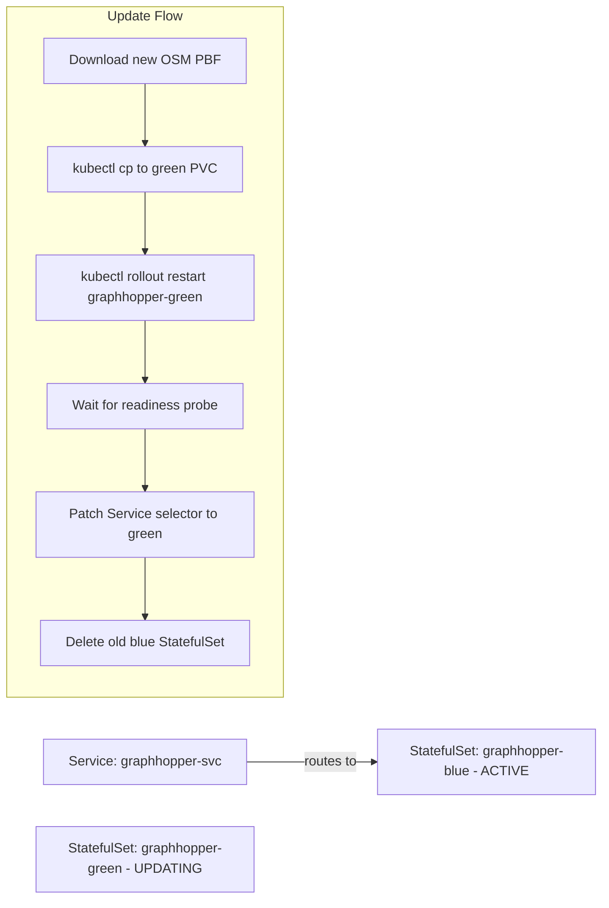

**Answer-first:** Step-by-step guide to deploying GraphHopper on Kubernetes with OpenStreetMap data: Docker image, PVC for OSM PBF files, RAM tuning, and health probes.

GraphHopper is arguably the most capable open-source routing engine available — it supports Contraction Hierarchies (CH) for sub-millisecond route queries, custom vehicle profiles, turn restrictions, and the full OpenStreetMap road network. The problem most teams encounter is not the algorithm; it is the operational challenge of running it in Kubernetes: loading a large OSM PBF file, sizing JVM memory correctly, handling the long CH pre-processing startup time, and updating map data without downtime.

This post is a production-grade Kubernetes deployment guide for GraphHopper using real OpenStreetMap data. By the end, you will have a StatefulSet deployment with persistent OSM graph files, correctly sized JVM resources, liveness and readiness probes that account for CH pre-processing time, and a zero-downtime map update strategy.

For the routing algorithm comparison and API usage, see [GraphHopper vs CARTO: Order Fulfillment Routing Engine](/posts/graphhopper-distance-matrix-routing).

---

## Why Self-Host GraphHopper? Cost vs. API Trade-Off Analysis

Before committing to a self-hosted deployment, weigh the options:

| Factor | Self-Hosted GraphHopper | GraphHopper Cloud API | Google Maps Routes API |
|---|---|---|---|
| **Per-query cost** | Infrastructure amortized | ~$0.005–0.008/request | $0.005–0.010/request |
| **At 1M queries/day** | ~$200–400/month (K8s) | ~$5,000–8,000/month | ~$5,000–10,000/month |
| **Data freshness** | Manual OSM update | Weekly OSM updates | Google's proprietary |
| **Offline capability** | Yes (no internet required) | No | No |
| **Custom profiles** | Full control | Limited | No |
| **Operational burden** | High | Low | Low |

**Self-hosting is the right choice when:**
- Query volume exceeds ~200,000 requests/day (API costs exceed infrastructure costs)
- You need offline operation (logistics in areas with poor connectivity)
- Your routing requirements need custom vehicle profiles (e-bikes, cargo trucks, motorcycle)
- Data sovereignty requirements prohibit sending GPS coordinates to third-party APIs

For most logistics platforms in Southeast Asia, the break-even volume is around 100,000–200,000 routing queries per day. Below that threshold, the GraphHopper Cloud API is cost-effective. If you are evaluating GraphHopper for order fulfillment and last-mile routing, see [Order Fulfillment Algorithm: Warehouse to Last-Mile](/posts/order-fulfillment-algorithm-warehouse-last-mile) for how the routing engine fits into the broader allocation pipeline. For platforms needing real-time geospatial compute with dynamic pricing signals, see [Surge Pricing Algorithm & Spatial Indexing Architecture](/posts/surge-pricing-optimization-architecture).

---

## Choosing the Right OSM PBF Data: Country, Region, or Bounding Box

OpenStreetMap provides free map data downloads in PBF (Protocol Buffer Format) through Geofabrik (the primary mirror).

### Data Size Reference

| Geography | Compressed PBF | CH Graph RAM (car profile) |
|---|---|---|
| Vietnam | ~170 MB | ~2–3 GB |
| Southeast Asia | ~1.2 GB | ~15–20 GB |
| Japan | ~1.0 GB | ~12–18 GB |
| Germany | ~3.5 GB | ~40–60 GB |
| Europe (full) | ~28 GB | ~300+ GB |

For logistics applications serving a single country, use the country-level extract. For multi-country coverage, use the regional extract. **Avoid using the global planet file** (>90 GB compressed) unless you have 512+ GB RAM available for graph pre-processing.

### Downloading OSM Data

```bash
# Vietnam only
wget https://download.geofabrik.de/asia/vietnam-latest.osm.pbf

# Southeast Asia (includes Vietnam, Thailand, Indonesia, Philippines, etc.)
wget https://download.geofabrik.de/asia/south-east-asia-latest.osm.pbf

# Verify the download integrity
wget https://download.geofabrik.de/asia/vietnam-latest.osm.pbf.md5
md5sum -c vietnam-latest.osm.pbf.md5
```

Store the PBF file in a Kubernetes PersistentVolume (PVC) — not in the container image. The OSM file is too large for a container layer, and it needs to persist across pod restarts.

---

## The GraphHopper Docker Image: Build vs. Official Image

GraphHopper publishes an official Docker image on GitHub Container Registry:

```bash
docker pull ghcr.io/graphhopper/graphhopper:latest
```

For production use, pin a specific version:

```bash
docker pull ghcr.io/graphhopper/graphhopper:10.0
```

### Custom Configuration via ConfigMap

Create a `graphhopper.yml` configuration file. The minimal production configuration:

```yaml
# graphhopper.yml
graphhopper:
  # Path to the OSM PBF file inside the container (mounted from PVC)
  datareader.file: /data/osm/vietnam-latest.osm.pbf
  
  # Graph cache directory (where CH graphs are stored between restarts)
  graph.location: /data/graph-cache
  
  # Profiles to prepare CH graphs for
  profiles:
    - name: car
      vehicle: car
      weighting: fastest
    - name: motorcycle
      vehicle: motorcycle
      weighting: fastest
    - name: bike
      vehicle: bike
      weighting: fastest
  
  ch.profiles: car,motorcycle,bike
  
  # Server configuration
  server:
    application_connectors:
      - type: http
        port: 8989
    admin_connectors:
      - type: http
        port: 8990
  
  # Import only (no live data sources)
  import.osm.ignored.highways: ""
```

Store this configuration as a Kubernetes ConfigMap:

```bash
kubectl create configmap graphhopper-config \
    --from-file=graphhopper.yml=./graphhopper.yml \
    -n logistics
```

---

## Kubernetes Deployment Architecture: PersistentVolume for OSM Graph Files

GraphHopper requires two persistent directories:
1. **OSM PBF input** (`/data/osm/`): The raw map data file
2. **Graph cache** (`/data/graph-cache/`): The pre-processed CH graph (survives restarts — avoids re-processing on every pod start)

```mermaid
graph TD
    PVC[PersistentVolumeClaim: graphhopper-data - 30Gi ReadWriteOnce]
    PVC --> OSM[/data/osm/vietnam-latest.osm.pbf]
    PVC --> GRAPH[/data/graph-cache/ - CH graphs]
    
    POD[GraphHopper Pod]
    POD --> PVC
    POD --> CM[ConfigMap: graphhopper-config]
    
    SVC[Service: graphhopper-svc :8989] --> POD
```

### PersistentVolumeClaim

```yaml
# graphhopper-pvc.yaml
apiVersion: v1
kind: PersistentVolumeClaim
metadata:
  name: graphhopper-data
  namespace: logistics
spec:
  accessModes:
    - ReadWriteOnce
  resources:
    requests:
      storage: 30Gi    # For Vietnam: OSM PBF (~170MB) + CH graphs (~3GB) + buffer
  storageClassName: ssd  # Use SSD storage class for faster graph reads
```

### Uploading the OSM PBF File to the PVC

Use a temporary pod with the PVC mounted to copy the OSM file:

```bash
# Create a temporary upload pod
kubectl run osm-uploader --image=alpine --restart=Never \
    --overrides='{"spec":{"volumes":[{"name":"data","persistentVolumeClaim":{"claimName":"graphhopper-data"}}],"containers":[{"name":"uploader","image":"alpine","command":["sleep","3600"],"volumeMounts":[{"name":"data","mountPath":"/data"}]}]}}' \
    -n logistics

# Wait for the pod to start
kubectl wait --for=condition=ready pod/osm-uploader -n logistics

# Copy the OSM file into the PVC
kubectl cp vietnam-latest.osm.pbf logistics/osm-uploader:/data/osm/vietnam-latest.osm.pbf

# Clean up
kubectl delete pod osm-uploader -n logistics
```

---

## RAM and JVM Tuning: How to Size Kubernetes Requests/Limits for CH Graphs

This is the most common source of GraphHopper failures in Kubernetes: the JVM OOMKill.

### Memory Requirements

GraphHopper loads the entire CH graph into memory (memory-mapped files via Java's `MappedByteBuffer`). This memory is **off-heap** — it does not count against the JVM heap (`-Xmx`) but does count against the container's total memory limit.

For Vietnam with car + motorcycle + bike profiles:
- **JVM heap** (`-Xmx`): 512MB–1GB (for GC overhead and route computation)
- **CH graph mmap** (off-heap): ~2–3 GB
- **Container memory limit**: `-Xmx` + graph size + 512MB buffer = **4–5 GB**

### JVM Configuration

Set JVM options via the `JAVA_OPTS` environment variable:

```yaml
env:
  - name: JAVA_OPTS
    value: >-
      -Xmx768m
      -Xms256m
      -XX:+UseG1GC
      -XX:MaxDirectMemorySize=4g
      -XX:+ExitOnOutOfMemoryError
      -Djava.nio.file.spi.DefaultFileSystemProvider=sun.nio.fs.UnixFileSystemProvider
```

Key flags:
- `-Xmx768m`: JVM heap cap (route computation, GC metadata)
- `-XX:MaxDirectMemorySize=4g`: Off-heap direct memory limit (covers mmap'd graph files)
- `-XX:+ExitOnOutOfMemoryError`: Forces a clean JVM exit on OOM instead of a degraded state — lets Kubernetes restart the pod cleanly

### Kubernetes Resource Requests and Limits

```yaml
resources:
  requests:
    memory: "4Gi"   # Scheduling: ensures node has enough free memory
    cpu: "1000m"    # 1 vCPU for CH queries (adjust based on query rate)
  limits:
    memory: "5Gi"   # 4GB graph mmap + 768MB heap + 512MB buffer
    cpu: "4000m"    # Allow bursting during CH pre-processing startup
```

---

## StatefulSet vs. Deployment: Which K8s Workload Type to Use

GraphHopper requires a PersistentVolume with `ReadWriteOnce` access mode (a single writer). This creates a fundamental Kubernetes constraint: you cannot run multiple replicas of GraphHopper on the same PVC simultaneously.

**Use StatefulSet when:**
- Each replica needs its own independent PVC (multiple GraphHopper instances with different regional data)
- You need stable pod names for discovery

**Use Deployment when:**
- A single instance is sufficient (most logistics platforms)
- You use a shared `ReadWriteMany` network storage (NFS or Ceph) — more expensive but allows multi-replica reads

For most production deployments, a single GraphHopper instance is sufficient up to ~2,000 route queries per second (limited by CPU, not I/O after the graph is memory-mapped). The complete StatefulSet manifest:

```yaml
# graphhopper-statefulset.yaml
apiVersion: apps/v1
kind: StatefulSet
metadata:
  name: graphhopper
  namespace: logistics
spec:
  serviceName: graphhopper
  replicas: 1
  selector:
    matchLabels:
      app: graphhopper
  template:
    metadata:
      labels:
        app: graphhopper
    spec:
      containers:
        - name: graphhopper
          image: ghcr.io/graphhopper/graphhopper:10.0
          args: ["start", "/config/graphhopper.yml"]
          
          ports:
            - name: http
              containerPort: 8989
            - name: admin
              containerPort: 8990
          
          env:
            - name: JAVA_OPTS
              value: "-Xmx768m -Xms256m -XX:+UseG1GC -XX:MaxDirectMemorySize=4g -XX:+ExitOnOutOfMemoryError"
          
          resources:
            requests:
              memory: "4Gi"
              cpu: "1000m"
            limits:
              memory: "5Gi"
              cpu: "4000m"
          
          volumeMounts:
            - name: data
              mountPath: /data
            - name: config
              mountPath: /config
          
          # Readiness: GraphHopper is ready ONLY after CH pre-processing finishes
          readinessProbe:
            httpGet:
              path: /health
              port: 8990
            initialDelaySeconds: 60    # Allow time for graph loading to start
            periodSeconds: 15
            failureThreshold: 40       # 40 * 15s = 10 min max wait for CH pre-processing
          
          # Liveness: restart if the JVM is frozen (not just slow to start)
          livenessProbe:
            httpGet:
              path: /health
              port: 8990
            initialDelaySeconds: 300   # 5 min — CH pre-processing must complete first
            periodSeconds: 30
            failureThreshold: 3
      
      volumes:
        - name: config
          configMap:
            name: graphhopper-config
  
  # The PVC template creates one PVC per replica
  volumeClaimTemplates:
    - metadata:
        name: data
      spec:
        accessModes: ["ReadWriteOnce"]
        resources:
          requests:
            storage: 30Gi
        storageClassName: ssd
```

---

## Zero-Downtime OSM Map Updates: Rolling Graph Regeneration Strategy

OSM data becomes stale over time — new roads, road closures, and access restriction changes accumulate. A practical update cadence for logistics is weekly (Geofabrik publishes weekly country extracts).

### The Blue-Green Graph Update Pattern

Since `ReadWriteOnce` prevents running two GraphHopper instances on the same PVC, use a blue-green approach:



This approach requires maintaining two StatefulSets with separate PVCs, but ensures the active instance is never interrupted during graph regeneration. Automate the update with a Kubernetes CronJob that:
1. Downloads the new OSM PBF
2. Copies it to the standby PVC
3. Restarts the standby pod and waits for readiness
4. Patches the Service selector to point to the standby
5. Marks the previous active as the new standby

For the GitOps workflow that manages CronJob and StatefulSet configuration in source control, see [GitOps at Scale: Kubernetes & ArgoCD for Microservices](/posts/gitops-at-scale-kubernetes-argocd-microservices).

---

## Health Probes and Readiness Gates: Waiting for CH Pre-Processing to Complete

The single most common misconfiguration is setting `initialDelaySeconds` too short on the readiness probe. GraphHopper must:
1. Load the OSM PBF file (first run: 2–5 minutes for Vietnam)
2. Build the Contraction Hierarchy graph (first run: 5–15 minutes)
3. Save the CH graph to disk
4. Load the CH graph into memory (subsequent runs: 1–3 minutes)

On subsequent restarts (when the CH graph cache already exists), startup is 1–3 minutes. But on the first run after a new OSM file, it can take 15–20 minutes.

The readiness probe configuration above uses `initialDelaySeconds: 60` with `failureThreshold: 40` (600 seconds of patience) — sufficient for most country-level graphs. The liveness probe uses `initialDelaySeconds: 300` to prevent Kubernetes from restarting a slow-starting pod that is simply doing CH pre-processing.

---

## Monitoring GraphHopper on Kubernetes with Prometheus & Grafana

GraphHopper's admin port exposes metrics in Dropwizard format. Use a Prometheus JMX exporter or the metrics endpoint to scrape:

```yaml
# ServiceMonitor for Prometheus Operator
apiVersion: monitoring.coreos.com/v1
kind: ServiceMonitor
metadata:
  name: graphhopper
  namespace: logistics
spec:
  selector:
    matchLabels:
      app: graphhopper
  endpoints:
    - port: admin
      path: /metrics
      interval: 30s
```

Key metrics to alert on:
- `graphhopper_routing_requests_total` — request rate (alert on >0 error rate)
- `graphhopper_routing_time_seconds` — P99 route computation latency (alert if >200ms)
- `jvm_memory_used_bytes{area="heap"}` — JVM heap utilization (alert if >85% of `-Xmx`)
- `process_resident_memory_bytes` — total process RSS (alert if approaching container memory limit)

Integrate these dashboards with the broader Kubernetes observability stack described in [Go pprof in Kubernetes: Remote Profiling & Flame Graphs](/posts/go-pprof-kubernetes-remote-profiling).

---

## Frequently Asked Questions

### How much RAM does GraphHopper need to serve Vietnam's road network?
For Vietnam with car + motorcycle + bike CH profiles: approximately 3–4 GB of memory-mapped off-heap memory for the graph files, plus 512MB–1GB JVM heap. Set your Kubernetes memory limit to 5 GB to provide adequate buffer. Southeast Asia region (including Thailand, Indonesia, Philippines) requires approximately 15–20 GB.

### Can I run GraphHopper on Kubernetes with multiple replicas?
Yes, but with constraints. `ReadWriteOnce` PVCs (standard SSD storage) only support a single writer — you cannot mount the same PVC to two pods simultaneously. For multi-replica serving, use `ReadWriteMany` storage (NFS or Ceph RBD) and a Deployment instead of StatefulSet. Alternatively, run separate StatefulSets per region, each with their own PVC, and route requests by geography.

### How do I update the OSM map data without downtime?
Use the blue-green graph update pattern: maintain two StatefulSets (active and standby), update the OSM file and regenerate the graph on the standby, then switch the Kubernetes Service selector to the newly ready standby. This eliminates downtime at the cost of double the storage and compute during the update window.

---

**Related Reading:** Once GraphHopper is running in production, see [Go pprof in Kubernetes: Remote Profiling & Flame Graphs](/posts/go-pprof-kubernetes-remote-profiling/) to profile your routing service and identify JVM/Go performance bottlenecks. For the business use case driving this infrastructure, see [GraphHopper vs CARTO: Order Fulfillment Routing Engine](/posts/graphhopper-distance-matrix-routing/) and the [Geospatial & Routing Engine Architecture series](/series/routing-geospatial-architecture/).


