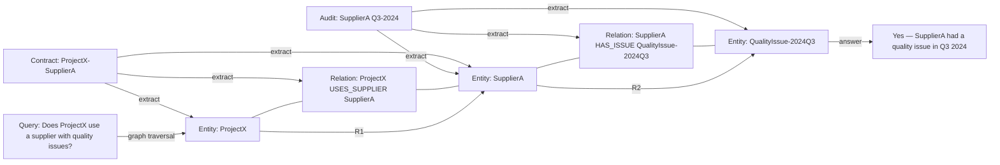
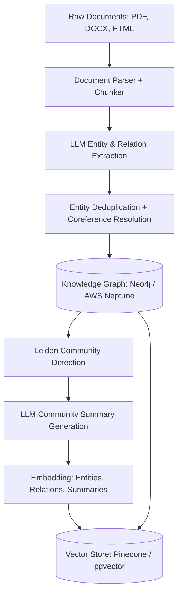
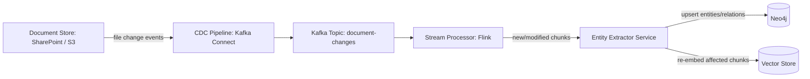

**Answer-first:** Naive RAG works well for simple keyword queries on isolated documents. For complex, global questions spanning multiple entities, GraphRAG is superior as it builds a knowledge graph using LLMs. Enterprise implementations require combining change data capture (CDC) with vector search to keep graphs synchronized.

### What You'll Learn That AI Won't Tell You
- Schema design for knowledge graphs that speed up global enterprise RAG.
- Syncing GraphRAG knowledge bases in real-time using PostgreSQL WAL events.


Most RAG (Retrieval-Augmented Generation) implementations look the same: chunk documents, embed them into vectors, store them in a vector database, retrieve by cosine similarity, and inject the top-K chunks into the LLM context. This works for simple document Q&A. It fails systematically for enterprise knowledge bases where the answer to a question depends not on a single document chunk, but on the *relationships* between dozens of interconnected entities.

GraphRAG (Graph-augmented RAG) addresses this failure by adding a knowledge graph layer to the retrieval pipeline. Instead of treating each document chunk as an independent unit, GraphRAG extracts entities and relationships from the corpus and builds a graph that represents how concepts connect — enabling retrieval strategies that span the full topology of the knowledge base, not just isolated similarity matches.

This post is a technical guide for enterprise architects evaluating or implementing GraphRAG: what it is, where it outperforms naive RAG, how to build the ingestion pipeline, and what security and operational concerns apply in a production enterprise deployment.

For the implementation series covering the full AI data engineering pipeline, see the [AI Data Engineering Pipeline Series](/series/ai-data-engineering-pipeline/) and specifically [Part 1: GraphRAG Convergence — Agents & Pipelines](/series/ai-data-engineering-pipeline/part-1-agentic-graphrag-long-context/).

---

## The Limits of Naive RAG: Why Vector Similarity Fails for Global Context

Naive RAG answers questions by finding document chunks whose *embedding vector* is similar to the query's embedding vector. This is effective when:
- The answer is contained within a single coherent document section
- The user's query language closely matches the source document language
- The question does not require reasoning across multiple documents

It fails for enterprise knowledge bases in several predictable ways:

**1. Multi-hop reasoning failures**: "What is the compliance status of Project X?" may require finding Project X's lead engineer, that engineer's department, the department's compliance officer, and that officer's last audit report — information scattered across four different documents with no lexical similarity to each other or to the query.

**2. Global context questions**: "Which suppliers have had quality issues in the last 6 months?" requires aggregating information across hundreds of supplier records. Cosine similarity retrieval returns a few similar chunks — not a holistic answer from the full corpus.

**3. Relationship-dependent answers**: "Is the regulatory approval for Drug A compatible with the manufacturing process used in Plant B?" requires understanding the relationship between two specific entities and traversing the graph of dependencies between them. No single document chunk contains this combined fact.

**4. Vocabulary drift**: Technical documentation often uses different terminology in different sections (acronyms, version names, internal code names). Naive RAG embeds each chunk independently — similar concepts with different surface forms receive low similarity scores.

These failure modes are not bugs in the RAG implementation. They are fundamental limitations of treating documents as bags of independently retrievable chunks.

---

## What is GraphRAG? Linking Entities, Relations, and Graph Communities

GraphRAG replaces the document chunk as the retrieval unit with a **knowledge graph** — a structured representation of entities and the relationships between them.



The knowledge graph enables **graph traversal retrieval**: starting from entities matched to the query, traverse the graph to discover connected entities and relationships, then compose the full context from the traversal result.

### Graph Communities and Community Summaries

Microsoft's original GraphRAG research introduced the concept of **graph communities**: clusters of densely connected entities in the knowledge graph that represent coherent topics. The Leiden algorithm (a community detection algorithm) partitions the graph into these clusters.

For each community, GraphRAG pre-generates an LLM-produced **community summary** — a paragraph describing the entities and relationships within that cluster. These summaries are indexed separately and serve as the retrieval units for global questions (questions that require synthesizing information from the entire corpus rather than a specific entity chain).

This two-level retrieval approach:
- **Local retrieval**: Traverse the graph from specific entity matches (for targeted questions)
- **Global retrieval**: Query community summaries (for broad, aggregative questions)

...is what gives GraphRAG its advantage over naive RAG for enterprise knowledge bases.

---

## Ingestion Pipelines: Extracting Knowledge Graphs from Unstructured Data

The GraphRAG ingestion pipeline has more steps than naive RAG, reflecting the additional structure it builds:



### Step 1: Document Parsing and Chunking

Unlike naive RAG where chunking is the primary ingestion step, in GraphRAG chunking is just the preprocessing step before entity extraction. Chunks should be large enough to contain coherent entity-relation triplets (~512–1024 tokens is typical).

Using LlamaIndex for the ingestion pipeline:

```python
from llama_index.core import SimpleDirectoryReader, VectorStoreIndex
from llama_index.core.node_parser import SentenceSplitter

# Load and parse documents
documents = SimpleDirectoryReader(
    input_dir="./enterprise-knowledge-base",
    recursive=True,
    required_exts=[".pdf", ".docx", ".md", ".txt"],
).load_data()

# Chunk with sufficient context for entity extraction
node_parser = SentenceSplitter(chunk_size=1024, chunk_overlap=128)
nodes = node_parser.get_nodes_from_documents(documents)
```

### Step 2: LLM-Based Entity and Relation Extraction

This is the most computationally expensive step. For each chunk, an LLM is prompted to extract:
- **Entities**: Named things (people, organizations, projects, products, regulations)
- **Relationships**: Directional connections between entities (Person MANAGES Project, Product COMPLIES_WITH Regulation)
- **Entity properties**: Key attributes (dates, status, version numbers)

```python
from llama_index.core.extractors import (
    KeywordExtractor,
    QuestionsAnsweredExtractor,
)
from llama_index.core.extractors import EntityExtractor  # requires llama-index-core>=0.10.0

# Entity extraction using a local model to control costs
entity_extractor = EntityExtractor(
    prediction_threshold=0.85,  # confidence threshold for entity classification
    label_entities=True,
    device="cuda",
)

# For relation extraction, use a structured LLM call
from llama_index.llms.openai import OpenAI

RELATION_EXTRACTION_PROMPT = """
Extract all entity relationships from the following text.
For each relationship, output JSON: {"subject": "...", "predicate": "...", "object": "..."}
Text: {text}
"""

def extract_relations(chunk_text: str, llm: OpenAI) -> list[dict]:
    response = llm.complete(RELATION_EXTRACTION_PROMPT.format(text=chunk_text))
    # Parse JSON response
    import json
    return json.loads(response.text)
```

### Step 3: Entity Deduplication and Coreference Resolution

The same real-world entity often appears under multiple surface forms across a large document corpus: "Supplier A," "SupplierA Corp," "Supplier A Ltd," and "SA" may all refer to the same entity. Without deduplication, the graph will have multiple disconnected nodes for the same entity — breaking graph traversal.

Deduplication uses a combination of:
- **String normalization**: lowercase, remove punctuation, normalize spacing
- **Embedding similarity**: entities with embedding cosine similarity > 0.92 are candidates for merging
- **LLM confirmation**: for high-similarity candidates, an LLM prompt confirms whether they refer to the same entity

```python
def deduplicate_entities(entities: list[str], embed_model) -> dict[str, str]:
    """
    Returns a mapping from each entity variant to its canonical form.
    """
    embeddings = embed_model.encode(entities)
    
    canonical_map = {}
    for i, entity in enumerate(entities):
        similarities = cosine_similarity([embeddings[i]], embeddings)[0]
        for j, sim in enumerate(similarities):
            if i != j and sim > 0.92:
                # Mark j as a variant of i (the canonical form)
                canonical_map[entities[j]] = entity
    
    return canonical_map
```

### Step 4: Graph Storage in Neo4j

The extracted entities and relationships are stored in a property graph database:

```python
from neo4j import GraphDatabase

def store_entity_relations(driver, relations: list[dict]):
    with driver.session() as session:
        for rel in relations:
            session.run("""
                MERGE (s:Entity {name: $subject})
                MERGE (o:Entity {name: $object})
                MERGE (s)-[r:RELATION {type: $predicate}]->(o)
                ON CREATE SET r.source_doc = $doc_id, r.created_at = datetime()
            """, 
            subject=rel['subject'], 
            predicate=rel['predicate'],
            object=rel['object'],
            doc_id=rel['source_doc'])
```

---

## Retrieval Strategy: Hybrid Queries and Community Summarization

GraphRAG supports two complementary retrieval strategies:

### Local Search (Entity-Anchored Traversal)

For specific, targeted questions about known entities:

```python
def local_search(query: str, graph_db, vector_store, k_hops: int = 2) -> str:
    # 1. Find seed entities from the query via vector similarity
    seed_entities = vector_store.similarity_search(query, k=5, filter={"type": "entity"})
    
    # 2. Expand the graph from seed entities via k-hop traversal
    context_nodes = []
    for entity in seed_entities:
        neighbors = graph_db.run(f"""
            MATCH (e:Entity {{name: $name}})-[r*1..{k_hops}]-(n)
            RETURN e, r, n LIMIT 50
        """, name=entity.metadata['name']).data()
        context_nodes.extend(neighbors)
    
    # 3. Retrieve source document chunks for the traversal nodes
    context_text = retrieve_chunks_for_entities(context_nodes, vector_store)
    
    return context_text
```

### Global Search (Community Summary Retrieval)

For broad, aggregative questions about the entire knowledge base:

```python
def global_search(query: str, community_summaries_store) -> str:
    # Retrieve the most relevant community summaries
    # These summaries describe clusters of related entities
    relevant_summaries = community_summaries_store.similarity_search(query, k=10)
    
    # Use the LLM to synthesize across multiple community summaries
    combined_context = "\n\n".join([s.text for s in relevant_summaries])
    return combined_context
```

---

## Dynamic Scaling: Real-Time Streaming CDC and Graph Database Sync

Enterprise knowledge bases are not static. Contracts are amended, employees change roles, regulations are updated. A GraphRAG system that only ingests documents in batch quickly becomes stale.

### Change Data Capture (CDC) for Real-Time Graph Updates

Use a streaming CDC pipeline to keep the knowledge graph synchronized with document changes:



The stream processor handles three event types:
- **New document**: Run full extraction pipeline on the new document
- **Modified document**: Re-extract entities from changed sections, diff against existing graph, upsert changes
- **Deleted document**: Remove entities and relations that were only sourced from this document (use source tracking on each edge)

### Incremental Community Recomputation

Full Leiden community detection is expensive (O(n log n) for n nodes). Rather than rerunning it on every graph update, use **incremental community updates**: when a small number of nodes are added/modified, only recompute community membership for the affected nodes and their neighbors.

---

## Enterprise Security: Access Control Lists (ACLs) and Data Poisoning Safeguards

Enterprise knowledge bases contain sensitive information. A GraphRAG system must enforce access control at the retrieval layer — not just at the document storage layer.

### Entity-Level Access Control

In enterprise deployments, different users have access to different subsets of entities. A Sales representative should be able to query customer contracts but not HR performance reviews. Standard vector database access control (row-level security) is insufficient for graph traversal — a graph query that starts from an authorized entity can traverse to unauthorized entities in a single hop.

The solution is **entity-level ACL tagging** in the graph:

```cypher
// Tag each entity with the groups allowed to access it
MATCH (e:Entity {name: "ProjectX"})
SET e.allowed_groups = ["engineering", "management", "legal"]

// Query filter: only return entities the user's groups can access
MATCH path = (s:Entity {name: $seed_entity})-[r*1..2]-(n:Entity)
WHERE ANY(g IN n.allowed_groups WHERE g IN $user_groups)
RETURN path
```

### Data Poisoning Safeguards

Allowing arbitrary documents to be ingested into the knowledge graph creates a data poisoning attack surface: a malicious actor could submit a document with false entity relationships designed to mislead the LLM's responses.

Mitigations:
1. **Source trust levels**: Assign trust scores to document sources. High-trust (internal systems, verified partners) contributes to the graph with full weight. Low-trust sources (uploaded PDFs from external parties) are kept in a sandboxed graph segment with lower retrieval priority.
2. **Provenance tracking**: Every entity and relation in the graph is tagged with its source document. Disputed relations can be traced to their source and removed.
3. **Adversarial chunking detection**: Detect unusually short or unusually specific document chunks that are designed to inject specific entity-relation triplets. Flag for human review.

---

## Evaluation, Testing, and Production CI/CD for GraphRAG Systems

GraphRAG systems are harder to evaluate than naive RAG because the failure modes (multi-hop reasoning errors, stale community summaries) are harder to detect with simple answer-match metrics.

### Evaluation Framework

Use a structured evaluation set that includes:

| Question Type | Metric | Example |
|---|---|---|
| Entity lookup | Precision@1 | "What is the contract value for Project X?" |
| Multi-hop reasoning | Faithfulness + Completeness | "Which suppliers used by Project X have had issues?" |
| Global aggregation | Recall@K | "List all projects with compliance risk" |
| Freshness | Staleness rate | "What is the current status of Regulation Y?" |

Automate evaluation with LLM-as-judge against a golden dataset. Track metrics across deployments in CI/CD — a regression in multi-hop faithfulness above a threshold should block deployment.

For the broader AI engineering decision framework (when to use RAG vs fine-tuning vs prompting), see [Fine-Tune vs Prompt-Engineer an LLM: Decision Guide](/posts/slm-fine-tune-vs-prompt-engineering/). For teams building autonomous AI agents that query GraphRAG systems at runtime, see [Production Agentic AI Swarm: OpenClaw & LiteLLM](/posts/deploying-autonomous-ai-swarm-openclaw-litellm) for the multi-agent orchestration layer.

---

## Frequently Asked Questions

### What is the difference between GraphRAG and Naive RAG?
Naive RAG retrieves document chunks by embedding similarity — each chunk is independent, and retrieval finds chunks most similar to the query. GraphRAG builds a knowledge graph of entities and relationships extracted from the corpus, enabling retrieval via graph traversal (finding entities connected to the query's seed entities) and community summary retrieval (synthesizing across clusters of related topics). GraphRAG is more expensive to build and maintain but handles multi-hop reasoning and global context questions that Naive RAG systematically fails on.

### When should I choose GraphRAG over vector databases?
Choose GraphRAG when: (1) answering questions requires connecting information from multiple documents or entities; (2) users ask aggregative questions about the entire knowledge base ("which X have Y issues?"); (3) your knowledge base has dense entity relationships (org charts, product dependencies, regulatory mappings); (4) knowledge freshness requires real-time updates. Stick with Naive RAG when: documents are largely independent, questions are specific and local, and simplicity of implementation is a priority.

### How do you update a GraphRAG knowledge graph in real-time?
Use a streaming CDC pipeline (Kafka Connect reading file system or S3 change events) to detect document changes. A stream processor (Apache Flink) routes change events to an entity extraction service, which upserts modified entities and relationships into the graph database (Neo4j) and re-embeds affected chunks in the vector store. Full community recomputation runs as a scheduled batch job (nightly or weekly). Incremental community updates can be applied for small, localized graph changes.

**Related Reading:** For the complete enterprise AI data pipeline — beyond GraphRAG to multimodal ingestion, semantic caching, streaming CDC, and production Evals — see the [Enterprise AI Data Pipeline & GraphRAG Architecture series](/series/ai-data-engineering-pipeline/). For the frontend architecture that consumes these pipelines, see [Generative UI with MCP: Architecting AI-Native Frontends](/posts/generative-ui-with-mcp-ai-native-frontend/). And for the engineering context of AI-generated code that relies on RAG systems, see [What is Vibe Coding?](/posts/vibe-coding-and-ai-code-review-future/).


