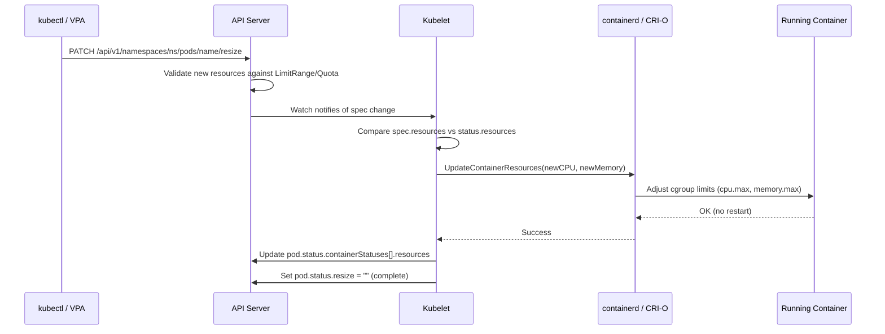
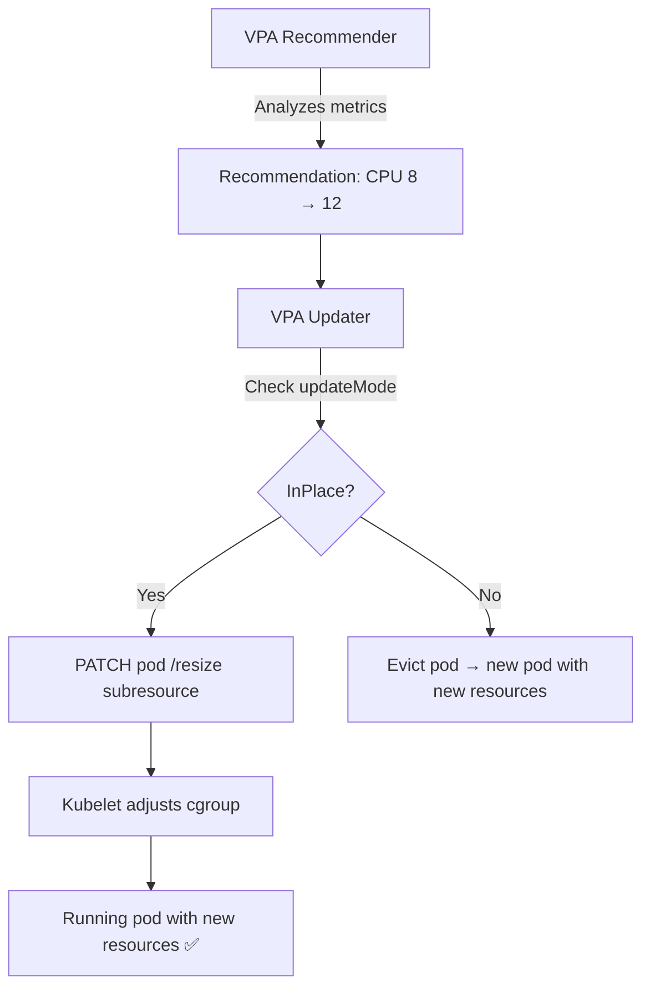

**Answer-first:** In-Place Pod Resizing (GA in Kubernetes v1.35) allows you to modify CPU and memory requests/limits on running containers without restarting the pod — eliminating cold-start disruptions for AI inference, databases, and stateful workloads. This guide covers requirements, production YAML, VPA integration, cost optimization patterns, and gotchas.

### What You'll Learn That AI Won't Tell You
- In-place pod resizing edge cases where CPU updates cause container restarts.
- Configuring kubelet parameters to support resizing without disrupting running JVM tasks.


Before this feature, changing a container's resource allocation required deleting and recreating the pod. For a stateful database holding connections, an AI model with 30GB of weights loaded in memory, or a long-running batch job — that restart is catastrophic. In-Place Pod Resize finally decouples resource management from pod lifecycle.

This post is the production guide: what it is, how to use it, and where the sharp edges are. For the broader Kubernetes deployment context, see our [GitOps at Scale](/posts/gitops-at-scale-kubernetes-argocd-microservices/) guide. If you're also upgrading your Go services, the [Go 1.26 Green Tea GC improvements](/posts/go-126-green-tea-gc-cgo-performance-guide/) pair well with in-place resizing for memory-efficient workloads.

---

## 1. What Is In-Place Pod Resizing?


### Before vs. After

| Scenario | Before v1.35 | After v1.35 |
|----------|-------------|-------------|
| AI inference pod needs more memory during peak | Delete pod → Schedule new pod → Load model weights (30s–5min cold start) | PATCH resize → Memory limit increased in ~1s → No disruption |
| Database needs CPU burst for overnight batch | Vertical Pod Autoscaler triggers restart → connections dropped | VPA patches resize → CPU limit raised → zero connection loss |
| Development pod needs temporary resources | Edit deployment → rolling restart | `kubectl resize` → instant |
| Idle pods wasting resources overnight | Scale down replicas (losing state) | Resize down → keep pod alive with minimal resources |

### The Journey to GA

| Version | Status | Notes |
|---------|--------|-------|
| v1.27 (2023) | Alpha | Feature gate `InPlacePodVerticalScaling` |
| v1.31 (2024) | Beta | Enabled by default on API server, not kubelet |
| v1.33 (2025) | Beta | Enabled by default everywhere |
| v1.35 (Dec 2025) | **Stable (GA)** | No feature gates needed. Enabled by default. |

---

## 2. Requirements


### Infrastructure Checklist

| Component | Minimum Version | Notes |
|-----------|----------------|-------|
| Kubernetes | v1.35+ | GA, no feature gates |
| containerd | ≥ 1.6.9 | Supports `UpdateContainerResources` CRI call |
| CRI-O | ≥ 1.25 | Alternative to containerd |
| kubelet | v1.35+ | Must match API server version |
| kubectl | v1.35+ | For `kubectl resize` convenience command |

### Managed Kubernetes Support (as of June 2026)

| Provider | Supported | Notes |
|----------|-----------|-------|
| **EKS** | ✅ v1.35 clusters | Available since March 2026 |
| **GKE** | ✅ v1.35 clusters | Rapid channel first |
| **AKS** | ✅ v1.35 clusters | Preview since Feb 2026 |
| **K3s** | ✅ v1.35+ | Works with embedded containerd |

---

## 3. How It Works: Resize Policy and Pod Status


### Resize Flow



### Resize Policy Options

```yaml
spec:
  containers:
  - name: inference
    resizePolicy:
    - resourceName: cpu
      restartPolicy: NotRequired      # CPU resize: no restart needed
    - resourceName: memory
      restartPolicy: RestartContainer  # Memory resize: requires container restart
```

| `restartPolicy` | Behavior | Use When |
|-----------------|----------|----------|
| `NotRequired` | Resize happens live via cgroup adjustment | CPU (always safe), Memory (if app can handle growing memory limit) |
| `RestartContainer` | Container is restarted after resize | Memory decrease (app may have allocated up to old limit), or apps that read memory limit at startup |

> **Production recommendation:** For most services, set CPU to `NotRequired` and memory to `NotRequired` for increases only. Memory decreases on apps with large heap allocations may OOM if the app doesn't release memory.

### Pod Status During Resize

```yaml
status:
  resize: InProgress  # or: Proposed, Deferred, Infeasible, ""
  containerStatuses:
  - name: inference
    resources:
      requests:
        cpu: "4"       # actual current allocation
        memory: "8Gi"
    allocatedResources:
      cpu: "4"
      memory: "8Gi"
```

| `status.resize` | Meaning |
|-----------------|---------|
| `""` (empty) | Resize complete or no resize pending |
| `Proposed` | Resize accepted by API server, kubelet hasn't acted yet |
| `InProgress` | Kubelet is applying the resize |
| `Deferred` | Node doesn't have enough resources right now; will retry |
| `Infeasible` | Resize cannot be fulfilled (exceeds node capacity) |

---

## 4. Production YAML Examples

### Example 1: AI Inference Pod with Live CPU/Memory Scaling

```yaml
apiVersion: v1
kind: Pod
metadata:
  name: llm-inference
  labels:
    app: llm-inference
    model: llama-3-70b
spec:
  containers:
  - name: inference
    image: ghcr.io/yourorg/llm-server:v2.1
    resources:
      requests:
        cpu: "4"
        memory: "32Gi"
      limits:
        cpu: "8"
        memory: "64Gi"
    resizePolicy:
    - resourceName: cpu
      restartPolicy: NotRequired
    - resourceName: memory
      restartPolicy: NotRequired  # Safe: model weights are mmap'd, not heap
    ports:
    - containerPort: 8080
    readinessProbe:
      httpGet:
        path: /health
        port: 8080
      periodSeconds: 5
```

**Resize during peak inference load:**

```bash
# Scale up CPU during peak hours (no restart)
kubectl patch pod llm-inference --subresource resize --type merge -p \
  '{"spec":{"containers":[{"name":"inference","resources":{"requests":{"cpu":"8"},"limits":{"cpu":"16"}}}]}}'

# Scale back down during off-peak
kubectl patch pod llm-inference --subresource resize --type merge -p \
  '{"spec":{"containers":[{"name":"inference","resources":{"requests":{"cpu":"4"},"limits":{"cpu":"8"}}}]}}'
```

### Example 2: Database Pod — CPU Live, Memory Restart

```yaml
apiVersion: v1
kind: Pod
metadata:
  name: postgres-primary
spec:
  containers:
  - name: postgres
    image: postgres:16
    resources:
      requests:
        cpu: "2"
        memory: "4Gi"
      limits:
        cpu: "4"
        memory: "8Gi"
    resizePolicy:
    - resourceName: cpu
      restartPolicy: NotRequired      # CPU can scale live
    - resourceName: memory
      restartPolicy: RestartContainer  # PostgreSQL reads shared_buffers at startup
    env:
    - name: POSTGRES_SHARED_BUFFERS
      value: "2GB"
```

### Example 3: Batch Job — Resize During Execution

```yaml
apiVersion: batch/v1
kind: Job
metadata:
  name: data-pipeline
spec:
  template:
    spec:
      containers:
      - name: etl
        image: yourorg/etl-runner:latest
        resources:
          requests:
            cpu: "2"
            memory: "8Gi"
          limits:
            cpu: "8"
            memory: "32Gi"
        resizePolicy:
        - resourceName: cpu
          restartPolicy: NotRequired
        - resourceName: memory
          restartPolicy: NotRequired
      restartPolicy: Never
```

If the ETL job hits a memory-intensive phase, an external controller (or VPA) can resize it mid-execution without losing hours of progress. For services with [goroutine leak issues](/posts/goroutine-leak-detection-production-golang/) causing gradual memory growth, in-place resizing can buy time while the leak is diagnosed — but it's not a substitute for fixing the root cause.

---

## 5. VPA Integration: Automatic In-Place Resizing


### VPA with In-Place Update Mode

```yaml
apiVersion: autoscaling.k8s.io/v1
kind: VerticalPodAutoscaler
metadata:
  name: llm-inference-vpa
spec:
  targetRef:
    apiVersion: apps/v1
    kind: Deployment
    name: llm-inference
  updatePolicy:
    updateMode: "InPlace"  # New mode: resize without restart
  resourcePolicy:
    containerPolicies:
    - containerName: inference
      minAllowed:
        cpu: "2"
        memory: "16Gi"
      maxAllowed:
        cpu: "32"
        memory: "128Gi"
      controlledResources: ["cpu", "memory"]
```

### How VPA + In-Place Resize Works



### Cost Optimization Pattern: Time-Based Resizing

For AI inference that has predictable load patterns (heavy during business hours, idle overnight):

```yaml
apiVersion: batch/v1
kind: CronJob
metadata:
  name: inference-scaleup
spec:
  schedule: "0 8 * * 1-5"  # 8 AM weekdays
  jobTemplate:
    spec:
      template:
        spec:
          containers:
          - name: resizer
            image: bitnami/kubectl:1.35
            command:
            - /bin/sh
            - -c
            - |
              kubectl get pods -l app=llm-inference -o name | while read pod; do
                kubectl patch $pod --subresource resize --type merge -p \
                  '{"spec":{"containers":[{"name":"inference","resources":{"requests":{"cpu":"16","memory":"64Gi"},"limits":{"cpu":"32","memory":"128Gi"}}}]}}'
              done
          restartPolicy: OnFailure
---
apiVersion: batch/v1
kind: CronJob
metadata:
  name: inference-scaledown
spec:
  schedule: "0 22 * * 1-5"  # 10 PM weekdays
  jobTemplate:
    spec:
      template:
        spec:
          containers:
          - name: resizer
            image: bitnami/kubectl:1.35
            command:
            - /bin/sh
            - -c
            - |
              kubectl get pods -l app=llm-inference -o name | while read pod; do
                kubectl patch $pod --subresource resize --type merge -p \
                  '{"spec":{"containers":[{"name":"inference","resources":{"requests":{"cpu":"4","memory":"32Gi"},"limits":{"cpu":"8","memory":"64Gi"}}}]}}'
              done
          restartPolicy: OnFailure
```

**Cost savings estimate:** If an AI inference pod runs on a `p3.2xlarge` ($3.06/hr) equivalent during business hours and can downscale to `m5.xlarge` ($0.192/hr) equivalent during 12 off-peak hours — that's ~$34/day savings per pod.

---

## 6. Limitations and Gotchas


### Hard Limitations

| Limitation | Explanation | Workaround |
|-----------|-------------|------------|
| **Cannot cross QoS boundaries** | A Guaranteed pod (requests=limits) cannot be resized to Burstable (requests<limits) or vice versa | Design pods in the target QoS class from the start |
| **Node resource scarcity** | If the node doesn't have free resources, resize status becomes `Deferred` | Use Pod Disruption Budgets + cluster autoscaler |
| **Memory decrease risk** | Reducing memory limit below current RSS triggers OOM kill | Only decrease memory on pods with controlled heap (e.g., JVM with -Xmx) |
| **Init containers excluded** | Cannot resize init containers (they've already completed) | N/A — init containers are short-lived |
| **ResourceQuota enforcement** | Resize must fit within namespace ResourceQuota | Pre-allocate quota headroom for resize scenarios |
| **LimitRange validation** | New values must satisfy LimitRange constraints | Ensure LimitRange allows your resize range |

### Common Pitfalls

**1. Memory decrease + OOM:**
```bash
# ❌ DANGEROUS: reducing memory below what the app has allocated
kubectl patch pod myapp --subresource resize --type merge -p \
  '{"spec":{"containers":[{"name":"app","resources":{"limits":{"memory":"2Gi"}}}]}}'
# If app RSS is 3Gi → immediate OOM kill
```

**2. Forgetting resizePolicy:**
If you don't specify `resizePolicy`, the default is `NotRequired` for both CPU and memory. This is usually fine for CPU but can be surprising for memory on apps that read memory limits at startup (e.g., JVM `-XX:MaxRAMPercentage`).

**3. Deployment rollout overrides resize:**
A normal Deployment rollout creates new pods with the Deployment's `spec.template.resources`. Any in-place resize on the old pods is lost. For persistent resizes, update the Deployment spec too.

**4. Monitoring stale `status.resize: Deferred`:**
If a node is persistently full, resizes stay `Deferred` forever with no alerting. Monitor this:

```promql
# Alert if any pod has been in Deferred resize state for > 10 minutes
kube_pod_status_resize{resize="Deferred"} > 0
```

---

## 7. Monitoring and Observability

### Key Metrics to Watch

```promql
# Pod resize state (requires kube-state-metrics v2.13+)
kube_pod_status_resize{namespace="inference", resize!=""}

# Actual vs requested resources (detect drift)
container_spec_cpu_quota / container_spec_cpu_period  # actual CPU limit in cores
container_memory_working_set_bytes                      # actual memory usage

# Node allocatable headroom (for Deferred prevention)
sum(kube_node_status_allocatable{resource="cpu"}) - sum(kube_pod_resource_request{resource="cpu"})
```

### Grafana Dashboard Panels

Track these per pod/namespace:
1. **Resize events timeline** — when resizes were applied
2. **Spec vs actual resources** — detect "resize drift" (resize applied but app didn't benefit)
3. **Deferred/Infeasible counts** — cluster capacity issues
4. **Cost savings** — actual resource reduction from resizes × hourly rate

---

## FAQ


**In-Place Pod Resizing** is a GA feature in Kubernetes v1.35 that allows you to modify CPU and memory requests/limits on a running container without restarting the pod. The kubelet adjusts the container's Linux cgroup limits (cpu.max, memory.max) in-place. This eliminates cold-start disruptions for stateful workloads like databases, AI inference pods, and long-running batch jobs.



It depends on the `resizePolicy` configuration. If set to `NotRequired` (default), the resize happens live with no restart. If set to `RestartContainer`, the container is restarted after the resize — useful for applications that read resource limits at startup (e.g., JVM heap configuration). CPU resizes are almost always safe without restart; memory resizes require care.



The feature graduated to **Stable (GA)** in Kubernetes v1.35 (December 2025). It was Beta since v1.31 and Alpha since v1.27. On v1.35+, no feature gates are needed — it works out of the box. The container runtime must support it: containerd ≥ 1.6.9 or CRI-O ≥ 1.25.



Yes. VPA v1.3+ supports an `updateMode: "InPlace"` that patches the pod's resize subresource instead of evicting and recreating it. This makes VPA production-ready for stateful workloads that previously couldn't tolerate VPA's eviction-based approach.



The pod's `status.resize` field will be set to `Deferred` — meaning the kubelet acknowledged the request but can't fulfill it due to insufficient node resources. The resize will be retried when resources become available. If the resize is fundamentally impossible (exceeds node capacity), the status becomes `Infeasible`. Monitor the `kube_pod_status_resize` metric to detect stuck resizes.



AI inference pods often need high resources (GPU, memory for model weights) during active inference but sit idle between requests. In-Place Resizing allows you to scale CPU/memory down during idle periods and up during load spikes — without the 30-second to 5-minute cold start of loading model weights into a new pod. Combined with time-based CronJobs or VPA, this can reduce compute costs by 40-60% for inference workloads with predictable traffic patterns.

