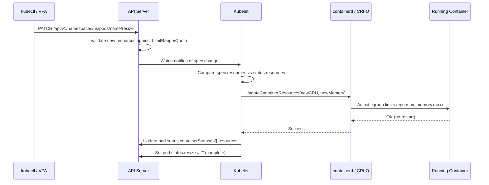
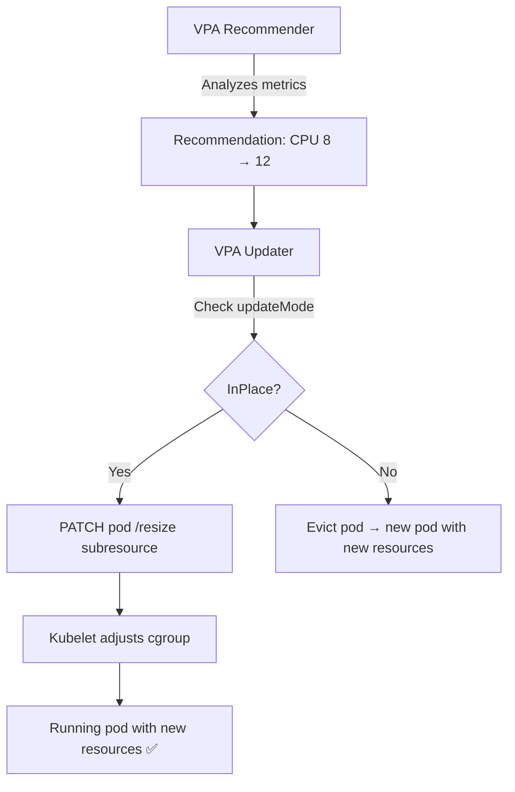

# Kubernetes In-Place Pod Resizing: No-Restart Scaling

**Answer-first:** Kubernetes in-place pod resizing allows dynamic CPU and memory limit adjustments without restarting pod containers, preventing application disruption during traffic surges. 

Before this feature, changing a container's resource allocation required deleting and recreating the pod. For a stateful database holding connections, an AI model with 30GB of weights loaded in memory, or a long-running batch job — that restart is catastrophic. In-Place Pod Resize finally decouples resource management from pod lifecycle.

This post is the production guide: what it is, how to use it, and where the sharp edges are. For the broader Kubernetes deployment context, see our [GitOps at Scale](/posts/gitops-at-scale-kubernetes-argocd-microservices/) guide. If you're also upgrading your Go services, the [Go 1.26 Green Tea GC improvements](/posts/go-126-green-tea-gc-cgo-performance-guide/) pair well with in-place resizing for memory-efficient workloads.

---

## 1. What Is In-Place Pod Resizing?

In-place pod resizing applies dynamic cgroup modifications instead of pod evictions. Live resource updates happen without container restarts, letting you adjust CPU and memory for stateful services, AI inference workloads, and high-concurrency microservices while preserving TCP connections and cached state.

### Before vs. After

Comparison illustrates operational behavior when adjusting resources under traditional eviction versus in-place resizing.

| Scenario | Without in-place resize support | With verified in-place resize support |
|----------|-------------|-------------|
| AI inference pod needs more memory during peak | Recreate or reschedule according to controller behavior | Request a resize; observe status and retain a restart fallback |
| Database needs CPU burst for overnight batch | Controller may recreate the pod | Resize only after validating workload and provider behavior |
| Development pod needs temporary resources | Edit the controller template or recreate the pod | Use the supported resize API and reconcile the controller template |
| Idle pods wasting resources overnight | Scale replicas or change the template | Resize down only when current usage makes the reduction safe |

### The Journey to GA

Ensure your control plane and node pools meet the minimum version requirements before attempting live resource mutation.

| Version | Status | Validation required |
|---------|--------|-------|
| Any cluster version | Varies by Kubernetes release and provider | Confirm the Kubernetes feature documentation and control-plane, kubelet, and runtime versions |

---

## 2. Requirements

### Infrastructure Checklist

Verify that all cluster infrastructure components meet the prerequisites for in-place pod resizing.

| Component | Minimum Version | Notes |
|-----------|----------------|-------|
| Kubernetes | Provider-supported version | Confirm feature state and API availability in the installed version |
| Container runtime | Provider-supported version | Confirm the runtime can update requested resources safely |
| Kubelet | Compatible with control plane | Test resize status transitions on a representative node pool |
| kubectl | Compatible client | Use the cluster's supported API or documented command |

### Managed Kubernetes Support

Check managed Kubernetes cloud provider documentation to confirm platform support for live pod resizing.

| Provider | Validation question | Notes |
|----------|-----------|-------|
| **EKS** | Does the chosen version and node runtime document support? | Verify against the current EKS release notes. |
| **GKE** | Is the feature enabled in the selected channel and node image? | Verify against the current GKE documentation. |
| **AKS** | Is the feature available in the selected region and tier? | Verify against the current AKS documentation. |
| **K3s** | Does the bundled Kubernetes/runtime combination support the workflow? | Test it on the target distribution. |

---

## 3. How It Works: Resize Policy and Pod Status

The resize workflow coordinates between the API server, kubelet, and container runtime. The control plane evaluates `resizePolicy` declarations, tracks pod status transitions, and applies cgroup updates based on node capacity and namespace quotas.

### Resize Flow

The sequence diagram below traces the interaction between the Kubernetes API server, kubelet, CRI container runtime, and cgroup controller during an in-place pod resize operation:


```mermaid
sequenceDiagram
    participant User as kubectl / VPA
    participant API as API Server
    participant Kubelet as Kubelet
    participant CRI as containerd / CRI-O
    participant Container as Running Container

    User->>API: PATCH /api/v1/namespaces/ns/pods/name/resize
    API->>API: Validate new resources against LimitRange/Quota
    API->>Kubelet: Watch notifies of spec change
    Kubelet->>Kubelet: Compare spec.resources vs status.resources
    Kubelet->>CRI: UpdateContainerResources(newCPU, newMemory)
    CRI->>Container: Adjust cgroup limits (cpu.max, memory.max)
    Container-->>CRI: OK (no restart)
    CRI-->>Kubelet: Success
    Kubelet->>API: Update pod.status.containerStatuses[].resources
    Kubelet->>API: Set pod.status.resize = ""  (complete)
```

### Resize Policy Options

To specify whether CPU or memory changes require a container restart, define explicit `resizePolicy` controls within your container specification:

```yaml
spec:
  containers:
  - name: inference
    resizePolicy:
    - resourceName: cpu
      restartPolicy: NotRequired      # CPU resize: no restart needed
    - resourceName: memory
      restartPolicy: RestartContainer  # Memory resize: requires container restart
```

| `restartPolicy` | Behavior | Use When |
|-----------------|----------|----------|
| `NotRequired` | Resize happens live via cgroup adjustment | CPU (always safe), Memory (if app can handle growing memory limit) |
| `RestartContainer` | Container is restarted after resize | Memory decrease (app may have allocated up to old limit), or apps that read memory limit at startup |

> **Production recommendation:** For most services, set CPU to `NotRequired` and memory to `NotRequired` for increases only. Memory decreases on apps with large heap allocations may OOM if the app doesn't release memory.

### Pod Status During Resize

Inspect the pod status object to monitor the state of pending or completed resource resize operations.

```yaml
status:
  resize: InProgress  # or: Proposed, Deferred, Infeasible, ""
  containerStatuses:
  - name: inference
    resources:
      requests:
        cpu: "4"       # actual current allocation
        memory: "8Gi"
    allocatedResources:
      cpu: "4"
      memory: "8Gi"
```

| `status.resize` | Meaning |
|-----------------|---------|
| `""` (empty) | Resize complete or no resize pending |
| `Proposed` | Resize accepted by API server, kubelet hasn't acted yet |
| `InProgress` | Kubelet is applying the resize |
| `Deferred` | Node doesn't have enough resources right now; will retry |
| `Infeasible` | Resize cannot be fulfilled (exceeds node capacity) |

---

## 4. Production YAML Examples

### Example 1: AI Inference Pod with Live CPU/Memory Scaling

An AI inference container with `NotRequired` restart policies for live scaling:

```yaml
apiVersion: v1
kind: Pod
metadata:
  name: llm-inference
  labels:
    app: llm-inference
    model: llama-3-70b
spec:
  containers:
  - name: inference
    image: ghcr.io/yourorg/llm-server:v2.1
    resources:
      requests:
        cpu: "4"
        memory: "32Gi"
      limits:
        cpu: "8"
        memory: "64Gi"
    resizePolicy:
    - resourceName: cpu
      restartPolicy: NotRequired
    - resourceName: memory
      restartPolicy: NotRequired  # Safe: model weights are mmap'd, not heap
    ports:
    - containerPort: 8080
    readinessProbe:
      httpGet:
        path: /health
        port: 8080
      periodSeconds: 5
```

**Resize during peak inference load:**

```bash
# Scale up CPU during peak hours (no restart)
kubectl patch pod llm-inference --subresource resize --type merge -p \
  '{"spec":{"containers":[{"name":"inference","resources":{"requests":{"cpu":"8"},"limits":{"cpu":"16"}}}]}}'

# Scale back down during off-peak
kubectl patch pod llm-inference --subresource resize --type merge -p \
  '{"spec":{"containers":[{"name":"inference","resources":{"requests":{"cpu":"4"},"limits":{"cpu":"8"}}}]}}'
```

### Example 2: Database Pod — CPU Live, Memory Restart

Configure a database container with live CPU scaling while enforcing container restart on memory changes to safely reload shared buffers.

```yaml
apiVersion: v1
kind: Pod
metadata:
  name: postgres-primary
spec:
  containers:
  - name: postgres
    image: postgres:16
    resources:
      requests:
        cpu: "2"
        memory: "4Gi"
      limits:
        cpu: "4"
        memory: "8Gi"
    resizePolicy:
    - resourceName: cpu
      restartPolicy: NotRequired      # CPU can scale live
    - resourceName: memory
      restartPolicy: RestartContainer  # PostgreSQL reads shared_buffers at startup
    env:
    - name: POSTGRES_SHARED_BUFFERS
      value: "2GB"
```

### Example 3: Batch Job — Resize During Execution

Job spec allows a long-running batch ETL workload to receive additional CPU and memory mid-execution without losing job progress.

```yaml
apiVersion: batch/v1
kind: Job
metadata:
  name: data-pipeline
spec:
  template:
    spec:
      containers:
      - name: etl
        image: yourorg/etl-runner:latest
        resources:
          requests:
            cpu: "2"
            memory: "8Gi"
          limits:
            cpu: "8"
            memory: "32Gi"
        resizePolicy:
        - resourceName: cpu
          restartPolicy: NotRequired
        - resourceName: memory
          restartPolicy: NotRequired
      restartPolicy: Never
```

If the ETL job hits a memory-intensive phase, an external controller (or VPA) can resize it mid-execution without losing hours of progress. For services with [goroutine leak issues](/posts/goroutine-leak-detection-production-golang/) causing gradual memory growth, in-place resizing can buy time while the leak is diagnosed — but it's not a substitute for fixing the root cause.

---

## 5. VPA Integration: Automatic In-Place Resizing

Integrating the Vertical Pod Autoscaler with in-place resizing capabilities enables fully automated resource management without incurring workload downtime. By configuring VPA update policies to patch pod resize subresources directly, engineering teams eliminate cold-start latencies and State loss while optimizing cluster resource utilization across variable production demand patterns.

### VPA and In-Place Resize Compatibility

Configure a VerticalPodAutoscaler resource with auto-update policies to automatically resize pod containers without evictions.

```yaml
apiVersion: autoscaling.k8s.io/v1
kind: VerticalPodAutoscaler
metadata:
  name: llm-inference-vpa
spec:
  targetRef:
    apiVersion: apps/v1
    kind: Deployment
    name: llm-inference
  updatePolicy:
    # Select only a mode documented by the VPA version installed in this cluster.
    # Verify whether that version can request in-place resizing before enabling it.
    updateMode: "Auto"
  resourcePolicy:
    containerPolicies:
    - containerName: inference
      minAllowed:
        cpu: "2"
        memory: "16Gi"
      maxAllowed:
        cpu: "32"
        memory: "128Gi"
      controlledResources: ["cpu", "memory"]
```

### Intended VPA + In-Place Resize Flow

The flowchart below shows how the VPA Updater applies recommended resource changes via in-place patch requests.


```mermaid
flowchart TD
    VPA["VPA Recommender"] -->|"Analyzes metrics"| REC["Recommendation: CPU 8 → 12"]
    REC --> UPDATER["VPA Updater"]
    UPDATER -->|"Check updateMode"| MODE{"InPlace?"}
    MODE -->|"Yes"| PATCH["PATCH pod /resize subresource"]
    MODE -->|"No"| EVICT["Evict pod → new pod with new resources"]
    PATCH --> KUBELET["Kubelet adjusts cgroup"]
    KUBELET --> DONE["Running pod with new resources ✅"]
```

### Cost Optimization Pattern: Time-Based Resizing

For AI inference that has predictable load patterns (heavy during business hours, idle overnight):

```yaml
apiVersion: batch/v1
kind: CronJob
metadata:
  name: inference-scaleup
spec:
  schedule: "0 8 * * 1-5"  # 8 AM weekdays
  jobTemplate:
    spec:
      template:
        spec:
          containers:
          - name: resizer
            image: bitnami/kubectl:1.35
            command:
            - /bin/sh
            - -c
            - |
              kubectl get pods -l app=llm-inference -o name | while read pod; do
                kubectl patch $pod --subresource resize --type merge -p \
                  '{"spec":{"containers":[{"name":"inference","resources":{"requests":{"cpu":"16","memory":"64Gi"},"limits":{"cpu":"32","memory":"128Gi"}}}]}}'
              done
          restartPolicy: OnFailure
---
apiVersion: batch/v1
kind: CronJob
metadata:
  name: inference-scaledown
spec:
  schedule: "0 22 * * 1-5"  # 10 PM weekdays
  jobTemplate:
    spec:
      template:
        spec:
          containers:
          - name: resizer
            image: bitnami/kubectl:1.35
            command:
            - /bin/sh
            - -c
            - |
              kubectl get pods -l app=llm-inference -o name | while read pod; do
                kubectl patch $pod --subresource resize --type merge -p \
                  '{"spec":{"containers":[{"name":"inference","resources":{"requests":{"cpu":"4","memory":"32Gi"},"limits":{"cpu":"8","memory":"64Gi"}}}]}}'
              done
          restartPolicy: OnFailure
```

**Cost validation:** Estimate savings from the actual node or accelerator allocation, purchase model, autoscaler behavior, utilization, and minimum replica count. Resizing a pod does not itself move it to a cheaper instance type or guarantee that a node can be removed.

---

## 6. Limitations and Gotchas

Navigating platform constraints and operational edge cases is vital when adopting live pod resizing across production Kubernetes clusters. Architectural limitations surrounding Quality of Service class immutability, node capacity exhaustion, and memory reduction risks require careful monitoring and workload design to prevent unexpected container Out-Of-Memory terminations.

### Hard Limitations

Consider these platform constraints when designing applications for in-place pod resizing.

| Limitation | Explanation | Workaround |
|-----------|-------------|------------|
| **Cannot cross QoS boundaries** | A Guaranteed pod (requests=limits) cannot be resized to Burstable (requests<limits) or vice versa | Design pods in the target QoS class from the start |
| **Node resource scarcity** | If the node doesn't have free resources, resize status becomes `Deferred` | Use Pod Disruption Budgets + cluster autoscaler |
| **Memory decrease risk** | Reducing memory limit below current RSS triggers OOM kill | Only decrease memory on pods with controlled heap (e.g., JVM with -Xmx) |
| **Init containers excluded** | Cannot resize init containers (they've already completed) | N/A — init containers are short-lived |
| **ResourceQuota enforcement** | Resize must fit within namespace ResourceQuota | Pre-allocate quota headroom for resize scenarios |
| **LimitRange validation** | New values must satisfy LimitRange constraints | Ensure LimitRange allows your resize range |

### Common Pitfalls

**1. Memory decrease + OOM:**
```bash
# ❌ DANGEROUS: reducing memory below what the app has allocated
kubectl patch pod myapp --subresource resize --type merge -p \
  '{"spec":{"containers":[{"name":"app","resources":{"limits":{"memory":"2Gi"}}}]}}'
# If app RSS is 3Gi → immediate OOM kill
```

**2. Forgetting resizePolicy:**
Do not rely on an assumed default `resizePolicy`. Check the API documentation for the installed Kubernetes version and explicitly declare restart behavior for CPU and memory. Apps that read limits at startup, such as JVM workloads using `-XX:MaxRAMPercentage`, need workload-level validation.

**3. Deployment rollout overrides resize:**
A normal Deployment rollout creates new pods with the Deployment's `spec.template.resources`. Any in-place resize on the old pods is lost. For persistent resizes, update the Deployment spec too.

**4. Monitoring stale `status.resize: Deferred`:**
If a node is persistently full, resizes stay `Deferred` forever with no alerting. Monitor this:

```promql
# Alert if any pod has been in Deferred resize state for > 10 minutes
kube_pod_status_resize{resize="Deferred"} > 0
```

---

## 7. Monitoring and Observability

Establishing continuous observability for in-place pod resizing operations requires tracking Prometheus metrics for pod resize status, cgroup quota adjustments, and node allocatable headroom. Integrating kube-state-metrics with Grafana dashboards allows platform teams to detect deferred resize requests, identify memory limits, and verify cost optimization benefits in real time.

### Key Metrics to Watch

Monitor these Prometheus metrics to track pod resize status, cgroup resource limits, and node capacity headroom.

```promql
# Pod resize state (requires kube-state-metrics v2.13+)
kube_pod_status_resize{namespace="inference", resize!=""}

# Actual vs requested resources (detect drift)
container_spec_cpu_quota / container_spec_cpu_period  # actual CPU limit in cores
container_memory_working_set_bytes                      # actual memory usage

# Node allocatable headroom (for Deferred prevention)
sum(kube_node_status_allocatable{resource="cpu"}) - sum(kube_pod_resource_request{resource="cpu"})
```

### Grafana Dashboard Panels

Track these per pod/namespace:
1. **Resize events timeline** — when resizes were applied
2. **Spec vs actual resources** — detect "resize drift" (resize applied but app didn't benefit)
3. **Deferred/Infeasible counts** — cluster capacity issues
4. **Cost savings** — actual resource reduction from resizes × hourly rate

---

## Frequently Asked Questions

Addressing key operational questions regarding Kubernetes in-place pod resizing helps infrastructure teams safely adopt no-restart scaling policies across critical production workloads. The following answers clarify version prerequisites, container restart policies, Vertical Pod Autoscaler integration rules, and node capacity handling strategies for modern enterprise Kubernetes deployments.

### What is In-Place Pod Resizing in Kubernetes?
In-Place Pod Resizing is a Kubernetes feature that allows you to modify CPU and memory requests and limits on a running container without restarting the pod. The kubelet adjusts the container's Linux cgroup limits (`cpu.max`, `memory.max`) in-place. This eliminates cold-start disruptions for stateful workloads like databases, AI inference pods, and long-running batch jobs.

### Does In-Place Pod Resizing require a container restart?
It depends on the `resizePolicy` configuration in your container spec. If set to `NotRequired`, the resize happens live with no container restart. If set to `RestartContainer`, the container is restarted after the resource update, which is useful for applications that read memory limits at startup.

### What Kubernetes version supports In-Place Pod Resizing?
In-place pod resizing requires feature enablement on modern Kubernetes releases with CRI runtime support. The container runtime must support live cgroup updates via containerd or CRI-O. Verify that your control plane and node kubelets have feature support enabled before relying on no-restart scaling.

### Can VPA use In-Place Pod Resizing instead of restarting pods?
Yes, supported Vertical Pod Autoscaler (VPA) controllers can apply resource recommendations in-place. By patching the pod's resize subresource instead of evicting the pod, VPA avoids downtime for latency-sensitive applications.

### What happens if the node doesn't have enough resources for the resize?
The pod's `status.resize` field will be set to `Deferred`, meaning the kubelet acknowledged the request but cannot fulfill it immediately. The resize will be retried when node capacity becomes available. If the requested increase exceeds total node capacity, the status is set to `Infeasible`.

### How does In-Place Pod Resizing help with AI inference costs?
AI inference workloads often experience fluctuating CPU and memory demands during peak traffic windows. By resizing resource requests live without unloading model weights from memory, teams can avoid costly cold starts and maintain strict SLOs.