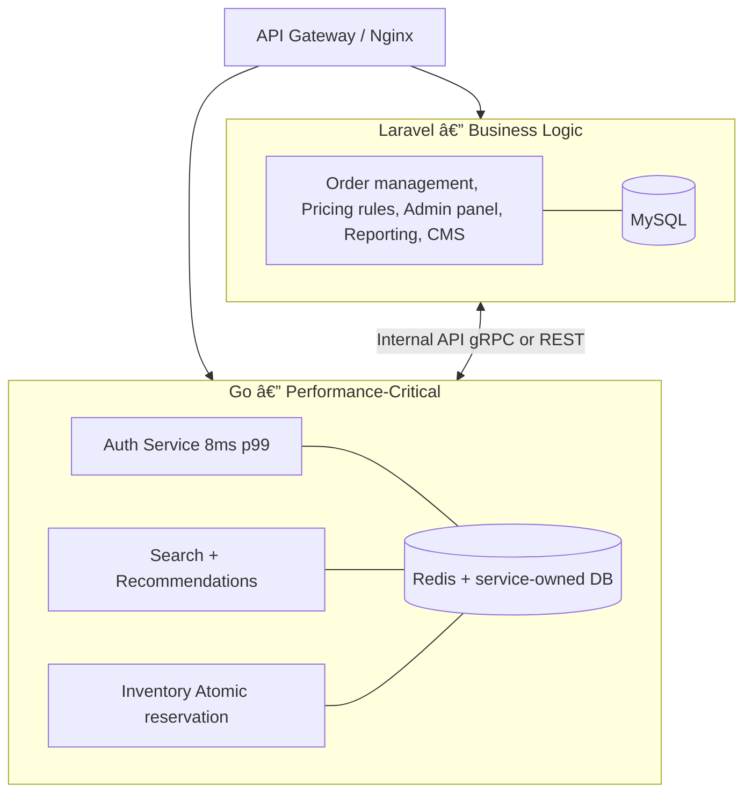

---
title: "Laravel vs Golang: When to Add Features in Each?"
description: "You have a running Laravel system. Should new features be built in Laravel or extracted to Golang? A 4-question decision framework with TCO comparison, concrete benchmarks, and the Strangler Fig hybrid pattern most teams actually use."
date: "2026-07-19T10:00:00+07:00"
lastmod: "2026-07-19T10:00:00+07:00"
slug: "laravel-vs-golang-when-to-add-features"
author: "Lê Tuấn Anh"
draft: false
series: ["magento-migration-vietnam"]
tags: ["Laravel", "Golang", "PHP", "Microservices", "Architecture", "Migration", "Performance", "Vietnam", "Decision Framework"]
categories: ["Architecture", "Engineering", "Strategy"]
ShowToc: true
TocOpen: true
mermaid: true
cover:
  image: "images/posts/laravel-vs-golang-when-to-add-features-cover.png"
  alt: "Laravel vs Golang: when to add features in each — architecture decision framework"
  relative: false
canonicalURL: "https://tanhdev.com/posts/laravel-vs-golang-when-to-add-features/"
---

**Answer-first:** Continue building in Laravel for 90% of new features — business logic, admin panels, complex workflows, reporting. Switch to Golang only when the new feature requires > 1,000 concurrent users, a sub-20ms latency SLA, or needs to scale completely independently from the rest of the system. The right mental model is not "Laravel or Go" — it is "Go for the right service."

### What You'll Learn That AI Won't Tell You
- 3 specific cases where Laravel still beats Go — even at significant scale.
- Why the correct pattern is Strangler Fig (run both), not a rewrite.

---

> This post is part of the **[Magento to Go Migration series](/series/magento-migration-vietnam/)** — a CTO playbook for migrating with a Vietnam engineering team.

## The Real Question

You are running a Laravel system. It works. Product wants new features.

Every Tech Lead eventually asks:

> *"Do we add this to Laravel, or is this the moment to introduce Golang?"*

The answer is not "Laravel is better" or "Go is better." The answer depends entirely on **what kind of feature you are adding**.

---

## Laravel Is the Right Choice When...

### 1. The Feature Has Complex Business Logic

Approval workflows, pricing rules, multi-step checkout, invoice generation, ERP sync, quote negotiation — this is Laravel's domain.

```php
// Laravel: complex, but readable in 5 minutes
Bus::chain([
    new ValidateQuote($quote),
    new ApplyPricingRules($quote),
    new NotifyApprovers($quote),
    new GenerateInvoice($quote),
])->catch(function (Throwable $e) {
    Log::alert('Quote pipeline failed', ['error' => $e->getMessage()]);
})->dispatch();
```

Rewriting this logic in Go takes **3× longer** — not because Go is hard, but because there is no Eloquent, no Horizon, and no equivalent ecosystem. Go is an excellent language for systems programming. It is not designed for business rule orchestration.

### 2. Your Team Is Strong in PHP, With No Go Engineers

Production-ready Go proficiency takes **3–6 months** of genuine ramp-up. During that window, Laravel developers are still shipping features. The opportunity cost of the ramp-up period almost always exceeds the performance benefit.

| | Laravel dev adds feature | Go (training from scratch) |
|---|---|---|
| **Weeks 1–2** | Feature shipped | Learning syntax + goroutine model |
| **Months 1–3** | 10–15 features | 3–5 features + debugging race conditions |
| **Months 4–6** | Production stable | Starting to feel confident with concurrency |

### 3. Traffic Has Not Hit the Laravel Ceiling

Laravel Octane with Swoole reaches **~15,000 req/s** on a well-provisioned server. If your peak traffic has not reached that threshold, adding horizontal scaling or a Read Replica will be cheaper and faster than introducing a Go service.

```bash
# Before reaching for Go, optimize Laravel first:
- Laravel Octane (Swoole/RoadRunner)  -> 3-5x throughput immediately
- Read Replica                         -> offloads 60% of DB read load
- Redis caching layers                 -> resolves 80% of slow query bottlenecks
- Laravel Horizon                      -> async queue replaces synchronous processing
```

### 4. The Feature Is an Admin Panel, Backoffice, or CMS

Filament, Nova, Livewire Volt — Go has **no equivalent**. This is where Laravel dominates absolutely, and no team should invest time building an admin interface from scratch in Go.

---

## Golang Is the Right Choice When...

### The Memory Model: Goroutine vs PHP-FPM Worker

```
PHP-FPM worker:  30-60 MB per request process
Go goroutine:    2-8 KB per concurrent connection

-> 8GB RAM server:
   PHP-FPM: ~130-260 concurrent workers
   Go:      ~1,000,000 goroutines (theoretical)
```

This is why Go wins in the following specific use cases:

### Use Case 1: Realtime APIs (WebSocket, SSE, Long-Poll)

PHP-FPM spawns **one process per connection**. With 10,000 WebSocket connections, you need 10,000 PHP workers — that is not viable.

Go's goroutine model handles **100,000+ concurrent connections** on the same server.

```go
// Go WebSocket handler — 1 goroutine per connection, 2-8KB stack
http.HandleFunc("/ws", func(w http.ResponseWriter, r *http.Request) {
    conn, _ := upgrader.Upgrade(w, r, nil)
    go handleConnection(conn) // non-blocking goroutine
})
```

### Use Case 2: Auth / Token Service (High-Frequency Reads)

Production measurements from `mag-go` — a live Magento to Go migration:

| Endpoint | Laravel (Magento PHP) | Go |
|---|---|---|
| `POST /auth/token` | **180ms** (framework bootstrap) | **8ms** |
| `GET /auth/validate` | **95ms** | **3ms** |
| `GET /user/profile` | **120ms** | **6ms** |

Auth is called on **every single request** across every downstream service. Reducing 170ms here reduces 170ms of latency across the entire system.

### Use Case 3: Flash Sale / Inventory Reservation

```
10x traffic spike during a flash sale:

Laravel monolith:
-> Must scale the entire application (Cart + Order + Payment + Catalog + Auth)
-> 10 services scaled when only 2 are actually bottlenecked
-> Infra cost increases ~10x

Go microservice (Order + Payment only):
-> Scale only the 2 services under load
-> Catalog, Auth, Admin are unaffected
-> Infra cost increases ~2-3x
```

### Use Case 4: File Processing, Image Resizing, Data Pipelines

CPU-bound parallel tasks: Go's goroutine worker pool handles concurrent file operations far more efficiently than a PHP queue. If you need to resize 10,000 images simultaneously or run a large ETL pipeline, Go is the natural fit.

---

## The Right Architecture: Hybrid, Not Rewrite



This pattern is the **Strangler Fig** — you do not rewrite Laravel. You extract exactly the services that need Go, and Laravel remains the core. Go runs as a sidecar for what has genuinely exceeded Laravel's ceiling.

> This is the model Tiki Vietnam uses: not all-Go or all-Java, but **100+ microservices hybrid** (Go + Java + PHP) matched to the exact demand of each domain.

---

## 4-Question Decision Framework

```
Q1: Will this feature serve > 1,000 concurrent users simultaneously?
  +-- NO  -> Continue in Laravel — Go is not needed at this scale
  +-- YES -> Q2

Q2: Does it have a latency SLA below 20ms (auth, search, realtime)?
  +-- NO  -> Laravel + Octane still handles this (50-100ms)
  +-- YES -> Go candidate

Q3: Does the team have at least one production-ready Go engineer?
  +-- NO  -> Stay in Laravel, plan a Go hire for 6 months out
  +-- YES -> Q4

Q4: Does this feature need to scale completely independently?
  +-- NO  -> Laravel monolith is simpler and sufficient
  +-- YES -> Go microservice
```

---

## TCO Comparison: Real Numbers for a Vietnam Team

| Dimension | New Laravel feature | New Go microservice |
|---|---|---|
| **Dev time** (existing Laravel team) | 1–2 weeks | 4–8 weeks (including ramp-up) |
| **Hiring cost (Vietnam)** | $1,500–$2,500/month | $3,000–$4,500/month |
| **Performance ceiling** | ~15k req/s (Octane) | ~200k req/s |
| **Flash sale scale event** | Scale entire monolith | Scale only the bottlenecked service |
| **Infra cost (100k req/day)** | ~$200–400/month | ~$80–150/month (if fully isolated) |
| **Maintenance complexity** | Low (single codebase) | Higher (distributed system) |
| **Bug rollback** | Redeploy one app | Redeploy one service |

**Breakeven point:** Go starts delivering a positive TCO when traffic exceeds **500k req/day AND** the team already has Go proficiency. Below that threshold, Laravel is simpler and cheaper.

---

## The 3-Phase Roadmap Most Teams Actually Follow

```
Phase 1 (Months 0-12): Optimize Laravel first
----------------------------------------------
[x] Laravel Octane (Swoole)     -> 3-5x throughput, no code changes
[x] Read Replica                -> offload 60% of DB read load
[x] Redis cache layers          -> eliminate 80% of slow queries
[x] Horizon + Queues            -> async processing replaces sync
[x] Establish baseline          -> measure p95, p99 response times

Phase 2 (Months 12-18): Extract the first candidate
----------------------------------------------------
[x] Hire or train 1 Go engineer
[x] Extract Auth service -> Go   (smallest, isolated, highest ROI)
[x] Laravel remains source of truth for all business data
[x] Measure: auth latency drops from 180ms -> 8ms
[x] Validate Go service stable in production for 30 days

Phase 3 (Months 18-36): Expand only where data demands it
----------------------------------------------------------
[x] Only extract services where profiling shows a clear bottleneck
[x] Laravel still handles 80-90% of business logic
[x] Go cluster: Auth, Search, Inventory, Realtime
[x] No deadline for "must rewrite everything"
```

---

## Common Mistakes to Avoid

**❌ "Rewrite Laravel in Go for performance"**

Teams that attempt a full rewrite typically spend 8 months and deliver 40% of the original feature set. The Go application is faster but has more bugs because the team has not yet internalized concurrency patterns. Partial rewrites under production pressure are where distributed systems get genuinely dangerous.

**❌ "Microservices before the monolith is stable"**

If your Laravel monolith lacks proper monitoring, structured logging, and defined SLOs — adding a distributed system doubles the operational complexity without solving the underlying problem.

**❌ "We should use Go because Tiki and Shopee use Go"**

Tiki has 200+ engineers. Shopee has 2,000+ engineers. At that scale, distributed systems complexity is justified. If your team has 5–10 engineers, a Laravel monolith is the correct choice until profiling data proves otherwise. Mimicking hyperscaler architecture at startup scale is one of the most common and expensive mistakes in backend engineering.

---

## The Right Question to Ask

It is not *"Laravel or Golang?"*

It is:

> **"Does this feature require something Laravel cannot deliver well enough to justify the operational cost of Go?"**

If you cannot answer that question with specific benchmark data — response time measurements, concurrent user counts, profiling traces — the default answer is **continue in Laravel**.

Go is the right answer to the right problem. Using Go on the wrong problem wastes time, increases cost, and solves nothing.

---


Laravel Octane (Swoole/RoadRunner) improves throughput **3–5× over standard PHP-FPM** by keeping the application bootstrapped in memory rather than reloading it per request. However, Octane does not change PHP's fundamental memory model — each request still executes synchronously, with no native goroutine equivalent. For workloads under **500k req/day** without realtime requirements, Octane is typically sufficient. When you exceed that threshold or require more than 10,000 concurrent connections (WebSocket, long-poll, SSE), Go is the better fit because its goroutine model enables concurrent I/O without a thread-per-connection constraint.



Yes — and this is the most common production pattern. Laravel handles business logic (orders, pricing, workflows), Go handles performance-critical services (auth, search, realtime, inventory). The two stacks communicate via internal REST APIs or gRPC. An API Gateway (Nginx or Cloudflare) routes traffic to the correct service. This pattern is called **Strangler Fig** — no full rewrite required, you extract services incrementally as demand justifies it. Tiki Vietnam is a well-documented example: 100+ microservices running a hybrid of Go, Java, and PHP.



A senior Laravel developer (3+ years) can write production-ready Go services after **3–4 months** of dedicated practice. Go syntax is simpler than PHP — no magic methods, no framework overhead. The hardest part is the **concurrency mental model**: goroutines, channels, race conditions, and context cancellation. These concepts do not exist in PHP and require real production exposure to master. Recommended learning path: Go tour (1 week) → goroutines + channels (2 weeks) → net/http + gRPC (1 month) → production service with proper error handling, testing, and context propagation (2 months).


---

## Related Reading

- **[Shared DB, CDC, or Event Bus? The Magento Migration Database Decision](/posts/strangler-fig-shared-database-quick-win/)** — Database strategy for Magento to Go migration
- **[Zero-Downtime: Moving from Magento to Microservices](/posts/moving-from-magento-to-microservices/)** — 3-phase Strangler Fig execution playbook with Debezium and Dapr
- **[Go Framework Benchmarks: Gin vs Fiber vs Kratos](/posts/high-throughput-go-framework-benchmarks-gin-fiber-kratos/)** — Once you decide on Go, which framework?
- **[Laravel in the AI Era: 10 Predictions for 2028](/posts/the-future-of-laravel-development-in-ai-era/)** — The future of Laravel with AI coding tools



