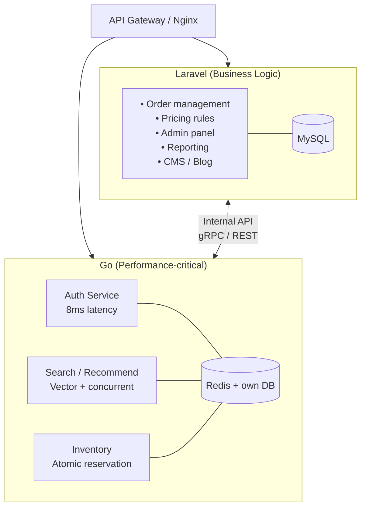

**Answer-first:** Tiếp tục Laravel cho 90% feature mới — business logic, admin panel, workflow phức tạp, report. Chỉ dùng Golang khi feature mới cần > 1,000 concurrent users, SLA latency < 20ms, hoặc cần scale độc lập với phần còn lại của hệ thống. Không phải "Laravel hay Go" — là "Go cho đúng service cần Go."

### What You'll Learn That AI Won't Tell You
- 3 trường hợp cụ thể mà Laravel vẫn thắng Go — kể cả ở quy mô lớn.
- Tại sao pattern đúng là Strangler Fig (chạy song song), không phải rewrite.

---

> Bài này thuộc **[Magento to Go Migration series](/series/magento-migration-vietnam/)** — CTO playbook cho migration với Vietnam engineering team.

## Câu Hỏi Thực Tế

Bạn đang chạy một hệ thống Laravel. Nó hoạt động tốt. Product muốn thêm tính năng mới.

Câu hỏi mà mọi Tech Lead đặt ra lúc này:

> *"Thêm vào Laravel cho nhanh, hay đây là lúc dùng Golang?"*

Câu trả lời không phải "Laravel tốt hơn" hay "Go tốt hơn". Câu trả lời là **feature mới đó thuộc loại nào**.

---

## Laravel Vẫn Là Lựa Chọn Đúng Khi...

### 1. Feature Có Business Logic Phức Tạp

Approval workflow, pricing rule, multi-step checkout, invoice generation, ERP sync, quote negotiation — đây là domain của Laravel.

```php
// Laravel: phức tạp nhưng đọc hiểu được trong 5 phút
Bus::chain([
    new ValidateQuote($quote),
    new ApplyPricingRules($quote),
    new NotifyApprovers($quote),
    new GenerateInvoice($quote),
])->catch(function (Throwable $e) {
    Log::alert('Quote pipeline failed', ['error' => $e->getMessage()]);
})->dispatch();
```

Viết lại logic này bằng Go mất **3× thời gian** — không phải vì Go khó, mà vì không có Eloquent, không có Queue, không có ecosystem tương đương. Go là ngôn ngữ tuyệt vời cho systems programming, không phải cho business rule orchestration.

### 2. Team PHP Mạnh, Chưa Có Go Engineer

Ramp-up Go đúng chuẩn production mất **3–6 tháng**. Trong thời gian đó, Laravel dev vẫn ship feature. Chi phí opportunity cost thường vượt lợi ích performance.

| | Laravel dev thêm feature | Go (ramp-up từ đầu) |
|---|---|---|
| **Tuần 1–2** | Feature shipped | Học syntax + goroutine model |
| **Tháng 1–3** | 10–15 features | 3–5 features + debugging race conditions |
| **Tháng 4–6** | Production stable | Bắt đầu confident với concurrency |

### 3. Traffic Chưa Chạm Trần Laravel

Laravel Octane + Swoole đạt **~15,000 req/s** trên một server tốt. Nếu peak traffic của bạn chưa tới ngưỡng đó, thêm horizontal scaling hoặc Read Replica sẽ rẻ hơn nhiều so với rewrite sang Go.

```bash
# Trước khi nghĩ đến Go, tối ưu Laravel trước:
- Laravel Octane (Swoole/RoadRunner): 3–5× throughput
- Read Replica: giảm tải query cho DB
- Redis Cache: tầng caching có thể giải quyết 80% bottleneck
- Laravel Horizon: async queue thay vì sync processing
```

### 4. Feature Là Admin Panel / Backoffice / CMS

Filament, Nova, Livewire Volt — Go **không có tương đương**. Đây là vùng Laravel thống trị tuyệt đối và không ai nên tốn công viết lại bằng Go.

---

## Golang Là Lựa Chọn Đúng Khi...

### Memory Model: Goroutine vs PHP-FPM Worker

```
PHP-FPM worker:  30–60 MB mỗi request process
Go goroutine:    2–8 KB mỗi concurrent connection

→ 1 server 8GB RAM:
   PHP-FPM: ~130–260 concurrent workers
   Go:      ~1,000,000 goroutines (lý thuyết)
```

Đây là lý do Go thắng ở những use case cụ thể sau:

### Use Case 1: Realtime API (WebSocket, SSE, Long-Poll)

PHP-FPM tạo **1 process per connection**. Với 10,000 WebSocket connections, bạn cần 10,000 PHP workers — không khả thi.

Go goroutine model xử lý **100,000+ concurrent connections** trên cùng một server.

```go
// Go WebSocket handler — 1 goroutine per connection, 2–8KB stack
http.HandleFunc("/ws", func(w http.ResponseWriter, r *http.Request) {
    conn, _ := upgrader.Upgrade(w, r, nil)
    go handleConnection(conn) // goroutine, không blocking
})
```

### Use Case 2: Auth / Token Service (High-Frequency Reads)

Kết quả đo từ production `mag-go`:

| Endpoint | Laravel (Magento) | Go |
|---|---|---|
| `POST /auth/token` | **180ms** (framework bootstrap) | **8ms** |
| `GET /auth/validate` | **95ms** | **3ms** |
| `GET /user/profile` | **120ms** | **6ms** |

Auth là service được gọi **trên mọi request**. Giảm 170ms ở đây nghĩa là giảm 170ms latency cho toàn bộ hệ thống downstream.

### Use Case 3: Flash Sale / Inventory Reservation

```
Flash sale 10× spike:

Laravel monolith:
→ Scale toàn bộ ứng dụng (Cart + Order + Payment + Catalog + Auth)
→ Scale 10 services khi chỉ 2 service thực sự bị hit
→ Chi phí infra tăng 10×

Go microservice (chỉ Order + Payment):
→ Scale đúng 2 service đang bị bottleneck
→ Catalog, Auth, Admin không bị ảnh hưởng
→ Chi phí infra tăng ~2–3×
```

### Use Case 4: File Processing, Image Resize, Data Pipeline

CPU-bound tasks chạy parallel: Go goroutine pool xử lý hiệu quả hơn PHP queue đơn giản. Nếu bạn cần resize 10,000 ảnh đồng thời hoặc chạy ETL pipeline lớn, Go là lựa chọn tự nhiên.

---

## Kiến Trúc Đúng: Hybrid, Không Phải Rewrite



Pattern này là **Strangler Fig** — không rewrite Laravel, chỉ tách đúng service cần Go ra ngoài. Laravel vẫn là core, Go là sidecar cho những gì vượt ngưỡng.

> Đây là mô hình Tiki Vietnam dùng: không phải all-Go hay all-Java, mà **100+ microservices hybrid** (Go + Java + PHP) theo đúng use case của từng domain.

---

## 4-Question Decision Framework

```
Q1: Feature mới có > 1,000 concurrent users đồng thời không?
  └─ NO  → Tiếp tục Laravel — không cần Go ở quy mô này
  └─ YES → Q2

Q2: Có SLA latency < 20ms không (auth, search, realtime)?
  └─ NO  → Laravel + Octane vẫn đủ (50–100ms)
  └─ YES → Go candidate

Q3: Team có ít nhất 1 Go engineer production-ready không?
  └─ NO  → Laravel trước, plan hire Go sau 6 tháng
  └─ YES → Q4

Q4: Feature này cần scale độc lập với phần còn lại không?
  └─ NO  → Laravel monolith đơn giản hơn, đủ dùng
  └─ YES → Go microservice
```

---

## TCO Comparison: Thực Tế Với Vietnam Team

| Dimension | Laravel feature mới | Go microservice mới |
|---|---|---|
| **Dev time** (Laravel team) | 1–2 tuần | 4–8 tuần (ramp-up included) |
| **Hiring cost (VN)** | $1,500–$2,500/tháng | $3,000–$4,500/tháng |
| **Performance ceiling** | ~15k req/s (Octane) | ~200k req/s |
| **Flash sale scale** | Scale toàn monolith | Scale đúng service |
| **Infra cost (100k req/day)** | ~$200–400/tháng | ~$80–150/tháng (nếu isolated) |
| **Maintenance complexity** | Thấp (1 codebase) | Cao hơn (distributed) |
| **Rollback khi có bug** | Deploy lại 1 app | Deploy lại 1 service |

**Breakeven point:** Go bắt đầu có lợi về TCO khi traffic > 500k req/day **và** team đã có sẵn Go experience. Dưới ngưỡng đó, Laravel đơn giản hơn và rẻ hơn.

---

## Lộ Trình Thực Tế: 3 Giai Đoạn

```
Giai đoạn 1 (0–12 tháng): Tối ưu Laravel trước
─────────────────────────────────────────────────
✓ Laravel Octane (Swoole)     → 3–5× throughput
✓ Read Replica                → giảm 60% DB load
✓ Redis Cache layers          → giảm 80% slow queries
✓ Horizon + Queue             → async processing
✓ Đo baseline: response time, p95, p99

Giai đoạn 2 (12–18 tháng): Extract candidate đầu tiên
──────────────────────────────────────────────────────
✓ Hire 1 Go engineer (hoặc train 1 Laravel senior)
✓ Extract Auth service → Go (nhỏ, isolated, high-ROI)
✓ Giữ Laravel làm source of truth
✓ Đo: auth latency giảm từ 180ms → 8ms
✓ Validate Go service stable trong 30 ngày

Giai đoạn 3 (18–36 tháng): Expand theo demand
───────────────────────────────────────────────
✓ Chỉ extract service nào có profiling data cho thấy bottleneck
✓ Laravel vẫn handle 80–90% business logic
✓ Go cluster: Auth, Search, Inventory, Realtime
✓ Không có deadline "phải rewrite hết"
```

---

## Sai Lầm Phổ Biến Cần Tránh

**❌ "Rewrite Laravel sang Go vì performance"**

Tôi đã thấy nhiều team Vietnam mất 8 tháng rewrite, ship được 40% features của Laravel app cũ. Go app chạy nhanh hơn nhưng bug nhiều hơn vì team chưa quen với concurrency patterns.

**❌ "Microservices trước khi monolith đã stable"**

Nếu Laravel monolith chưa có monitoring, chưa có proper logging, chưa có SLO — thêm distributed system sẽ nhân đôi complexity mà không giải quyết vấn đề gốc.

**❌ "Dùng Go vì Tiki/Shopee dùng Go"**

Tiki có 200+ engineers. Shopee có 2,000+ engineers. Scale đó justify distributed system complexity. Nếu team bạn có 5–10 engineers, monolith Laravel vẫn là lựa chọn đúng cho đến khi có profiling data chứng minh ngược lại.

---

## Kết Luận: Câu Hỏi Đúng

Không phải "Laravel hay Golang?" mà là:

> **"Feature này có cần gì mà Laravel không thể cung cấp đủ tốt?"**

Nếu không trả lời được câu hỏi đó với data cụ thể (benchmark, latency measurement, concurrency count), câu trả lời mặc định là **tiếp tục Laravel**.

Go là đáp án cho bài toán đúng. Dùng Go cho bài toán sai thì tốn tiền, tốn thời gian, và không giải quyết được gì.

---


Laravel Octane (Swoole/RoadRunner) đẩy throughput lên **3–5× so với PHP-FPM** bằng cách giữ application bootstrapped trong memory thay vì reload mỗi request. Tuy nhiên, Octane không thay đổi memory model cơ bản của PHP — mỗi request vẫn chạy synchronous, không có native goroutine equivalent. Với workload **< 500k req/day** và không có realtime requirement, Octane thường đủ dùng. Khi vượt ngưỡng đó hoặc cần > 10,000 concurrent connections (WebSocket, long-poll), Go là lựa chọn tốt hơn vì goroutine model cho phép concurrent I/O mà không cần thread-per-connection.



Có — và đây là pattern phổ biến nhất trong production. Laravel xử lý business logic (order, pricing, workflow), Go xử lý high-performance services (auth, search, realtime, inventory). Hai stack giao tiếp qua internal REST API hoặc gRPC. API Gateway (Nginx hoặc Cloudflare) route traffic đến đúng service. Pattern này gọi là **Strangler Fig** — không cần rewrite toàn bộ, chỉ extract từng service khi có nhu cầu thực tế. Tiki Vietnam là ví dụ điển hình: 100+ microservices hybrid Go + Java + PHP.



Senior Laravel developer (3+ năm) có thể viết Go service production-ready sau **3–4 tháng** học nghiêm túc. Syntax Go đơn giản hơn PHP nhiều — không có magic, không có framework overhead. Phần khó nhất là **concurrency mental model**: goroutine, channel, race condition, context cancellation. Đây là những khái niệm không có trong PHP và cần thực hành production thực sự để thành thục. Lộ trình học: Go tour (1 tuần) → goroutine + channel (2 tuần) → net/http + gRPC (1 tháng) → production service với proper error handling + testing (2 tháng).


---

## Bài Tiếp Theo

- **[Shared DB, CDC, hay Event Bus? Quyết định Database khi migrate Magento](/posts/strangler-fig-shared-database-quick-win/)** — Database strategy cho Magento → Go migration
- **[Zero-Downtime: Moving from Magento to Microservices](/posts/moving-from-magento-to-microservices/)** — 3-phase Strangler Fig execution playbook
- **[Go Framework Benchmarks: Gin vs Fiber vs Kratos](/posts/high-throughput-go-framework-benchmarks-gin-fiber-kratos/)** — Khi đã quyết định dùng Go, chọn framework nào?
- **[Laravel in the AI Era: 10 Predictions for 2028](/posts/the-future-of-laravel-development-in-ai-era/)** — Tương lai của Laravel với AI coding tools


