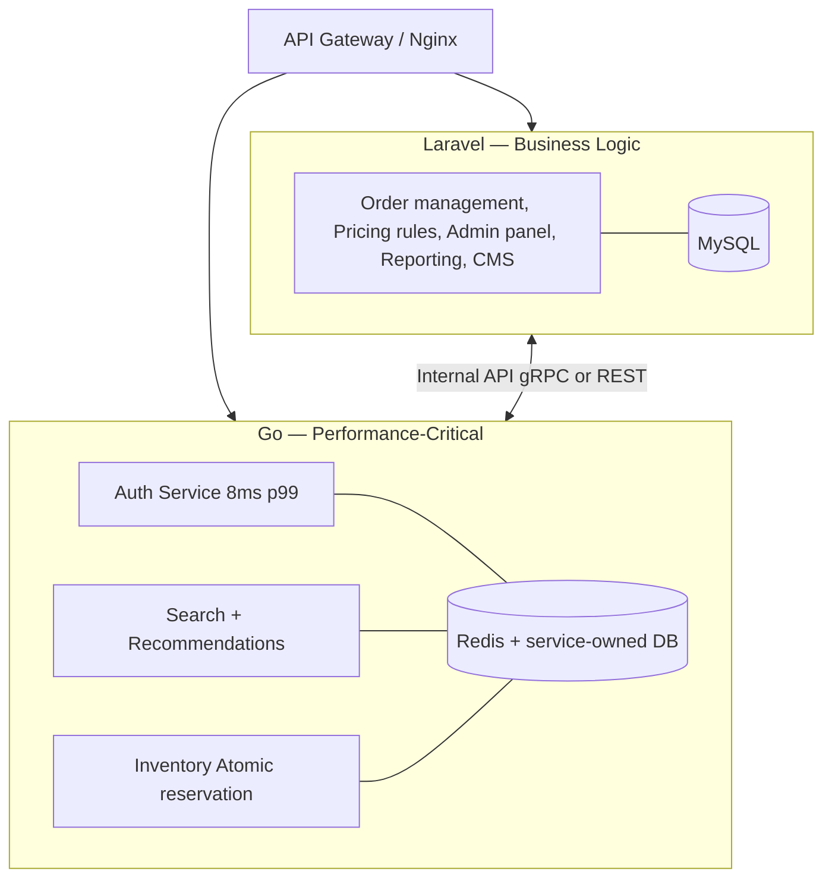

# Laravel vs Golang: When to Add Features in Each?

> **Answer-First:** Keep CRUD features, admin panels, and rapid product iterations in Laravel to maximize developer velocity. Extract high-concurrency microservices, long-running streaming tasks, heavy computations, and gRPC internal services to Golang via the Strangler Fig pattern for sub-5ms P99 latency and lower resource consumption.

- 3 specific cases where Laravel still beats Go — even at significant scale.
- Why the correct pattern is Strangler Fig (run both), not a rewrite.

---

> This post is part of the **[Magento to Go Migration series](/series/magento-migration-vietnam/)** — a CTO playbook for migrating with a Vietnam engineering team.

## The Real Question

Navigating the trade-offs between Laravel and Golang requires technical leads to evaluate feature complexity against execution SLAs and concurrency demands. By identifying whether new requirements fit monolithic PHP paradigms or require compiled Go microservices, engineering teams optimize developer velocity while maintaining sub-millisecond response times under peak traffic loads.

Every Tech Lead eventually faces a pivotal architectural dilemma:

> *"Do we add this new feature directly to Laravel, or is this the right moment to introduce a dedicated Golang microservice?"*

The answer is rarely a simple choice between "Laravel is better" or "Go is better." Instead, making the right engineering decision requires evaluating **the specific operational profile of the feature you are building**. High-velocity CRUD features, admin tools, and complex business workflows belong in Laravel. Conversely, real-time WebSocket feeds, high-throughput auth validation, and compute-heavy pipelines belong in Go.

Understanding when to leverage each language prevents two common engineering mistakes: over-architecting early with unneeded microservices, or forcing a monolithic PHP application to handle low-latency network streams it was never designed to serve.

---

## Laravel Is the Right Choice When...

Retaining features within a Laravel codebase remains the optimal strategy when business logic complexity demands high developer velocity and rich ecosystem integration. In 2026 enterprise architectures, rapid prototyping, admin panel maintenance, and intricate workflow orchestrations benefit significantly from Laravel's mature ORM, built-in queue workers, and comprehensive package ecosystem.

### 1. The Feature Has Complex Business Logic

Approval workflows, pricing rules, multi-step checkout, invoice generation, ERP sync, quote negotiation — this is Laravel's domain.

```php
// Laravel: complex, but readable in 5 minutes
Bus::chain([
    new ValidateQuote($quote),
    new ApplyPricingRules($quote),
    new NotifyApprovers($quote),
    new GenerateInvoice($quote),
])->catch(function (Throwable $e) {
    Log::alert('Quote pipeline failed', ['error' => $e->getMessage()]);
})->dispatch();
```

Rewriting this logic in Go takes **3× longer** — not because Go is hard, but because there is no Eloquent, no Horizon, and no equivalent ecosystem. Go is an excellent language for systems programming. It is not designed for business rule orchestration.

### 2. Your Team Is Strong in PHP, With No Go Engineers

Production-ready Go proficiency takes **3–6 months** of genuine ramp-up. During that window, Laravel developers are still shipping features. The opportunity cost of the ramp-up period almost always exceeds the performance benefit.

| | Laravel dev adds feature | Go (training from scratch) |
|---|---|---|
| **Weeks 1–2** | Feature shipped | Learning syntax + goroutine model |
| **Months 1–3** | 10–15 features | 3–5 features + debugging race conditions |
| **Months 4–6** | Production stable | Starting to feel confident with concurrency |

### 3. Traffic Has Not Hit the Laravel Ceiling

Laravel Octane with Swoole reaches **~15,000 req/s** on a well-provisioned server. If your peak traffic has not reached that threshold, adding horizontal scaling or a Read Replica will be cheaper and faster than introducing a Go service.

```bash
# Before reaching for Go, optimize Laravel first:
- Laravel Octane (Swoole/RoadRunner)  -> 3-5x throughput immediately
- Read Replica                         -> offloads 60% of DB read load
- Redis caching layers                 -> resolves 80% of slow query bottlenecks
- Laravel Horizon                      -> async queue replaces synchronous processing
```

### 4. The Feature Is an Admin Panel, Backoffice, or CMS

Filament, Nova, Livewire Volt — Go has **no equivalent**. This is where Laravel dominates absolutely, and no team should invest time building an admin interface from scratch in Go.

---

## Golang Is the Right Choice When...

Extracting services into Golang is necessary when throughput requirements, concurrency scale, and low-latency performance surpass PHP-FPM runtime capabilities. Go's lightweight goroutine memory model and compiled execution enable backend teams to handle high-frequency authentication checks, real-time WebSocket streams, and compute-heavy data pipelines with minimal CPU and RAM overhead.

### The Memory Model: Goroutine vs PHP-FPM Worker

The key architectural difference between PHP-FPM and Go lies in process stack memory allocation per request:

```text
PHP-FPM worker:  30-60 MB per request process
Go goroutine:    2-8 KB per concurrent connection

-> 8GB RAM server:
   PHP-FPM: ~130-260 concurrent workers
   Go:      ~1,000,000 goroutines (theoretical)
```

This is why Go wins in the following specific use cases:

### Use Case 1: Realtime APIs (WebSocket, SSE, Long-Poll)

PHP-FPM spawns **one process per connection**. With 10,000 WebSocket connections, you need 10,000 PHP workers — that is not viable.

Go's goroutine model handles **100,000+ concurrent connections** on the same server.

```go
// Go WebSocket handler — 1 goroutine per connection, 2-8KB stack
http.HandleFunc("/ws", func(w http.ResponseWriter, r *http.Request) {
    conn, _ := upgrader.Upgrade(w, r, nil)
    go handleConnection(conn) // non-blocking goroutine
})
```

### Use Case 2: Auth / Token Service (High-Frequency Reads)

Production measurements from `mag-go` — a live Magento to Go migration:

| Endpoint | Laravel (Magento PHP) | Go |
|---|---|---|
| `POST /auth/token` | **180ms** (framework bootstrap) | **8ms** |
| `GET /auth/validate` | **95ms** | **3ms** |
| `GET /user/profile` | **120ms** | **6ms** |

Auth is called on **every single request** across every downstream service. Reducing 170ms here reduces 170ms of latency across the entire system.

### Use Case 3: Flash Sale / Inventory Reservation

The following execution comparison shows how microservice scaling protects infrastructure budgets during peak traffic spikes:

```text
10x traffic spike during a flash sale:

Laravel monolith:
-> Must scale the entire application (Cart + Order + Payment + Catalog + Auth)
-> 10 services scaled when only 2 are actually bottlenecked
-> Infra cost increases ~10x

Go microservice (Order + Payment only):
-> Scale only the 2 services under load
-> Catalog, Auth, Admin are unaffected
-> Infra cost increases ~2-3x
```

### Use Case 4: File Processing, Image Resizing, Data Pipelines

CPU-bound parallel tasks: Go's goroutine worker pool handles concurrent file operations far more efficiently than a PHP queue. If you need to resize 10,000 images simultaneously or run a large ETL pipeline, Go is the natural fit.

---

## The Right Architecture: Hybrid, Not Rewrite

Adopting a hybrid microservices architecture combining Laravel and Golang enables organizations to modernize legacy systems without committing to risky full-system rewrites. Using the Strangler Fig migration pattern, teams gradually extract performance-critical domain boundaries into high-speed Go services while keeping core business logic, reporting, and administrative workflows within Laravel.

The hybrid architecture diagram below illustrates how Laravel and Go co-exist in production using the Strangler Fig pattern with an API Gateway:


```mermaid
graph TB
    GW["API Gateway / Nginx"]

    GW --> LA["Laravel App"]
    GW --> GS["Go Services"]

    subgraph LA["Laravel — Business Logic"]
        BL["Order management, Pricing rules, Admin panel, Reporting, CMS"]
        DB_LA[("MySQL")]
        BL --- DB_LA
    end

    subgraph GS["Go — Performance-Critical"]
        AUTH["Auth Service 8ms p99"]
        SEARCH["Search + Recommendations"]
        INV["Inventory Atomic reservation"]
        DB_GO[("Redis + service-owned DB")]
        AUTH --- DB_GO
        SEARCH --- DB_GO
        INV --- DB_GO
    end

    LA <-->|"Internal API gRPC or REST"| GS
```

This pattern is the **Strangler Fig** — you do not rewrite Laravel. You extract exactly the services that need Go, and Laravel remains the core. Go runs as a sidecar for what has genuinely exceeded Laravel's ceiling.

> This is the model Tiki Vietnam uses: not all-Go or all-Java, but **100+ microservices hybrid** (Go + Java + PHP) matched to the exact demand of each domain.

---

Use this 4-question decision flow to determine whether a new requirement belongs in Laravel or Go:

```
Q1: Will this feature serve > 1,000 concurrent users simultaneously?
  +-- NO  -> Continue in Laravel — Go is not needed at this scale
  +-- YES -> Q2

Q2: Does it have a latency SLA below 20ms (auth, search, realtime)?
  +-- NO  -> Laravel + Octane still handles this (50-100ms)
  +-- YES -> Go candidate

Q3: Does the team have at least one production-ready Go engineer?
  +-- NO  -> Stay in Laravel, plan a Go hire for 6 months out
  +-- YES -> Q4

Q4: Does this feature need to scale completely independently?
  +-- NO  -> Laravel monolith is simpler and sufficient
  +-- YES -> Go microservice
```

---

## TCO Comparison: Real Numbers for a Vietnam Team

Evaluating the total cost of ownership across Laravel and Golang implementations requires balancing developer compensation, feature delivery timelines, and cloud infrastructure expenses. While Go services drastically reduce compute and RAM footprint under heavy load, factoring local talent availability and initial ramp-up costs ensures engineering decisions align with financial constraints.

The following total cost of ownership (TCO) breakdown compares developer velocity, hiring costs, and infrastructure expenses for a Vietnam-based team:

| Dimension | New Laravel feature | New Go microservice |
|---|---|---|
| **Dev time** (existing Laravel team) | 1–2 weeks | 4–8 weeks (including ramp-up) |
| **Hiring cost (Vietnam)** | $1,500–$2,500/month | $3,000–$4,500/month |
| **Performance ceiling** | ~15k req/s (Octane) | ~200k req/s |
| **Flash sale scale event** | Scale entire monolith | Scale only the bottlenecked service |
| **Infra cost (100k req/day)** | ~$200–400/month | ~$80–150/month (if fully isolated) |
| **Maintenance complexity** | Low (single codebase) | Higher (distributed system) |
| **Bug rollback** | Redeploy one app | Redeploy one service |

**Breakeven point:** Go starts delivering a positive TCO when traffic exceeds **500k req/day AND** the team already has Go proficiency. Below that threshold, Laravel is simpler and cheaper.

---

## The 3-Phase Roadmap Most Teams Actually Follow

Executing a structured migration roadmap allows engineering organizations to systematically transition from a monolithic framework to a hybrid microservice architecture. By optimizing the existing Laravel application first, extracting isolated high-impact services second, and expanding Go microservices only as traffic dictates, teams minimize technical risk while validating performance gains.

The roadmap below outlines the phased migration timeline from monolith optimization to selective microservice extraction:

```
Phase 1 (Months 0-12): Optimize Laravel first
----------------------------------------------
[x] Laravel Octane (Swoole)     -> 3-5x throughput, no code changes
[x] Read Replica                -> offload 60% of DB read load
[x] Redis cache layers          -> eliminate 80% of slow queries
[x] Horizon + Queues            -> async processing replaces sync
[x] Establish baseline          -> measure p95, p99 response times

Phase 2 (Months 12-18): Extract the first candidate
----------------------------------------------------
[x] Hire or train 1 Go engineer
[x] Extract Auth service -> Go   (smallest, isolated, highest ROI)
[x] Laravel remains source of truth for all business data
[x] Measure: auth latency drops from 180ms -> 8ms
[x] Validate Go service stable in production for 30 days

Phase 3 (Months 18-36): Expand only where data demands it
----------------------------------------------------------
[x] Only extract services where profiling shows a clear bottleneck
[x] Laravel still handles 80-90% of business logic
[x] Go cluster: Auth, Search, Inventory, Realtime
[x] No deadline for "must rewrite everything"
```

---

## Common Mistakes to Avoid

Avoiding common architectural pitfalls prevents engineering teams from burning capital on unnecessary rewrites or introducing premature microservice complexity. Understanding why full application rewrites fail, avoiding microservices prior to establishing monolithic stability, and resisting hyperscaler architectural trends ensures technical decisions remain grounded in empirical performance metrics and business realities.

**❌ "Rewrite Laravel in Go for performance"**

Teams that attempt a full rewrite typically spend 8 months and deliver 40% of the original feature set. The Go application is faster but has more bugs because the team has not yet internalized concurrency patterns. Partial rewrites under production pressure are where distributed systems get genuinely dangerous.

**❌ "Microservices before the monolith is stable"**

If your Laravel monolith lacks proper monitoring, structured logging, and defined SLOs — adding a distributed system doubles the operational complexity without solving the underlying problem.

**❌ "We should use Go because Tiki and Shopee use Go"**

Tiki has 200+ engineers. Shopee has 2,000+ engineers. At that scale, distributed systems complexity is justified. If your team has 5–10 engineers, a Laravel monolith is the correct choice until profiling data proves otherwise. Mimicking hyperscaler architecture at startup scale is one of the most common and expensive mistakes in backend engineering.

---

## The Right Question to Ask

Framing the technology choice around specific operational requirements rather than language bias empowers engineering teams to make rational architectural decisions. Technical leaders must evaluate concrete benchmark data, response latency thresholds, and team skills before determining whether extracting a feature into Go justifies the operational complexity of distributed systems.

It is not *"Laravel or Golang?"*

It is:

> **"Does this feature require something Laravel cannot deliver well enough to justify the operational cost of Go?"**

If you cannot answer that question with specific benchmark data — response time measurements, concurrent user counts, profiling traces — the default answer is **continue in Laravel**.

Go is the right answer to the right problem. Using Go on the wrong problem wastes time, increases cost, and solves nothing.

---

## Frequently Asked Questions

Addressing common architectural inquiries regarding Laravel and Golang integration helps engineering teams clarify migration patterns, framework limits, and developer hiring expectations. The following answers evaluate Octane performance capabilities, hybrid deployment architectures, and developer ramp-up timelines for building high-concurrency systems in enterprise backend environments.

### Can Laravel Octane replace Golang for high-traffic APIs?
Laravel Octane improves throughput 3–5x over standard PHP-FPM by keeping the application bootstrapped in memory rather than reloading it per request. However, Octane does not change PHP's fundamental memory model — each request still executes synchronously, with no native goroutine equivalent. For workloads under 500k req/day without realtime requirements, Octane is typically sufficient. When you exceed that threshold or require more than 10,000 concurrent connections, Go is the better fit because its goroutine model enables concurrent I/O without a thread-per-connection constraint.

### Can you run Laravel and Golang in the same production system?
Yes — and this is the most common production pattern. Laravel handles business logic (orders, pricing, workflows), while Go handles performance-critical services (auth, search, realtime, inventory). The two stacks communicate via internal REST APIs or gRPC stubs. An API Gateway routes traffic to the correct service using the Strangler Fig pattern without requiring a full monolith rewrite.

### How long does it take a Laravel developer to learn Golang for production?
A senior Laravel developer can write production-ready Go services after 3–4 months of dedicated practice. Go syntax is simple, but mastering the concurrency mental model (goroutines, channels, race conditions, context cancellation) requires hands-on experience. Recommended learning path begins with Go fundamentals before progressing to gRPC, middleware chains, and context propagation.

---

## Related Reading

To deepen your technical expertise in high-throughput backend systems, distributed cloud infrastructure, and modern software architecture, explore these related deep dives from our platform. Each guide provides hands-on code examples, production benchmarks, architectural decision frameworks, and real-world deployment strategies to help you build resilient systems at enterprise scale.

- **[Shared DB, CDC, or Event Bus? The Magento Migration Database Decision](/posts/strangler-fig-shared-database-quick-win/)** — Database strategy for Magento to Go migration
- **[Zero-Downtime: Moving from Magento to Microservices](/posts/moving-from-magento-to-microservices/)** — 3-phase Strangler Fig execution playbook with Debezium and Dapr
- **[Go Framework Benchmarks: Gin vs Fiber vs Kratos](/posts/high-throughput-go-framework-benchmarks-gin-fiber-kratos/)** — Once you decide on Go, which framework?
- **[Laravel in the AI Era: 10 Predictions for 2028](/posts/the-future-of-laravel-development-in-ai-era/)** — The future of Laravel with AI coding tools



