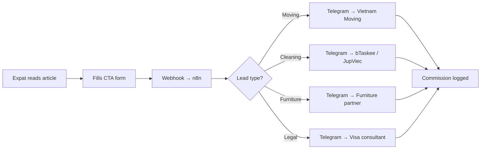
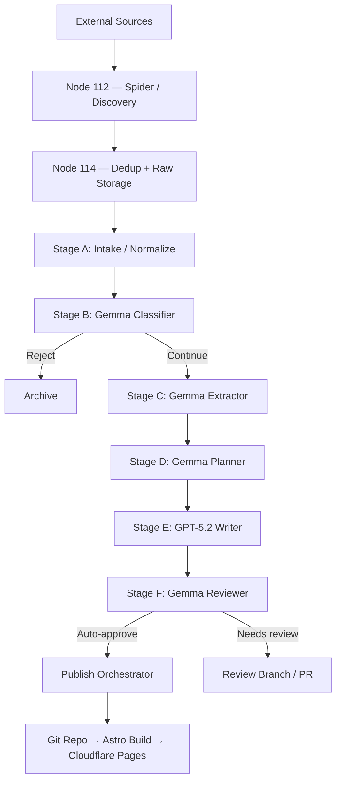

Most AI content projects are built around one question: how do I publish more? LeaseInVietnam is built around a different question: how do I make every published piece convert?

The system is an autonomous relocation hub targeting expats and digital nomads renting in Southern Vietnam — Ho Chi Minh City, Nha Trang, Phú Quốc. It produces content in American English, publishes daily via GitOps, and routes every reader interaction toward a B2B lead funnel that pays commission on moving services, cleaning bookings, furniture rentals, and legal consultations.

The engineering constraint that makes this work is non-negotiable: **no fact reaches the website unless it has a traceable evidence chain back to a real DOM element or API response.** A hallucinated rental price or a fabricated legal claim doesn't just hurt SEO — it destroys the trust that makes the lead funnel valuable.

## 1. The Business Model: Traffic as a Lead Funnel, Not an Ad Inventory

The revenue model is deliberately not AdSense. Expats renting in Vietnam have a predictable sequence of needs after signing a lease:

1. **Moving services** — they need a truck and English-speaking movers
2. **Cleaning / maid services** — weekly cleaning for unfurnished or furnished units
3. **Furniture rental** — many expats rent unfurnished to save on rent, then need furniture
4. **Legal and visa consultation** — TRC renewals, police registration, lease contract review

Each of these is a B2B lead worth real money. Moving commissions run 10-15% per booking. A single furniture fit-out referral for a landlord converting a townhouse into a café or hostel can be worth thousands of dollars in commission.

The mechanism is simple: when an expat fills out a CTA form on the site, a webhook fires to n8n on Node 114, which routes the lead to the relevant B2B partner via Telegram in real time. The partner gets a warm lead with context — what the expat needs, which district, what timeline. The system logs the referral for end-of-month commission reconciliation.



The CTA injection is not manual. GPT-5.2 reads the article's data tags and injects the contextually correct component automatically. An article about flooding in District 7 gets a cleaning service CTA. An article about deposit scams gets a legal consultation CTA. An article about moving to Thao Dien gets a moving service CTA.

## 2. The Scam Warning Feature: Trust as a Competitive Moat

Expats renting in Vietnam have one dominant anxiety: being scammed. Fake listings, bait-and-switch prices, deposit theft, landlords who refuse to register tenants with the police. This anxiety is the reason they search in English rather than using Vietnamese platforms directly.

The system turns this anxiety into a trust signal. The AI Extractor is programmed to detect scam indicators during data collection:

- Price significantly below market for the area and property type
- Listing demands deposit payment before viewing
- No verifiable address or building name
- Source domain is Tier C (forum, unverified social post) with no corroborating evidence

When these signals are detected, the article automatically renders a `<ScamWarning />` component — a red-bordered alert block that explains the specific risk pattern and what to verify before proceeding.

```mdx
<ScamWarning title="Deposit Risk Detected">
  This listing asks for a 3-month deposit upfront before viewing.
  Legitimate landlords in Thao Dien typically require 1-2 months.
  Verify the unit exists and matches photos before transferring any funds.
</ScamWarning>
```

No Vietnamese real estate portal does this. No expat blog does this at scale. The automated scam detection layer is what makes LeaseInVietnam a trust portal rather than just another listing aggregator — and trust is what makes the B2B lead funnel work.

## 3. The Architecture: Eight Stages, Two Nodes, One Rule

The full pipeline runs across two physical machines on a home LAN. The rule that governs the entire system is simple: **Node 112 handles facts. Node 114 handles stories.**



**Node 112** crawls sources, normalizes URLs, deduplicates locally, fetches HTML, and runs Gemma4:e4b for classification and extraction. It never writes an article. It never touches Git. Its output is clean JSONL bundles shipped to Node 114 via a typed internal API.

**Node 114** owns PostgreSQL, runs the internal API, manages content queues, calls GPT-5.2 for article synthesis, validates MDX output, and triggers Cloudflare Pages builds via GitOps.

### The Edge Worker Architecture

Node 112 also exposes a secure Edge API Gateway that allows external workers — laptops, personal machines — to contribute crawling capacity when available. This reduces infrastructure costs by approximately 80% during peak crawl periods. The key design decision: **Node 112 always maintains its own internal workers**, so the system runs autonomously even when no external machines are connected. External workers are acceleration, not dependency.

## 4. The Anti-Hallucination Pipeline

Every field that ends up in a published article passes through four verification layers. This is not optional — it is the architectural foundation that makes the trust portal claim credible.

### Layer 1: Deterministic Extraction

The extractor is a Go service that loads a YAML selector profile for each domain and extracts fields using a strict priority cascade:

1. **Embedded structured data** — JSON-LD, inline script state, API responses (confidence: 0.94-0.98)
2. **DOM selectors** — CSS selectors against the parsed HTML tree (confidence: 0.85-0.95)
3. **Regex on cleaned text** — for price, area, bedroom count patterns (confidence: 0.70-0.85)
4. **Drop** — if none of the above produce evidence, the field does not exist

```go
func (e *Extractor) ExtractField(doc *goquery.Document, rule FieldRule) ExtractedField {
    // 1. Try JSON-LD first — most reliable
    if val, ok := e.extractFromJSONLD(doc, rule.JSONLDPath); ok {
        return ExtractedField{Value: val, Method: "jsonld", Confidence: 0.94}
    }
    // 2. DOM selectors in priority order
    for _, selector := range rule.Selectors {
        if val := doc.Find(selector).First().Text(); val != "" {
            return ExtractedField{Value: val, Method: "dom", Confidence: 0.90}
        }
    }
    // 3. Regex fallback on cleaned text
    if rule.Regex != "" {
        if val, ok := e.extractWithRegex(doc.Text(), rule.Regex); ok {
            return ExtractedField{Value: val, Method: "regex", Confidence: 0.78}
        }
    }
    return ExtractedField{Status: "missing"}
}
```

### Layer 2: Verification

The verifier runs hard rules (instant reject), soft rules (confidence penalty), and cross-field consistency checks.

Hard rejects include: missing `source_url`, critical field with no `raw_text` or `evidence_snippet`, `source_method` is `llm_guess`, price is negative, location contradicts the geo-fence.

The output is a typed verdict per field and per record:

```json
{
  "record_status": "pass",
  "field_results": {
    "price": { "status": "pass", "final_confidence": 0.92 },
    "address": { "status": "pass", "final_confidence": 0.88 },
    "bedrooms": { "status": "suspicious", "reason_codes": ["MULTI_MATCH_CONFLICT"] }
  },
  "record_confidence": 0.87
}
```

Records below 0.80 confidence go to quarantine. Domain trust tiers enforce the distinction: a Tier A listing site can produce a verified price fact; a Tier C Reddit comment can produce a risk signal but not a hard fact.

### Layer 3: Gemma4 Enrichment (Local, Zero Token Cost)

Gemma4:e4b runs locally on Node 112 via Ollama. Its job is narrow: classify the category tag, detect sub-location, summarize clean text in 2-3 sentences, infer risk level from evidence bullets. It receives only `verified_fields`, `clean_text`, and `evidence[]`. It cannot see raw HTML. It cannot hallucinate what it cannot see.

### Layer 4: Bundle Handoff via Internal API

Node 112 ships verified records to Node 114 through a typed HTTP API with idempotency keys. Every field is a typed struct. The API validates schema, business rules, and idempotency before writing to PostgreSQL.

```
POST /internal/api/v1/bundles
Authorization: Bearer <internal-token>
Idempotency-Key: bundle_20260424_hcmc_001
```

## 5. The Selector Profile System

The system has 11 domain-specific YAML profiles covering `batdongsan.com.vn`, `chotot.com`, `nhatot.com`, Reddit threads, Google Maps reviews, official legal pages, and expat blog guides.

```yaml
profile_id: "batdongsan_listing_detail_v1"
domain: "batdongsan.com.vn"
trust_tier: "A"
field_rules:
  price:
    methods: [dom, regex]
    selectors:
      - ".re__pr-short__value"
      - ".price"
    required: true
    base_confidence: 0.92
  address:
    methods: [dom]
    selectors:
      - ".re__pr-short__address"
    base_confidence: 0.88
```

When a domain has no profile, the extractor falls back to generic JSON-LD and meta extraction with a confidence cap of 0.75. Selector drift — when a site redesigns and breaks existing selectors — is detected through pass rate monitoring and triggers a profile update workflow.

## 6. The Editorial Engine: GPT-5.2 as Layout Engineer

Once verified bundles arrive at Node 114, PostgreSQL tracks all state transitions. The router classifies bundles into two content types:

- **Radar articles** — same category tag and location, triggers at 5 items, 600-1200 words, single CTA
- **Guide articles** — multiple category tags for the same sub-location, triggers at 15 items with ≥3 distinct tags, deep-dive format

The writer prompt does not ask GPT-5.2 to "write about Thao Dien." It gives it a structured JSONL payload and a rigid MDX output contract:

- `[PRICE]` + `[INFRASTRUCTURE]` → executive summary frontmatter
- `[DRAMA]` + `[ENVIRONMENT]` → `<ScamWarning>` or `<RedFlags>` component
- `[LIFESTYLE_FOOD]` + `[LIFESTYLE_WELLNESS]` → `<NeighborhoodGrid>` component
- `[SERVICE_GAP]` → contextually appropriate `<CallToAction>` component

The model acts as a layout engineer, not a creative writer. The output is deterministic enough to validate programmatically before it touches Git.

## 7. Dual-Mode Operation

The system supports two content production modes:

**Auto mode** runs on a daily cron. The system maintains a list of core keywords — *"Thao Dien apartment price"*, *"Nha Trang nomad hub"*, *"District 7 expat living"* — and autonomously crawls, extracts, and publishes market updates and area guides without human intervention.

**Manual mode via Telegram** handles breaking trends and niche requests. An admin sends a single keyword to the Telegram bot. The bot triggers the full pipeline — search, extract, verify, write, review, publish — and the article is live within minutes. This is the mechanism for responding to a viral Reddit thread about a scam, a sudden visa regulation change, or a new expat community forming in a new district.

## 8. Content Strategy: Four Buckets, One Conversion Goal

Every piece of content is designed to convert toward one of the B2B lead categories:

| Content Bucket | Example | CTA Injected |
|---|---|---|
| Area Guides | "Best neighborhoods in Nha Trang for expats" | Relocation consultation |
| Relocation Guides | "How to rent in Vietnam as a foreigner" | Legal / TRC consultation |
| Market Updates | "Thao Dien rental prices, April 2026" | Moving service |
| Practical Living | "How to set up utilities in HCMC" | Cleaning / maintenance service |

The Area Guides bucket is the MVP focus — evergreen content, strong SEO, no time sensitivity, ideal for testing the full 8-stage pipeline before expanding to time-sensitive market updates.

## 9. The 10-Agent Scraper Swarm

Data collection runs 10 specialized agents, each geo-fenced to Southern Vietnam (Nha Trang → Phú Quốc):

| Agent | Data Collected | Tag |
|---|---|---|
| `lease_scraper_price_rent` | Current rental rates from listing sites | `[PRICE]` |
| `lease_scraper_price_sale` | Sale prices, ROI estimates | `[INVESTMENT]` |
| `lease_scraper_fb_expat` | Community vibe, local recommendations | `[VIBE]` |
| `lease_scraper_reddit_drama` | Scams, deposit disputes, landlord complaints | `[DRAMA]` |
| `lease_scraper_infra_macro` | Metro updates, road construction, flooding | `[INFRASTRUCTURE]` |
| `lease_scraper_fnb_food` | Expat-rated restaurants, cafes, bars | `[LIFESTYLE_FOOD]` |
| `lease_scraper_wellness` | International hospitals, gyms, yoga studios | `[LIFESTYLE_WELLNESS]` |
| `lease_scraper_climate_aqi` | AQI levels, flood-prone streets | `[ENVIRONMENT]` |
| `lease_scraper_legal` | Visa rules, TRC requirements, police registration | `[LEGAL]` |
| `lease_scraper_competitors` | 1-star reviews of competing agencies | `[SERVICE_GAP]` |

The geo-fence is enforced at both the system prompt level and the verifier level. A record with `location = hanoi` is rejected before it enters the queue.

## 10. Roadmap

**Phase 1 — MVP:** Area Guides for HCMC (Thao Dien, District 7). Evergreen content, strong SEO, no time sensitivity. Goal: validate the full 8-stage pipeline end-to-end and establish the first B2B partner relationships.

**Phase 2 — Coastal expansion:** Nha Trang and Phú Quốc. Deep B2B partner integration with automated commission reconciliation via Telegram SLA bot. Market Updates and Practical Living content buckets activated.

**Phase 3 — Platform scale:** Short-term rental coverage (Airbnb-adjacent), real-time price tracking, and expansion to northern Vietnam (Hanoi, Hai Phong) once the southern pipeline is stable.

## 11. Lessons Learned

**The trust portal is the product, not the content.** The scam warning feature, the evidence-backed prices, the verified legal information — these are what make the B2B lead funnel work. Expats pay attention to a source that tells them when something looks wrong, not just when something looks good.

**Separate the data plane from the editorial plane at the network level.** Not just in code — at the HTTP boundary. This forces a contract and prevents the two concerns from bleeding into each other as the system scales.

**Confidence scores are more useful than binary pass/fail.** A field with 0.72 confidence from a regex match on a noisy domain is different from a field with 0.94 confidence from a JSON-LD parse on a structured listing site. Preserving that signal lets the writer and validator make smarter decisions downstream.

**LLMs are excellent layout engineers when given structured input.** GPT-5.2's output quality improved dramatically when the prompt stopped asking it to "write about X" and started giving it a typed JSONL payload with a rigid MDX output contract. Less creative freedom, more reliable output.

**Quarantine is a feature, not a failure state.** Every quarantined record is a data point about selector drift, domain changes, or edge cases in the extraction logic. A healthy quarantine queue is how the system improves over time without human intervention.

---

*The full architecture documentation, agent identities, pipeline scripts, selector profile bundle, and Go implementation are available in the [leaseinvietnam-model](https://gitlab.com/data-agent/leaseinvietnam) repository.*
