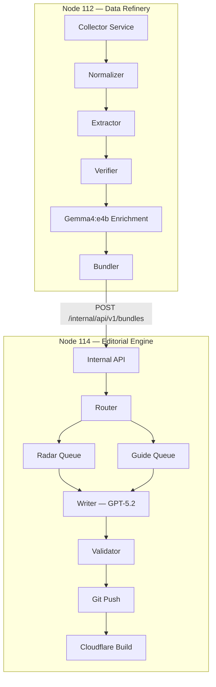
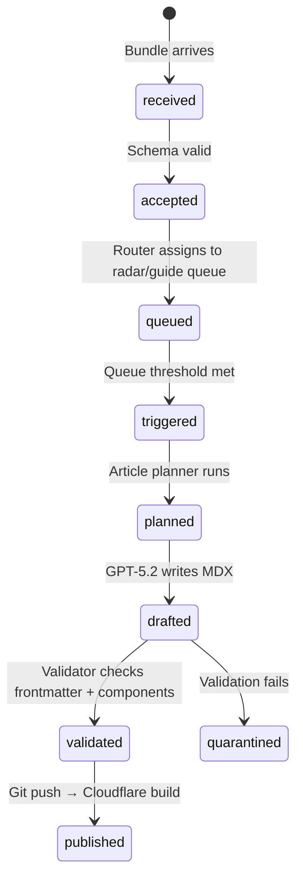

Most AI content pipelines are built backwards. They hand a URL to a Cloud LLM, ask it to "summarize this page," and publish whatever comes out. For a tech blog, that's fine. For a real estate intelligence platform where a hallucinated price or a fabricated legal claim can mislead someone signing a $1,200/month lease in a foreign country, it's a liability.

This is the engineering story behind **LeaseInVietnam** — an autonomous system that scrapes, verifies, and publishes expat rental intelligence for Southern Vietnam. The core design constraint was simple and non-negotiable: **no fact reaches the website unless it has a traceable evidence chain back to a real DOM element or API response.**

## 1. The Problem: LLMs Make Terrible Scrapers

The naive approach to AI-powered content is to treat the LLM as an all-in-one tool: give it a search query, let it browse the web, and ask it to write an article. This works until it doesn't.

The failure modes are predictable:
- **Hallucinated prices.** Ask an LLM to find rental prices in Thao Dien and it will confidently produce numbers that are plausible but unverifiable.
- **Stale legal claims.** Visa regulations in Vietnam change frequently. An LLM trained on data from 6 months ago will state outdated rules as current fact.
- **Geographic drift.** Ask for HCMC data and you'll occasionally get Hanoi results mixed in, especially when the LLM is doing its own web search.

The solution isn't to use a smarter LLM. The solution is to **remove the LLM from the data extraction layer entirely** and only bring it in after the data has been deterministically verified.

## 2. The Architecture: Two Nodes, Two Responsibilities

The system runs on two physical machines on a home LAN, with a hard separation of concerns enforced at the network boundary.



**Node 112** is the data refinery. It crawls, cleans, extracts, and verifies. It runs Gemma4:e4b locally via Ollama for classification and enrichment. It never writes an article. It never touches Git.

**Node 114** is the editorial engine. It owns PostgreSQL, runs the internal API, manages content queues, calls GPT-5.2 Thinking for article synthesis, validates MDX output, and triggers Cloudflare Pages builds via GitOps.

The rule is absolute: **Node 112 handles facts. Node 114 handles stories.**

## 3. The Anti-Hallucination Pipeline

This is the core engineering investment of the project. Every field that ends up in a published article must pass through four layers before it's trusted.

### Layer 1: Deterministic Extraction

The extractor is not an LLM. It's a Go service that loads a YAML selector profile for each domain and extracts fields using a strict priority cascade:

1. **Embedded structured data** — JSON-LD, inline script state, API responses
2. **DOM selectors** — CSS selectors against the parsed HTML tree
3. **Regex on cleaned text** — for price, area, bedroom count patterns
4. **Drop** — if none of the above produce evidence, the field doesn't exist

```go
// Extraction priority: structured data first, DOM second, regex last
func (e *Extractor) ExtractField(doc *goquery.Document, rule FieldRule) ExtractedField {
    // 1. Try JSON-LD
    if val, ok := e.extractFromJSONLD(doc, rule.JSONLDPath); ok {
        return ExtractedField{Value: val, Method: "jsonld", Confidence: 0.94}
    }
    // 2. Try DOM selectors in order
    for _, selector := range rule.Selectors {
        if val := doc.Find(selector).First().Text(); val != "" {
            return ExtractedField{Value: val, Method: "dom", Confidence: 0.90}
        }
    }
    // 3. Try regex on cleaned text
    if rule.Regex != "" {
        if val, ok := e.extractWithRegex(doc.Text(), rule.Regex); ok {
            return ExtractedField{Value: val, Method: "regex", Confidence: 0.78}
        }
    }
    return ExtractedField{Status: "missing"}
}
```

Every extracted field carries its `raw_text`, `evidence_snippet`, `source_selector`, `source_method`, and a `confidence` score. If a field has no evidence, it has no value.

### Layer 2: Verification

The verifier runs hard rules, soft rules, and cross-field consistency checks before any record is accepted.

Hard rules are instant rejects:
- Missing `source_url`
- Critical field (price, address, location) has a value but no `raw_text` or `evidence_snippet`
- `source_method` is `llm_guess` or `unknown`
- Price is negative or zero
- Location in the extracted text contradicts the expected geo-fence

Soft rules lower confidence without rejecting:
- Regex match with a very short snippet
- Multiple selectors returning conflicting values
- Domain is Tier C (Reddit, forum comments) — these can produce signals but not hard facts

The output is a typed verdict per field and per record:

```json
{
  "record_status": "pass",
  "field_results": {
    "price": { "status": "pass", "final_confidence": 0.92 },
    "address": { "status": "pass", "final_confidence": 0.88 },
    "bedrooms": { "status": "suspicious", "reason_codes": ["MULTI_MATCH_CONFLICT"] }
  },
  "record_confidence": 0.87
}
```

Records below 0.80 confidence go to quarantine, not to the queue.

### Layer 3: Gemma4 Enrichment (Local, Zero Token Cost)

Only after a record passes verification does Gemma4:e4b get involved. And its job is narrow: classify the category tag, detect sub-location, summarize the clean text in 2-3 sentences, and infer a risk level from the evidence bullets.

Gemma is explicitly forbidden from:
- Inventing a price
- Filling in a missing address
- Generating a legal claim
- Overriding any verified field

The prompt is structured to receive only `verified_fields`, `clean_text`, and `evidence[]`. It cannot see the raw HTML. It cannot hallucinate what it cannot see.

### Layer 4: Bundle Handoff via Internal API

Node 112 ships verified records to Node 114 through a typed HTTP API, not a shared database or a file drop. Every bundle has an idempotency key. Every field in the payload is a typed struct. The API validates schema, business rules, and idempotency before writing to PostgreSQL.

```
POST /internal/api/v1/bundles
Authorization: Bearer <internal-token>
Idempotency-Key: bundle_20260419_hcmc_001
```

If Node 112 retries due to a timeout, the same bundle is safely replayed without creating duplicates.

## 4. The Selector Profile System

One of the most valuable assets in the project is the selector profile library — YAML files that describe how to extract data from each domain.

```yaml
profile_id: "batdongsan_listing_detail_v1"
domain: "batdongsan.com.vn"
page_type: "listing_detail"
trust_tier: "A"
url_patterns:
  - "/cho-thue*"
field_rules:
  price:
    methods: [dom, regex]
    selectors:
      - ".re__pr-short__value"
      - ".price"
    required: true
    base_confidence: 0.92
  address:
    methods: [dom]
    selectors:
      - ".re__pr-short__address"
    required: false
    base_confidence: 0.88
```

The system currently has 11 profiles covering `batdongsan.com.vn`, `chotot.com`, Reddit threads, Google Maps reviews, official legal pages, and expat blog guides. When a domain has no profile, the extractor falls back to generic JSON-LD and meta extraction — and caps confidence at 0.75.

Domain trust tiers matter. A Tier A listing site can produce a verified price fact. A Tier C Reddit comment can produce a risk signal. The verifier enforces this distinction automatically.

## 5. The Editorial Engine on Node 114

Once verified bundles arrive at Node 114, the editorial pipeline takes over. PostgreSQL is the source of truth for all state transitions — no file queues, no in-memory state.



The router applies a simple rule: if all items in a bundle share the same `category_tag` and `location`, it's a **Radar** article (short, punchy, single-topic). If items span multiple categories for the same sub-location, it's a **Guide** article (deep-dive, multi-section).

Radar triggers at 5 items. Guide triggers at 15 items with at least 3 distinct category tags.

### GPT-5.2 as Layout Engineer

The writer prompt doesn't ask GPT-5.2 to "write an article about renting in Thao Dien." It gives it a structured JSONL payload and a rigid output contract:

- Use `[PRICE]` and `[INFRASTRUCTURE]` data for the executive summary frontmatter
- Use `[DRAMA]` and `[ENVIRONMENT]` data to generate a `<RedFlags>` component
- Use `[LIFESTYLE_FOOD]` and `[LIFESTYLE_WELLNESS]` to populate a `<NeighborhoodGrid>`
- Use `[SERVICE_GAP]` data to inject a contextually appropriate `<CallToAction>`

The model is acting as a layout engineer, not a creative writer. It maps verified data into pre-defined Astro MDX components. The output is deterministic enough to validate programmatically.

### Validation Before Publish

Before any MDX file touches Git, the validator runs:
1. YAML frontmatter parses cleanly
2. `slug` is lowercase, hyphenated, under 60 characters
3. `category` is in the allowed list (`hcmc`, `nha-trang`, `vung-tau`, `phu-quoc`)
4. All components are in the allowlist — no arbitrary JSX injection
5. No section is empty

Fail any check → quarantine. The article job status stays `quarantined` in PostgreSQL. No push to main.

## 6. The 10-Agent Scraper Swarm

The data collection layer runs 10 specialized agents, each geo-fenced to Southern Vietnam (Nha Trang → Phú Quốc). Each agent is a focused identity with a narrow mandate:

| Agent | Data Collected | Tag |
|---|---|---|
| `lease_scraper_price_rent` | Current rental rates | `[PRICE]` |
| `lease_scraper_price_sale` | Sale prices, ROI estimates | `[INVESTMENT]` |
| `lease_scraper_fb_expat` | Community vibe, local recommendations | `[VIBE]` |
| `lease_scraper_reddit_drama` | Scams, deposit disputes, landlord complaints | `[DRAMA]` |
| `lease_scraper_infra_macro` | Metro updates, road construction, flooding | `[INFRASTRUCTURE]` |
| `lease_scraper_fnb_food` | Expat-rated restaurants, cafes, bars | `[LIFESTYLE_FOOD]` |
| `lease_scraper_wellness` | International hospitals, gyms, yoga studios | `[LIFESTYLE_WELLNESS]` |
| `lease_scraper_climate_aqi` | AQI levels, flood-prone streets | `[ENVIRONMENT]` |
| `lease_scraper_legal` | Visa rules, TRC requirements, police registration | `[LEGAL]` |
| `lease_scraper_competitors` | 1-star reviews of competing agencies | `[SERVICE_GAP]` |

The geo-fence is enforced at the system prompt level and at the verifier level. If an extracted `location` field resolves to Hanoi or Da Nang, the record is rejected before it enters the queue.

## 7. The Business Model: B2B Lead Funnel

The content pipeline isn't just an SEO play. Every article is a lead funnel for B2B services targeting expats who just rented a place and immediately need:

- Moving services (commission: 10-15% per booking)
- Weekly cleaning (referral to bTaskee, JupViec)
- Furniture rental for unfurnished units
- Legal consultation for TRC and lease contract review

The `<CallToAction>` component is injected contextually by the writer. An article about flooding in District 7 gets a cleaning service CTA. An article about deposit scams gets a legal consultation CTA. An article about moving to Thao Dien gets a moving service CTA.

The lead webhook fires to n8n on Node 114, which routes to the relevant B2B partner via Telegram in real time.

## 8. Lessons Learned

**Separate the data plane from the editorial plane at the network level.** Not just in code, not just in modules — at the HTTP boundary. This forces you to define a contract and prevents the two concerns from bleeding into each other over time.

**Confidence scores are more useful than binary pass/fail.** A field with 0.72 confidence from a regex match on a noisy domain is different from a field with 0.94 confidence from a JSON-LD parse on a structured listing site. Preserving that signal lets the writer and validator make smarter decisions downstream.

**Quarantine is a feature, not a failure state.** Every record that goes to quarantine is a data point about selector drift, domain changes, or edge cases in the extraction logic. A healthy quarantine queue is how you improve the system over time.

**LLMs are excellent layout engineers when given structured input.** The quality of GPT-5.2's output improved dramatically when we stopped asking it to "write about X" and started giving it a typed JSONL payload with a rigid MDX output contract. Less creative freedom, more reliable output.

## 9. What's Next

The `code/` directory is currently in Sprint 1 — closing the five P0 gaps identified in the code quality assessment: typed boundary contracts, unified dedup strategy, DB-backed queue for guide articles, claim-job lifecycle for article jobs, and publish status correctness.

After that, Sprint 2 focuses on deepening the extractor with JSON-LD parsing, adding fixture tests for the two primary listing domains, and persisting quarantine audit trails end-to-end.

The long-term vision is a user-generated content layer where Vietnamese landlords submit listings through a form, n8n triggers an LLM to translate and reformat the listing into expat-grade English, and a Pull Request is automatically opened for admin review. The website stays static. The pipeline stays autonomous. The trust score stays intact.

---

*The full architecture documentation, agent identities, pipeline scripts, and selector profile bundle are available in the [leaseinvietnam-model](https://gitlab.com/data-agent/leaseinvietnam) repository.*
