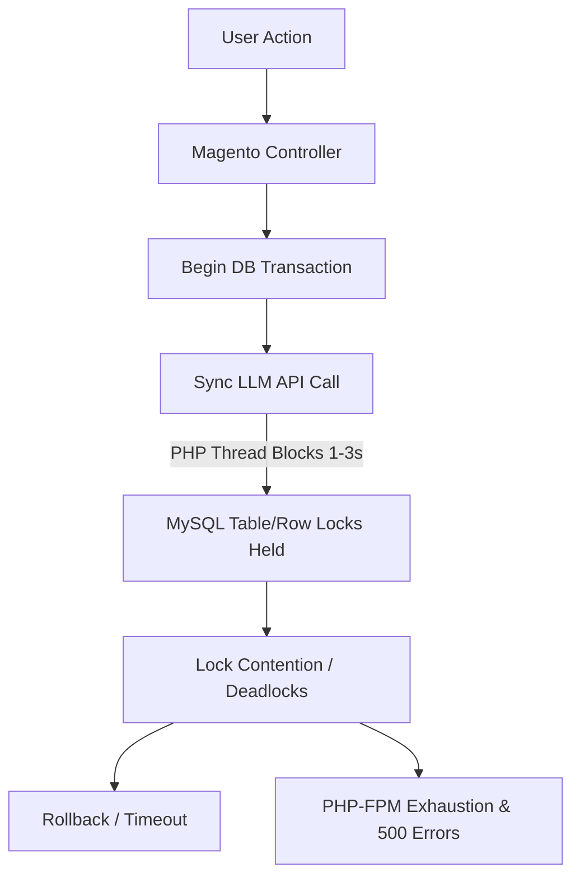
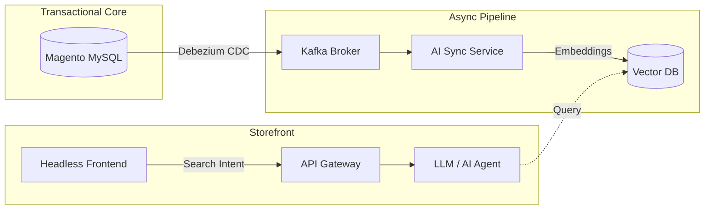

The hype surrounding artificial intelligence in e-commerce is deafening. Every SaaS platform promises "one-click AI personalization," leaving legacy Magento (Adobe Commerce) merchants feeling trapped. Facing the choice of a multi-million dollar replatforming project or falling behind the AI curve, many e-commerce leaders make a critical mistake: they attempt to force AI workloads directly into Magento's monolithic core.

This guide details why that approach fails, provides an architectural blueprint for decoupling AI workloads, and analyzes the strategic ROI and compliance considerations of Magento AI integration.

---

## 1. The Magento AI Dilemma: Legacy EAV vs. High-Performance AI

**Answer-first:** Integrating AI into Magento requires decoupling AI workloads via event-driven architecture to prevent MySQL lock contention, PHP-FPM exhaustion, and performance degradation in production environments.

Magento was architected in a different era. At its core lies the **Entity-Attribute-Value (EAV)** database schema. While EAV provides unmatched flexibility for managing complex, multi-attribute product catalogs, it does so at a massive performance cost. Ranging across tables like `catalog_product_entity_varchar`, `_int`, and `_decimal`, rendering a single product grid requires joining five or more tables at query time. 

AI workloads—specifically vector searches, LLM-based product recommendations, and agentic workflows—are fundamentally different from traditional SQL transactions:
1. **High Dimensionality:** Vector embeddings representing product semantic meanings require specialized vector databases (e.g., pgvector, Qdrant, Pinecone) to calculate similarity using cosine distance. Relational MySQL databases are mathematically incompatible with high-dimensional search queries at scale.
2. **Computational Load:** Generative AI calls and prompt-building pipelines require low-latency data access. Forcing Magento to process unstructured catalog text and compute recommendations synchronously on the main database server degrades platform responsiveness.
3. **Data Silos:** Magento contains transactional data (orders, carts, quotes) and product data, but lacks context regarding customer clickstreams, hesitation, or off-site behaviors. AI thrives on unified customer profiles, which Magento’s database is not designed to aggregate.

To successfully integrate AI, you must recognize that Magento is an exceptional **transactional core** (order management, promotions, checkout rules) but a poor **analytical engine** for AI workloads.

---

## 2. The Technical Pitfall: How Synchronous AI Plugins Cause MySQL Locks

The most common point of failure when adding AI to Magento is installing market-ready plugins that run **synchronously** within Magento’s execution thread. 

Consider a standard transaction flow: a customer updates their cart, or an administrator saves a product catalog change. In a standard Magento installation, these write operations are wrapped in MySQL database transactions. 



If an AI plugin is wired to trigger during these events (for instance, to auto-tag a product during save or fetch custom up-sell options during checkout) and makes a synchronous external API call (e.g., to OpenAI or Claude), the following chain reaction occurs:

1. **Extended Lock Duration:** The database transaction remains open while Magento waits for the external AI API to respond. Latency from external services (which frequently spikes to 1–3 seconds) means InnoDB row or table locks (e.g., on quotes or inventory) are held far longer than the normal milliseconds.
2. **Lock Contention & Deadlocks:** Under high concurrency, other user sessions attempting to write to those same tables are blocked. When multiple threads wait for each other's locks, a deadlock occurs, throwing database errors and terminating checkout sessions.
3. **PHP-FPM Pool Exhaustion:** Magento’s synchronous PHP architecture means a PHP worker is blocked, idling, while waiting for the LLM response. During peak traffic, all available PHP-FPM processes can become blocked waiting on external network I/O, rendering the entire digital storefront unresponsive (throwing 504 Gateway Timeouts).

Any architecture that allows external, high-latency API calls to block database-wrapped PHP threads is a critical liability for production environments.

---

## 3. Decoupling the Stack: Augmenting Magento via AI Microservices

To bypass these database locks and maintain performance, you should adopt a **decoupled, event-driven architecture** based on the Strangler Fig pattern. Instead of running AI inside Magento, you extract the data to a dedicated AI-native service layer.

For a deeper dive on applying this pattern to legacy stacks, see the [Magento to microservices migration guide](/posts/moving-from-magento-to-microservices/).

The decoupled architecture consists of three components:



### Step 1: Change Data Capture (CDC)
Instead of forcing Magento to push catalog updates to the AI engine via synchronous hooks, use a CDC tool like **Debezium** to monitor the MySQL binary log (binlog) in real-time. Whenever a product is created, updated, or deleted, Debezium captures the low-level database write event asynchronously and streams it to an event broker (e.g., Apache Kafka or RabbitMQ). This adds zero overhead to Magento’s application layer.

### Step 2: Asynchronous Data Processing
A lightweight background microservice consumes events from the broker. This service flattens the complex EAV product data into a structured JSON document, generates semantic embeddings via an embedding model API, and writes the vectors directly to a dedicated vector database.

### Step 3: API Gateway Routing
When a customer searches the site or requests recommendations, the frontend (e.g., a React/Astro headless storefront or an API gateway) bypasses Magento entirely. It queries the vector database directly for semantic recommendations and returns the list of matching SKUs. Magento is only called at the final step to fetch real-time inventory and pricing for those specific SKUs.

By keeping the AI data pipeline completely out of Magento’s execution thread, your transactional core remains fast and stable, even if the AI engine is processing massive reasoning chains.

---

## 4. High-ROI Use Cases: Vector Search and Autonomous Support Agents

E-commerce C-level executives must focus investments on use cases with proven revenue and operational ROI:

### Use Case A: Conversational & Vector Search
Traditional search in Magento relies on exact keyword matching (via Elasticsearch or OpenSearch). If a user types a synonym, descriptive phrase, or makes a typo, they often receive a "zero results" page, causing high bounce rates.

By [implementing agentic search using vector databases](/posts/agentic-ecommerce-search-golang-vector-databases/), you search by **intent** rather than strings. 
*   **Business Impact:** In case studies of mid-market retailers, vector search implementation has led to **10–25% increases in search-to-conversion rates** and **10–50% average order value (AOV) growth** due to more accurate semantic cross-selling.
*   **Merchandising Savings:** Manually curating search dictionaries and redirect rules becomes obsolete, reducing merchandising labor costs.

### Use Case B: Autonomous Customer Service Swarms
Customer service is a major cost center, especially during seasonal surges. 
*   **Beyond Chatbots:** 2026 marks the shift to **Agentic Support**, where AI agents are integrated via Magento’s REST/GraphQL APIs. Instead of merely answering FAQs, these agents can check shipment APIs, issue returns, process exchanges, or apply credits directly to Magento accounts based on business rules.
*   **Business Impact:** As demonstrated by brands like Klarna, modern AI support agents can automate **60–70% of routine inquiries** (such as WISMO - "Where Is My Order?"), lowering support contact costs by up to 30% and dramatically accelerating average resolution times from minutes to seconds.

---

## 5. Open-Source vs. Proprietary APIs: Navigating the E-commerce AI Cost Curve

A critical decision for the TCO (Total Cost of Ownership) is choosing between proprietary APIs (e.g., OpenAI, Claude, Gemini) and hosting open-source LLMs (e.g., Llama, Mistral, DeepSeek).

```
Proprietary APIs (Pay-as-you-go)        Open-Source Hosting (Self-Hosted)
─────────────────────────────────        ─────────────────────────────────
- Capital Expense (CapEx): None          - Capital Expense (CapEx): High (GPU servers)
- Marginal Cost: Linear ($/1M tokens)    - Marginal Cost: Flat (fixed infra cost)
- Best for: Low/Bursty volume            - Best for: High, predictable volume
```

### The Token Amplification Tax
Proprietary models charge per million tokens. While this seems minor, production-grade agentic workflows require "chain-of-thought" reasoning, where a single user inquiry triggers multiple internal model loops (classification, database lookup, verification, synthesis). This leads to **token amplification**, multiplying your expected API cost by **5x to 10x** per session.

*   **When to Use Proprietary APIs:** Best for fast prototyping, low traffic volumes, or highly complex tasks requiring frontier model intelligence.
*   **When to Deploy Open-Source LLMs:** If your e-commerce platform processes tens of thousands of search queries and support chats daily, self-hosting fine-tuned open-source models on dedicated cloud GPUs (e.g., AWS EC2 with NVIDIA H100s) reaches a break-even point within months. It enables **token arbitrage**—routing basic inquiries to cheap, internal open-source models and only escalating complex reasoning to expensive proprietary models.

---

## 6. Data Privacy and Compliance: GDPR, CCPA, and AI in E-commerce

Feeding customer and catalog data to AI models introduces major compliance challenges under data protection laws like GDPR (Europe) and CCPA/CPRA (California):

1. **Automated Decision-Making (ADMT):** CCPA grants consumers the right to opt out of automated decision-making technologies, which includes AI-driven dynamic pricing or profiling. E-commerce platforms must provide clear "Opt-Out" mechanisms.
2. **Explainable AI (XAI):** Under GDPR, if an AI model decides to deny a promotion or credit limit to a user, the business must be able to explain the logic behind the automated outcome. Deep-learning black boxes do not satisfy this requirement; you must build transparency logs.
3. **Data Residency and Leakage:** Sending customer PII (names, purchase history, addresses) to external APIs for personalization can violate compliance laws if the data is used to train third-party models. Using enterprise-grade private API tenants (e.g., Azure OpenAI) or self-hosted open-source models guarantees that customer data remains isolated.

---

## 7. Decision Framework: Replatform to SaaS vs. Strangler Fig Augmentation

Before deciding to retire your Magento instance in favor of a modern SaaS stack (like Shopify Plus) for its AI native features, evaluate the total cost of ownership (TCO) and customization requirements.

Use this decision matrix to evaluate your next move:

| Dimension | Replatform to Shopify Plus + AI | Maintain Magento + Decoupled AI |
|:---|:---|:---|
| **Upfront Cost (CAPEX)** | Very High (rebuilding code, themes, integrations) | Moderate (building CDC pipeline and AI gateway) |
| **Operational Cost (OPEX)** | Linear scaling (revenue sharing, app subscription fees) | Fixed infrastructure (hosting vector DBs and cloud GPUs) |
| **Customization Ceiling** | Medium (bound by SaaS API limits and templates) | Unlimited (full control over database, code, and models) |
| **Upgrade Friction** | Zero (handled by SaaS platform) | Remains high for Magento Core, but low for the AI layer |

If your commerce logic is relatively standard and speed-to-market is your primary KPI, replatforming is highly viable. 

However, if your business relies on complex B2B workflows, ERP reconciliations, or custom configurations, the cost of rebuilding those rules on a SaaS platform often exceeds the cost of augmenting your existing Magento core with an asynchronous AI microservice stack.

To assess if Magento remains a viable foundation for your business architecture, refer to our analysis: [Is Magento still worth investing in 2026?](/posts/magento-still-worth-investing-2026/).

---

## FAQ


Synchronous AI plugins cause locks by keeping the database transaction open while waiting for high-latency external AI API responses (1-3 seconds). This blocks other write operations, leading to lock contention and deadlocks under high traffic.



It uses Change Data Capture (CDC) like Debezium to asynchronously read database changes from the MySQL binlog and stream them to a separate AI microservice. This completely removes the external API call from Magento's execution thread and database transactions.



Vector search implementations have shown 10-25% increases in search-to-conversion rates and 10-50% AOV growth. Autonomous support agents can automate 60-70% of routine inquiries, reducing support costs by up to 30%.



To comply with GDPR and CCPA, merchants must ensure AI models don't use customer PII for third-party training, provide clear opt-out mechanisms for automated decision-making, and maintain transparency logs for Explainable AI (XAI).



Replatforming to SaaS (like Shopify Plus) is ideal if your commerce logic is standard and speed-to-market is the primary goal. Augmenting Magento with decoupled AI is more cost-effective if your business relies on complex B2B workflows, ERP reconciliations, or highly custom configurations.


## Bottom Line

Integrating AI into legacy e-commerce is not a database query problem; it is an **architectural boundary problem**. Trying to force AI into Magento's monolithic EAV core leads to MySQL lock contention, PHP worker depletion, and performance degradation. 

By utilizing event-driven, asynchronous data streaming, you can isolate your stable transactional core while layering high-performance, agentic search and customer support services. You don't need to rebuild your storefront to leverage AI—you need to decouple it.

For the broader PHP ecosystem perspective — how AI agents, serverless functions, and Model Context Protocol are reshaping Laravel development toward 2028 — see [Laravel in the AI Era: 10 Predictions for 2028](/posts/the-future-of-laravel-development-in-ai-era).


