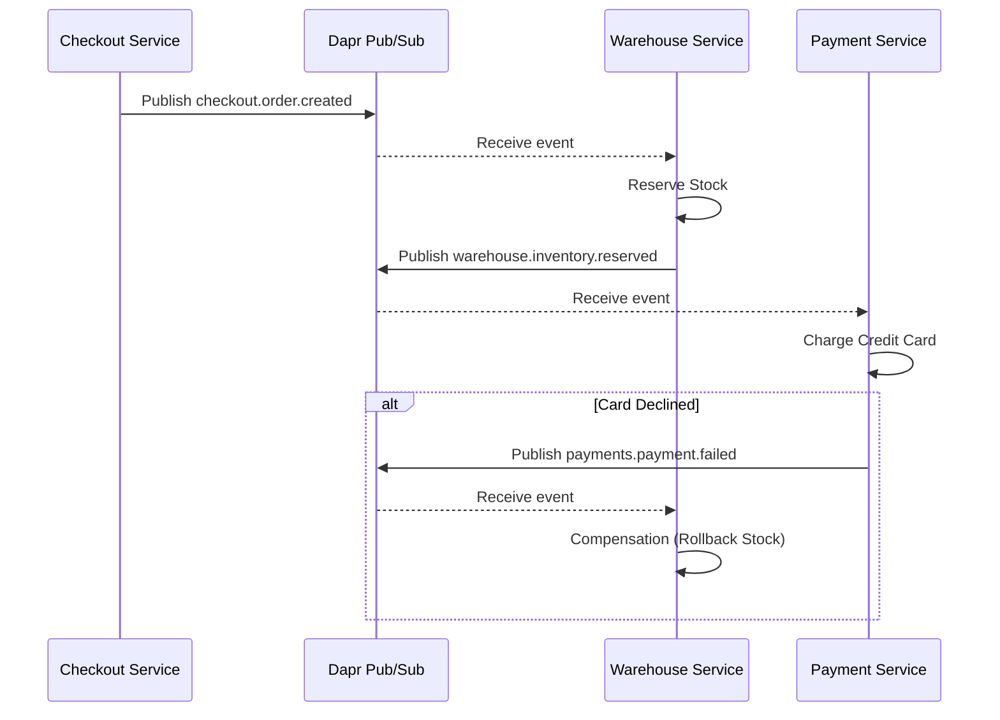

**Answer-first:** Decouple a 21+ microservice ecosystem using Event-Driven Architecture. Ensure data consistency via Sagas, Dead Letter Queues, and Idempotent handlers.

In my previous post, we explored how abandoning monolithic architecture in favor of strict **Domain-Driven Design (DDD)** bounded contexts allowed an e-commerce platform to scale beyond 10,000+ orders per day. However, splitting one big database into 20+ isolated Postgres databases introduces a terrifying new problem: **How do we maintain data consistency across disconnected services?**

The answer is **Event-Driven Architecture (EDA)**. Rather than chaining blocking synchronous HTTP calls across the network — which guarantees a cascading failure if a single service is down — each microservice independently broadcasts out-of-band "Events" through a centralized broker. Services are decoupled from each other's availability. A brief outage in the Notification service does not cause a checkout failure.

This post walks through how we implemented EDA in a production Go microservices system using **Dapr v1.14** — covering the sidecar model, pub/sub configuration, the Saga pattern, idempotent consumers, DLQ configuration, and the production pitfalls we encountered that the tutorials never warn you about.

---

## What Is Dapr and Why Use It for Go Microservices?

**Dapr is NOT a message broker — it's a sidecar abstraction layer running as a separate process next to every service. Your Go code calls `dapr.PublishEvent(ctx, "pubsub", "orders", payload)` where `"pubsub"` is a component name in YAML — not hardcoded Kafka config. Swap from Redis (local dev) to Kafka (production) by changing one YAML field, zero Go code changes. The sidecar adds ~1ms localhost latency per hop.**

Before writing a single `PublishEvent` call, you need to understand what Dapr actually is — because most tutorials misrepresent it.

**Dapr (Distributed Application Runtime)** is not a message broker. It is an **abstraction layer** that runs as a sidecar process next to every service in your Kubernetes cluster. Your Go service never talks directly to Kafka, RabbitMQ, or Redis. It talks to the local Dapr sidecar via HTTP or gRPC (over localhost), and the sidecar handles all the broker-specific communication.

```
Your Go Service (port 8080)
       ↕ localhost (sub-ms latency)
Dapr Sidecar (port 3500)
       ↕ Kafka / RabbitMQ / Redis
Message Broker
```

### Why This Matters for Go Engineers

**Infrastructure portability:** Your Go service calls `dapr.PublishEvent(ctx, "pubsub", "orders", payload)`. That `"pubsub"` is the component name defined in a YAML file — not hardcoded Kafka config. Switching from Redis (local development) to Kafka (production) means changing a YAML file, not rewriting service code.

**No broker SDK sprawl:** Without Dapr, every service imports `sarama` (Kafka) or `amqp` (RabbitMQ) — each with its own connection management, offset handling, and error semantics. With Dapr, your Go code uses a single, uniform `go-sdk` API regardless of the underlying broker.

**Built-in resilience:** Dapr handles retries, circuit breaking, dead-letter routing, and mTLS between services — configured via YAML, not coded into every service individually.

### Dapr vs. Kafka Directly: When to Choose Which

This is the question every Go team asks. They are not competing technologies — Dapr can use Kafka as its backend. The decision is about the abstraction:

| Use Dapr Pub/Sub when... | Use Kafka directly when... |
|---|---|
| Polyglot services (Go, Python, Node.js) | You need Kafka Streams / ksqlDB for stream processing |
| You may swap brokers in the future | Latency budget is extremely tight (< 1ms per hop) |
| You want built-in retries and DLQ via YAML | Your team has deep Kafka expertise and no need for portability |
| Rapid development is the priority | You need granular partition management / offset control |

The Dapr sidecar adds approximately **sub-millisecond to ~1ms latency per hop** via the localhost loopback. For the vast majority of e-commerce and fintech workloads, this is an acceptable tradeoff for the developer velocity gains.

> **Note:** Do not run Dapr and Istio mTLS simultaneously without disabling one of them — the double sidecar overhead compounds and you end up with redundant mTLS on the same traffic path.

---

## Setting Up Dapr Pub/Sub in Go

**Four-step Dapr setup in Go: (1) define a `Component` YAML with `type: pubsub.kafka` and broker address; (2) publish with a single `client.PublishEvent(ctx, "pubsub", "checkout.order.created", event)` call; (3) subscribe by registering an HTTP route handler via `s.AddTopicEventHandler`; (4) for background workers without HTTP servers, use the v1.14 streaming subscription (`client.Subscribe`) with `msg.Success()` / `msg.Fail()` acks.**

### Step 1: Define the Pub/Sub Component

Create a component YAML that tells Dapr which message broker to use. For local development, Redis is installed by default with `dapr init`. For production, swap to Kafka by changing the `type` and `metadata`:

```yaml
# components/pubsub.yaml
apiVersion: dapr.io/v1alpha1
kind: Component
metadata:
  name: pubsub          # This name is what your Go code references
  namespace: default
spec:
  type: pubsub.kafka    # Use pubsub.redis for local development
  version: v1
  metadata:
  - name: brokers
    value: "kafka-broker:9092"
  - name: consumerGroup
    value: "orders-consumer-group"
  - name: authType
    value: "none"       # Use certificate for production
```

No Go code changes — only the YAML changes between environments. Your service always calls `"pubsub"` by component name.

### The Golden Rule: Event Naming Conventions

Event-Driven systems quickly devolve into untraceable chaos if events aren't strictly structured. We enacted an iron-clad 3-segment naming convention:

`{service}.{entity}.{action}`

For example:
* `orders.order.status_changed`
* `pricing.price.updated`
* `warehouse.inventory.stock_changed`

This enforces traceability. The prefix declares the absolute root owner of the event, the entity declares the contextual object, and the past-participle action perfectly defines its lifecycle state. It also makes DLQ routing predictable (more on that below).

### Step 2: Publishing Events from Go

Install the Dapr Go SDK:

```bash
go get github.com/dapr/go-sdk
```

Publishing an event is a single function call. The SDK handles serialization, sidecar communication, and retry on transient network errors:

```go
package checkout

import (
    "context"
    "encoding/json"
    "fmt"

    dapr "github.com/dapr/go-sdk/client"
)

type OrderCreatedEvent struct {
    EventID   string  `json:"event_id"`    // Idempotency key
    OrderID   string  `json:"order_id"`
    UserID    string  `json:"user_id"`
    TotalAmt  float64 `json:"total_amount"`
}

func PublishOrderCreated(ctx context.Context, order *Order) error {
    client, err := dapr.NewClient()
    if err != nil {
        return fmt.Errorf("dapr client init: %w", err)
    }
    defer client.Close()

    event := OrderCreatedEvent{
        EventID:  generateUUID(), // Critical: unique idempotency key per event
        OrderID:  order.ID,
        UserID:   order.UserID,
        TotalAmt: order.Total,
    }

    if err := client.PublishEvent(
        ctx,
        "pubsub",           // Component name from YAML
        "checkout.order.created",  // Topic — follows our naming convention
        event,
    ); err != nil {
        return fmt.Errorf("publish order.created: %w", err)
    }
    return nil
}
```

### Step 3: Subscribing in Go (Push Model)

The traditional push-based subscription registers HTTP route handlers that Dapr calls when events arrive:

```go
package warehouse

import (
    "context"
    "log"

    "github.com/dapr/go-sdk/service/common"
    daprd "github.com/dapr/go-sdk/service/grpc"
)

func main() {
    s, err := daprd.NewService(":50051")
    if err != nil {
        log.Fatal(err)
    }

    // Register subscription handler
    if err := s.AddTopicEventHandler(&common.Subscription{
        PubsubName: "pubsub",
        Topic:      "checkout.order.created",
        Route:      "/reserve-stock",  // HTTP path for push-based delivery
    }, handleOrderCreated); err != nil {
        log.Fatal(err)
    }

    log.Println("Warehouse service listening on :50051")
    if err := s.Start(); err != nil {
        log.Fatal(err)
    }
}

func handleOrderCreated(ctx context.Context, e *common.TopicEvent) (bool, error) {
    var event OrderCreatedEvent
    if err := e.DataAs(&event); err != nil {
        return false, err // Return error → Dapr retries
    }

    // Idempotency check before processing
    if alreadyProcessed(ctx, event.EventID) {
        log.Printf("Duplicate event %s — skipping", event.EventID)
        return false, nil // Acknowledge without processing
    }

    if err := reserveStock(ctx, event.OrderID); err != nil {
        return true, err // true = retry; false = send to DLQ
    }

    markProcessed(ctx, event.EventID) // Record for idempotency
    return false, nil
}
```

### Step 4: Streaming Subscriptions (Dapr v1.14 — Preview)

Dapr v1.14 introduced **Streaming Subscriptions** as a preview feature. Instead of Dapr pushing HTTP calls to your application, your Go service opens a persistent bi-directional gRPC stream and pulls messages:

```go
package warehouse

import (
    "context"
    "fmt"
    "log"

    dapr "github.com/dapr/go-sdk/client"
)

func RunStreamingConsumer(ctx context.Context) error {
    client, err := dapr.NewClient()
    if err != nil {
        return fmt.Errorf("dapr client: %w", err)
    }
    defer client.Close()

    // Open persistent stream — no inbound ports needed
    sub, err := client.Subscribe(ctx, dapr.SubscriptionOptions{
        PubsubName: "pubsub",
        Topic:      "checkout.order.created",
    })
    if err != nil {
        return fmt.Errorf("subscribe: %w", err)
    }
    defer sub.Close()

    log.Println("Streaming subscription open — waiting for events")

    for {
        msg, err := sub.Receive()
        if err != nil {
            return fmt.Errorf("receive: %w", err)
        }

        if err := processEvent(ctx, msg.RawData); err != nil {
            // Negative acknowledgment → triggers retry + eventual DLQ routing
            msg.Fail()
            continue
        }

        msg.Success() // Positive ack — advances the offset
    }
}
```

**When to prefer streaming:** Background workers, batch processors, or Kubernetes jobs where you do not want to open an HTTP server or expose inbound ports. The persistent gRPC connection also provides better flow control and backpressure than push-based delivery.

> **⚠️ Preview API Notice:** The streaming subscription API (`client.Subscribe`) was introduced as a **preview feature in Dapr v1.14**. The struct name `dapr.SubscriptionOptions` and the exact method signatures may have evolved in subsequent releases. Always verify the exact API against the official [Dapr Go SDK releases page](https://github.com/dapr/go-sdk/releases) before using this pattern in production. Do not use preview APIs without pinning to a specific SDK version in your `go.mod`.

---

## Surviving Failure: The Saga Pattern

**Dapr choreography Saga: Checkout publishes `checkout.order.created` → Warehouse reserves stock and publishes `warehouse.inventory.reserved` → Payment charges and publishes result. On payment failure, a `payments.payment.failed` event triggers Warehouse to compensate (rollback stock). No central coordinator — each service knows its role. Use this pattern for 2–4 step Sagas; switch to Dapr Workflow Orchestration for 4+ steps with complex branching.**

You can no longer execute a simple `BEGIN ... COMMIT` SQL block to save an order, reserve inventory, and capture a payment. If a customer checks out, we launch a **Saga**.



A Saga is an orchestrated sequence of local transactions. The Checkout service publishes `checkout.order.created`. The Warehouse service catches this event, reserves stock, and reacts based on success. If a subsequent step fails (e.g., the Payment service declines the card via a `payments.payment.failed` event), the Saga triggers **Compensating Transactions** — broadcasting reverse events to un-reserve the stock and fail the order.

### Choreography vs. Orchestration

The diagram above shows **Choreography**: each service knows its role and reacts to events independently. No central coordinator exists.

For complex sagas with many conditional branches, consider **Dapr Workflow** (orchestration): a durable workflow engine where a single orchestrator function defines the entire saga steps, handles state persistence, and manages retries and compensation automatically. The tradeoff is coupling — the orchestrator knows about every participant.

**Rule of thumb:** Use choreography for 2–4 step sagas. Switch to Dapr Workflow when compensating transaction logic becomes complex enough that a single developer cannot reason about the entire flow at a glance.

---

## Designing Immortal Consumers (Idempotency & DLQs)

**Every event payload must include a unique `EventID`. Before processing, check `alreadyProcessed(ctx, event.EventID)` — if true, acknowledge and skip (don't re-process). For poison messages, configure `deadLetterTopic: "dlq.checkout.order.created"` in `resiliency.yaml` with `maxRetries: 5` and exponential backoff — after 5 failures, the event routes to the DLQ instead of looping forever and blocking the partition.**

The network is notoriously unreliable. Dapr guarantees *At-Least-Once* delivery, meaning your service **will** receive duplicate events occasionally during retry storms.

Every single event payload structurally guarantees a unique `EventID`. Our Go consumer handlers are religiously **Idempotent**. If `pricing.price.updated` arrives twice, the handler gracefully verifies if the database already matches the new state, skipping the duplicate without throwing errors.

### Configuring Retries and DLQ in `resiliency.yaml`

What if a message consistently crashes the processor because of a logical defect? Without explicit DLQ configuration, the message loops in the retry queue forever — blocking processing of subsequent events in the same partition.

Configure Dapr's resiliency policies with a `deadLetterTopic`:

```yaml
# components/resiliency.yaml
apiVersion: dapr.io/v1alpha1
kind: Resiliency
metadata:
  name: order-resiliency
  namespace: default
spec:
  policies:
    retries:
      pubsubRetry:
        policy: exponential   # exponential backoff
        maxInterval: 60s
        maxRetries: 5         # After 5 failures → route to DLQ
  targets:
    components:
      pubsub:                 # Matches the component name in pubsub.yaml
        inbound:
          retry: pubsubRetry
          deadLetterTopic: "dlq.checkout.order.created"  # Naming convention
```

Following our naming convention, a crashing `checkout.order.created` event gets routed precisely to `dlq.checkout.order.created`. This allows engineers to safely replay failed events post-mortem after deploying a hotfix, permanently eliminating critical data loss.

### DLQ Subscriber: Inspecting and Replaying Poison Messages

```go
package dlq

import (
    "context"
    "encoding/json"
    "log"

    "github.com/dapr/go-sdk/service/common"
)

// DLQ handler — wired to "dlq.checkout.order.created" topic
func HandlePoisonMessage(ctx context.Context, e *common.TopicEvent) (bool, error) {
    log.Printf("[DLQ] Received poison message: topic=%s, data=%s",
        e.Topic, string(e.RawData))

    var event map[string]interface{}
    if err := json.Unmarshal(e.RawData, &event); err != nil {
        log.Printf("[DLQ] Cannot parse message — archiving for manual review")
        archiveForManualReview(ctx, e.RawData)
        return false, nil // Acknowledge — don't re-loop
    }

    // After deploying a hotfix, replay by re-publishing to original topic
    if shouldReplay(ctx, event) {
        replayToOriginalTopic(ctx, "checkout.order.created", event)
    }

    return false, nil
}
```

The DLQ pattern converts permanent failures from silent data loss into **observable, recoverable engineering events**.

---

## Production Pitfalls to Avoid

**Five pitfalls that only production reveals: (1) Double-write — crash between `db.Update` and `PublishEvent` creates a permanently stuck Saga; fix with the Transactional Outbox Pattern (write event to `outbox` table in the same DB transaction, CDC publishes it). (2) Schema evolution — renaming an event field silently breaks all consumers; use Protobuf or a Schema Registry. (3) Ordering — use `partitionKey: order.ID` so all events for the same order route to the same Kafka partition. (4) SIGTERM mid-message — finish current message before stopping. (5) Dapr + Istio double mTLS — disable one.**

These are the failure modes that production experience reveals — and that tutorials skip.

### 1. The Double-Write Problem (The Silent Data Killer)

**The bug:** Your Go handler writes the payment state to Postgres, then calls `dapr.PublishEvent`. The service crashes between those two lines. Result: the database has the payment recorded. The downstream Warehouse service never receives `payments.payment.completed`. Stock is never released. The Saga is permanently stuck in an inconsistent state — silently.

**The fix:** **Transactional Outbox Pattern**. Write the event record into an `outbox` table in the *same database transaction* as the state change. A separate CDC process (Debezium or TiCDC) reads the outbox table and publishes to Dapr/Kafka. Either both the state change and the event emission happen, or neither does.

```sql
BEGIN;
-- 1. Business state change
UPDATE orders SET status = 'confirmed' WHERE id = $1;

-- 2. Outbox record — same transaction
INSERT INTO event_outbox (topic, payload, created_at)
VALUES ('checkout.order.created', $2, NOW());

COMMIT;
-- CDC process handles publishing — no dual-write risk
```

For a deep-dive on how PayPay implements this at 7.8 billion transactions/year, see the [Kafka idempotency and Outbox Pattern in production](/series/paypay-architecture/part-2-event-driven-kafka/) post.

### 2. Schema Evolution: Events Are Public APIs

When you change an event's field names, add required fields, or remove fields, you are changing a public API that every subscriber depends on. Unlike HTTP APIs where you can version a single endpoint, changing an event schema silently breaks all existing consumers on the next deploy.

**The fix:** Treat event schemas like public API contracts.
- Use **Protocol Buffers (Protobuf)** for event serialization — the compiler enforces backward compatibility.
- If using JSON, maintain a **Schema Registry** and version your events explicitly (`"schema_version": "v2"`).
- Never remove or rename a field in a breaking release — add new fields alongside existing ones.

### 3. Message Ordering Guarantees

Dapr (and Kafka) do not guarantee global ordering across all partitions. If `orders.order.status_changed` for the same order ID arrives on two different partitions, the consumer might process the `cancelled` event before the `confirmed` event.

**The fix:** Use a consistent partition key (e.g., `order_id`) so all events for a single order are routed to the same Kafka partition. Within a single partition, ordering is guaranteed.

```go
// Publish with explicit partition key
client.PublishEvent(ctx, "pubsub", "orders.order.status_changed", event,
    dapr.PublishEventWithMetadata(map[string]string{
        "partitionKey": order.ID, // All events for same order → same partition
    }),
)
```

### 4. Graceful Shutdown: Do Not Kill Mid-Message

If your Go service receives SIGTERM (Kubernetes pod termination) while processing a message, the default behavior kills the process immediately — leaving the message partially processed. Dapr will redeliver it, but your handler may have already committed a side effect (e.g., partially updated the database).

**The fix:** Listen for shutdown signals and finish the current message before stopping:

```go
func main() {
    ctx, cancel := context.WithCancel(context.Background())

    // Intercept SIGTERM / SIGINT
    sigCh := make(chan os.Signal, 1)
    signal.Notify(sigCh, syscall.SIGTERM, syscall.SIGINT)

    go func() {
        <-sigCh
        log.Println("Shutdown signal received — finishing current message...")
        cancel() // Signal consumers to stop after current message
    }()

    runConsumer(ctx) // Consumer checks ctx.Done() between messages
    log.Println("Clean shutdown complete")
}
```

### 5. Avoid Dapr + Istio mTLS Double Overhead

If you run both Dapr and Istio (or Linkerd) in the same cluster, you may end up with mTLS enforced at both the Dapr sidecar layer and the service mesh layer — encrypting the same traffic twice, adding double overhead with zero security benefit.

**The fix:** Choose one for mTLS. Use the service mesh for cluster-wide network security, and disable Dapr's mTLS (`daprsystem` config: `mtls.enabled: false`). Or use Dapr mTLS only and disable the service mesh's traffic interception for Dapr-annotated pods.

---

## Conclusion

Event-Driven Architecture is not just about writing async code; it is a **defensive engineering mindset**. By enforcing iron-clad naming conventions, embracing the Saga pattern for cross-boundary consistency, and heavily leveraging Idempotency and DLQs, we transformed a fragile distributed system into a practically bulletproof e-commerce nervous system.

The patterns in this post — the Transactional Outbox, idempotent consumers, DLQ replay workflows, and graceful shutdown — are the difference between an EDA system that works in demos and one that holds up at 3 AM during a flash sale campaign.

**Where to go next:**

- For the full DDD architecture that this EDA layer builds on, see [Architecting a 21-Service E-commerce Ecosystem with Golang & DDD](/posts/architecting-21-service-ecommerce-golang-ddd/).
- For how PayPay implements Kafka-native idempotency at 7.8 billion transactions/year (without Dapr's abstraction layer), see [Part 2 — Handling the Surge: Event-Driven & Kafka](/series/paypay-architecture/part-2-event-driven-kafka/).
- For high concurrency event-driven scaling patterns using these concepts, check out our [High Concurrency Systems](/series/high-concurrency-systems/) masterclass.
- For deploying these Go microservices on Kubernetes with GitOps, see [GitOps at Scale with Argo CD](/posts/gitops-at-scale-kubernetes-argocd-microservices/).
- For the observability layer — how to propagate W3C trace context across Kafka topics, configure tail-based sampling in OTel Collector, and trace gRPC calls between Dapr sidecars — see [Go Microservices Distributed Tracing Architecture](/posts/go-microservices-distributed-tracing-architecture).



## FAQ


The **Transactional Outbox pattern** solves the double-write problem in event-driven systems. Without it, your service writes state to Postgres, then calls `dapr.PublishEvent` — if it crashes between those two lines, the state is saved but the event is never published, leaving downstream services in an inconsistent state permanently. The fix: write the event record into an `outbox` table in the *same database transaction* as the state change, then use a CDC process (Debezium or TiCDC) to read the outbox and publish to Dapr/Kafka. Either both the state change and event emission happen (database commits), or neither does (database rolls back). No dual-write risk.



Use **Choreography** (each service reacts to events independently with no central coordinator) for sagas with 2–4 steps where any developer can reason about the entire flow at a glance. Use **Dapr Workflow Orchestration** (a single durable orchestrator function that defines all saga steps, state persistence, retries, and compensation) when the compensating transaction logic becomes complex enough that you cannot trace a failure without reading 4+ service codebases simultaneously. The tradeoff: choreography has lower coupling but harder observability at scale; orchestration is easier to debug but creates a single point of change that all participants couple to.



They are not mutually exclusive — Dapr can use Kafka as its backend. The decision is about the abstraction layer. Use **Dapr Pub/Sub** when you have polyglot services (Go + Python + Node.js), may need to swap brokers in the future (Redis locally, Kafka in production), or want retries, DLQ routing, and circuit breaking configured via YAML without coding them into every service. Use **Kafka directly** when you need Kafka Streams or ksqlDB for stream processing, need granular partition management and offset control, have a team with deep Kafka expertise, or your latency budget is extremely tight (Dapr adds ~1ms sidecar overhead per hop via localhost loopback).


