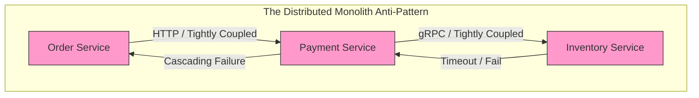

# Golang Modular Monolith: The Anti-Microservices Guide

For years, the software industry has been brainwashed by a pervasive mindset: *"A Modular Monolith is just a weak stepping stone before the system gets big enough to graduate to Microservices."* Countless companies, even those with engineering teams you can count on two hands, rushed to dismantle their monoliths to chase the distributed "cloud" dream.

They called it the Future. Architect Rico Fritzsche calls it **"CV-Driven Development"** [in his famous GitConnected article](https://medium.com/gitconnected/microservices-are-not-the-next-step-after-a-modular-monolith-01287f0fde4e). And the hard data from 2025 is proving Rico right.

---

## 1. The Receding Tide of Microservices (Hard Data)

**According to a 2025 CNCF survey, 42% of organizations that adopted Microservices have consolidated their systems back into Modular Monoliths after hitting the "Coordination Ceiling," where operational costs choke technical benefits.**

If you still believe Microservices are the undeniable pinnacle of architecture, look at the most dramatic "U-turns" in the industry:

### Amazon Prime Video: 90% Cost Savings
In early 2023, Amazon Prime Video shocked the tech world by abandoning their Serverless Microservices architecture (AWS Lambda/Step Functions) for their Video monitoring system. The reason? Millions of state transitions and constant network data transfers via S3 created massive latency and an astronomical AWS bill. By consolidating everything into a single Monolith running on EC2/ECS, they [reduced infrastructure costs by 90%](https://www.primevideotech.com/video-streaming/scaling-up-the-prime-video-audio-video-monitoring-service-and-reducing-costs-by-90).

### Segment: Goodbye 140 Microservices
Segment once sliced their system into 140 independent Microservices. Instead of shipping new features, their engineers were forced to become "plumbers"—configuring Service Meshes, managing cross-dependencies, and desperately trying to trace bugs across dozens of repositories (massive Cognitive Load). When they consolidated back into a Modular Monolith, their deployment velocity skyrocketed.

---

## 2. Anatomy of the "Distributed Monolith" Trap

**The Distributed Monolith is a disastrous anti-pattern where a system is split into multiple services that remain tightly coupled, forcing you to inherit all the drawbacks of Microservices with none of the benefits.**

Imagine splitting an E-commerce system into `OrderService`, `PaymentService`, and `InventoryService`. When a new order arrives, `Order` makes a gRPC call to `Payment`, waiting for `Payment` to make an HTTP call to `Inventory`.



- **The Distributed Penalty:** An in-memory function call takes a few **nanoseconds**. A network call between two services takes several **milliseconds** (millions of times slower).
- **No Independent Deployment:** If you change the data schema in `Order`, the `Payment` service crashes.
- **Complex Transactions:** You are forced to implement complex distributed transaction patterns like Sagas or Two-Phase Commits (2PC).

---

## 3. Why Golang Was Born for Modular Monoliths

**Golang provides powerful code isolation mechanisms (like `internal` packages) and native in-memory communication (Go Channels, Interfaces), making it the ultimate language for designing ultra-low latency Modular Monoliths.**

Instead of relying on Kubernetes namespaces and gRPC to isolate modules, Golang allows you to enforce boundaries directly at the Compiler level.

### Isolating Domains with `internal` packages
Go has an elegant feature: the `internal/` directory. Code placed inside `internal/` can only be accessed by packages sharing the same parent directory. You can break tight coupling without having to split code into separate repositories.

```go
project-root/
├── cmd/
│   └── api/
│       └── main.go (Single Entrypoint - 1 Binary)
├── internal/
│   ├── order/
│   │   ├── handler.go
│   │   └── service.go (Communicates with payment strictly via Interface)
│   ├── payment/
│   │   └── service.go
```

### In-Memory Communication
Instead of `Order` firing an HTTP request to `Payment`, they communicate via **Interfaces** (Dependency Injection) or by passing Events through **Go Channels**. Everything happens inside a single OS Process, within shared RAM. The speed is measured in nanoseconds. Even if you eventually need to decouple, refer to [Building Event-Driven Microservices with NATS](/posts/building-high-throughput-event-driven-microservices-go-nats-jetstream-cqrs/) to avoid synchronous HTTP calls.

---

## 4. Conway's Law: When Do You Actually Need Microservices?

Conway's Law states: *"Organizations which design systems are constrained to produce designs which are copies of the communication structures of these organizations."*

You should only adopt Microservices when you meet these conditions:
1. **Organizational Scale:** You have >50 Backend Developers, split into independent "2-pizza" teams (5-7 people). Merging code into a single repository causes conflicts that CI/CD can no longer resolve efficiently.
2. **Asymmetrical Infrastructure Scaling:** For instance, a "Video Encode" feature requires GPUs and consumes 90% CPU, while the "User Profile" feature only needs RAM. In this scenario, extracting `VideoService` into its own deployment unit makes practical sense.

## Frequently Asked Questions


The Coordination Ceiling is the operational threshold where the costs of distributed systems (cross-network latency, distributed Sagas, complex CI/CD pipelines, and multi-repo sync) exceed the productivity benefits of independent team deployments, slowing feature velocity and inflating cloud bills.



A Go modular monolith compiles into a single static binary that can be deployed across dozens of stateless container instances behind an Application Load Balancer. Scaling horizontally is straightforward and cost-effective since all internal domain calls run in-memory without network serialization overhead.



Go's compiler natively enforces package encapsulation: any package located inside an `internal/` directory cannot be imported by packages outside that parent directory tree. This compile-time rule prevents cross-domain spaghetti coupling without requiring runtime network boundaries.



Decomposing into microservices is justified when engineering organizations grow beyond 50+ backend engineers split across autonomous 2-pizza teams, or when specific modules require asymmetrical hardware resources (such as GPU-accelerated video rendering versus lightweight user profiles).


---

## Conclusion

A Modular Monolith is not an outdated predecessor to Microservices. It is a complete, highly optimized destination. Build a clean Modular Monolith with strict Domain boundaries. Only carve it up into Microservices if—and only if—the cost of communication between humans (Developers) becomes higher than the cost of communication over the Network.
