```mermaid
graph TD
    subgraph DNS_Routing [DNS-based Latency Routing - e.g., AWS Route 53]
        ClientDNS[Client in Vietnam] -->|1. Resolve api.tanhdev.com| Resolver[Local DNS Resolver]
        Resolver -->|2. Query Name Server| Route53[AWS Route 53]
        Route53 -->|3. Measure Latency via ECS Subnet| Resolver
        Route53 -->|4. Return lowest latency IP: Singapore| Resolver
        Resolver -->|5. Return Singapore ALB IP| ClientDNS
        ClientDNS -->|6. Connect directly via TCP/TLS| SG_ALB[Singapore Region - ap-southeast-1]
    end

    subgraph Anycast_Routing [Anycast IP Routing - e.g., Cloudflare]
        ClientAnycast[Client in Vietnam] -->|1. Resolve api.tanhdev.com| ResolverAnycast[Local DNS Resolver]
        ResolverAnycast -->|2. Query Anycast DNS| CF_DNS[Cloudflare Anycast DNS]
        CF_DNS -->|3. Return Static Anycast IPs| ResolverAnycast
        ResolverAnycast -->|4. Return Static Anycast IPs| ClientAnycast
        ClientAnycast -->|5. Send TCP/TLS Packets| ISP[Vietnam ISP Gateway]
        ISP -->|6. Route via BGP to closest node| CF_Edge[Cloudflare Ho Chi Minh / Hanoi POP]
        CF_Edge -->|7. Reverse Proxy over backbone| Origin[Origin Backend Server]
    end
```

Geo-distributed API Routing giúp điều hướng request của người dùng đến server gần nhất để giảm thiểu độ trễ. Các phương pháp phổ biến bao gồm DNS Latency-based Routing (như AWS Route53) và Anycast IP (như Cloudflare), kết hợp với cơ chế đồng bộ dữ liệu liên vùng (cross-region replication).

## The Need for Geo-Distributed APIs

Trong kỷ nguyên số hóa toàn cầu, trải nghiệm của người dùng được quyết định trực tiếp bởi tốc độ phản hồi của ứng dụng. Khi doanh nghiệp mở rộng quy mô phục vụ khách hàng trên nhiều quốc gia và châu lục, mô hình kiến trúc một máy chủ trung tâm (Single-region) nhanh chóng bộc lộ những hạn chế nghiêm trọng về mặt vật lý. Bản chất của truyền thông mạng là sự di chuyển của các gói tin qua cáp quang, vốn bị giới hạn bởi tốc độ ánh sáng. Một request đi từ Việt Nam sang máy chủ đặt tại miền Đông nước Mỹ (us-east-1) phải vượt qua hàng chục ngàn kilomet và hàng loạt nút trung chuyển (hops), dẫn đến độ trễ khứ hồi (Round Trip Time - RTT) tối thiểu từ 200ms đến 300ms. Đối với các ứng dụng yêu cầu tương tác thời gian thực hoặc các giao dịch tài chính, độ trễ này là không thể chấp nhận được.

Xây dựng hệ thống Geo-Distributed API (API phân tán theo địa lý) giải quyết ba bài toán cốt lõi sau:

1. **Tối ưu hóa độ trễ tối đa (Latency Reduction):** Bằng cách triển khai các điểm tiếp nhận API gần hơn với vị trí địa lý của người dùng cuối, chúng ta giảm thiểu số chặng mạng mà gói tin phải đi qua. Các quá trình bắt tay TCP (TCP handshake) và thiết lập bảo mật TLS (TLS negotiation) tiêu tốn nhiều vòng RTT sẽ được xử lý cực kỳ nhanh chóng tại biên hoặc các khu vực lân cận, giúp thời gian phản hồi giảm từ hàng trăm miligiây xuống còn hàng chục hoặc thậm chí hàng đơn vị miligiây. Trong mô hình này, một [API Gateway](/series/high-concurrency-systems/article_6_api_gateway/) phân tán sẽ đóng vai trò như một chốt chặn đầu tiên tại mỗi vùng để tiếp nhận, xác thực và điều phối luồng traffic.

2. **Đảm bảo tính sẵn sàng cao và khả năng chống chịu thiên tai (High Availability & Disaster Recovery):** Khi toàn bộ một vùng địa lý gặp sự cố nghiêm trọng (như mất điện diện rộng, cháy trung tâm dữ liệu hoặc đứt cáp quang biển quốc tế), một hệ thống API đa vùng được thiết kế tốt có khả năng tự động phát hiện và chuyển hướng lưu lượng truy cập (failover) của người dùng sang vùng hoạt động gần nhất mà không gây ra bất kỳ sự gián đoạn dịch vụ nào dễ nhận biết.

3. **Tuân thủ quy định pháp lý và chủ quyền dữ liệu (Data Sovereignty & Compliance):** Các quốc gia và khu vực ngày càng thắt chặt các quy định về quyền riêng tư và lưu trữ dữ liệu cá nhân (ví dụ: GDPR tại Liên minh Châu âu hoặc Luật An ninh mạng tại Việt Nam). Việc triển khai các API đa vùng cho phép doanh nghiệp phân tách và lưu trữ dữ liệu nhạy cảm của người dùng ngay tại quốc gia bản địa của họ, đáp ứng đầy đủ các yêu cầu pháp lý mà không làm ảnh hưởng đến hiệu năng chung của hệ thống toàn cầu.

## DNS-based Routing (AWS Route53) vs Anycast IP (Cloudflare)

Để thực hiện việc điều phối request của người dùng đến đúng máy chủ ở khu vực gần nhất, các kỹ sư hệ thống thường sử dụng hai công nghệ định tuyến phổ biến: Định tuyến dựa trên DNS (DNS-based Routing) và Định tuyến Anycast (Anycast IP Routing). Mỗi phương pháp hoạt động ở các tầng khác nhau của mô hình OSI và mang lại những đặc tính kỹ thuật riêng biệt.

### Định tuyến dựa trên DNS (DNS-based Latency Routing)

Định tuyến dựa trên DNS hoạt động ở tầng ứng dụng (Application Layer). Khi người dùng gửi yêu cầu đến domain `api.tanhdev.com`, trình duyệt sẽ thực hiện truy vấn DNS để tìm địa chỉ IP tương ứng. Các dịch vụ DNS nâng cao như AWS Route 53 sẽ phân tích địa chỉ IP của client (hoặc của DNS Resolver gửi truy vấn, thông qua tiện ích mở rộng EDNS Client Subnet - ECS) và so sánh độ trễ mạng từ dải IP đó đến các AWS Region khác nhau. Sau đó, Route 53 sẽ phản hồi địa chỉ IP của máy chủ nằm ở Region có độ trễ thấp nhất đối với client đó.

**Ưu điểm:**
- Khả năng kiểm soát cực kỳ chi tiết: Nhà phát triển có thể thiết lập các chính sách định tuyến phức tạp kết hợp giữa Latency, Geo-location, Failover và Weighted routing.
- Kiểm tra sức khỏe (Health checks) thông minh: Nếu máy chủ tại một region bị sập, DNS Server sẽ lập tức loại bỏ địa chỉ IP đó khỏi bản ghi phản hồi, hướng traffic sang các vùng khỏe mạnh.

**Nhược điểm:**
- Phụ thuộc lớn vào bộ nhớ đệm DNS (DNS Caching): Cả hệ điều hành của người dùng và các nhà cung cấp dịch vụ Internet (ISP) đều lưu cache bản ghi DNS dựa trên chỉ số TTL (Time-To-Live). Nếu một region gặp sự cố, ngay cả khi chúng ta cập nhật DNS ngay lập tức, người dùng vẫn có thể tiếp tục bị điều hướng đến IP lỗi cho đến khi TTL hết hạn (thường từ vài phút đến vài giờ).

### Định tuyến Anycast (Anycast IP Routing)

Định tuyến Anycast hoạt động ở tầng mạng (Network Layer) thông qua giao thức định tuyến động BGP (Border Gateway Protocol). Trong mạng Anycast, nhiều máy chủ vật lý đặt tại các trung tâm dữ liệu khác nhau trên toàn cầu sẽ cùng chia sẻ và phát sóng (advertise) duy nhất một địa chỉ IP (hoặc một dải IP). Khi gói tin của người dùng được gửi đi, các router trên Internet sẽ tự động định tuyến gói tin đó qua con đường ngắn nhất (shortest path) dựa trên cấu trúc liên kết mạng mạng để đến điểm tiếp nhận (Point of Presence - POP) gần nhất. Cloudflare là một ví dụ điển hình áp dụng công nghệ này trên mạng lưới biên của mình.

**Ưu điểm:**
- Không bị ảnh hưởng bởi DNS Caching: Do địa chỉ IP của dịch vụ là cố định và duy nhất toàn cầu, không cần thay đổi bản ghi DNS khi có sự cố. Việc chuyển hướng lưu lượng xảy ra tự động ở cấp độ hạ tầng mạng.
- Tối ưu hóa bắt tay TLS: Kết nối TCP/TLS được chấm dứt (terminated) ngay tại Edge POP gần nhất, sau đó dữ liệu được truyền qua mạng trục riêng (private backbone network) tốc độ cao để về origin server.
- Khả năng chống DDoS tự nhiên: Lưu lượng tấn công khổng lồ sẽ tự động bị phân tán nhỏ ra hàng trăm POP khác nhau trên toàn thế giới, ngăn chặn việc làm tràn ngập băng thông của một server đơn lẻ.

**Nhược điểm:**
- Khó kiểm soát luồng đi: Định tuyến Anycast hoàn toàn dựa vào quyết định của các ISP và giao thức BGP. Đôi khi, do chính sách thương lượng của các nhà mạng, gói tin của người dùng ở Việt Nam có thể bị định tuyến vòng qua Hồng Kông trước khi đến Singapore mặc dù có tuyến cáp quang trực tiếp.

Dưới đây là sơ đồ mô tả chi tiết quy trình định tuyến của cả hai phương pháp từ góc nhìn của một client tại Việt Nam:



Để hiện thực hóa cấu hình DNS Latency Routing bằng mã nguồn hạ tầng (Infrastructure as Code), dưới đây là mã nguồn Terraform mẫu cấu hình AWS Route 53 định tuyến tên miền `api.tanhdev.com` dựa trên độ trễ thực tế đến hai khu vực Singapore và Hồng Kông:

```terraform
terraform {
  required_version = ">= 1.0.0"
  required_providers {
    aws = {
      source  = "hashicorp/aws"
      version = "~> 5.0"
    }
  }
}

# Khai báo Hosted Zone cho domain
resource "aws_route53_zone" "main" {
  name = "tanhdev.com"
}

# Record định tuyến theo Latency trỏ tới Singapore (phục vụ chính cho Nam/Trung Bộ)
resource "aws_route53_record" "api_sg" {
  zone_id        = aws_route53_zone.main.zone_id
  name           = "api.tanhdev.com"
  type           = "A"
  ttl            = 60
  set_identifier = "api-singapore"

  latency_routing_policy {
    region = "ap-southeast-1"
  }

  records = ["13.228.0.1"] # Địa chỉ IP Endpoint khu vực Singapore (ALB/API Gateway)
}

# Record định tuyến theo Latency trỏ tới Hồng Kông (phục vụ tối ưu hơn cho Bắc Bộ)
resource "aws_route53_record" "api_hk" {
  zone_id        = aws_route53_zone.main.zone_id
  name           = "api.tanhdev.com"
  type           = "A"
  ttl            = 60
  set_identifier = "api-hongkong"

  latency_routing_policy {
    region = "ap-east-1"
  }

  records = ["18.162.0.1"] # Địa chỉ IP Endpoint khu vực Hồng Kông (ALB/API Gateway)
}
```

## Edge Routing with Cloudflare Workers

Với sự phát triển mạnh mẽ của công nghệ Edge Computing (Tính toán tại biên), chúng ta không còn bị giới hạn bởi các luật định tuyến tĩnh ở tầng mạng hay DNS. Cloudflare Workers cung cấp một môi trường runtime cực kỳ gọn nhẹ dựa trên V8 Engine của Google, cho phép thực thi các đoạn mã JavaScript/TypeScript ngay tại các Edge POP nằm sát người dùng nhất.

Bằng cách sử dụng Edge Workers, chúng ta có thể xây dựng một hệ thống định tuyến thông minh (Smart Dynamic Router) ở Layer 7 với khả năng xử lý logic phức tạp trước khi chuyển tiếp request về các máy chủ gốc (Origin Servers). 

Ví dụ, khi một client gửi request tới API, Edge Worker sẽ lập tức can thiệp và thực hiện các bước sau:
1. **Đọc metadata của request:** Phân tích HTTP Headers đặc trưng của Cloudflare như `CF-IPCountry` để xác định quốc gia của người dùng, hoặc phân tích tọa độ địa lý.
2. **Kiểm tra trạng thái hệ thống (Health Check Cache):** Đọc thông tin về tình trạng tải và tính sẵn sàng của các backend region được lưu trữ trong bộ nhớ đệm phân tán toàn cầu (như Cloudflare KV hoặc Durable Objects).
3. **Thực thi thuật toán định tuyến:** Quyết định chuyển tiếp request đến backend tối ưu nhất. Nếu người dùng ở Đông Nam Á, chuyển tiếp đến Singapore (`ap-southeast-1`). Nếu người dùng ở Châu âu, chuyển tiếp đến Frankfurt (`eu-central-1`).
4. **Xử lý Failover tức thời:** Nếu quá trình chuyển tiếp tới Singapore gặp lỗi mạng (ví dụ: HTTP 502 hoặc Timeout), Edge Worker sẽ ngay lập tức thử lại (retry) và chuyển hướng request sang Hồng Kông hoặc Mỹ mà client không hề nhận ra sự cố mạng.

Phương pháp này giúp loại bỏ hoàn toàn độ trễ do DNS caching gây ra, đồng thời mang lại sự linh hoạt tối đa trong việc tùy biến luồng dữ liệu theo thời gian thực.

## The Hard Part: Cross-Region Data Replication

Trong thiết kế hệ thống phân tán địa lý, định tuyến request của người dùng đến server gần nhất chỉ là phần nổi của tảng băng chìm. Thử thách khó khăn nhất, đòi hỏi sự cân nhắc kỹ lưỡng về mặt kiến trúc, chính là làm sao để đồng bộ dữ liệu giữa các vùng (Cross-Region Data Replication) mà vẫn giữ được hiệu năng cao và tính toàn vẹn dữ liệu.

Khi dữ liệu được phân tách ra nhiều khu vực địa lý, chúng ta đối mặt trực tiếp với các giới hạn của định lý CAP và PACELC. Dưới đây là các mô hình kiến trúc dữ liệu phổ biến được áp dụng để giải quyết bài toán này:

### 1. Phân vùng dữ liệu theo địa lý (Geo-Partitioning / Data Locality)

Giải pháp này hoạt động bằng cách gán cho mỗi người dùng một "Home Region" cụ thể dựa trên vị trí địa lý của họ. Ví dụ, toàn bộ thông tin tài khoản, đơn hàng và hoạt động của người dùng tại Việt Nam sẽ được lưu trữ chủ đạo tại AWS Region Singapore (`ap-southeast-1`). 

Mọi thao tác Ghi (Write) và Đọc (Read) thông thường của người dùng này đều được xử lý trực tiếp tại Singapore với tốc độ cực nhanh. Dữ liệu này chỉ được đồng bộ bất đồng bộ (Asynchronous replication) sang các region khác (như Mỹ hay Châu âu) để phục vụ cho mục đích sao lưu (backup) hoặc phân tích thống kê. Cơ chế này thường liên kết chặt chẽ với chiến lược [Database Sharding](/series/high-concurrency-systems/article_9_sharding/) để chia nhỏ cơ sở dữ liệu vật lý theo các khóa phân vùng địa lý (geographic shard keys).

### 2. Mô hình Read-Local, Write-Global

Trong mô hình này, hệ thống sẽ duy trì một cơ sở dữ liệu Master duy nhất đặt tại một region trung tâm (ví dụ: Singapore) và thiết lập các bản sao chỉ đọc (Read Replicas) tại các region khác (ví dụ: Mỹ, Châu âu).
- **Thao tác Đọc:** Người dùng ở Mỹ sẽ đọc dữ liệu từ Read Replica đặt ngay tại Mỹ, mang lại độ trễ cực thấp.
- **Thao tác Ghi:** Mọi request ghi từ Mỹ phải được chuyển tiếp xuyên đại dương về Master DB tại Singapore để xử lý. Sau khi ghi thành công tại Master, dữ liệu mới được đồng bộ bất đồng bộ trở lại các Read Replicas.

**Hạn chế:** Độ trễ ghi sẽ rất cao đối với người dùng ở xa Master DB. Ngoài ra, hệ thống sẽ gặp hiện tượng nhất quán cuối (eventual consistency) khi dữ liệu vừa ghi ở Master chưa kịp đồng bộ về replica, khiến người dùng đọc phải dữ liệu cũ (stale read).

### 3. Đồng bộ hóa đồng bộ vs bất đồng bộ (Synchronous vs Asynchronous Replication)

- **Synchronous Replication (Đồng bộ trực tiếp):** Khi có request ghi, máy chủ gốc phải đợi xác nhận ghi thành công từ tất cả (hoặc một số lượng đa số - Quorum) các vùng địa lý khác trước khi phản hồi thành công cho client. Điều này đảm bảo tính nhất quán dữ liệu tuyệt đối (Strong Consistency) nhưng làm tăng độ trễ ghi lên mức khủng khiếp (bằng RTT giữa các region xa nhất) và khiến hệ thống dễ bị lỗi hàng loạt nếu đường truyền giữa các region gặp trục trặc.
- **Asynchronous Replication (Đồng bộ ngầm):** Request ghi được xác nhận thành công ngay khi ghi vào DB local. Quá trình đồng bộ sang các vùng khác diễn ra ngầm sau đó. Cách này giữ cho độ trễ ghi ở mức thấp nhất, nhưng tạo ra rủi ro xung đột ghi (Write Conflicts) khi hai người dùng ở hai region khác nhau cùng sửa đổi một bản ghi tại cùng một thời điểm.

### 4. Sử dụng cấu trúc dữ liệu CRDTs (Conflict-Free Replicated Data Types)

Đối với các hệ thống yêu cầu Active-Active đa vùng thực sự (người dùng có thể ghi vào bất kỳ region nào và dữ liệu tự động đồng bộ chéo), việc giải quyết xung đột ghi là cực kỳ phức tạp. CRDTs là các cấu trúc dữ liệu toán học đặc biệt (như Grow-Only Counter, LWW-Element-Set) được thiết kế để tự động hội tụ dữ liệu.

Khi các bản cập nhật dữ liệu từ nhiều region khác nhau được gửi đến nhau (bất kể thứ tự nhận được là gì), các node có thể áp dụng các hàm toán học có tính chất giao hoán (commutative) và kết hợp (associative) để tự động gộp (merge) dữ liệu về một trạng thái nhất quán duy nhất mà không cần sử dụng cơ chế khóa (locking) hay gây ra xung đột dữ liệu. Redis Enterprise Active-Active là một sản phẩm thực tế ứng dụng hiệu quả công nghệ này.

## Case Study: Singapore (ap-southeast-1) and Vietnam Latency

Để hiểu rõ hơn tầm quan trọng của các cơ chế định tuyến API, hãy cùng phân tích một trường hợp nghiên cứu (Case Study) thực tế tại thị trường Việt Nam.

Đối với các doanh nghiệp công nghệ tại Việt Nam triển khai ứng dụng trên hạ tầng điện toán đám mây toàn cầu như AWS, khu vực Singapore (`ap-southeast-1`) luôn là sự lựa chọn mặc định hàng đầu. Khoảng cách địa lý tương đối gần giữa Việt Nam và Singapore giúp mang lại hiệu năng mạng tối ưu nhất so với các khu vực khác như Tokyo, Seoul hay Oregon.

### Phân tích số liệu độ trễ thực tế

Trong điều kiện hạ tầng mạng bình thường, khi thực hiện ping test từ các ISP lớn tại Việt Nam (Viettel, VNPT, FPT) tới các máy chủ đặt tại AWS Singapore, kết quả thu được rất khả quan:
- **Từ TP. Hồ Chí Minh đến Singapore:** Độ trễ mạng (RTT) dao động từ **28ms đến 35ms**.
- **Từ Hà Nội đến Singapore:** Độ trễ mạng (RTT) dao động từ **38ms đến 48ms** (do khoảng cách địa lý xa hơn và đường truyền cáp đất liền/biển đi qua nhiều trạm trung chuyển hơn).

Tuy nhiên, thị trường Đông Nam Á và đặc biệt là Việt Nam thường xuyên phải đối mặt với các sự cố đứt cáp quang biển quốc tế (như tuyến cáp APG, AAG, IA). Khi xảy ra sự cố cáp biển:
- Lưu lượng mạng quốc tế bị nghẽn nghiêm trọng do các nhà mạng phải chuyển hướng traffic đi qua các tuyến cáp đất liền dự phòng hoặc đi vòng qua Hồng Kông/Nhật Bản trước khi quay lại Singapore.
- Độ trễ mạng từ Việt Nam đi Singapore có thể tăng vọt lên mức **120ms đến 250ms**, đi kèm với tỷ lệ mất gói tin (packet loss) cao từ 5% đến 15%, gây ảnh hưởng nghiêm trọng đến trải nghiệm người dùng cuối.

### Giải pháp khắc phục độ trễ bằng Geo-routing

Bằng cách áp dụng kiến trúc định tuyến API đa vùng kết hợp Anycast IP (như Cloudflare) hoặc DNS Latency-routing của Route 53 kết hợp với các Edge POPs trong nước, doanh nghiệp có thể giải quyết triệt để bài toán này:

1. **Thiết lập TCP/TLS Termination tại nội địa:** Thay vì client tại Việt Nam phải bắt tay TCP và TLS trực tiếp với máy chủ tại Singapore (mất tối thiểu 3 lượt khứ hồi RTT xuyên biên giới, tương đương 90ms - 150ms trong điều kiện bình thường, hoặc lên tới 600ms khi đứt cáp), client sẽ kết nối trực tiếp tới Edge POP của CDN đặt ngay tại Hà Nội hoặc TP.HCM. Độ trễ chặng đầu tiên này chỉ mất từ **2ms đến 5ms**.
2. **Sử dụng mạng trục tối ưu của Cloud Provider/CDN:** Sau khi kết nối được thiết lập tại Edge POP trong nước, các request sẽ được chuyển tiếp đến máy chủ gốc tại Singapore thông qua hạ tầng mạng riêng chuyên dụng (dedicated private network) của Cloudflare hoặc AWS. Mạng riêng này được định tuyến tối ưu, không bị ảnh hưởng bởi tình trạng nghẽn băng thông của các tuyến cáp quang công cộng thông thường, giữ cho độ trễ ổn định ở mức thấp nhất có thể ngay cả khi có sự cố cáp biển xảy ra.

## Frequently Asked Questions

### Anycast IP hoạt động như thế nào trong định tuyến API?

Anycast IP hoạt động ở tầng Network (Layer 3) và Layer 4 thông qua giao thức định tuyến động BGP (Border Gateway Protocol). Trong mạng Anycast, một dải địa chỉ IP duy nhất được cấu hình và phát sóng (advertise) từ hàng trăm trung tâm dữ liệu (Edge POPs) của nhà cung cấp dịch vụ (như Cloudflare) trên toàn thế giới. Khi client gửi một request, các router trung gian trên Internet của các nhà cung cấp dịch vụ mạng (ISPs) sẽ tự động dẫn dắt gói tin đó đi qua con đường ngắn nhất (về mặt node mạng và chính sách BGP) để đến POP gần nhất.

**So sánh với DNS Routing (AWS Route 53):**
DNS Routing hoạt động ở tầng Application (Layer 7). Khi người dùng phân giải tên miền, DNS Server sẽ đo lường độ trễ mạng hoặc dựa trên vị trí địa lý của client để trả về một địa chỉ IP máy chủ tối ưu nhất ở thời điểm đó.
- Anycast IP vượt trội hơn DNS Routing ở chỗ nó hoàn toàn loại bỏ được độ trễ do cơ chế lưu cache DNS (DNS Caching) gây ra. Nếu một Edge Node Anycast bị sập, các router mạng sẽ tự động cập nhật bảng định tuyến BGP và chuyển hướng gói tin sang node khác gần đó trong vòng vài giây mà không cần thay đổi IP của tên miền.
- Ngược lại, DNS Routing cho phép kiểm soát luồng traffic linh hoạt hơn ở mức ứng dụng, dễ dàng tích hợp các logic định tuyến phức tạp và kiểm tra sức khỏe sâu của từng server gốc phía sau.

### Làm sao để giải quyết bài toán độ trễ đồng bộ database khi chạy Multi-region (Active-Active)?

Đây là một thách thức vật lý cốt lõi liên quan đến tốc độ truyền dẫn ánh sáng. Bạn không thể đồng thời có cả độ trễ thấp (low latency) và tính nhất quán dữ liệu tức thời (strong consistency) trên phạm vi toàn cầu. Để giải quyết bài toán này, các kỹ sư thường áp dụng kết hợp các giải pháp sau:

1. **Phân vùng dữ liệu theo địa lý (Geo-Partitioning / Data Locality):** 
Xác định một "Home Region" cho mỗi khách hàng (Ví dụ: khách hàng đăng ký tại Việt Nam sẽ có Home Region là Singapore). Toàn bộ dữ liệu giao dịch của khách hàng đó sẽ được ghi và đọc trực tiếp tại Singapore để đảm bảo độ trễ thấp và tính nhất quán mạnh. Dữ liệu này chỉ được đồng bộ bất đồng bộ sang các region khác để dự phòng.

2. **Cấu trúc dữ liệu hội tụ tự động (CRDTs):**
Nếu hệ thống bắt buộc phải ghi dữ liệu đồng thời ở nhiều region khác nhau (Active-Active thực sự), chúng ta sử dụng các cấu trúc dữ liệu CRDTs (như trong cơ sở dữ liệu Redis Enterprise). Các region sẽ tự động trao đổi các bản cập nhật và gộp (merge) dữ liệu dựa trên các quy tắc toán học định sẵn mà không cần khóa (lock) tài nguyên, loại bỏ hoàn toàn tình trạng deadlock hoặc xung đột ghi đè.

3. **Kiến trúc Read-Local, Write-Global:**
Cho phép các ứng dụng đọc dữ liệu từ bản sao (replica) ở region gần nhất để có tốc độ phản hồi nhanh nhất. Tuy nhiên, tất cả các tác vụ ghi dữ liệu bắt buộc phải được chuyển tiếp (forward) về một Master Database duy nhất ở một region trung tâm để xử lý tuần tự, chấp nhận độ trễ ghi cao hơn để đổi lấy tính nhất quán tuyệt đối của dữ liệu gốc.
