**Answer-first:** Geo-distributed API Routing directs user requests to the nearest geographic server to minimize latency. Utilizing methods like DNS Latency-based Routing (AWS Route53) or Anycast IP (Cloudflare), combined with robust cross-region data replication, significantly improves response times and system availability for global audiences.

> [!NOTE]
> **What You'll Learn That AI Won't Tell You:** This guide breaks down real-world latency metrics from Southeast Asian ISPs to AWS Singapore, provides concrete Terraform infrastructure code for Route53 latency routing, and details advanced Edge routing techniques using Cloudflare Workers to bypass DNS caching limits and perform dynamic L7 failovers.

## The Need for Geo-Distributed APIs

In the era of global digitization, user experience is directly determined by application response speed. When a business scales to serve customers across multiple countries and continents, a single-region central server architectural model quickly reveals severe physical limitations. The nature of network communication involves the movement of data packets through fiber optic cables, which is ultimately bounded by the speed of light. A request traveling from Vietnam to a server located in the US East region (us-east-1) must traverse tens of thousands of kilometers and numerous transit hops, resulting in a minimum Round Trip Time (RTT) of 200ms to 300ms. For applications requiring real-time interaction or financial transactions, this latency is unacceptable.

Building a Geo-Distributed API system solves three core challenges:

1. **Latency Reduction:** By deploying API entry points closer to the geographical location of end-users, we minimize the number of network hops data packets must traverse. Processes that consume multiple RTTs, such as TCP handshakes and TLS security negotiations, are handled extremely quickly at the edge or in nearby regions, reducing response times from hundreds of milliseconds to tens or even single digits of milliseconds. In this model, a distributed [API Gateway](/posts/shopee-flash-sale-architecture/) acts as the first line of defense in each region to receive, authenticate, and coordinate traffic flows.

2. **High Availability & Disaster Recovery:** When an entire geographical region suffers a catastrophic failure (e.g., massive power outages, data center fires, or severed international submarine cables), a well-designed multi-region API system can automatically detect the issue and failover user traffic to the nearest operational region without causing any noticeable service disruption.

3. **Data Sovereignty & Compliance:** Countries and regions are increasingly tightening regulations regarding privacy and the storage of personal data (e.g., GDPR in the European Union or Cybersecurity Laws in various countries). Deploying multi-region APIs allows businesses to isolate and store sensitive user data locally within their home country, fully satisfying legal requirements without compromising the overall performance of the global system.

## DNS-based Routing (AWS Route53) vs Anycast IP (Cloudflare)

To route user requests to the correct server in the closest region, systems engineers typically employ two popular routing technologies: DNS-based Routing and Anycast IP Routing. Each method operates at different layers of the OSI model and offers distinct technical characteristics.

### DNS-based Latency Routing

DNS-based routing operates at the Application Layer. When a user sends a request to the domain `api.tanhdev.com`, the browser performs a DNS query to find the corresponding IP address. Advanced DNS services like AWS Route 53 analyze the client's IP address (or the IP of the querying DNS Resolver, via the EDNS Client Subnet - ECS extension) and compare the network latency from that IP block to various AWS Regions. Route 53 then returns the IP address of the server located in the Region with the lowest latency for that specific client.

**Advantages:**
- Highly granular control: Developers can configure complex routing policies combining Latency, Geo-location, Failover, and Weighted routing.
- Intelligent Health checks: If a server in one region goes down, the DNS Server immediately removes that IP address from the response record, directing traffic to healthy regions.

**Disadvantages:**
- Heavy reliance on DNS Caching: Both the user's operating system and Internet Service Providers (ISPs) cache DNS records based on the TTL (Time-To-Live) index. If a region fails, even if we update the DNS immediately, users might continue to be routed to the faulty IP until the TTL expires (which can range from minutes to hours).

### Anycast IP Routing

Anycast routing operates at the Network Layer via the Border Gateway Protocol (BGP) dynamic routing protocol. In an Anycast network, multiple physical servers located in different data centers worldwide share and advertise a single, identical IP address (or IP range). When a user's data packet is dispatched, Internet routers automatically route that packet through the shortest path based on network topology to reach the closest Point of Presence (POP). Cloudflare is a prime example of applying this technology across its edge network.

**Advantages:**
- Immune to DNS Caching: Because the service's IP address is globally static and unique, there is no need to alter DNS records during an outage. Traffic redirection occurs automatically at the network infrastructure level.
- TLS Handshake Optimization: TCP/TLS connections are terminated right at the closest Edge POP, after which data is transmitted over a high-speed private backbone network back to the origin server.
- Natural DDoS Mitigation: Massive attack traffic is automatically dispersed across hundreds of different POPs worldwide, preventing a single server from being overwhelmed by bandwidth saturation.

**Disadvantages:**
- Difficulty controlling routing paths: Anycast routing relies entirely on ISP decisions and the BGP protocol. Occasionally, due to peering policies between carriers, a user's packet in Vietnam might be routed through Hong Kong before reaching Singapore, despite a direct submarine cable existing.

Below is a detailed Mermaid diagram illustrating the routing process of both methods from the perspective of a client in Vietnam:

```mermaid
graph TD
    subgraph DNS_Routing [DNS-based Latency Routing - e.g., AWS Route 53]
        ClientDNS[Client in Vietnam] -->|1. Resolve api.tanhdev.com| Resolver[Local DNS Resolver]
        Resolver -->|2. Query Name Server| Route53[AWS Route 53]
        Route53 -->|3. Measure Latency via ECS Subnet| Resolver
        Route53 -->|4. Return lowest latency IP: Singapore| Resolver
        Resolver -->|5. Return Singapore ALB IP| ClientDNS
        ClientDNS -->|6. Connect directly via TCP/TLS| SG_ALB[Singapore Region - ap-southeast-1]
    end

    subgraph Anycast_Routing [Anycast IP Routing - e.g., Cloudflare]
        ClientAnycast[Client in Vietnam] -->|1. Resolve api.tanhdev.com| ResolverAnycast[Local DNS Resolver]
        ResolverAnycast -->|2. Query Anycast DNS| CF_DNS[Cloudflare Anycast DNS]
        CF_DNS -->|3. Return Static Anycast IPs| ResolverAnycast
        ResolverAnycast -->|4. Return Static Anycast IPs| ClientAnycast
        ClientAnycast -->|5. Send TCP/TLS Packets| ISP[Vietnam ISP Gateway]
        ISP -->|6. Route via BGP to closest node| CF_Edge[Cloudflare Ho Chi Minh / Hanoi POP]
        CF_Edge -->|7. Reverse Proxy over backbone| Origin[Origin Backend Server]
    end
```



To implement DNS Latency Routing using Infrastructure as Code, below is a sample Terraform script configuring AWS Route 53 to route the domain `api.tanhdev.com` based on actual latency to two regions: Singapore and Hong Kong:

```terraform
terraform {
  required_version = ">= 1.0.0"
  required_providers {
    aws = {
      source  = "hashicorp/aws"
      version = "~> 5.0"
    }
  }
}

# Declare Hosted Zone for the domain
resource "aws_route53_zone" "main" {
  name = "tanhdev.com"
}

# Latency routing record pointing to Singapore (primarily serving South/Central Vietnam)
resource "aws_route53_record" "api_sg" {
  zone_id        = aws_route53_zone.main.zone_id
  name           = "api.tanhdev.com"
  type           = "A"
  ttl            = 60
  set_identifier = "api-singapore"

  latency_routing_policy {
    region = "ap-southeast-1"
  }

  records = ["13.228.0.1"] # Singapore Region Endpoint IP (ALB/API Gateway)
}

# Latency routing record pointing to Hong Kong (optimized for Northern Vietnam)
resource "aws_route53_record" "api_hk" {
  zone_id        = aws_route53_zone.main.zone_id
  name           = "api.tanhdev.com"
  type           = "A"
  ttl            = 60
  set_identifier = "api-hongkong"

  latency_routing_policy {
    region = "ap-east-1"
  }

  records = ["18.162.0.1"] # Hong Kong Region Endpoint IP (ALB/API Gateway)
}
```

## Edge Routing with Cloudflare Workers

With the robust development of Edge Computing, we are no longer limited by static routing rules at the network or DNS layers. Cloudflare Workers provide an extremely lightweight runtime environment based on Google's V8 Engine, allowing JavaScript/TypeScript code execution right at the Edge POPs closest to the users.

By utilizing Edge Workers, we can build a Smart Dynamic Router at Layer 7 with the capability to process complex logic before forwarding requests to the Origin Servers.

For example, when a client sends an API request, an Edge Worker immediately intercepts it and executes the following steps:
1. **Read request metadata:** Analyzes specific Cloudflare HTTP Headers like `CF-IPCountry` to determine the user's country, or analyzes geo-coordinates.
2. **Health Check Cache:** Reads load status and availability information of backend regions stored in a globally distributed cache (such as Cloudflare KV or Durable Objects).
3. **Execute routing algorithms:** Decides to forward the request to the most optimal backend. If the user is in Southeast Asia, forward to Singapore (`ap-southeast-1`). If the user is in Europe, forward to Frankfurt (`eu-central-1`).
4. **Instant Failover processing:** If forwarding to Singapore encounters a network error (e.g., HTTP 502 or Timeout), the Edge Worker immediately retries and routes the request to Hong Kong or the US without the client ever noticing the network hiccup.

This approach completely eliminates latency caused by DNS caching and offers maximum flexibility in customizing real-time data flows.

## The Hard Part: Cross-Region Data Replication

In geo-distributed system design, routing user requests to the nearest server is only the tip of the iceberg. The most difficult challenge, requiring meticulous architectural consideration, is how to synchronize data across regions (Cross-Region Data Replication) while maintaining high performance and data integrity.

When data is partitioned across multiple geographical zones, we directly confront the limitations of the CAP and PACELC theorems. Below are popular data architecture models applied to solve this problem:

### 1. Geo-Partitioning / Data Locality

This solution works by assigning each user a specific "Home Region" based on their geographical location. For example, all account information, orders, and activities for a user in Vietnam will be primarily stored in the AWS Singapore Region (`ap-southeast-1`).

All regular Write and Read operations for this user are processed directly in Singapore at extremely fast speeds. This data is only asynchronously replicated to other regions (like the US or Europe) for backup or statistical analysis purposes. This mechanism is closely tied to [Database Sharding](/series/high-concurrency-systems/database-sharding-read-write-splitting/) strategies, splitting the physical database via geographic shard keys.

### 2. Read-Local, Write-Global Model

In this model, the system maintains a single Master database located in a central region (e.g., Singapore) and establishes Read Replicas in other regions (e.g., US, Europe).
- **Read Operations:** A user in the US reads data from the Read Replica located in the US, achieving ultra-low latency.
- **Write Operations:** Any write request from the US must be forwarded across the ocean to the Master DB in Singapore for processing. After a successful write at the Master, the new data is asynchronously synchronized back to the Read Replicas.

**Limitations:** Write latency will be very high for users located far from the Master DB. Additionally, the system experiences eventual consistency; when data is written to the Master but hasn't yet synced to the replica, users may encounter stale reads.

### 3. Synchronous vs Asynchronous Replication

- **Synchronous Replication:** When a write request occurs, the origin server must wait for successful write acknowledgments from all (or a Quorum majority) of other geographical regions before responding with a success message to the client. This guarantees absolute data integrity (Strong Consistency) but exponentially increases write latency (equal to the RTT between the furthest regions) and makes the system highly susceptible to cascading failures if the connection between regions drops.
- **Asynchronous Replication:** Write requests are confirmed successfully as soon as they are written to the local DB. The synchronization process to other regions occurs silently in the background afterward. This keeps write latency at the absolute minimum but introduces the risk of Write Conflicts when two users in different regions modify the same record simultaneously.

### 4. Using Conflict-Free Replicated Data Types (CRDTs)

For systems demanding true multi-region Active-Active setups (where users can write to any region and data cross-syncs automatically), resolving write conflicts is incredibly complex. CRDTs are specialized mathematical data structures (like Grow-Only Counter, LWW-Element-Set) designed to converge data automatically.

When data updates from multiple different regions are transmitted to each other (regardless of the order received), nodes can apply mathematical functions possessing commutative and associative properties to automatically merge the data into a single consistent state without utilizing locking mechanisms or causing data conflicts. Redis Enterprise Active-Active is a practical product effectively applying this technology.

## Case Study: Singapore (ap-southeast-1) and Vietnam Latency

To better understand the importance of API routing mechanisms, let's analyze a real-world Case Study in the Vietnamese market.

For tech enterprises in Vietnam deploying applications on global cloud infrastructures like AWS, the Singapore region (`ap-southeast-1`) is always the default top choice. The relatively short geographical distance between Vietnam and Singapore yields the most optimal network performance compared to other regions like Tokyo, Seoul, or Oregon.

### Actual Latency Metrics Analysis

Under normal network infrastructure conditions, performing ping tests from major ISPs in Vietnam (Viettel, VNPT, FPT) to AWS Singapore servers yields very positive results:
- **From Ho Chi Minh City to Singapore:** Network latency (RTT) fluctuates between **28ms to 35ms**.
- **From Hanoi to Singapore:** Network latency (RTT) fluctuates between **38ms to 48ms** (due to the longer geographic distance and land/submarine cables passing through more transit nodes).

However, the Southeast Asian market, and Vietnam in particular, frequently faces international submarine cable faults (such as the APG, AAG, and IA cable systems). When a submarine cable incident occurs:
- International network traffic experiences severe congestion as ISPs must reroute traffic through backup land cables or detour via Hong Kong/Japan before returning to Singapore.
- Network latency from Vietnam to Singapore can spike to **120ms to 250ms**, accompanied by high packet loss rates from 5% to 15%, severely impacting the end-user experience.

### Resolving Latency with Geo-routing

By applying a multi-region API routing architecture utilizing Anycast IP (like Cloudflare) or Route 53 DNS Latency-routing combined with domestic Edge POPs, businesses can completely resolve this issue:

1. **Establishing Domestic TCP/TLS Termination:** Instead of clients in Vietnam performing TCP and TLS handshakes directly with servers in Singapore (taking a minimum of 3 cross-border RTT rounds, equivalent to 90ms - 150ms normally, or up to 600ms during cable faults), clients connect directly to the CDN's Edge POP located in Hanoi or HCMC. This first-hop latency only takes **2ms to 5ms**.
2. **Utilizing Optimized Backbone Networks of Cloud Providers/CDNs:** After establishing the connection at the domestic Edge POP, requests are forwarded to the origin server in Singapore via the dedicated private network of Cloudflare or AWS. This private network utilizes optimized routing paths that are unaffected by bandwidth congestion on typical public fiber optic routes, keeping latency as stable and low as possible even when submarine cable incidents occur.

## Frequently Asked Questions

### How does Anycast IP work in API routing?

Anycast IP operates at the Network Layer (Layer 3) and Layer 4 via the Border Gateway Protocol (BGP) dynamic routing protocol. In an Anycast network, a single IP address range is configured and advertised from hundreds of data centers (Edge POPs) of a service provider (like Cloudflare) worldwide. When a client sends a request, intermediate routers on the Internet belonging to Internet Service Providers (ISPs) automatically guide that packet through the shortest path (in terms of network nodes and BGP policies) to reach the nearest POP.

**Comparison with DNS Routing (AWS Route 53):**
DNS Routing operates at the Application Layer (Layer 7). When a user resolves a domain name, the DNS Server measures network latency or uses the client's geographical location to return the most optimal server IP address at that moment.
- Anycast IP outperforms DNS Routing because it completely eliminates latency caused by DNS Caching mechanisms. If an Anycast Edge Node goes down, network routers automatically update the BGP routing tables and redirect packets to another nearby node within seconds without needing to change the domain's IP.
- Conversely, DNS Routing allows for more flexible traffic flow control at the application level, easily integrating complex routing logic and deep health checks of each backend origin server.

### How do you solve the database synchronization latency issue when running Multi-region (Active-Active)?

This is a core physical challenge related to the speed of light. You cannot simultaneously achieve low latency and strong consistency on a global scale. To solve this problem, engineers often apply a combination of the following solutions:

1. **Geo-Partitioning / Data Locality:** 
Determine a "Home Region" for each customer (e.g., customers registering in Vietnam will have Singapore as their Home Region). All transactional data for that customer will be written and read directly in Singapore to ensure low latency and strong consistency. This data is only asynchronously synchronized to other regions for redundancy.

2. **Conflict-Free Replicated Data Types (CRDTs):**
If the system absolutely must record data simultaneously in multiple different regions (true Active-Active), we use CRDT data structures (like those found in Redis Enterprise databases). Regions automatically exchange updates and merge data based on predefined mathematical rules without locking resources, entirely eliminating deadlocks or overwrite conflicts.

3. **Read-Local, Write-Global Architecture:**
Allows applications to read data from a replica in the closest region for the fastest response times. However, all data write tasks must be forwarded to a single central Master Database for sequential processing, accepting higher write latency in exchange for absolute integrity of the source data.
