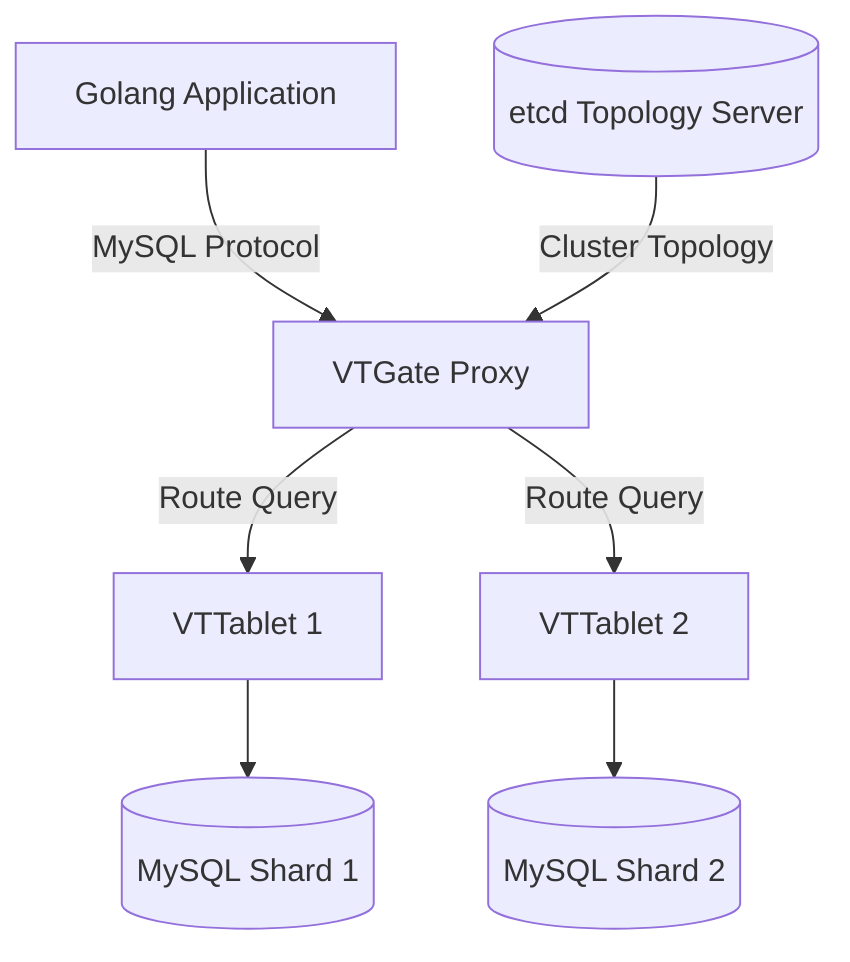

When your application reaches millions of users, a single database instance will inevitably become the biggest bottleneck in your entire architecture. To solve this, **MySQL database scaling** becomes mandatory. You must [Scale DB for Microservices](/posts/banking-microservices-architecture) using Horizontal Scaling techniques.

This article delves into the differences between scaling methods and compares the two most popular Sharding architectures today: Middleware-level Sharding (Vitess) and Application-level Sharding in Go (GORM Sharding plugin).

---

## The Limits of Vertical Scaling and When to Scale MySQL?

**Vertical Scaling (Scaling Up)** involves pumping more resources (CPU, RAM, NVMe SSDs) into a single Database server. 

However, this method has three fatal limits:
1. **Physical Hardware Limits:** You cannot buy a server with infinite RAM or CPU.
2. **Exponential Cost Curve:** A single 128-Core / 1TB RAM server is astronomically more expensive than the combined cost of four 32-Core / 256GB RAM servers.
3. **Single Point of Failure (SPOF):** No matter how premium the hardware is, if that single server crashes or experiences a disk failure, the entire system goes down.

When your CPU consistently exceeds 80% due to massive write transaction volume, it is time to transition to **Horizontal Scaling (Scaling Out)** – distributing your data across multiple smaller servers.

---

## Differentiating Read-Scaling (Replication) and Write-Scaling (Sharding)

There are two primary directions for horizontal scaling, depending on the specific bottleneck your system is facing.

### 1. Read-Scaling (Replication)
If your system has a Read/Write ratio of 90/10 (such as a blog, news site, or e-commerce product catalog), the best solution is a **Primary-Replica Topology**.
- **Primary Node:** Exclusively handles Writes (Insert/Update/Delete).
- **Replica Nodes:** Satellite nodes that handle Reads, synchronizing data from the Primary via the Binlog.

#### The Challenge of Replication Lag & Read-after-Write Consistency
The biggest issue with Replication is **Replication Lag**. When a user changes their account name (written to the Primary) and immediately refreshes the webpage (read from a Replica), they might still see the old name because the data hasn't synchronized yet. The solution for this "Read-after-Write inconsistency" is to force critical read queries for that user back to the Primary for a few seconds following an update.

### 2. Write-Scaling (Sharding)
If your system (like Core Banking or a [Surge Pricing Engine](/posts/surge-pricing-optimization-architecture)) has a massive volume of Writes that overwhelms the Primary node, Replication becomes useless. You must resort to **Sharding**.
Sharding is the process of splitting a large table into multiple smaller pieces (shards) and storing them across different physical MySQL servers based on a **Sharding Key** (e.g., `user_id`).

---

## Database-Level Sharding Architecture: Vitess

**Vitess** is a database clustering system for horizontal scaling of MySQL, often deployed using modern [GitOps platforms like Argo CD](/posts/argo-cd-updates-2026). Originally developed by YouTube, it is now used by massive platforms like Slack and GitHub. Vitess acts as a Middleware layer sitting between the application and the database. 

Your application connects to Vitess as if it were a standard MySQL server, remaining completely unaware of which Shard the data resides on.



### The Role of the VTGate Proxy and VTTablet Agent
- **VTGate:** Acts as an intelligent, stateless proxy. It receives SQL queries from the application, parses them, and uses a `VIndex` (Vitess Index) to determine which Shard holds the data, then routes the query accordingly.
- **VTTablet:** A lightweight agent running alongside each MySQL process (mysqld). It protects MySQL from bad queries (automatically killing long-running queries or those returning too many rows) and manages connection pooling.

### VReplication and Zero-Downtime Cutover
When a Shard becomes full (a "Hot Shard"), you need to split it in two (Resharding). Vitess uses its **VReplication** feature to automatically clone data to new nodes by reading directly from the MySQL Binlog. Once synchronization is complete, Vitess automatically cuts over the write traffic to the new nodes in under a second, resulting in zero application downtime.

---

## Application-Level Sharding in Go: GORM Sharding

While Vitess is a massive and complex ecosystem, the **GORM Sharding Plugin** offers a much lighter approach by performing sharding directly within your Go source code.

### How GORM Sharding Parses SQL AST to Route Queries
GORM Sharding operates as a middleware that intercepts the SQL generation process within GORM. 

When you execute `db.Where("user_id = ?", 10).Find(&Order{})`:
1. GORM Sharding uses a SQL AST Parser to "read" the SQL statement.
2. It detects that the `user_id` column has a value of `10`.
3. Using a hashing algorithm (e.g., `10 % 4`), it determines the target table is `orders_2`.
4. It rewrites the SQL to: `SELECT * FROM orders_2 WHERE user_id = 10` and executes it.

```go
import "github.com/go-gorm/sharding"

middleware := sharding.Register(sharding.Config{
    ShardingKey:         "user_id",
    NumberOfShards:      64,
    PrimaryKeyGenerator: sharding.PKSnowflake,
}, "orders")
db.Use(middleware)
```

### The Importance of the Sharding Key and the ErrMissingShardingKey Risk
The fatal flaw of application-level sharding is that you **must include the Sharding Key** in every single query targeting a sharded table. 

If you write `db.Where("status = ?", "pending").Find(&Order{})` and forget to pass the `user_id`, GORM Sharding will throw an `ErrMissingShardingKey` error. If configured to bypass this, it would be forced to query all 64 shards (Scatter-Gather) and merge the results in the Go server's RAM, causing a catastrophic spike in CPU and Memory usage.

---

## Vitess vs. GORM Sharding: Which Should You Choose?

| Criteria | Vitess (Middleware Sharding) | GORM Sharding (App-level Sharding) |
| :--- | :--- | :--- |
| **Deployment Complexity** | Very High (Requires operating VTGate, VTTablet, etcd) | Low (Just a Go package) |
| **Application Transparency** | Fully transparent (App sees one big DB) | App must be aware of Sharding Key logic |
| **Operational Costs** | High server costs for Control Plane | Cheap, requires no extra servers |
| **Dynamic Resharding** | Automatic, zero-downtime via VReplication | Manual, painful, and error-prone |
| **Best Suited For** | Large enterprises, strong SRE teams, polyglot environments | Startups, Go-only teams, tight budgets |

If your project is written exclusively in Go and only has one or two historical tables that need sharding, **GORM Sharding** is a perfect starting point. However, if you are building a core Platform and have abundant DevOps resources, investing in **Vitess** will guarantee infinite horizontal scalability for the future.
