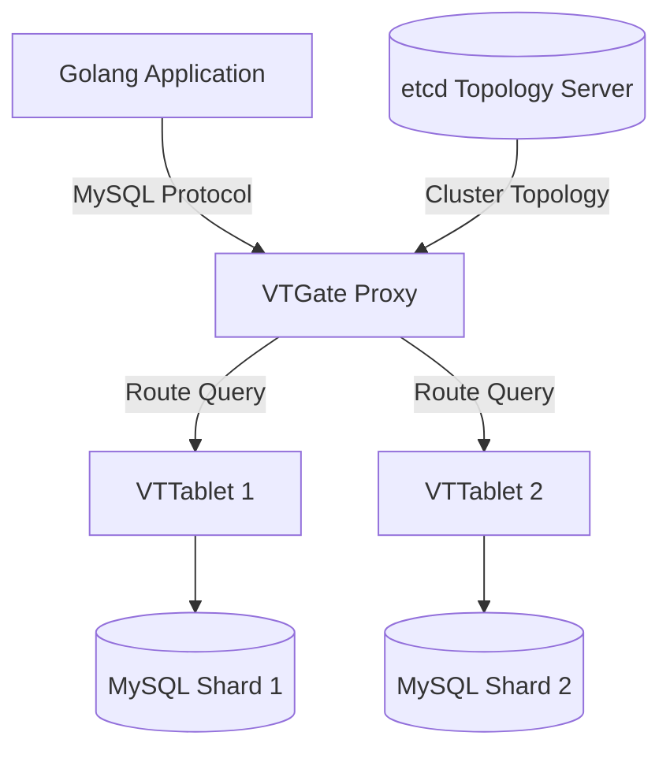

# Vitess vs GORM Sharding: MySQL Write Scaling in Go

When your application reaches millions of users, a single database instance will inevitably become the biggest bottleneck in your entire architecture. To solve this, **MySQL database scaling** becomes mandatory. You must [Scale DB for Microservices](/posts/banking-microservices-architecture/) using Horizontal Scaling techniques.

This article examines the differences between scaling methods and compares the two most popular Sharding architectures today: Middleware-level Sharding (Vitess) and Application-level Sharding in Go (GORM Sharding plugin).

---

## The Limits of Vertical Scaling and When to Scale MySQL?

Vertical Scaling (Scaling Up) involves adding CPU, RAM, and NVMe storage to a single database node. However, this approach runs into three fundamental engineering bottlenecks:

1. **Physical Hardware Limits:** Single-socket and multi-socket servers have hard architectural boundaries on CPU socket capacity and memory bus channels.
2. **Exponential Cost Curve:** High-end enterprise servers exhibit non-linear pricing, where a 128-core system costs significantly more than multiple commodity 32-core nodes combined.
3. **Single Point of Failure (SPOF):** Hardware redundancy within a single chassis cannot protect against kernel panics, mainboard failure, or catastrophic hypervisor crashes.

When primary write transactions consistently saturate storage IOPS or CPU, transitioning to **Horizontal Scaling (Scaling Out)** — partitioning datasets across independent nodes — becomes mandatory. For a broader overview of database architecture strategies, read our detailed [MySQL Scalability guide](/posts/mysql-scalability-guide/).

---

## Differentiating Read-Scaling (Replication) and Write-Scaling (Sharding)

**Read-scaling copies data to replicas to serve high-volume SELECT queries, but all writes still bottleneck at one master. Write-scaling (sharding) partitions data across multiple active masters, permanently solving the write-bottleneck for high-throughput e-commerce platforms.**

There are two primary directions for horizontal scaling, depending on the specific bottleneck your system is facing.

### 1. Read-Scaling (Replication)
If your system has a Read/Write ratio of 90/10 (such as a blog, news site, or e-commerce product catalog), the best solution is a **Primary-Replica Topology**.
- **Primary Node:** Exclusively handles Writes (Insert/Update/Delete).
- **Replica Nodes:** Satellite nodes that handle Reads, synchronizing data from the Primary via the Binlog.

#### The Challenge of Replication Lag & Read-after-Write Consistency
The biggest issue with Replication is **Replication Lag**. When a user changes their account name (written to the Primary) and immediately refreshes the webpage (read from a Replica), they might still see the old name because the data hasn't synchronized yet. The solution for this "Read-after-Write inconsistency" is to force critical read queries for that user back to the Primary for a few seconds following an update.

#### ProxySQL: Transparent Read/Write Splitting

Rather than hardcoding read/write routing logic within the Go application code (which increases complexity and couples the codebase to the infrastructure layout), production systems employ **ProxySQL**. ProxySQL is an open-source, high-performance, protocol-aware proxy that sits between your Go application and the MySQL cluster, routing queries transparently.

ProxySQL categorizes servers into **Hostgroups**:
- **Hostgroup 0 (Writer):** Contains the primary database node.
- **Hostgroup 1 (Readers):** Contains the pool of read-replicas.

By defining routing rules using regex matches on incoming SQL text, ProxySQL intercepts queries and routes them to the appropriate hostgroup. For instance, write queries (`INSERT`, `UPDATE`, `DELETE`) are sent to the writer hostgroup, while standard `SELECT` statements are distributed across readers. Crucially, queries that lock rows (like `SELECT ... FOR UPDATE`) must be explicitly routed to the writer hostgroup to prevent execution on read replicas.

Configure ProxySQL hostgroups and query rules via its admin interface:

```sql
-- 1. Define MySQL nodes and assign them to Hostgroups
INSERT INTO mysql_servers(hostgroup_id, hostname, port) VALUES (0, 'mysql-primary.internal', 3306);
INSERT INTO mysql_servers(hostgroup_id, hostname, port) VALUES (1, 'mysql-replica-1.internal', 3306);
INSERT INTO mysql_servers(hostgroup_id, hostname, port) VALUES (1, 'mysql-replica-2.internal', 3306);

-- Load the servers configuration into ProxySQL runtime and persist to disk
LOAD MYSQL SERVERS TO RUNTIME;
SAVE MYSQL SERVERS TO DISK;

-- 2. Define Query Routing Rules
-- Rule A: Route locking SELECT statements to the Writer (Hostgroup 0)
INSERT INTO mysql_query_rules (rule_id, active, match_pattern, destination_hostgroup, apply) 
VALUES (1, 1, '^SELECT.*FOR UPDATE$', 0, 1);

-- Rule B: Route all standard SELECT statements to the Readers (Hostgroup 1)
INSERT INTO mysql_query_rules (rule_id, active, match_pattern, destination_hostgroup, apply) 
VALUES (2, 1, '^SELECT', 1, 1);

-- Load query rules into ProxySQL runtime and persist to disk
LOAD MYSQL QUERY RULES TO RUNTIME;
SAVE MYSQL QUERY RULES TO DISK;
```

This configuration ensures that your Go database connection string can target a single ProxySQL port (typically 6033), letting the proxy layer handle load balancing, failovers, and read/write splitting automatically.

### 2. Write-Scaling (Sharding)
If your system (like Core Banking or a [Surge Pricing Engine](/posts/surge-pricing-optimization-architecture/)) has a massive volume of Writes that overwhelms the Primary node, Replication becomes useless. You must resort to **Sharding**.
Sharding is the process of splitting a large table into multiple smaller pieces (shards) and storing them across different physical MySQL servers based on a **Sharding Key** (e.g., `user_id`).

---

## Database-Level Sharding Architecture: Vitess

**Vitess is a database clustering system built at YouTube that provides transparent MySQL sharding. It acts as an intelligent proxy layer, allowing Go applications to connect to Vitess as if it were a single MySQL database while it routes queries to thousands of underlying shards.**

**Vitess** is a database clustering system for horizontal scaling of MySQL, often deployed using modern [GitOps platforms like Argo CD](/posts/argo-cd-updates-2026/). Originally developed by YouTube, it is now used by massive platforms like Slack and GitHub. Vitess acts as a Middleware layer sitting between the application and the database. 

Your application connects to Vitess as if it were a standard MySQL server, remaining completely unaware of which Shard the data resides on.

The Vitess request topology coordinates query execution across stateless proxy instances. The VTGate proxy consults cluster topology to route incoming MySQL protocol queries directly to target VTTablets and underlying database shards:


```mermaid
flowchart TD
    App[Golang Application] -->|MySQL Protocol| VTGate[VTGate Proxy]
    etcd[(etcd Topology Server)] -->|Cluster Topology| VTGate
    VTGate -->|Route Query| VTTablet1[VTTablet 1]
    VTGate -->|Route Query| VTTablet2[VTTablet 2]
    
    VTTablet1 --> MySQL1[(MySQL Shard 1)]
    VTTablet2 --> MySQL2[(MySQL Shard 2)]
```

### The Role of the VTGate Proxy and VTTablet Agent
- **VTGate:** Acts as an intelligent, stateless proxy. It receives SQL queries from the application, parses them, and uses a `VIndex` (Vitess Index) to determine which Shard holds the data, then routes the query accordingly.
- **VTTablet:** A lightweight agent running alongside each MySQL process (mysqld). It protects MySQL from bad queries (automatically killing long-running queries or those returning too many rows) and manages connection pooling.

### VReplication and Zero-Downtime Cutover
When a Shard becomes full (a "Hot Shard"), you need to split it in two (Resharding). Vitess uses its **VReplication** feature to automatically clone data to new nodes by reading directly from the MySQL Binlog. Once synchronization is complete, Vitess automatically cuts over the write traffic to the new nodes in under a second, resulting in zero application downtime.

---

## Application-Level Sharding in Go: GORM Sharding

**Application-level sharding handles data partitioning directly within the Go codebase using libraries like GORM Sharding. The Go application explicitly computes the shard key and manages multiple database connection pools to route queries to the correct MySQL instance.**

While Vitess is a massive and complex ecosystem, the **GORM Sharding Plugin** offers a much lighter approach by performing sharding directly within your Go source code.

### How GORM Sharding Parses SQL AST to Route Queries
GORM Sharding operates as a middleware that intercepts the SQL generation process within GORM. 

When you execute `db.Where("user_id = ?", 10).Find(&Order{})`:
1. GORM Sharding uses a SQL AST Parser to "read" the SQL statement.
2. It detects that the `user_id` column has a value of `10`.
3. Using a hashing algorithm (e.g., `10 % 4`), it determines the target table is `orders_2`.
4. It rewrites the SQL to: `SELECT * FROM orders_2 WHERE user_id = 10` and executes it.

Application-level sharding logic is configured directly during GORM initialization. Registering GORM sharding middleware requires defining the target partition key, total shard count, and primary key generator:

```go
import "github.com/go-gorm/sharding"

middleware := sharding.Register(sharding.Config{
    ShardingKey:         "user_id",
    NumberOfShards:      64,
    PrimaryKeyGenerator: sharding.PKSnowflake,
}, "orders")
db.Use(middleware)
```

### The Importance of the Sharding Key and the ErrMissingShardingKey Risk
The fatal flaw of application-level sharding is that you **must include the Sharding Key** in every single query targeting a sharded table. 

If you write `db.Where("status = ?", "pending").Find(&Order{})` and forget to pass the `user_id`, GORM Sharding will throw an `ErrMissingShardingKey` error. If configured to bypass this, it would be forced to query all 64 shards (Scatter-Gather) and merge the results in the Go server's RAM, causing a catastrophic spike in CPU and Memory usage.

---

## Vitess vs. GORM Sharding: Which Should You Choose?

**Use Vitess for massive, organization-wide scale where transparent sharding and Kubernetes native management are required. Choose GORM application-level sharding for smaller, contained Go microservices where adding a complex proxy infrastructure like Vitess is overkill.**

| Criteria | Vitess (Middleware Sharding) | GORM Sharding (App-level Sharding) |
| :--- | :--- | :--- |
| **Deployment Complexity** | Very High (Requires operating VTGate, VTTablet, etcd) | Low (Just a Go package) |
| **Application Transparency** | Fully transparent (App sees one big DB) | App must be aware of Sharding Key logic |
| **Operational Costs** | High server costs for Control Plane | Cheap, requires no extra servers |
| **Dynamic Resharding** | Automatic, zero-downtime via VReplication | Manual, painful, and error-prone |
| **Best Suited For** | Large enterprises, strong SRE teams, polyglot environments | Startups, Go-only teams, tight budgets |

If your project is written exclusively in Go and only has one or two historical tables that need sharding, **GORM Sharding** is a perfect starting point. However, if you are building a core Platform and have abundant DevOps resources, investing in **Vitess** will guarantee infinite horizontal scalability for the future.

## Frequently Asked Questions

### What is MySQL horizontal scaling and how does write sharding work?
MySQL horizontal scaling distributes data rows across multiple independent database instances to overcome single-node write IOPS and CPU constraints. Unlike read replicas that mirror data, write sharding partitions tables based on a defined sharding key to distribute transactional write traffic across cluster nodes.

### When should an engineering team select Vitess over GORM application-level sharding?
Teams should choose Vitess when managing large polyglot microservice ecosystems that require transparent query routing and zero-downtime dynamic resharding. Conversely, GORM Sharding is ideal for Go-native services with limited tables to shard and minimal operational resources.

### What happens if a database query omits the designated sharding key in GORM Sharding?
Omitting the sharding key in GORM Sharding causes the middleware to return an `ErrMissingShardingKey` error. If fallback behavior is enabled, the query executes a scatter-gather operation across all shards, consuming excessive database memory and CPU resources.
