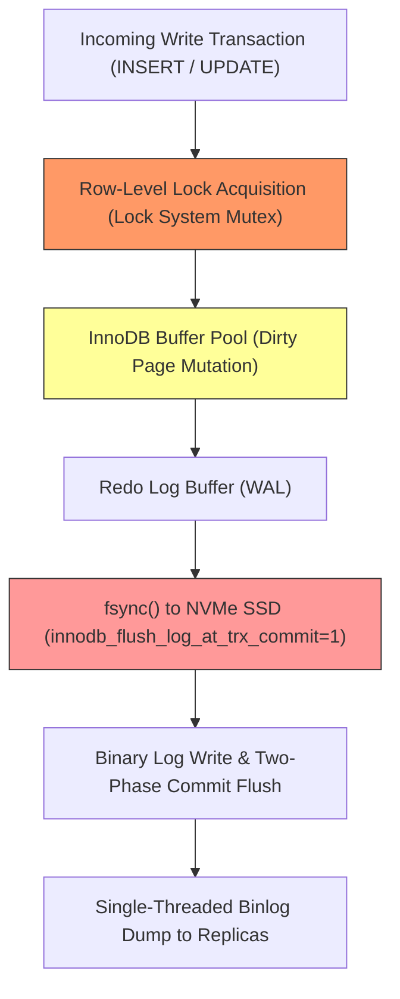
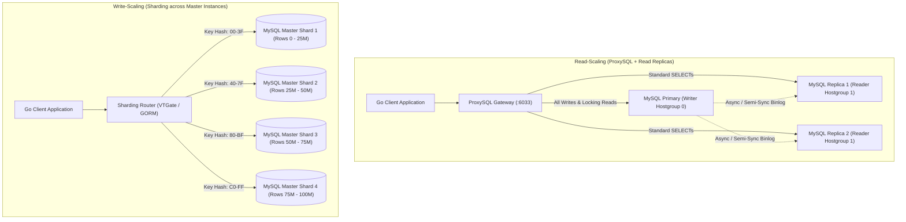
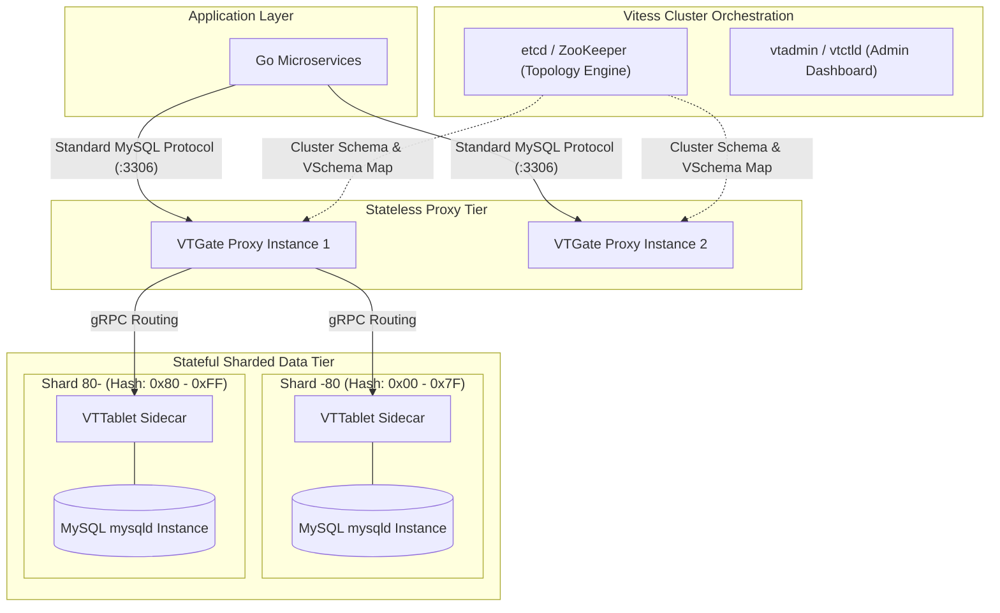
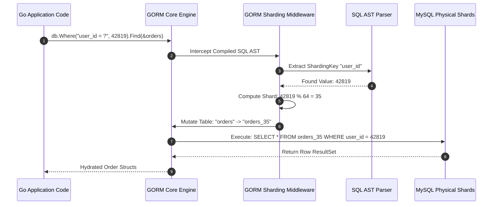
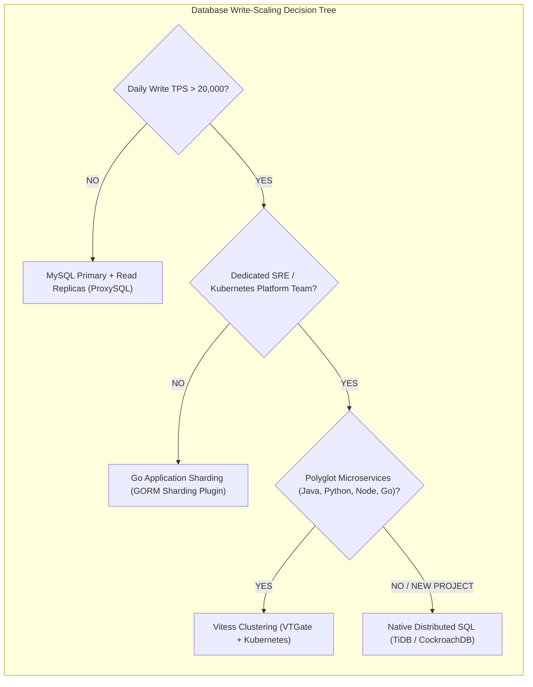
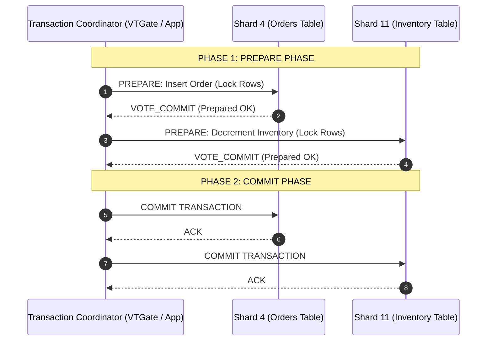
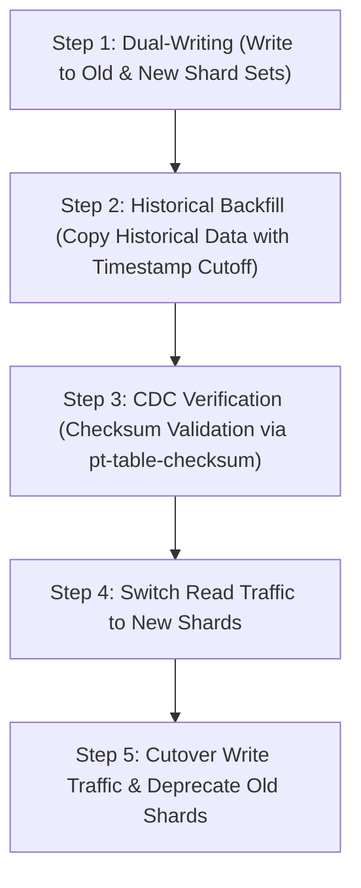

# Vitess vs GORM Sharding: MySQL Write Scaling in Go

When an engineering organization scales beyond millions of active transactions, a monolithic relational database instance inevitably becomes the single biggest systemic bottleneck in the entire software architecture. While read traffic can be scaled horizontally almost indefinitely by attaching read replicas behind a load-balancing proxy like ProxySQL, **write traffic hits an unyielding physical ceiling on a single MySQL Primary instance**.

Hardware upgrades (Vertical Scaling) provide temporary relief at an exponential cost curve, but cannot evade the physical laws of InnoDB buffer pool latch contention, redo log checkpointing stalls, and operating system `fsync` boundaries.

When writes saturate your primary database, you must transition to **Horizontal Write Scaling (Sharding)**. In the Go ecosystem, architects face a foundational trade-off: **Should you adopt an enterprise database middleware proxy like Vitess, or implement application-level shard routing directly in Go using GORM Sharding?**

---

> ### ⚡ Executive Architectural Summary
> * **The Core Problem**: A single MySQL Primary node saturates at approximately 8,000–15,000 write transactions per second (TPS) due to InnoDB lock management, write-ahead log (WAL) serialized fsyncs, and single-leader replication thread bottlenecks. Read replicas cannot absorb write transactions (`INSERT`, `UPDATE`, `DELETE`, `SELECT ... FOR UPDATE`).
> * **The Solution Paths**:
>   * **Vitess (Middleware Proxy Sharding)**: Developed by YouTube, Vitess decouples applications from physical MySQL instances via stateless **VTGate** proxies, **VTTablet** query-governing sidecars, and declarative **VIndex** routing rules. It delivers transparent SQL execution, cross-shard scatter-gather joins, and automated zero-downtime resharding via **VReplication**.
>   * **GORM Sharding (Application-Level Sharding)**: A lightweight Go library that intercepts SQL statements at the Abstract Syntax Tree (AST) level, extracts the configured sharding key (`user_id`), computes a consistent hash or modulo, and rewrites the physical target table (`orders_04`) directly in memory.
>   * **Distributed SQL (TiDB / CockroachDB)**: An evolutionary leap that bypasses MySQL sharding complexity entirely by replacing the B+Tree storage engine with Raft-replicated distributed Key-Value stores (TiKV / RocksDB).

---

## 1. The Anatomy of MySQL Write Bottlenecks

Why can't modern server hardware handle 100,000 write queries per second on a single MySQL instance? Understanding the physics of the InnoDB storage engine reveals why vertical scaling fails:


```mermaid
flowchart TD
    SQL["Incoming Write Transaction (INSERT / UPDATE)"] --> Lock["Row-Level Lock Acquisition (Lock System Mutex)"]
    Lock --> BP["InnoDB Buffer Pool (Dirty Page Mutation)"]
    BP --> WAL["Redo Log Buffer (WAL)"]
    WAL --> Fsync["fsync() to NVMe SSD (innodb_flush_log_at_trx_commit=1)"]
    Fsync --> Binlog["Binary Log Write & Two-Phase Commit Flush"]
    Binlog --> Replication["Single-Threaded Binlog Dump to Replicas"]

    style Fsync fill:#f99,stroke:#333
    style Lock fill:#f96,stroke:#333
    style BP fill:#ff9,stroke:#333
```

1. **WAL Redo Log Serialization**: To satisfy ACID Durability (`innodb_flush_log_at_trx_commit = 1`), every transaction commit forces an explicit synchronous `fsync()` system call to persist the log sequence number (LSN) to disk. Under high concurrency, the kernel IO queue becomes saturated with serialized flush operations.
2. **Buffer Pool Latch Contention**: Mutating B+Tree index leaf pages requires acquiring exclusive latches on the in-memory pages in the Buffer Pool. When concurrent threads update adjacent rows within the same 16KB index page, execution threads stall waiting for latch releases.
3. **Doublewrite Buffer Overhead**: To guard against partial page writes during power failures, InnoDB writes pages twice—first to the contiguous doublewrite buffer, then to the actual tablespace `.ibd` file.
4. **Replication Binlog Dump Stalls**: A high write volume on the primary saturates the network socket of the `binlog_dump` thread, causing downstream read replicas to suffer severe, unbounded replication lag.

---

## 2. Horizontal Architecture: Read-Scaling vs Write-Scaling

Before committing to the architectural complexity of sharding, teams must clearly differentiate between **Read-Scaling (Replication)** and **Write-Scaling (Sharding)**.


```mermaid
graph TD
    subgraph Read_Scaling ["Read-Scaling (ProxySQL + Read Replicas)"]
        ClientR["Go Client Application"] --> ProxySQL["ProxySQL Gateway (:6033)"]
        ProxySQL -->|All Writes & Locking Reads| Primary["MySQL Primary (Writer Hostgroup 0)"]
        ProxySQL -->|Standard SELECTs| Rep1["MySQL Replica 1 (Reader Hostgroup 1)"]
        ProxySQL -->|Standard SELECTs| Rep2["MySQL Replica 2 (Reader Hostgroup 1)"]
        Primary -.->|Async / Semi-Sync Binlog| Rep1
        Primary -.->|Async / Semi-Sync Binlog| Rep2
    end

    subgraph Write_Scaling ["Write-Scaling (Sharding across Master Instances)"]
        ClientW["Go Client Application"] --> Router["Sharding Router (VTGate / GORM)"]
        Router -->|Key Hash: 00-3F| Master1[("MySQL Master Shard 1 (Rows 0 - 25M)")]
        Router -->|Key Hash: 40-7F| Master2[("MySQL Master Shard 2 (Rows 25M - 50M)")]
        Router -->|Key Hash: 80-BF| Master3[("MySQL Master Shard 3 (Rows 50M - 75M)")]
        Router -->|Key Hash: C0-FF| Master4[("MySQL Master Shard 4 (Rows 75M - 100M)")]
    end
```

### When Does Read-Scaling Fail?
Read replication works exceptionally well when the system's Read/Write ratio exceeds 90:10 (such as content management systems, media streaming catalogs, or product listings). However, it collapses under write-heavy systems:
* **E-commerce Flash Sales & Cart Updates**: Millions of inventory reservation writes.
* **Financial Ledgers & Digital Wallets**: Strict double-entry balance updates requiring immediate row locking.
* **IoT Sensor Ingestion & Telematics**: Continuous 100k+ events/sec stream ingestion.

In these domains, every single transaction must hit the Primary. Adding 50 read replicas does not alleviate 1% of the write load; in fact, it exacerbates primary CPU load due to binlog replication thread multiplexing. Sharding is the only architectural remedy.

---

## 3. Middleware-Level Sharding: Vitess Deep-Dive

Originally engineered by YouTube in 2010 to scale MySQL to billions of global users, **Vitess** is a Cloud Native Computing Foundation (CNCF) graduated database clustering framework deployed by Slack, GitHub, Square, and Pinterest.


```mermaid
flowchart TD
    subgraph Client_Tier ["Application Layer"]
        GoApp["Go Microservices"]
    end

    subgraph Vitess_Control_Plane ["Vitess Cluster Orchestration"]
        etcd["etcd / ZooKeeper (Topology Engine)"]
        VTAdmin["vtadmin / vtctld (Admin Dashboard)"]
    end

    subgraph Routing_Tier ["Stateless Proxy Tier"]
        VTGate1["VTGate Proxy Instance 1"]
        VTGate2["VTGate Proxy Instance 2"]
    end

    subgraph Storage_Tier ["Stateful Sharded Data Tier"]
        subgraph Shard_0 ["Shard -80 (Hash: 0x00 - 0x7F)"]
            VTTablet0["VTTablet Sidecar"]
            MySQL0[("MySQL mysqld Instance")]
            VTTablet0 --- MySQL0
        end
        
        subgraph Shard_1 ["Shard 80- (Hash: 0x80 - 0xFF)"]
            VTTablet1["VTTablet Sidecar"]
            MySQL1[("MySQL mysqld Instance")]
            VTTablet1 --- MySQL1
        end
    end

    GoApp -->|"Standard MySQL Protocol (:3306)"| VTGate1
    GoApp -->|"Standard MySQL Protocol (:3306)"| VTGate2
    etcd -.->|"Cluster Schema & VSchema Map"| VTGate1
    etcd -.->|"Cluster Schema & VSchema Map"| VTGate2
    VTGate1 -->|"gRPC Routing"| VTTablet0
    VTGate1 -->|"gRPC Routing"| VTTablet1
```

### Core Components of Vitess
1. **VTGate**: A lightweight, stateless proxy that speaks the MySQL wire protocol. The Go application connects to VTGate using the standard `database/sql` driver or GORM as if it were a single giant MySQL server. VTGate parses incoming SQL queries, consults the **VSchema**, resolves the target shard, and dispatches queries concurrently.
2. **VTTablet**: An intelligent sidecar daemon running alongside every physical `mysqld` process. VTTablet performs connection pooling (preventing thousands of app connections from overwhelming MySQL's thread manager), enforces query execution deadlines, and automatically kills runaway queries returning excessive row counts.
3. **Topology Service (etcd)**: Maintains the cluster metadata, shard range maps, primary-replica promotion states, and VSchema rules.
4. **VSchema (Vitess Schema)**: Declarative JSON configurations that define how tables are distributed. It specifies the **VIndex** (e.g., `hash`, `binary_md5`, `lookup`) used to map a column's value to a keyspace ID.

### Zero-Downtime Resharding with VReplication
The crowning architectural achievement of Vitess is **VReplication (Vitess Replication)**. When Shard `-80` becomes hot, operators trigger a dynamic resharding workflow:
1. Vitess provisions two new child shards: `-40` and `40-80`.
2. VReplication streams raw row data and tailing binlogs from the parent shard to the child shards in real time.
3. Once replication lag reaches sub-millisecond status, VTGate executes a **Routing Cutover (`SwitchTraffic`)**: writes are paused for $< 500\text{ms}$ while routing tables update, and writes instantly resume pointing to the new child shards without dropping connections or requiring application restarts.

---

## 4. Application-Level Sharding in Go: GORM Sharding

For small-to-medium engineering teams or standalone Go microservices, running the Vitess control plane (VTGate, VTTablet, etcd, vtctld) is massive operational overkill. The **GORM Sharding Plugin** provides an application-level alternative by performing query rewriting directly in the Go process memory space.

### The SQL AST Rewriting Mechanism

GORM Sharding hooks into GORM's callback lifecycle (`gorm:create`, `gorm:query`, `gorm:update`, `gorm:delete`). It parses the SQL Abstract Syntax Tree (AST) generated by GORM:
1. It locates the designated `ShardingKey` (e.g., `user_id = 42819`).
2. It executes a hashing or modulo function against the configured shard count: $\text{Shard ID} = 42819 \pmod{64} = 35$.
3. It mutates the physical table name in the compiled SQL string from `orders` to `orders_35`.
4. It dispatches the mutated SQL statement to the database.


```mermaid
sequenceDiagram
    autonumber
    participant App as Go Application Code
    participant GORM as GORM Core Engine
    participant Plugin as GORM Sharding Middleware
    participant AST as SQL AST Parser
    participant DB as MySQL Physical Shards

    App->>GORM: db.Where("user_id = ?", 42819).Find(&orders)
    GORM->>Plugin: Intercept Compiled SQL AST
    Plugin->>AST: Extract ShardingKey "user_id"
    AST-->>Plugin: Found Value: 42819
    Plugin->>Plugin: Compute Shard: 42819 % 64 = 35
    Plugin->>GORM: Mutate Table: "orders" -> "orders_35"
    GORM->>DB: Execute: SELECT * FROM orders_35 WHERE user_id = 42819
    DB-->>GORM: Return Row ResultSet
    GORM-->>App: Hydrated Order Structs
```

### Production Go 1.24 Implementation: GORM Sharding & Distributed IDs

Below is a complete, runnable Go 1.24 implementation demonstrating GORM Sharding with a custom Snowflake distributed ID generator, table creation automation, and scatter-gather parallel queries.

```go
// Package main demonstrates production-ready application-level MySQL sharding
// using Go 1.24, GORM, and GORM Sharding plugin with Snowflake primary keys.
package main

import (
	"context"
	"fmt"
	"log"
	"sync"
	"time"

	"github.com/bwmarrin/snowflake"
	"gorm.io/driver/mysql"
	"gorm.io/gorm"
	"gorm.io/gorm/logger"
	"gorm.io/sharding"
)

// Order represents a high-throughput sharded commercial order entity.
type Order struct {
	ID        int64     `gorm:"primaryKey;autoIncrement:false" json:"id"`
	UserID    int64     `gorm:"index;not null" json:"user_id"` // Sharding Key
	Amount    float64   `gorm:"type:decimal(12,2);not null" json:"amount"`
	Status    string    `gorm:"type:varchar(32);not null" json:"status"`
	CreatedAt time.Time `gorm:"not null" json:"created_at"`
}

// Global Snowflake Node for thread-safe 64-bit distributed ID generation.
var snowflakeNode *snowflake.Node

func init() {
	var err error
	// Node ID 1 (configured via environment or orchestrator pod ordinal)
	snowflakeNode, err = snowflake.NewNode(1)
	if err != nil {
		log.Fatalf("failed to initialize snowflake ID generator: %v", err)
	}
}

// GenerateSnowflakeKey satisfies the GORM sharding primary key generator contract.
func GenerateSnowflakeKey() int64 {
	return snowflakeNode.Generate().Int64()
}

func main() {
	dsn := "app_user:SecurePass2026@tcp(127.0.0.1:3306)/commerce_core?charset=utf8mb4&parseTime=True&loc=Local"
	
	db, err := gorm.Open(mysql.Open(dsn), &gorm.Config{
		Logger: logger.Default.LogMode(logger.Info),
	})
	if err != nil {
		log.Fatalf("failed to connect to mysql database: %v", err)
	}

	const numShards = 16

	// Initialize the GORM Sharding Middleware
	shardingMiddleware := sharding.Register(sharding.Config{
		ShardingKey:         "user_id",
		NumberOfShards:      numShards,
		PrimaryKeyGenerator: sharding.PKSnowflake,
		// Custom key generator function hook
		CustomPKGenerator: func() int64 {
			return GenerateSnowflakeKey()
		},
	}, "orders") // Target logical table name

	if err := db.Use(shardingMiddleware); err != nil {
		log.Fatalf("failed to register sharding middleware: %v", err)
	}

	// AutoMigrate: Automatically create physical shard tables (orders_0 ... orders_15)
	for i := 0; i < numShards; i++ {
		tableName := fmt.Sprintf("orders_%d", i)
		if err := db.Table(tableName).AutoMigrate(&Order{}); err != nil {
			log.Fatalf("failed to migrate shard table %s: %v", tableName, err)
		}
	}
	log.Println("Successfully migrated all 16 physical shard tables.")

	// ── 1. INSERTION WITH SHARDING KEY ──
	testUser := int64(98231)
	newOrder := Order{
		ID:        GenerateSnowflakeKey(),
		UserID:    testUser,
		Amount:    149.50,
		Status:    "PENDING_PAYMENT",
		CreatedAt: time.Now(),
	}

	// Sharding middleware extracts UserID, hashes to shard, rewrites to orders_X
	if err := db.Create(&newOrder).Error; err != nil {
		log.Fatalf("failed to create sharded order: %v", err)
	}
	log.Printf("Created order ID %d for User %d successfully.\n", newOrder.ID, testUser)

	// ── 2. QUERY TARGETING A SPECIFIC SHARD ──
	var userOrders []Order
	err = db.Where("user_id = ?", testUser).Find(&userOrders).Error
	if err != nil {
		log.Fatalf("failed to query orders for user: %v", err)
	}
	log.Printf("Retrieved %d orders for user %d.\n", len(userOrders), testUser)

	// ── 3. PARALLEL SCATTER-GATHER QUERY ACROSS ALL SHARDS ──
	// Useful for administrative audits or reporting when sharding key is unknown
	allPendingOrders, err := ScatterGatherPendingOrders(context.Background(), db, numShards)
	if err != nil {
		log.Fatalf("scatter-gather query failed: %v", err)
	}
	log.Printf("Scatter-gather query discovered %d pending orders across cluster.\n", len(allPendingOrders))
}

// ScatterGatherPendingOrders executes parallel goroutine reads across all physical shard tables.
func ScatterGatherPendingOrders(ctx context.Context, db *gorm.DB, totalShards int) ([]Order, error) {
	type shardResult struct {
		orders []Order
		err    error
	}

	resultChan := make(chan shardResult, totalShards)
	var wg sync.WaitGroup

	for i := 0; i < totalShards; i++ {
		wg.Add(1)
		go func(shardIdx int) {
			defer wg.Done()
			var shardOrders []Order
			tableName := fmt.Sprintf("orders_%d", shardIdx)

			err := db.WithContext(ctx).Table(tableName).
				Where("status = ?", "PENDING_PAYMENT").
				Order("created_at DESC").
				Limit(100).
				Find(&shardOrders).Error

			resultChan <- shardResult{orders: shardOrders, err: err}
		}(i)
	}

	wg.Wait()
	close(resultChan)

	var aggregated []Order
	for res := range resultChan {
		if res.err != nil {
			return nil, fmt.Errorf("error querying shard: %w", res.err)
		}
		aggregated = append(aggregated, res.orders...)
	}

	return aggregated, nil
}
```

### The Pitfall: `ErrMissingShardingKey`

The most hazardous operational vulnerability in application-level sharding is omitting the sharding key from a query.

```go
// HAZARDOUS: Missing user_id filter!
var pendingOrders []Order
err := db.Where("status = ?", "PENDING").Find(&pendingOrders).Error
```

When this code executes:
1. GORM Sharding inspects the SQL AST and discovers no match for `user_id`.
2. By default, the plugin returns `sharding.ErrMissingShardingKey`.
3. If configured with permissive defaults, it falls back to a **Scatter-Gather** across all shards, issuing 16 to 128 simultaneous queries, flooding database connection pools, and consuming hundreds of megabytes of Go heap memory to merge and sort rows.

**Architectural Standard**: Always enforce strict mode (`ThrowError: true`) in staging and production to prevent developers from accidentally introducing unkeyed full-table scans.

---

## 5. Architectural Comparison: Vitess vs GORM Sharding vs TiDB

When selecting a horizontal scaling architecture, engineering leaders must balance operational complexity, development velocity, and long-term scaling ceilings.


```mermaid
graph LR
    subgraph Architecture_Selection ["Database Write-Scaling Decision Tree"]
        Volume{"Daily Write TPS > 20,000?"}
        DevOps{"Dedicated SRE / Kubernetes Platform Team?"}
        Language{"Polyglot Microservices (Java, Python, Node, Go)?"}
        
        Volume -- NO --> Single["MySQL Primary + Read Replicas (ProxySQL)"]
        Volume -- YES --> DevOps
        
        DevOps -- NO --> GORM["Go Application Sharding (GORM Sharding Plugin)"]
        DevOps -- YES --> Language
        
        Language -- YES --> VitessChoice["Vitess Clustering (VTGate + Kubernetes)"]
        Language -- NO / NEW PROJECT --> TiDBChoice["Native Distributed SQL (TiDB / CockroachDB)"]
    end
```

### Comprehensive Technical Trade-off Matrix

| Engineering Metric | Vitess (Middleware Proxy) | GORM Sharding (App-Level) | TiDB (Distributed SQL) |
| :--- | :--- | :--- | :--- |
| **Architecture Pattern** | Transparent Proxy Clustering | Application AST Query Rewriting | Native Distributed Key-Value (Raft) |
| **Language Support** | Polyglot (Any MySQL client) | **Go Only** | Polyglot (MySQL 8.0 Protocol) |
| **Deployment Complexity** | **Very High** (etcd, VTGate, VTTablet) | **Minimal** (Single Go dependency) | Medium (TiDB, TiKV, PD nodes) |
| **Zero-Downtime Resharding**| **Automated** via VReplication | **Manual** (Complex custom migrations) | **Autonomous** (Automatic Raft Region split)|
| **Cross-Shard Transactions**| Supported via 2PC / VTCrd | **Unsupported** (Manual Sagas required) | **Native ACID Transactions** (Percolator)|
| **Scatter-Gather Merging** | Managed transparently by VTGate | Managed manually via Goroutines | Handled natively by TiDB Coprocessor |
| **Memory Footprint** | Heavy (Multiple Java/Go daemons)| Negligible (Runs inside app heap) | Dedicated server cluster required |
| **Best Architectural Fit** | Enterprise-scale, multi-team orgs | Single Go services with 1-2 hot tables | New greenfield financial/e-commerce apps |

---

## 6. The Cross-Shard Distributed Transaction Crisis

The fatal architectural compromise of horizontal database sharding is the loss of native atomic multi-table transactions (`BEGIN ... COMMIT`).

When data was co-located on a single MySQL instance, creating an order and debiting inventory was trivially atomic:
```sql
START TRANSACTION;
INSERT INTO orders (id, user_id, amount) VALUES (101, 550, 45.00);
UPDATE inventory SET stock = stock - 1 WHERE sku_id = 'SKU_SHIRT_BLUE';
COMMIT;
```

Once sharding is introduced:
* `orders` is sharded by `user_id` (residing on Shard 4).
* `inventory` is sharded by `sku_id` (residing on Shard 11).

Executing an atomic transaction across two distinct MySQL instances requires a **Two-Phase Commit (2PC)** protocol:


```mermaid
sequenceDiagram
    autonumber
    participant Coord as Transaction Coordinator (VTGate / App)
    participant S4 as Shard 4 (Orders Table)
    participant S11 as Shard 11 (Inventory Table)

    Note over Coord, S11: PHASE 1: PREPARE PHASE
    Coord->>S4: PREPARE: Insert Order (Lock Rows)
    S4-->>Coord: VOTE_COMMIT (Prepared OK)
    Coord->>S11: PREPARE: Decrement Inventory (Lock Rows)
    S11-->>Coord: VOTE_COMMIT (Prepared OK)

    Note over Coord, S11: PHASE 2: COMMIT PHASE
    Coord->>S4: COMMIT TRANSACTION
    S4-->>Coord: ACK
    Coord->>S11: COMMIT TRANSACTION
    S11-->>Coord: ACK
```

### Why Two-Phase Commit Fails at High Scale
While mathematically correct, 2PC is an **availability and throughput catastrophe** in high-throughput distributed systems:
1. **Prolonged Lock Holding**: Database row locks must be held across the entire network round-trip time of both phases. If Shard 11 experiences a 200ms network jitter, Shard 4 remains blocked, holding row locks and causing cascading connection pool exhaustion.
2. **Coordinator Failure States**: If the coordinator crashes between Phase 1 and Phase 2, shards remain in an indeterminate "prepared" state, locking rows indefinitely until manual DBA intervention.

### The Modern Solution: Transactional Outbox & Saga Patterns
Modern distributed systems abandon cross-shard 2PC in favor of **Eventual Consistency**:
1. **Co-locate Related Entities**: Shard `orders` and `order_items` using the exact same sharding key (`user_id`). This ensures that an entire order document lives within a single physical shard, preserving local ACID guarantees.
2. **Transactional Outbox Pattern**: Store domain events in an `outbox` table located within the same physical shard as the order.
3. **Saga Choreography**: A reliable background worker (or CDC stream via Debezium) reads the outbox and publishes events to Kafka, instructing downstream inventory microservices to deduct stock asynchronously, compensating failures via rollback events.

---

## 7. Production Resharding Playbook: Zero-Downtime Migration

If your team begins with GORM Sharding (e.g., 16 shards) and later needs to double capacity to 32 shards, you cannot run `ALTER TABLE`. You must execute a disciplined **Zero-Downtime Resharding Migration**:


```mermaid
graph TD
    Step1["Step 1: Dual-Writing (Write to Old & New Shard Sets)"]
    Step2["Step 2: Historical Backfill (Copy Historical Data with Timestamp Cutoff)"]
    Step3["Step 3: CDC Verification (Checksum Validation via pt-table-checksum)"]
    Step4["Step 4: Switch Read Traffic to New Shards"]
    Step5["Step 5: Cutover Write Traffic & Deprecate Old Shards"]

    Step1 --> Step2
    Step2 --> Step3
    Step3 --> Step4
    Step4 --> Step5
```

1. **Dual-Writing**: Update the Go application to write all new mutations (`INSERT`, `UPDATE`, `DELETE`) to both the old 16-shard cluster and the new 32-shard cluster simultaneously, using non-blocking asynchronous error handlers.
2. **Historical Backfill**: Deploy a background worker pool to copy historical data written prior to the dual-writing window from the old shards to the new shards.
3. **Continuous Reconciliation**: Run checksum validation jobs (comparing primary key hashes and updated timestamps) until the delta drops to zero.
4. **Read Cutover**: Switch application read traffic to query the 32-shard cluster. Verify error rates and latencies for 48 hours.
5. **Write Cutover & Decommissioning**: Repoint all primary write traffic exclusively to the 32-shard cluster, terminate dual-write pathways, and archive the old 16-shard tables.

---

## Frequently Asked Questions


MySQL horizontal scaling distributes data rows across multiple independent database instances to overcome single-node write IOPS and CPU constraints. Unlike read replicas that mirror data from a single writer, write sharding partitions tables based on a designated sharding key (such as `user_id`), allowing concurrent write transactions to execute in parallel across separate physical database master instances.



Teams should choose Vitess when managing large polyglot microservice ecosystems (combining Go, Java, Python, and Node) that require transparent query routing, automated connection pooling, and zero-downtime dynamic resharding managed by Kubernetes. Conversely, GORM Sharding is ideal for Go-native single-service architectures where operating Vitess's complex control plane (VTGate, VTTablet, etcd) is cost-prohibitive.



Omitting the sharding key in GORM Sharding causes the middleware to return an `ErrMissingShardingKey` error. If permissive fallback behavior is configured, the middleware executes a scatter-gather operation across all shards, issuing dozens of simultaneous queries and merging results in application memory, which can exhaust database connection pools and cause severe latency spikes.



Vitess supports cross-shard transactions using an optimized Two-Phase Commit (2PC) protocol managed by the VTGate proxy. However, because 2PC incurs high latency penalties and row lock contention across network boundaries, high-scale architectures generally structure their schemas to co-locate related records using shared VIndex keys, or manage cross-shard consistency asynchronously via Saga and Transactional Outbox patterns.



TiDB eliminates the architectural complexity of manually managing shards, proxies, and resharding migrations. Built on top of the Raft consensus protocol and a distributed Key-Value storage engine (TiKV), TiDB natively presents itself as a standard MySQL 8.0 database while automatically splitting, balancing, and distributing data ranges across storage nodes with full ACID transactional support.


---

## Conclusion & Architectural Summary

Scaling MySQL write capacity requires recognizing when single-node physical limits have been reached and adopting the appropriate architectural pattern for your organization's scale:

1. **Under 10k TPS (Read-Dominant)**: Stick with a single MySQL Primary paired with ProxySQL and read replicas. Avoid sharding prematurely.
2. **10k–50k TPS (Go Microservices)**: Deploy application-level **GORM Sharding** using 64-bit Snowflake primary keys, strict key enforcement, and asynchronous Saga orchestrations.
3. **50k+ TPS (Enterprise Polyglot Ecosystems)**: Invest in **Vitess** to achieve transparent horizontal scale with zero-downtime VReplication resharding.
4. **Greenfield Distributed Systems**: Evaluate **TiDB** or **CockroachDB** to eliminate the operational tax of sharding entirely through distributed SQL.
