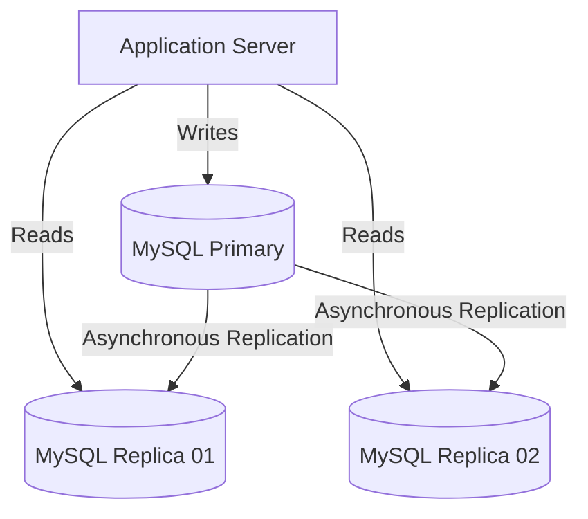
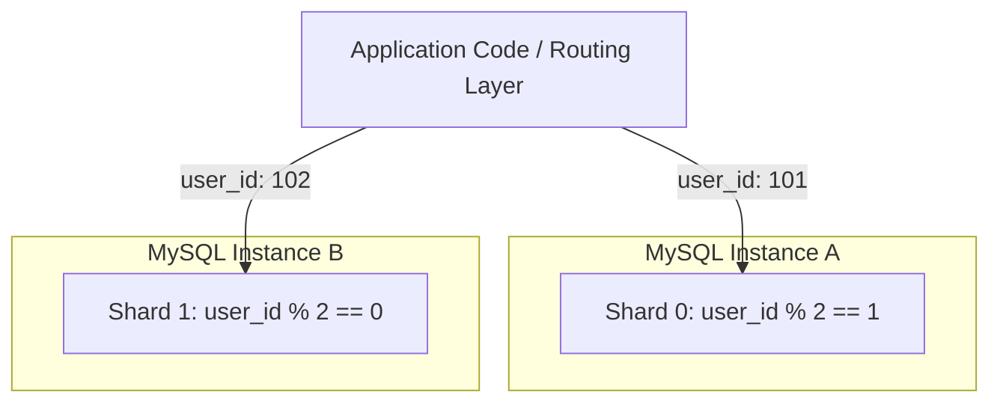
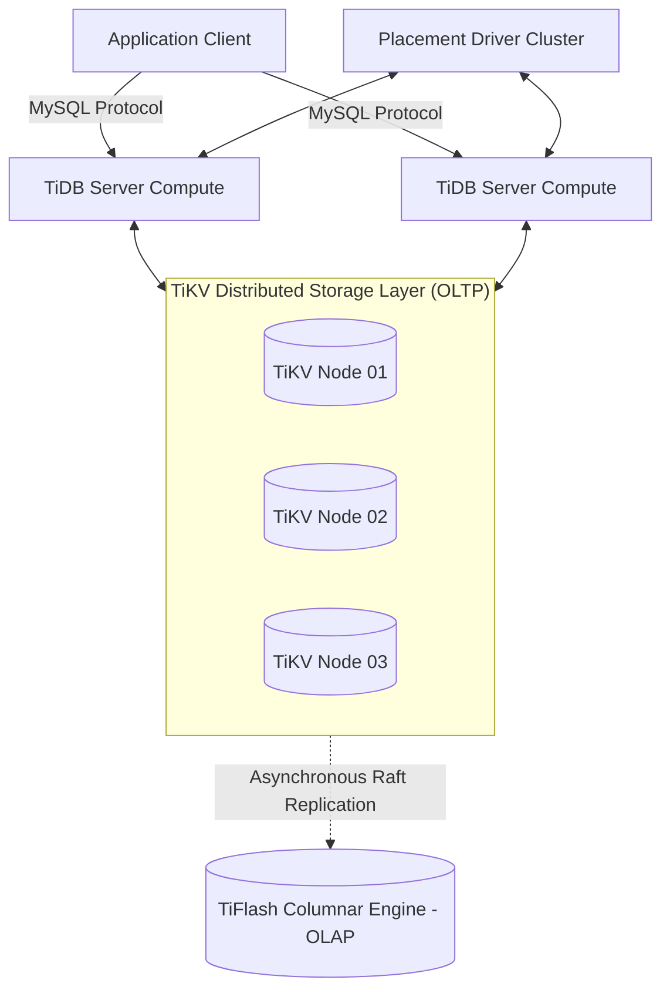

**Answer-first:** Replace MySQL manual sharding with TiDB: TiKV, Raft consensus, Percolator ACID, TiFlash HTAP, and a step-by-step DM shard merge guide.

Scaling a relational database is one of the most demanding challenges in system design. As applications grow from thousands to millions of active users, the database ceases to be a simple storage engine and becomes the primary bottleneck of the entire system architecture. 

In this deep dive, we will explore the architectural progression of scaling MySQL—beginning with replication topologies, stepping through the complexities and operational hazards of manual database sharding (including proxy middleware like Vitess), and evaluating NewSQL alternatives, specifically the distributed architecture of TiDB.

---

## The Limits of Traditional MySQL Scaling

**Replacing MySQL sharding** means migrating from a setup where the application manually routes queries to multiple MySQL instances (based on a shard key like `user_id % 4`) to a single TiDB cluster that auto-partitions data internally using Raft Regions — and exposes one standard MySQL connection string to the application.

Most scaling journeys start with a single primary instance handling both read and write operations. Before jumping to Sharding, it is highly recommended to review the basic strategies in our [MySQL Scalability Guide](/posts/mysql-scalability-guide). When read volume saturates the CPU or disk bandwidth, the standard mitigation is to implement a Primary-Replica replication topology.



### The Primary Write Bottleneck
While read replication scales read throughput linearly by adding replica nodes, all write traffic must still go to the single primary node. The primary becomes a write bottleneck because:
* **Single Point of Mutations:** All modifications must be serialized and written to the primary's InnoDB table spaces and doublewrite buffers.
* **Vertical Ceiling:** To handle more write transactions per second (TPS), you must upgrade the primary node's hardware (e.g., adding CPU cores, increasing RAM, and moving to higher-IOPS NVMe SSDs). This vertical scaling quickly hits a steep cost-to-performance curve, capped by physical hardware constraints.

### Replication Lag and the Single-Threaded Applier
The most significant operational risk in a replicated setup is **replication lag**—the delay between a transaction committing on the primary and being applied on a replica. Replicas process changes through a two-step log transport:
1. The replica's **I/O Thread** reads binary logs (binlogs) from the primary and writes them to local relay logs.
2. The replica's **SQL Thread** reads transactions from the relay logs and applies them to the local database.

Historically, the SQL Thread was single-threaded. If a replica was configured to run updates serially, a single long-running query or bulk operation on the primary would block all subsequent transactions in the queue.

> 🔥 **[Production Failure]: The Unindexed Batch Delete Cascading Outage**
> **Symptom:** Transactional write database locks up; replica read nodes fall behind by hours, serving stale data to clients and showing outdated payment records.
> **Root Cause:** A developer executed `DELETE FROM logs WHERE created_at < '2026-01-01'` on a table containing 50 million rows. The `created_at` column lacked an index. The primary executed the deletion in a single atomic transaction. When replicated, the replica's single SQL applier thread was forced to perform continuous full-table scans for each deleted row, saturating CPU and disk I/O, and blocking all subsequent read-replica updates.
> 📊 **Impact:** A 6-hour replication lag caused payment statuses to display as "Pending" in the customer UI despite successful completion at the payment provider, triggering thousands of redundant customer support tickets.
> 📈 **Resolution:** Batched the delete operation into segments of 5,000 rows utilizing the primary key (`id`), indexed the `created_at` column, and enabled multi-threaded `WRITESET` replication.
> *(Source: Internal Post-Mortem 2026)*

To mitigate single-threaded applier bottlenecks, modern MySQL versions (5.7 and 8.0+) support multi-threaded replication. By configuring:
```sql
-- Enable multi-threaded appliers on the replica
SET GLOBAL replica_parallel_workers = 8;
SET GLOBAL replica_parallel_type = 'LOGICAL_CLOCK';
```
And on the primary:
```sql
-- Track transaction dependencies using writesets to maximize parallelism
SET GLOBAL binlog_transaction_dependency_tracking = 'WRITESET';
```
The database tracks which transactions modify non-overlapping rows (writesets) and allows replicas to apply them in parallel. However, even with parallel appliers, replication lag will still occur if the replica's disk I/O is fully saturated by high write volume.

---

## MySQL Horizontal Scaling vs. Vertical Scaling

When vertical scaling (scaling up) reaches its limit, you must transition to horizontal scaling (scaling out).

| Dimension | Vertical Scaling (Scale-Up) | Horizontal Scaling (Scale-Out) |
|---|---|---|
| **Approach** | Upgrade existing hardware (CPU, RAM, NVMe) | Add more physical database nodes to the cluster |
| **Cost Curve** | Exponential (Premium enterprise hardware costs mount quickly) | Linear (Commodity server nodes) |
| **Fault Isolation** | Poor (Single primary crash halts all writes) | Good (Failure of one partition/node doesn't stop the cluster) |
| **Write Scaling** | Hard limits dictated by single-system memory bus | Theoretically unlimited write throughput |
| **Complexity** | Extremely low (No changes to application code) | High (Requires data partitioning and query routing) |

---

## The Pain Points of MySQL Sharding

Database sharding is the process of partitioning a single database across multiple physical machines. It splits data horizontally based on a chosen **shard key** (e.g., partitioning users with `user_id % 4` across four database instances). 

While sharding scales writes, it introduces massive architectural complexity by pushing database-level responsibilities up to the application layer.



### 1. Application-Level Routing and Shard Keys
In a sharded environment, the application can no longer open a single database connection. The code must inspect every query, extract the shard key, and route the query to the correct connection pool. If a query lacks the shard key, the application must run a "scatter-gather" query—broadcasting the query to all shards and merging the results in memory. This degrades query performance and increases network overhead.

### 2. Loss of Cross-Shard Joins
Standard SQL `JOIN` statements only function within a single physical MySQL instance. If you need to join user profile details on Shard A with order transactions on Shard B, you cannot write a simple `JOIN` query. Instead, you must:
1. Query Shard A to retrieve user details.
2. Query Shard B to retrieve order details.
3. Merge the datasets manually in the application code.

This pattern breaks relational database paradigms and shifts heavy computational work from the database optimizer to the application server.

### 3. Loss of ACID and Distributed Transaction Complexity
MySQL provides ACID (Atomicity, Consistency, Isolation, Durability) guarantees within a single instance using InnoDB's transactional engine. Across shards, these guarantees disappear. 

If a business transaction requires writing to Shard A (deducting account balance) and Shard B (creating an invoice), you must implement distributed transaction coordination:
* **Two-Phase Commit (2PC):** A protocol that coordinates commits across all participating shards. However, 2PC is notoriously slow, introduces network blocking, and is prone to locking the entire system if the coordinator crashes mid-transaction.
* **Saga Pattern:** A sequence of local transactions where each step updates data within a single shard. If a later step fails, the application must execute compensating transactions (rollback steps) in reverse order. This adds massive complexity to application-level state machines.

### 4. Re-sharding and Hot Shards
If 80% of your transactions are generated by a few popular users, the shard containing those users will experience a "Hot Shard" bottleneck. To fix this, you must **re-shard**—splitting the hot shard into two or more new database nodes. 

Re-sharding is a risky operational process:
1. You must spin up new MySQL instances.
2. Copy a subset of data from the active shard while it continues to serve traffic.
3. Keep the new nodes in sync using binlog replication.
4. Atomically switch the routing rules in the application layer.

Any error in this synchronization pipeline can lead to data inconsistency or silent corruption.

### 5. Vitess Middleware: An Intermediate Alternative
**Vitess** acts as an SQL proxy and orchestration layer that sits between the application and a fleet of MySQL instances. It presents a unified SQL interface to the application, automatically handling query routing, re-sharding, and basic cross-shard joins.

While Vitess preserves your existing investment in MySQL storage engines (InnoDB) and DBA tools, it introduces a complex control plane:
* You must run and manage `VTGate` (routing proxies), `VTTablet` (agent processes running alongside each MySQL instance), and `Topology Servers` (like etcd or ZooKeeper).
* Developers must still define explicit database partition structures using **VSchemas** (Vitess Schemas) and **VIndexes** (Vitess Indexes).

---

## Enter NewSQL: TiDB as a Sharding Alternative

NewSQL databases represent a class of modern relational databases that provide the horizontal scalability of NoSQL systems while preserving ACID transaction guarantees and standard SQL syntax. **TiDB** (developed by PingCAP) is an open-source, distributed NewSQL database designed to serve as a drop-in replacement for scaled-out MySQL databases.

### Core Architecture: Separation of Compute and Storage
TiDB is built from the ground up as a stateless compute layer separated from a distributed transactional storage layer.



#### 1. TiDB Server (Compute Layer)
Stateless nodes that accept MySQL client connections. They parse SQL queries, generate optimized distributed execution plans, and convert SQL queries into key-value requests that are sent to the storage layer. Because TiDB servers are stateless, you can scale them horizontally by placing them behind an standard load balancer (e.g., HAProxy or Nginx).

#### 2. TiKV (Storage Layer)
A distributed, transactional key-value store. Data is automatically partitioned into contiguous key ranges called **Regions** (defaulting to 96MB in size). Each Region is replicated across multiple TiKV nodes using the **Raft consensus protocol** to form a Raft Group.

#### 3. Placement Driver (PD - The Brain)
A cluster of nodes that stores cluster metadata, monitors TiKV node health, and manages automatic data scheduling. The PD acts as the cluster's coordinator, automatically splitting regions when they grow beyond 96MB and migrating them to less-utilized TiKV nodes to prevent hot spots. It also acts as the **Timestamp Oracle (TSO)**, issuing globally unique, monotonically increasing timestamps for distributed transactions.

### RocksDB Integration and Multi-Version Concurrency Control (MVCC)
Each TiKV node stores its local data partitions inside RocksDB, a high-performance LSM-tree (Log-Structured Merge-tree) key-value engine. To support transactional isolation, TiKV writes data across three RocksDB **Column Families (CF)**:
* **Default CF:** Stores the actual values indexed by key and version timestamp.
* **Lock CF:** Stores active transaction locks.
* **Write CF:** Stores commit metadata (the commit timestamp `commit_ts` and pointers to the version in Default CF).

When a query reads data, TiDB checks the Write CF using its transaction start timestamp (`start_ts`) to locate the latest committed version. This Multi-Version Concurrency Control (MVCC) enables non-blocking reads—write transactions never block read transactions, and read transactions never block write transactions.

### Percolator Distributed Transactions
TiDB implements distributed ACID transactions across the storage cluster using an optimized variant of Google's **Percolator** model, executing a Two-Phase Commit (2PC) protocol directly at the storage level:
1. **Prewrite Phase:** The client requests a `start_ts` from the PD. It writes mutations to TiKV, selecting one key as the "Primary Lock" and others as "Secondary Locks." The database locks the target keys in the RocksDB Lock CF and writes the temporary data to the Default CF.
2. **Commit Phase:** The client requests a `commit_ts` from the PD. It attempts to commit the Primary Lock first. If successful, the transaction is logically committed. The Lock CF entries are cleared, and commit markers are written to the Write CF. The remaining secondary locks are committed asynchronously.

This design avoids centralized lock managers and distributes transactional overhead across all TiKV storage nodes.

### Real-Time HTAP via TiFlash and Raft Learners
One of TiDB's most powerful features is its Hybrid Transactional/Analytical Processing (HTAP) capability. While TiKV stores data in a row-based format optimized for rapid OLTP writes, analytical queries (`SUM`, `AVG`, `GROUP BY`) run slowly on row-based storage.

TiDB solves this by integrating **TiFlash**, a column-oriented storage engine. TiFlash nodes connect directly to the TiKV storage tier:
* **Raft Learner Replication:** TiFlash nodes join the Raft groups of TiKV Regions as **Learners**.
* **Zero OLTP Impact:** Unlike followers, Raft Learners do not participate in consensus voting or leader elections. Row data is replicated asynchronously from TiKV to TiFlash and transformed into columnar layouts in real-time. Because learners do not participate in the voting quorum, network delays or write stalls on TiFlash nodes have zero performance impact on TiKV OLTP transaction latencies.
* **Smart Routing:** The TiDB optimizer automatically routes analytical queries to TiFlash and transactional queries to TiKV, allowing teams to run real-time BI dashboards on live database data without building complex ETL (Extract, Transform, Load) pipelines.

---

## Scalable Database Architecture: Making the Right Choice

When architecting a database platform, there is no single "best" solution. The right choice depends on your scale, operational budget, and application requirements.

### Database Architecture Comparison Matrix

| Feature | Primary-Replica Topology | Sharded MySQL (Vitess) | NewSQL (TiDB) |
|---|---|---|---|
| **Max Database Size** | ~1 - 2 TiB (limited by single disk capacity) | Unlimited (scale out by adding shards) | Unlimited (scale out by adding TiKV nodes) |
| **Write Scalability** | Capped by single primary performance | Horizontally scalable | Horizontally scalable |
| **Sharding Effort** | None | High (requires manual shard key design) | None (automatic Region partitioning) |
| **Distributed ACID** | Native | Complex (requires 2PC/XA proxy setup) | Native (built-in Percolator engine) |
| **Operational Overhead** | Extremely Low | High (managing proxy + topological fleet) | Medium-High (managing TiDB, TiKV, and PD) |
| **Real-time Analytics** | Poor (locks tables / saturates disk I/O) | Requires ETL to separate Data Warehouse | Excellent (via real-time TiFlash columnar engine) |
| **MySQL Compatibility** | 100% | ~99% (supports major SQL features) | ~90% (wire-compatible, lacks triggers/procedures) |

### Migration Pathways and Tools

If you decide to migrate from a legacy MySQL setup to TiDB, you can leverage native database migration tools:

```
[Small-to-Medium DBs < 1 TiB]
MySQL Source ───────────────── TiDB Data Migration (DM) ────────────────► TiDB Target

[Large DBs > 1 TiB]
MySQL Source ──► Dumpling (CSV/SQL Export) ──► TiDB Lightning (Physical Mode) ──► TiDB Target
```

1. **TiDB Data Migration (DM):**
   * Designed for datasets **under 1 TiB**.
   * Automates the full migration lifecycle: copies table schemas, imports existing historical data, and reads MySQL binary logs to perform live, incremental replication.
2. **Dumpling + TiDB Lightning (Physical Import Mode):**
   * Designed for large-scale datasets **over 1 TiB**.
   * **Dumpling** exports table data into SQL or CSV files.
   * **TiDB Lightning** runs in **Physical Mode**, parsing the raw files and generating database SST files directly. It then writes these SST files directly to the TiKV storage tier, bypassing the SQL compute layer entirely. This physical import mode is extremely fast, reaching import speeds of up to 250 GiB/hour per node.
   * *Critical Gotcha:* During a Physical Mode import, the target TiDB tables must be empty, and the cluster cannot serve active application traffic. Once complete, you must configure TiDB DM to replicate the incremental write window that occurred during the import process.

### Compatibility Limitations
While TiDB is highly compatible with the MySQL wire protocol, it is not a drop-in replacement for all systems. It lacks support for:
* **Triggers & Stored Procedures:** Distributed databases cannot easily run procedurally defined state changes within individual storage partitions without creating severe performance bottlenecks.
* **Multi-Object DDL Statements:** You cannot alter multiple columns or constraints in a single `ALTER TABLE` statement if they conflict or reference identical tables.
* **Foreign Key Constraints:** Although TiDB parses foreign key syntax, enforcing foreign keys across distributed nodes requires expensive cross-node verification. Large-scale applications should manage integrity constraint enforcement in the application layer.

For systems that do not rely heavily on database-level procedural code, migrating to TiDB eliminates the operational drag of sharding, providing a clear path to scale database writes horizontally.

## Frequently Asked Questions (FAQ)

**How do you scale a MySQL database?**
You start by scaling vertically (upgrading hardware) and adding read replicas. When write throughput becomes the bottleneck, you must transition to horizontal scaling (sharding) or adopt a NewSQL database like TiDB.

**What is the difference between sharding and partitioning?**
Partitioning generally refers to dividing a large table into smaller, manageable pieces within the same database instance. Sharding is horizontal partitioning where the data is distributed across entirely separate physical database instances, requiring application-level routing.

**Why is TiDB a good replacement for MySQL sharding?**
TiDB offers the horizontal write scalability of sharding without the application-level complexity. It automatically handles data partitioning (Regions), query routing, and re-balancing. It also supports distributed ACID transactions natively, which is incredibly difficult to achieve in a manually sharded MySQL environment.

---

🔗 **Next Step:** To see how database scaling and high-availability topologies fit into broader cloud infrastructure designs, read our guide on [architecting large-scale systems](/series/agentic-system-architecture) and contrast traditional regional database systems with modern [edge computing databases](/posts/deploying-astro-on-cloudflare-full-stack-edge-architecture).

**Continue Reading:** [Financial Microservices Architecture: Saga & Double-Entry Ledger](/posts/banking-microservices-architecture/) — how the database layer covered here supports ACID-compliant financial transaction processing in a distributed system.

🔗 **Real-World Case Study:** See how Shopee scaled their database architecture to handle flash sales at 10M+ concurrent users, including their MySQL sharding evolution and TiDB adoption: [Shopee Architecture: Database Scaling at Scale](/series/shopee-architecture/04-database-scale/).


