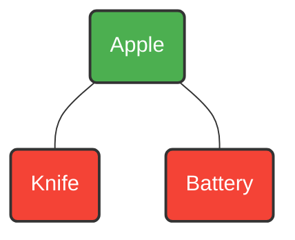

# Order Splitting at Scale: Graph Coloring, Bin Packing, and OPA in Go

**Answer-first:** Real-time e-commerce order splitting is a Constraint Satisfaction Problem (CSP). To determine the absolute minimum number of cardboard boxes required for a complex cart without violating safety rules or physical dimensions, the 2026 standard pipeline relies on **Open Policy Agent (OPA)** for dynamic business rules, **Golang (`gonum`)** for Graph Coloring (Welsh-Powell) to resolve logical conflicts, and **First-Fit Decreasing Bin Packing** to resolve physical constraints. This pipeline executes in under 50ms during synchronous checkout, deferring heavy Multi-Warehouse routing to async workers.

---

## The Order Splitting Problem in E-commerce Logistics

Imagine a customer checks out with a diverse shopping cart containing three items:
1. **A Kitchen Knife** (Sharp object)
2. **Organic Apples** (Perishable food)
3. **A Car Battery** (Hazmat / Lithium / Heavy)

If your warehouse management system blindly dumps these three items into a single cardboard box, you are inviting disaster. The knife might puncture the battery, or the battery acid might leak onto the apples. 

Logistics constraints dictate that these items cannot be packed together. But if you naively place each item in its own box, you incur the base shipping rate three times, destroying your profit margin. The engineering challenge is clear: **How do you group cart items into the absolute minimum number of boxes in less than 50 milliseconds?**

## Why Naive Graph Coloring Algorithms Fail in Production

In computer science, this is a classic **Vertex Coloring** problem.
- **Vertices (Nodes):** The items in the cart.
- **Edges:** A line drawn between two items if they are incompatible (e.g., Hazmat vs. Food).
- **Colors:** The cardboard boxes. If two items are connected by an edge, they cannot share the same color (box).



In the graph above, the Apple cannot share a box with the Knife or the Battery. However, the Knife and the Battery *can* share a box because there is no edge between them. The algorithmic goal is to minimize the chromatic number of the graph.

Many engineers implement a fast heuristic like **Welsh-Powell** to solve this and call it a day. But in production, this academic approach fails catastrophically due to the **Bin Packing Trap**.

### The Bin Packing Trap
Graph coloring only solves *logical* constraints. It is entirely blind to *physical* constraints (Volume and Weight). If a customer orders 100 packs of toilet paper, they do not logically conflict with each other. A pure graph algorithm will color all 100 packs with "Color 1" (Box 1). The warehouse worker is then instructed to pack 100 packs of toilet paper into a single standard-sized box. The box explodes.

## SOTA Order Splitting Architecture (OPA + Go)

To survive production at 8,000 RPS, we cannot rely on a single algorithm. We must chain a decoupled Rule Engine, a Graph heuristic, and a dimensional packer.

### Phase 1: Policy-as-Code with Open Policy Agent (OPA)
Hardcoding `if item.Type == "Hazmat"` inside your Go service requires a full deployment every time the legal department updates shipping regulations. 

Instead, we use **Open Policy Agent (OPA)**. We pass the entire cart payload to an OPA sidecar. OPA evaluates a Rego policy and returns a flat array of conflicting edges. 

*Crucial Architecture Note:* **Never query OPA in an N+1 loop** (evaluating pairs one by one). A 50-item cart requires 1,225 pair checks. Doing this over gRPC will cause your checkout API to time out. Send the whole array.

**The Rego Policy (`rules.rego`):**
```rego
package logistics.splitting

# Generate all unique pairs from the cart array
pairs[[a, b]] {
    a := input.cart[i]
    b := input.cart[j]
    i < j
}

# Rule: Food cannot mix with Hazmat
conflict[[a.id, b.id]] {
    pairs[[a, b]]
    a.category == "Food"
    b.category == "Hazmat"
}

# Rule: Sharp objects cannot mix with Food
conflict[[a.id, b.id]] {
    pairs[[a, b]]
    a.category == "Sharp"
    b.category == "Food"
}
```

### Phase 2: In-Memory Graph Coloring with Go
The Go service receives the `conflict` array from OPA in ~2ms. It constructs the graph in memory using `gonum/graph`.

```go
package splitter

import "gonum.org/v1/gonum/graph/simple"

func ConstructGraph(items []Item, conflicts [][]string) *simple.UndirectedGraph {
    g := simple.NewUndirectedGraph()
    
    // Add nodes
    nodes := make(map[string]graph.Node)
    for _, item := range items {
        n := g.NewNode()
        g.AddNode(n)
        nodes[item.ID] = n
    }

    // Add edges from OPA result
    for _, edge := range conflicts {
        g.SetEdge(g.NewEdge(nodes[edge[0]], nodes[edge[1]]))
    }
    return g
}
```
We then apply the **Welsh-Powell** algorithm. It sorts nodes by their degree (items with the most conflicts get prioritized) and greedily assigns boxes. The output is a set of *Logically Valid Groups*.

### Phase 3: First-Fit Decreasing (Bin Packing)
Now we iterate through each Logically Valid Group. We sort the items descending by volume. We use a **1D/3D Bin Packing** algorithm to place items into standard box sizes. If a box hits its volume or weight limit, we spawn a new box.

This two-stage pipeline (Graph -> Bin Packing) guarantees that items are safe to mix *and* physically fit into the cardboard.

## Scaling the Pipeline: Synchronous Checkout vs Async OR-Tools

Finding the optimal warehouse to ship from, or combining these boxes with other orders for the same delivery driver requires a Mixed Integer Programming (MIP) solver like **Google OR-Tools (CP-SAT)**. 

**Do not run OR-Tools synchronously during checkout.** It is CPU-heavy and will crush your cluster during Black Friday. 

The architecture strictly separates responsibilities:
1. **Synchronous Checkout (Under 50ms):** The Go + OPA + Bin Packing pipeline estimates the number of boxes. We use this to calculate the temporary shipping fee and return `HTTP 200 OK` to the customer.
2. **Asynchronous Fulfillment (Background):** Once payment clears, the `order.paid` event triggers the Fulfillment worker. This async worker feeds the finalized box requirements into the C++ OR-Tools microservice to calculate the mathematically optimal multi-origin warehouse routing and driver assignments.

---

## Series Navigation

**[E-commerce Order Allocation Architecture Systems Guide](https://tanhdev.com/series/ecommerce-order-allocation/)**

| Part | What it covers |
| :--- | :--- |
| [Part 1-4: Executive Summary](/posts/order-fulfillment-algorithm-warehouse-last-mile/) | Full warehouse-to-last-mile pipeline, inventory sync, multi-warehouse allocation |
| [Part 5: Split Shipment & Consolidation](/series/ecommerce-order-allocation/part-5-split-consolidation-lastmile/) | Greedy set-covering heuristic, profitability thresholds |
| [Part 6: Building a Mini Allocation Engine](/series/ecommerce-order-allocation/part-6-build-mini-allocation-engine/) | Google OR-Tools integer programming for assignment |
| [Part 7: Distance Matrix Routing](/series/ecommerce-order-allocation/part-7-distance-matrix-routing/) | GraphHopper distance matrix generation for VRP |
| [Part 8: Intelligent Order Release](/series/ecommerce-order-allocation/part-8-intelligent-order-release/) | Agentic AI Order Batching & VRPTW |
| **This post (Part 9)** | Order Splitting Algorithm, OPA & Graph Coloring |
| [Part 10: Picker Routing Optimization](/posts/warehouse-picker-routing-optimization/) | GraphHopper A*, OR-Tools in C++ |

---
*If you are an engineer scaling logistics platforms, how do you handle dimensional weight logic? Share your approach below.*
