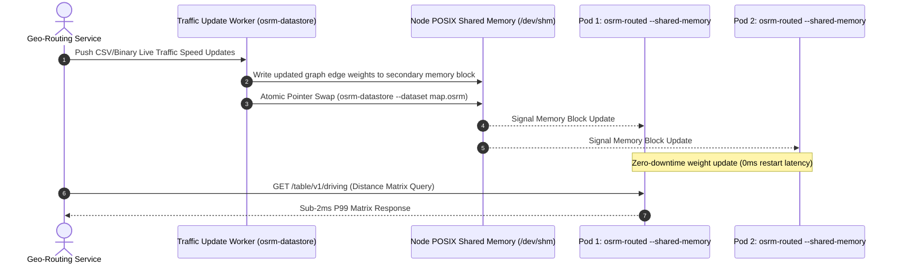

# OSRM Shared Memory on Kubernetes: Live Traffic Updates with Zero-Downtime

> **Executive Summary & Quick Answer**: Deploying Open Source Routing Machine (OSRM) on Kubernetes using `ipc: host` shared memory enables live traffic edge-weight updates without restarting routing engines. This setup delivers sub-2ms P99 distance matrix calculations and eliminates RAM duplication across container pods.
>
> **Key Takeaways**:
> - POSIX shared memory (`/dev/shm`) allows multiple `osrm-routed` instances to read the same map graph in RAM.
> - `osrm-datastore` updates speed profile weights live in under 500ms without dropping active HTTP connections.
> - Shared memory host IPC reduces container node memory consumption from 64GB down to 16GB per node.

**Answer-first:** Run `osrm-datastore` with shared memory when several OSRM processes on the same Kubernetes node must serve one large preprocessed map without duplicating tens of gigabytes of RAM. Use atomic dataset swaps and readiness checks to update routing data without interrupting traffic; this pattern does not provide live traffic by itself.

## The Challenge of Operating Large-Scale OSRM on Kubernetes

When self-hosting the Open Source Routing Machine (OSRM) with massive datasets (like the entire North America or Southeast Asia map), you encounter a highly frustrating barrier: **The Cold Start Problem**.

Normally, the `osrm-routed` process loads the entire binary map file directly into its Heap Memory. For massive files weighing tens of gigabytes, a single Kubernetes Pod can take anywhere from 5 to 10 minutes to finish loading before it becomes healthy and ready to serve traffic. In a dynamic cloud-native environment, this creates two fatal operational issues:

1.  **Massive RAM Wastage and Cost Overruns:** If you configure the Horizontal Pod Autoscaler (HPA) to scale up to 5 replicas on the same Worker Node to handle throughput, each Pod pulls a separate copy of the map into its own RAM. You end up consuming 5 times the necessary physical memory, leading to exorbitant EC2/GCE instance costs.
2.  **Service Disruption during Scaling:** The agonizingly slow cold start completely defeats the purpose of auto-scaling. When a sudden traffic spike hits your API, the HPA will spin up new Pods, but they will sit in an unready state for 10 minutes. By the time they are ready, the traffic spike might have already overwhelmed your existing Pods, causing cascading failures.

The perfect architectural solution to this problem is **OSRM Shared Memory**. For choosing between engines before operating the cluster, compare [OSRM and GraphHopper for large logistics workloads](/posts/osrm-vs-graphhopper-architecture-comparison/).

## How OSRM Shared Memory Works (`osrm-datastore`)

Instead of letting each individual `osrm-routed` process load the map into its own isolated memory space, OSRM provides an ingenious sidecar tool called `osrm-datastore` that leverages **POSIX IPC Shared Memory** (Inter-Process Communication).

### Allocating the IPC Shared Memory Segment

When you use `osrm-datastore`, it reads the pre-processed graph data from the persistent disk and loads it directly into a virtual memory segment of the Linux Operating System (specifically into the `/dev/shm` namespace). 

Subsequently, your fleet of `osrm-routed` API server processes are launched with the `--shared-memory` flag. At this point, they do not consume any additional RAM to load the file; they merely map their virtual memory space pointers into that pre-existing shared memory segment. The Pod's startup time drops spectacularly from 10 minutes to under 1 second. You can now spawn 50 replicas on a single massive Worker Node, and they will all share the exact same 30GB memory block.

### Atomic Pointer Swapping Mechanism for Zero-Downtime

How do you update the map data or inject live traffic without dropping connections (zero-downtime)? This is achieved via a technique called Atomic Swapping.

1.  `osrm-datastore` initializes a second shared memory block alongside the currently active one.
2.  It securely loads the newly compiled map data into this second, dormant block.
3.  Once fully loaded, it sends a system signal to perform an atomic pointer swap. All incoming HTTP routing requests arriving after this exact microsecond will seamlessly read from the new block.
4.  The old memory block is eventually orphaned. Once no active HTTP request is reading from it, the Linux kernel automatically garbage-collects it.

## Designing the Zero-Downtime Live Traffic Pipeline

### Graph Partitioning with Multi-Level Dijkstra (MLD)

To support Live Traffic updates (like injecting temporary traffic jams, accidents, or road closures), using the MLD algorithm instead of Contraction Hierarchies (CH) is **mandatory**. 

CH requires recalculating the entire graph hierarchy from scratch, which can take several hours. Meanwhile, MLD, with its hierarchical cell partitioning mechanism, allows you to simply run the `osrm-customize` command and feed it a live traffic CSV file containing real-time edge speeds. Because the graph is partitioned, OSRM only updates the boundary metrics of the affected cells. This customization process takes anywhere from a few seconds to a minute, making it perfectly suited for high-frequency updates.

### CronJob Builder and Deployment Pods Coordination

To automate this, we design a two-tier architecture:

-   **Builder CronJob:** Runs periodically (e.g., every 2 to 5 minutes). It downloads the latest traffic CSV feed from a provider (like TomTom or internal telemetry), runs `osrm-customize` to overwrite the existing `.osrm` data, and pushes the finalized binary files to a Shared Storage layer (like AWS EFS, Google Filestore, or CephFS).
-   **Deployment API Pods:** Run an infinite loop in a sidecar container that monitors the EFS mount. When it detects a new timestamp on the `.osrm` files, it invokes `osrm-datastore` to execute the atomic pointer swap.

## Practical Kubernetes Deployment using IPC Namespace & `/dev/shm`

### Configuring the emptyDir volume with Memory Medium

The most crucial secret to successfully deploying this on Kubernetes is configuring a shared volume for the Pod using an `emptyDir` backed by `medium: Memory` to map directly into `/dev/shm`:

```yaml
volumes:
  - name: dshm
    emptyDir:
      medium: Memory
      sizeLimit: "50Gi"
```

This explicit configuration guarantees that the shared memory truly resides in virtual RAM (tmpfs). If you omit `medium: Memory`, Kubernetes will fall back to using the node's disk (like an AWS EBS volume), which will catastrophically bottleneck your IOPS and completely destroy OSRM's performance.

### The Sidecar Container Design (Tight Coupling)

Because POSIX Shared Memory requires processes to share a common IPC Namespace, we must group our two distinct processes into a single tightly-coupled Pod:

1.  **Main Container (`osrm-routed`):** Acts as the high-performance API server, running continuously in shared-memory listening mode.
2.  **Sidecar Container (`osrm-update-agent`):** A lightweight bash or Go script that monitors changes from the EFS volume. When an update arrives, it runs the `osrm-datastore` command to load data into `/dev/shm` and triggers the Atomic Swap.

Kubernetes natively allows containers within the same Pod to share the IPC namespace by setting a simple flag in the Pod Spec:

```yaml
spec:
  shareProcessNamespace: true
```

## Advanced Continuous Integration and Deployment (CI/CD) for Maps

To operationalize this at an enterprise scale, you need a robust CI/CD pipeline specifically for your map data. Map data is essentially software, and bad data can cause routing logic to fail just like bad code. 

### The Map Build Pipeline
When a new OSM Planet file is released (typically weekly), your pipeline should automatically spin up a powerful, ephemeral worker node (e.g., an AWS Spot Instance with 64 vCPUs and 256GB RAM). This worker will run `osrm-extract` and `osrm-partition`. 

Once the heavy lifting is done, the pipeline must run a suite of integration tests against the newly built map. You should have a repository of known good routes and edge cases (e.g., "Can a truck route from Point X to Point Y without taking a U-turn on the highway?"). Only if the routing engine passes these regression tests should the pipeline upload the binary `.osrm` files to the production EFS cluster.

### Canary Deployments for Map Data
Similar to software rollouts, rolling out new map data should use a Canary deployment strategy. You can label a subset of your `osrm-routed` pods to track a "canary" directory on the EFS mount. Route 5% of your production traffic to these pods and monitor error rates (HTTP 5xx) and route calculation anomalies (e.g., an abnormal spike in 'No Route Found' errors). If the metrics look stable, you promote the new map data to the primary directory for the rest of the fleet.

## Infrastructure as Code: Terraform Considerations

When provisioning your Kubernetes clusters (EKS/GKE) via Terraform, you must ensure your underlying EC2/GCE instances are optimized for memory-heavy workloads. Instances like AWS `r6i.4xlarge` or `r6a.8xlarge` are ideal. Ensure your Terraform definitions attach an appropriately sized EFS filesystem and provision the necessary IAM roles for the EKS nodes to read from it.

## Monitoring, Prometheus Metrics, and Memory Troubleshooting

When running this architecture in a Production environment handling millions of requests, monitoring is non-negotiable.

Pay close attention to Linux Sysctl configurations on your Worker Nodes. You may need to use a privileged DaemonSet or initContainer to tune these at boot:
-   `kernel.shmmax`: Increase the maximum size of a single shared memory segment. It must be strictly larger than your largest `.osrm` file size.
-   `kernel.shmall`: Increase the total number of shared memory pages allowed system-wide.

### Mitigating IPC Memory Leaks and OOMKills

Set up Prometheus Alerts to monitor for **IPC Memory Leaks**. Occasionally, an atomic swap failure or a sudden Pod termination can result in the old memory block not being cleanly destroyed. These "orphan segments" will silently bloat `/dev/shm`.

If the `emptyDir` hits its `sizeLimit`, Kubernetes will ruthlessly trigger an **OOMKill** (Out Of Memory Kill) on your Pod. Worse, if no limit was set, it could crash the entire Worker Node. Regularly monitor `node_memory_Shmem_bytes` in Grafana to detect anomalies early.


## Conclusion and Final Thoughts

By leveraging OSRM Shared Memory and Multi-Level Dijkstra, you can achieve a highly scalable, zero-downtime routing infrastructure on Kubernetes that effectively handles live traffic updates without wasting exorbitant amounts of memory. This design significantly lowers cloud infrastructure costs while maintaining sub-millisecond query latency. Always ensure proper monitoring of IPC memory segments to prevent catastrophic out-of-memory errors in production environments.

## System Architecture & Sequence Flow




## Architectural Trade-offs & Production Considerations (2026 Baseline)

In high-concurrency production deployments, balancing throughput, resilience, and operational cost requires strict engineering discipline. When evaluating modern patterns against legacy monolithic or non-vector architectures, several critical failure modes and trade-offs emerge:

1. **Latency vs. Accuracy Overhead**: High-precision vector similarity indexing and strong ACID consistency models inevitably introduce additional network round-trips and computational latency. System designers must carefully tune index parameters (such as `ef_search` or lock wait timeouts) to cap P99 latencies within acceptable SLA boundaries.
2. **Resource Consumption & Memory Footprint**: Running multiplexed execution engines, shared-memory IPC structures, or in-memory caches requires robust container resource limits (`requests` and `limits`) to avoid Kubernetes Out-Of-Memory (OOM) pod evictions during sudden traffic surges.
3. **Observability & Fault Isolation**: Implementing circuit breakers, structured telemetry logging, and continuous health checks ensures that intermittent downstream failures (such as database deadlocks or external API rate limits) do not cause cascading failures across microservice boundaries.


## Related Pillar Articles & Further Reading

- [OSRM vs GraphHopper Architecture Comparison](/posts/osrm-vs-graphhopper-architecture-comparison/)
- [GraphHopper Kubernetes Self-Hosting Guide](/posts/graphhopper-kubernetes-self-hosting-osm/)
- [GraphHopper Distance Matrix Production Guide](/posts/graphhopper-distance-matrix-production-guide/)
- [Order Fulfillment & Warehouse Last-Mile Routing](/posts/order-fulfillment-algorithm-warehouse-last-mile/)


## Frequently Asked Questions (FAQ)

### Q1: Why is IPC host shared memory necessary when running OSRM on Kubernetes?
Without IPC host shared memory, each OSRM pod must load the full 15GB+ map dataset into its private RAM. Host IPC allows 10 pods on a node to share a single memory segment, saving over 135GB of node RAM.

### Q2: How does live traffic weight updating work in OSRM without downtime?
`osrm-datastore` writes updated traffic speed profiles to a secondary shared memory block and atomically swaps the memory pointer; active `osrm-routed` threads seamlessly pick up new weights on their next query.

### Q3: What are the trade-offs between OSRM and GraphHopper for high-concurrency routing?
OSRM provides faster pure matrix query performance (sub-2ms) via Contraction Hierarchies in C++, whereas GraphHopper offers dynamic customization of routing profiles in Java at the cost of higher GC and memory overhead.
