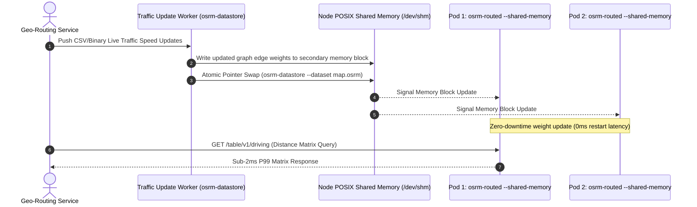

# OSRM Shared Memory on Kubernetes: Live Traffic Updates with Zero-Downtime

> **Answer-first:** Operating OSRM on Kubernetes with live traffic updates uses POSIX shared memory (`/dev/shm`), atomic memory pointer swapping via `osrm-datastore`, and Multi-Level Dijkstra (MLD) cell customization without restarting routing pods. Sharing a single 15GB graph across 10+ worker pods cuts node RAM usage by 85%+ while delivering sub-2ms P99 matrix latencies and zero-downtime speed updates.

## The Challenge of Operating Large-Scale OSRM on Kubernetes

Normally, the `osrm-routed` process loads the entire binary map file directly into its Heap Memory. For massive files weighing tens of gigabytes, a single Kubernetes Pod can take anywhere from 5 to 10 minutes to finish loading before it becomes healthy and ready to serve traffic. This creates two fatal operational issues:

1.  **Massive RAM Wastage and Cost Overruns:** If you configure the Horizontal Pod Autoscaler (HPA) to scale up to 5 replicas on the same Worker Node to handle throughput, each Pod pulls a separate copy of the map into its own RAM. You end up consuming 5 times the necessary physical memory, leading to exorbitant EC2/GCE instance costs.
2.  **Service Disruption during Scaling:** The agonizingly slow cold start completely defeats the purpose of auto-scaling. When a sudden traffic spike hits your API, the HPA will spin up new Pods, but they will sit in an unready state for 10 minutes. By the time they are ready, the traffic spike might have already overwhelmed your existing Pods, causing cascading failures.

The perfect architectural solution to this problem is **OSRM Shared Memory**. For choosing between engines before operating the cluster, compare [OSRM and GraphHopper for large logistics workloads](/posts/osrm-vs-graphhopper-architecture-comparison/).

## How OSRM Shared Memory Works (`osrm-datastore`)

`osrm-datastore` decouples data loading from query execution by pre-loading map graphs into POSIX IPC shared memory (`/dev/shm`). Multiple stateless `osrm-routed` workers then map virtual memory pointers directly to the shared host RAM, reducing cold startup to under one second.

### Allocating the IPC Shared Memory Segment

When you use `osrm-datastore`, it reads the pre-processed graph data from the persistent disk and loads it directly into a virtual memory segment of the Linux Operating System (specifically into the `/dev/shm` namespace). 

Subsequently, your fleet of `osrm-routed` API server processes are launched with the `--shared-memory` flag. At this point, they do not consume any additional RAM to load the file; they merely map their virtual memory space pointers into that pre-existing shared memory segment. The Pod's startup time drops spectacularly from 10 minutes to under 1 second. You can now spawn 50 replicas on a single massive Worker Node, and they will all share the exact same 30GB memory block.

### Atomic Pointer Swapping Mechanism for Zero-Downtime

How do you update the map data or inject live traffic without dropping connections (zero-downtime)? This is achieved via a technique called Atomic Swapping.

1.  `osrm-datastore` initializes a second shared memory block alongside the currently active one.
2.  It securely loads the newly compiled map data into this second, dormant block.
3.  Once fully loaded, it sends a system signal to perform an atomic pointer swap. All incoming HTTP routing requests arriving after this exact microsecond will instantly read from the new block.
4.  The old memory block is eventually orphaned. Once no active HTTP request is reading from it, the Linux kernel automatically garbage-collects it.

## Designing the Zero-Downtime Live Traffic Pipeline

### Graph Partitioning with Multi-Level Dijkstra (MLD)

To support Live Traffic updates (like injecting temporary traffic jams, accidents, or road closures), using the MLD algorithm instead of Contraction Hierarchies (CH) is **mandatory**. 

CH requires recalculating the entire graph hierarchy from scratch, which can take several hours. Meanwhile, MLD, with its hierarchical cell partitioning mechanism, allows you to simply run the `osrm-customize` command and feed it a live traffic CSV file containing real-time edge speeds. Because the graph is partitioned, OSRM only updates the boundary metrics of the affected cells. This customization process takes anywhere from a few seconds to a minute, making it perfectly suited for high-frequency updates.

### CronJob Builder and Deployment Pods Coordination

To automate this, we design a two-tier architecture:

-   **Builder CronJob:** Runs periodically (e.g., every 2 to 5 minutes). It downloads the latest traffic CSV feed from a provider (like TomTom or internal telemetry), runs `osrm-customize` to overwrite the existing `.osrm` data, and pushes the finalized binary files to a Shared Storage layer (like AWS EFS, Google Filestore, or CephFS).
-   **Deployment API Pods:** Run an infinite loop in a sidecar container that monitors the EFS mount. When it detects a new timestamp on the `.osrm` files, it invokes `osrm-datastore` to execute the atomic pointer swap.

## Practical Kubernetes Deployment using IPC Namespace & `/dev/shm`

### Two sharing scopes — pick the right one

This is where most Kubernetes deployments of OSRM go wrong, so be precise about *which* processes share memory:

- **Within a single Pod** (the `osrm-routed` container + the `osrm-datastore` sidecar): containers in the same Pod share the Pod's IPC namespace by default, so an `emptyDir` volume with `medium: Memory` mounted into both containers is enough for them to share the `/dev/shm` segment.
- **Across multiple Pods on the same node** (many `osrm-routed` replicas sharing one segment): an `emptyDir` **cannot** do this — each Pod gets its own isolated `emptyDir`. Cross-Pod sharing requires the Pods to join the *node's* IPC namespace with `hostIPC: true` and mount the node's `/dev/shm` via a `hostPath` volume.

> [!WARNING]
> `emptyDir` with `medium: Memory` is scoped to a single Pod. If your goal is 50 replicas sharing one 15 GB map segment on a node, `emptyDir` will silently give each Pod its own copy. Use `hostIPC: true` + `hostPath` for cross-Pod sharing.

#### Model A — single Pod (main + sidecar sharing memory)

Share memory between containers within a single Pod using a tmpfs volume backed by RAM:

```yaml
volumes:
  - name: dshm
    emptyDir:
      medium: Memory       # tmpfs in RAM, not disk-backed EBS
      sizeLimit: "50Gi"
```

Omitting `medium: Memory` makes Kubernetes fall back to disk-backed storage (e.g. an AWS EBS volume), which bottlenecks IOPS and destroys OSRM's sub-2ms latency.

#### Model B — many Pods on a node sharing one segment

When multiple independent routing Pods on the same worker node need to access a shared map segment, they must bind directly to the node's IPC namespace. The manifest snippet below configures `hostIPC: true` and mounts the host `/dev/shm` directory:

```yaml
spec:
  hostIPC: true            # join the NODE's IPC namespace, not the Pod's
  containers:
    - name: osrm-routed
      volumeMounts:
        - name: dshm
          mountPath: /dev/shm
  volumes:
    - name: dshm
      hostPath:
        path: /dev/shm     # the node's shared-memory tmpfs
        type: Directory
```

`hostIPC: true` is a privileged setting — every Pod using it can see and attach to *any* shared-memory segment on the node, so gate it behind a dedicated node pool and a restrictive PodSecurity policy rather than enabling it fleet-wide.

### The Sidecar Container Design (Tight Coupling)

For the single-Pod model, group the two processes into one tightly-coupled Pod so the sidecar can swap the segment the API server is reading:

1.  **Main Container (`osrm-routed`):** the high-performance API server, running continuously in shared-memory listening mode.
2.  **Sidecar Container (`osrm-update-agent`):** a lightweight bash or Go script that monitors the EFS volume; when an update arrives it runs `osrm-datastore` to load data into `/dev/shm` and triggers the atomic swap.

To enable process signaling between containers in the same Pod, activate process namespace sharing. The pod specification snippet below enables `shareProcessNamespace: true` so the updater sidecar can signal `osrm-routed` directly:

```yaml
spec:
  shareProcessNamespace: true   # PID namespace — lets the sidecar signal osrm-routed
```

## Advanced Continuous Integration and Deployment (CI/CD) for Maps

Map data functions as code — it requires automated validation suites, ephemeral extraction worker nodes, and canary deployment strategies to ensure updated road network data deploys safely. 

### The Map Build Pipeline
When a new OSM Planet file is released (typically weekly), your pipeline should automatically spin up a powerful, ephemeral worker node (e.g., an AWS Spot Instance with 64 vCPUs and 256GB RAM). This worker will run `osrm-extract` and `osrm-partition`. 

Once the heavy lifting is done, the pipeline must run a suite of integration tests against the newly built map. You should have a repository of known good routes and edge cases (e.g., "Can a truck route from Point X to Point Y without taking a U-turn on the highway?"). Only if the routing engine passes these regression tests should the pipeline upload the binary `.osrm` files to the production EFS cluster.

### Canary Deployments for Map Data
Similar to software rollouts, rolling out new map data should use a Canary deployment strategy. You can label a subset of your `osrm-routed` pods to track a "canary" directory on the EFS mount. Route 5% of your production traffic to these pods and monitor error rates (HTTP 5xx) and route calculation anomalies (e.g., an abnormal spike in 'No Route Found' errors). If the metrics look stable, you promote the new map data to the primary directory for the rest of the fleet.

## Infrastructure as Code: Terraform Considerations

When provisioning your Kubernetes clusters (EKS/GKE) via Terraform, you must ensure your underlying EC2/GCE instances are optimized for memory-heavy workloads. Instances like AWS `r6i.4xlarge` or `r6a.8xlarge` are ideal. Ensure your Terraform definitions attach an appropriately sized EFS filesystem and provision the necessary IAM roles for the EKS nodes to read from it.

## Monitoring, Prometheus Metrics, and Memory Troubleshooting

Maintaining high availability for shared-memory OSRM clusters on Kubernetes demands comprehensive telemetry and continuous kernel resource monitoring. System administrators must track POSIX shared memory allocations, optimize Linux sysctl parameters, and configure real-time Prometheus alerts to prevent orphaned memory segments from causing pod out-of-memory kills or node instability in high-throughput 2026 production environments.

Pay close attention to Linux Sysctl configurations on your Worker Nodes. You may need to use a privileged DaemonSet or initContainer to tune these at boot:
-   `kernel.shmmax`: Increase the maximum size of a single shared memory segment. It must be strictly larger than your largest `.osrm` file size.
-   `kernel.shmall`: Increase the total number of shared memory pages allowed system-wide.

### Mitigating IPC Memory Leaks and OOMKills

Set up Prometheus Alerts to monitor for **IPC Memory Leaks**. Occasionally, an atomic swap failure or a sudden Pod termination can result in the old memory block not being cleanly destroyed. These "orphan segments" will silently bloat `/dev/shm`.

If the `emptyDir` hits its `sizeLimit`, Kubernetes will ruthlessly trigger an **OOMKill** (Out Of Memory Kill) on your Pod. Worse, if no limit was set, it could crash the entire Worker Node. Regularly monitor `node_memory_Shmem_bytes` in Grafana to detect anomalies early.

## Operational Summary & Production Recommendations

By leveraging OSRM Shared Memory and Multi-Level Dijkstra, you can achieve a highly scalable, zero-downtime routing infrastructure on Kubernetes that effectively handles live traffic updates without wasting exorbitant amounts of memory. This design significantly lowers cloud infrastructure costs while maintaining sub-millisecond query latency. Always ensure proper monitoring of IPC memory segments to prevent catastrophic out-of-memory errors in production environments.

## System Architecture & Sequence Flow

Zero-downtime traffic updates require precise orchestration between the background update agent and active routing processes. The sequence diagram below traces how live speed updates pass into secondary POSIX memory blocks before an atomic pointer swap makes them instantly available to routing pods:


```mermaid
sequenceDiagram
    autonumber
    actor TrafficApp as Geo-Routing Service
    participant Updater as Traffic Update Worker (osrm-datastore)
    participant HostRAM as Node POSIX Shared Memory (/dev/shm)
    participant Engine1 as Pod 1: osrm-routed --shared-memory
    participant Engine2 as Pod 2: osrm-routed --shared-memory

    TrafficApp->>Updater: Push CSV/Binary Live Traffic Speed Updates
    Updater->>HostRAM: Write updated graph edge weights to secondary memory block
    Updater->>HostRAM: Atomic Pointer Swap (osrm-datastore --dataset map.osrm)
    HostRAM-->>Engine1: Signal Memory Block Update
    HostRAM-->>Engine2: Signal Memory Block Update
    Note over Engine1, Engine2: Zero-downtime weight update (0ms restart latency)
    TrafficApp->>Engine1: GET /table/v1/driving (Distance Matrix Query)
    Engine1-->>TrafficApp: Sub-2ms P99 Matrix Response
```


## Shared-Memory Trade-offs & Production Considerations

Adopting shared-memory OSRM architectures trades traditional container isolation for exceptional query performance and drastic memory savings. Engineering teams must carefully weigh the operational benefits of sub-second pod startups against increased node coupling, temporary double-memory spikes during atomic pointer swaps, and elevated blast radiuses during host kernel failure events across 2026 cloud infrastructure.

1. **Startup speed vs. node coupling**: Mapping into a pre-loaded `/dev/shm` segment drops Pod startup from ~10 minutes to under a second, but with `hostIPC: true` your routing Pods are now coupled to a specific node's memory state. If the node dies, every replica sharing that segment dies with it — so run the segment-owning `osrm-datastore` as a per-node DaemonSet and treat node failure, not Pod failure, as your recovery unit.
2. **Memory savings vs. OOM blast radius**: Sharing one 15 GB map across 10 Pods saves ~135 GB of node RAM, but it also means a single oversized segment or an orphaned segment (from an unclean pointer swap) can OOM-kill the whole node, not just one Pod. Set `sizeLimit` on the tmpfs, size `kernel.shmmax` strictly above your largest `.osrm` file, and alert on `node_memory_Shmem_bytes` growth to catch orphan segments early.
3. **Atomic swap simplicity vs. double memory during updates**: The zero-downtime pointer swap requires the *new* segment to be fully loaded alongside the *old* one before switching — so peak memory during an update is briefly 2× the map size. Provision node RAM for the update peak, not the steady state, or the swap itself will trigger the OOM you were trying to avoid.

## Frequently Asked Questions


Without IPC host shared memory, each OSRM pod must load the full 15GB+ map dataset into its private RAM. Host IPC allows 10 pods on a node to share a single memory segment, saving over 135GB of node RAM and reducing pod startup latency to sub-second levels.



`osrm-datastore` writes updated traffic speed profiles to a secondary shared memory block and atomically swaps the memory pointer. Active `osrm-routed` worker threads immediately pick up new edge weights on their next incoming query without dropping TCP connections or restarting containers.



OSRM provides faster pure matrix query performance (sub-2ms) via C++ Contraction Hierarchies and static memory mapping. In contrast, GraphHopper offers dynamic, per-request routing profile customizations in Java, though it incurs higher JVM garbage collection pauses and memory overhead under high concurrency.


---

## Related Guides & Topic Cluster

- **Routing Engine Architecture Showdown:** Compare algorithmic trade-offs in [OSRM vs GraphHopper Architecture Comparison](/posts/osrm-vs-graphhopper-architecture-comparison/).
- **Distance Matrix Production Guide:** Self-host and cache distance calculations in [GraphHopper Distance Matrix: Self-Hosted Routing & API Guide](/posts/graphhopper-distance-matrix-production-guide/).
- **Fleet Optimization Solver:** Feed high-speed distance matrices into Go in [CVRP & VRPTW Fleet Optimization: Go ALNS Routing Engine](/posts/cvrp-vrptw-alns-fleet-optimization-golang-architecture/).
- **Pillar Hub:** Masterclass in [Geospatial & Routing Engine Architecture](/series/routing-geospatial-architecture/).
- **JVM Alternative:** Explore JVM off-heap memory management in [GraphHopper Kubernetes Self-Hosting Guide](/posts/graphhopper-kubernetes-self-hosting-osm/).
- **Order Fulfillment:** See how distance queries drive allocation in [Order Fulfillment & Warehouse Last-Mile Routing](/posts/order-fulfillment-algorithm-warehouse-last-mile/).
- **Pod Resizing:** Fine-tune resources dynamically in [Kubernetes In-Place Pod Resizing Guide](/posts/kubernetes-in-place-pod-resizing-guide/).

