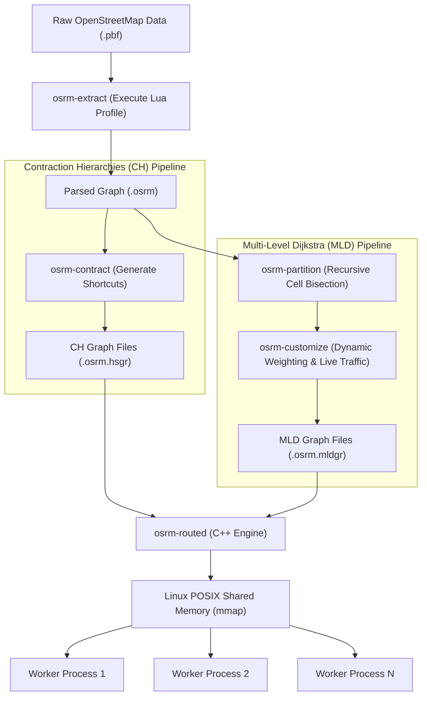
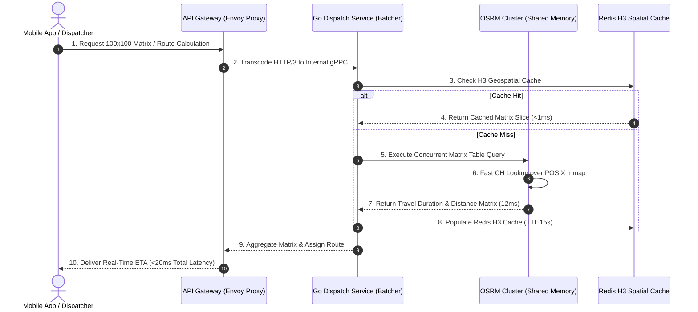

# OSRM vs GraphHopper: Routing Engine Benchmarks & RAM

> **Answer-first:** Comparing OSRM and GraphHopper shows OSRM excelling in raw speed (<2ms single queries, <20ms 100x100 matrix) via C++ Contraction Hierarchies and Linux POSIX shared memory (`mmap`), while GraphHopper provides flexible Java-based runtime Custom Models, turn restrictions, and multi-profile vehicle fleets. For static ride-hailing matrices, choose OSRM; for heterogeneous delivery fleets with weight/height limits, choose GraphHopper.

> **Prerequisite:** Solid understanding of graph algorithms (Dijkstra, A*), Linux virtual memory management (`mmap`, POSIX shared memory), OpenStreetMap (OSM) protocol buffers (.pbf), and Go 1.25 concurrent network programming.

## Introduction: When Do You Outgrow Cloud Route APIs?

Building early-stage logistics applications with cloud routing APIs provides immediate reliability, accurate ETAs, and zero infrastructure maintenance. However, when daily traffic exceeds 100,000 requests or requires massive distance matrices for vehicle route optimization, proprietary API costs explode while rigid routing profiles prevent injecting custom fleet constraints. 

Not only are they prohibitively expensive at scale, but these proprietary APIs also lack the flexibility required to inject custom routing rules. For instance, if your logistics fleet consists of 5-ton trucks that cannot enter certain city districts between 6 AM and 8 AM, or if you need to strictly penalize left turns at specific intersections to optimize fuel consumption, standard APIs fall short. They offer generic profiles for 'driving' or 'bicycling', but they do not allow you to define the exact physics and legal constraints of your unique vehicles.

This is the tipping point where software architects must consider self-hosting an OpenStreetMap (OSM) based routing engine on their own infrastructure. The two most formidable open-source contenders in this arena today are **OSRM** (Open Source Routing Machine) and **GraphHopper**. Both are extremely powerful, but they are built on fundamentally different philosophies regarding speed, memory management, and runtime flexibility. *(Note: If you are dealing with noisy GPS coordinates in dense cities, you should also read our deep dive on [architecting Map Matching systems for GPS Urban Canyon noise](/posts/urban-canyon-gps-multipath-map-matching-architecture/)).*

## OSRM: The C++ Titan of Speed and Memory Optimization

Written entirely in C++, OSRM is renowned in the geospatial industry for its blistering, sub-millisecond response times. It achieves this by shifting the computational heavy lifting to an offline pre-processing phase, resulting in a highly optimized graph structure that can be queried instantly.



### Contraction Hierarchies (CH): The Speed Demon

OSRM's primary claim to fame is its implementation of the **Contraction Hierarchies (CH)** algorithm. 

The core concept of CH revolves around 'node ordering' and 'shortcut creation'. During the offline pre-processing phase (`osrm-contract`), the algorithm ranks all intersections (nodes) in the map based on their importance. It then "contracts" the less important nodes one by one. When a node is contracted, the algorithm adds a direct "shortcut" edge between its neighbors if the shortest path between them went through the contracted node. 

As a result, a routing query from Point A to Point B no longer needs to traverse every small street node. Instead, it quickly jumps onto the "shortcuts" (which usually correspond to major highways), drastically pruning the search space. This yields astonishing query speeds, often under 1 millisecond even for transcontinental routes. 

However, CH has a massive drawback: **extreme rigidity**. Any change to the road network—such as modifying edge weights due to a live traffic jam or a sudden road closure—requires recalculating the entire hierarchy. This offline compilation can take hours for a planet-sized map, making CH unsuitable for real-time traffic updates.

### Multi-Level Dijkstra (MLD): Balancing Speed and Updates

To mitigate the extreme rigidity of CH, OSRM introduced **Multi-Level Dijkstra (MLD)**, also known as Customizable Route Planning (CRP).

MLD relies on hierarchical graph partitioning. It divides the global graph into nested cells (e.g., cell level 1 might be a neighborhood, level 2 a city, level 3 a state). During the pre-processing phase (`osrm-partition` and `osrm-customize`), MLD calculates the optimal travel times between all boundary nodes of each cell. 

Because of this encapsulation, if a traffic jam occurs deep inside a specific cell, you only need to recalculate the metrics for that single cell and its parents, rather than the entire planet. This drops the update time from hours to mere seconds, allowing OSRM to support live traffic updates (see our guide on [OSRM Shared Memory on Kubernetes for Live Traffic](/posts/osrm-shared-memory-kubernetes-live-traffic/)).

### OSRM's Memory-Mapped Files (mmap) & POSIX Shared Memory

Another architectural brilliance of OSRM is its memory management. Instead of loading massive graphs (which can be tens of gigabytes) entirely into heap memory, OSRM utilizes the `mmap` syscall and POSIX shared memory (`shm_open`) to map binary graph datasets directly into virtual memory address spaces.

In production deployments, you load the road network into shared memory using `osrm-datastore`. When running multiple `osrm-routed` worker processes on the same Linux host or Kubernetes Node to handle concurrent traffic, the operating system kernel shares the identical physical RAM pages across all worker processes.

```text
Host Physical RAM (40 GB Node)
┌─────────────────────────────────────────────────────────────┐
│  OSRM Shared Memory Region (/dev/shm)                       │
│  - Nodes Index (.osrm.names, .osrm.ramindex)                │
│  - Edge Weights & Contraction Shortcuts (.osrm.hsgr)        │
└──────────────┬───────────────────────────────┬──────────────┘
               ▲                               ▲
               │ (Zero-Copy Read)              │ (Zero-Copy Read)
┌──────────────┴──────────────┐ ┌──────────────┴──────────────┐
│ Worker Process 1 (PID 101) │ │ Worker Process 2 (PID 102)  │
│ Virtual Heap: 80 MB        │ │ Virtual Heap: 80 MB         │
└─────────────────────────────┘ └─────────────────────────────┘
```

This drastically reduces the physical RAM footprint. A 40 GB continental road network is loaded into RAM once, allowing 16 worker pods to run with a collective footprint of ~42 GB instead of 640 GB.

### The Achilles' Heel: Rigid Lua Profiles

OSRM defines routing logic—such as max speeds, road penalties, and access restrictions—via Lua scripts (e.g., `car.lua`, `bicycle.lua`). If you want to alter a rule, you must edit the Lua file and rerun the entire extraction and compilation pipeline. This offline rigidity makes dynamic, per-request routing logic incredibly cumbersome.

## GraphHopper: The Java Soul with Infinite Runtime Flexibility

GraphHopper trades minor raw query latency for unmatched runtime routing flexibility. Dynamic Custom Models and off-heap memory management enable logistics platforms to execute complex per-request vehicle restrictions and weight penalties.

### Custom Models and Dynamic Weighting

GraphHopper's crown jewel is its **Custom Models** feature. By passing a JSON payload directly inside your HTTP API request, you can dynamically alter route priorities on the fly.

For example, you can send a request that says: "Multiply the speed on all roads with `surface=gravel` by 0.5, and add a strict penalty for any road tagged as a `residential` zone." Unlike OSRM's static Lua compilation, GraphHopper evaluates these Custom Models at runtime. This makes it the undisputed champion for logistics companies managing diverse fleets (vans, heavy trucks, motorbikes) where each delivery request might have entirely different vehicle constraints.

### Landmarks Algorithm (LM / ALT)

To balance query speed with flexibility, GraphHopper heavily leverages the ALT (A*, Landmarks, Triangle Inequality) algorithm, commonly referred to as the **Landmarks (LM)** algorithm.

During preparation, GraphHopper selects a set of "Landmark" nodes spread across the map and pre-computes the distances from all nodes to these landmarks. When executing an A* search from Point A to Point B, it utilizes the triangle inequality theorem combined with the landmark distances to calculate a highly accurate heuristic. 

This heuristic severely prunes the A* search space. Crucially, the LM algorithm tolerates dynamic edge weight adjustments (like those from Custom Models) at runtime without requiring a full graph reprocessing, provided the new weights don't drop below the base distances.

### Optimizing JVM Heap & Off-heap Memory (RAMDirectory)

Being a Java application, GraphHopper must deal with the JVM's Garbage Collection (GC). A massive routing graph living inside the JVM heap would cause catastrophic Stop-The-World (STW) GC pauses.

GraphHopper elegantly tackles this using `RAMDirectory` backed by Java's `DirectByteBuffer`. This allocates the massive graph memory **Off-heap**, completely bypassing the Garbage Collector. The JVM only manages the small, short-lived objects created during the actual query execution. While GraphHopper consumes more RAM than OSRM's shared memory model, this off-heap strategy keeps latencies stable. [Check out our guide on tuning JVM RAM for GraphHopper on Kubernetes](/posts/graphhopper-kubernetes-self-hosting-osm/).

## Performance Benchmarks & Operational Costs

| Architectural Criteria | OSRM (C++) | GraphHopper (Java) |
|------------------------|------------|--------------------|
| **Raw Query Speed (A-B)** | Unbeatable (0.5 - 2ms) via CH | Fast (10-40ms) with LM / Custom Models |
| **Throughput (RPS/core)** | ~800 - 1000 RPS per core | ~200 - 400 RPS per core |
| **Memory Footprint**| Extremely low due to OS-level `mmap` | High, requires careful JVM Off-heap tuning |
| **Routing Logic Changes** | Requires offline Lua recompilation (rigid) | Extremely High (JSON Custom Models per request) |
| **Large Distance Matrix** | Outstanding (sub-second for 500x500 matrices) | [Needs specific tuning to avoid OOM crashes](/posts/graphhopper-distance-matrix-production-guide/) |
| **Startup Time** | Fast with `mmap` or Shared Memory | Slower due to JVM warmup and index loading |

## Decision Matrix: Which Engine Should You Choose?

### You should definitely choose OSRM when:
- You are building a core **Ride-hailing application** (like Uber or Grab clones) where the routing rules for cars and motorcycles are largely static.
- You demand the absolute minimum latency (< 2ms) to ensure your mobile apps feel instantaneously responsive.
- You rely heavily on generating massive Distance Matrices (e.g., 1000x1000) every few seconds to feed into an external driver-dispatching or ETA-matching algorithm.
- You want to maximize your infrastructure ROI by running many worker processes on a single node sharing the same `mmap` memory.

### You should definitely choose GraphHopper when:
- You are architecting a complex **3PL (Third-Party Logistics) or Last-Mile Delivery** platform.
- You need to serve a highly diverse fleet (e.g., small vans, 10-ton trucks, refrigerated vehicles), each requiring unique road restrictions, height limits, and weight limits.
- You require the immense flexibility to inject dynamic priority weights per individual delivery request using Custom Models without recompiling the graph.
- Your developers are primarily familiar with the Java ecosystem and prefer an engine that is easier to extend programmatically through Java APIs rather than C++.

Both engines represent the pinnacle of open-source geospatial engineering. For practical integration into order fulfillment workflows, check out our guide on [distance matrix routing for order allocation](/series/ecommerce-order-allocation/part-7-distance-matrix-routing/) and our comprehensive [GraphHopper Distance Matrix production guide](/posts/graphhopper-distance-matrix-production-guide/) covering Docker deployments, memory sizing, and Redis H3 spatial caching. Evaluate your requirements against their architectural trade-offs to make the right call for your infrastructure.

## Real-Time Fleet Dispatching & Distance Matrix Architecture

In modern on-demand ride-hailing and last-mile logistics platforms, calculating distance and duration matrices accounts for over 80% of backend routing query volume. The sequence diagram below demonstrates how high-throughput Go dispatch microservices batch incoming delivery requests, query local OSRM clusters over POSIX shared memory, and cache matrix slices inside Redis H3 geospatial indexes:



## Production Go 1.25 Routing Engine Client with Fallbacks

When building production microservices that interface with both OSRM and GraphHopper, backend engineers should implement a dual-engine client. In the Go 1.25 implementation below, the router automatically executes fast OSRM queries for standard passenger cars, while falling back to GraphHopper whenever specialized constraints (such as heavy vehicle axle weights, toll avoidance, or unpaved road penalties) are requested:

```go
//go:build go1.25
// Package routing provides a high-throughput routing client supporting both OSRM and GraphHopper.
package routing

import (
	"bytes"
	"context"
	"encoding/json"
	"fmt"
	"net"
	"net/http"
	"time"
)

type Coordinate struct {
	Longitude float64 `json:"lon"`
	Latitude  float64 `json:"lat"`
}

type VehicleConstraint struct {
	MaxWeightTons float64 `json:"max_weight_tons"`
	IsMotorcycle  bool    `json:"is_motorcycle"`
	AvoidTolls    bool    `json:"avoid_tolls"`
	AvoidUnpaved  bool    `json:"avoid_unpaved"`
}

type RouteResult struct {
	DistanceMeters float64       `json:"distance_meters"`
	Duration       time.Duration `json:"duration"`
	Polyline       string        `json:"polyline"`
	EngineSource   string        `json:"engine_source"`
}

type RouterClient struct {
	osrmBaseURL        string
	graphhopperBaseURL string
	httpClient         *http.Client
}

func NewRouterClient(osrmURL, ghURL string) *RouterClient {
	transport := &http.Transport{
		DialContext: (&net.Dialer{
			Timeout:   500 * time.Millisecond,
			KeepAlive: 30 * time.Second,
		}).DialContext,
		MaxIdleConns:        200,
		MaxIdleConnsPerHost: 50,
		IdleConnTimeout:     90 * time.Second,
	}

	return &RouterClient{
		osrmBaseURL:        osrmURL,
		graphhopperBaseURL: ghURL,
		httpClient: &http.Client{
			Transport: transport,
			Timeout:   2 * time.Second,
		},
	}
}

func (c *RouterClient) RouteWithFallback(ctx context.Context, origin, dest Coordinate, vc VehicleConstraint) (*RouteResult, error) {
	if vc.MaxWeightTons > 0 || vc.AvoidTolls || vc.AvoidUnpaved {
		res, err := c.routeGraphHopper(ctx, origin, dest, vc)
		if err == nil {
			return res, nil
		}
	}
	return c.routeOSRM(ctx, origin, dest)
}

func (c *RouterClient) routeOSRM(ctx context.Context, origin, dest Coordinate) (*RouteResult, error) {
	url := fmt.Sprintf("%s/route/v1/driving/%f,%f;%f,%f?overview=full&geometries=polyline",
		c.osrmBaseURL, origin.Longitude, origin.Latitude, dest.Longitude, dest.Latitude)

	req, err := http.NewRequestWithContext(ctx, http.MethodGet, url, nil)
	if err != nil {
		return nil, fmt.Errorf("failed to create OSRM request: %w", err)
	}

	resp, err := c.httpClient.Do(req)
	if err != nil {
		return nil, fmt.Errorf("osrm connection failure: %w", err)
	}
	defer resp.Body.Close()

	if resp.StatusCode != http.StatusOK {
		return nil, fmt.Errorf("osrm returned status %d", resp.StatusCode)
	}

	var data struct {
		Code   string `json:"code"`
		Routes []struct {
			Distance float64 `json:"distance"`
			Duration float64 `json:"duration"`
			Geometry string  `json:"geometry"`
		} `json:"routes"`
	}

	if err := json.NewDecoder(resp.Body).Decode(&data); err != nil {
		return nil, fmt.Errorf("failed to decode osrm json: %w", err)
	}
	if len(data.Routes) == 0 {
		return nil, fmt.Errorf("no route found by osrm")
	}

	return &RouteResult{
		DistanceMeters: data.Routes[0].Distance,
		Duration:       time.Duration(data.Routes[0].Duration * float64(time.Second)),
		Polyline:       data.Routes[0].Geometry,
		EngineSource:   "OSRM-CH",
	}, nil
}

func (c *RouterClient) routeGraphHopper(ctx context.Context, origin, dest Coordinate, vc VehicleConstraint) (*RouteResult, error) {
	url := fmt.Sprintf("%s/route", c.graphhopperBaseURL)
	profile := "car"
	if vc.IsMotorcycle {
		profile = "motorcycle"
	}

	payload := map[string]interface{}{
		"points": [][]float64{
			{origin.Longitude, origin.Latitude},
			{dest.Longitude, dest.Latitude},
		},
		"profile":        profile,
		"elevation":      false,
		"points_encoded": true,
	}

	if vc.MaxWeightTons > 0 {
		payload["custom_model"] = map[string]interface{}{
			"priority": []map[string]interface{}{
				{
					"if":           fmt.Sprintf("maxweight < %.1f", vc.MaxWeightTons),
					"multiply_by": 0.0,
				},
			},
		}
	}

	bodyBytes, err := json.Marshal(payload)
	if err != nil {
		return nil, err
	}

	req, err := http.NewRequestWithContext(ctx, http.MethodPost, url, bytes.NewReader(bodyBytes))
	if err != nil {
		return nil, err
	}
	req.Header.Set("Content-Type", "application/json")

	resp, err := c.httpClient.Do(req)
	if err != nil {
		return nil, err
	}
	defer resp.Body.Close()

	if resp.StatusCode != http.StatusOK {
		return nil, fmt.Errorf("graphhopper returned status %d", resp.StatusCode)
	}

	var ghResp struct {
		Paths []struct {
			Distance float64 `json:"distance"`
			Time     float64 `json:"time"`
			Points   string  `json:"points"`
		} `json:"paths"`
	}

	if err := json.NewDecoder(resp.Body).Decode(&ghResp); err != nil {
		return nil, err
	}
	if len(ghResp.Paths) == 0 {
		return nil, fmt.Errorf("no path returned by graphhopper")
	}

	return &RouteResult{
		DistanceMeters: ghResp.Paths[0].Distance,
		Duration:       time.Duration(ghResp.Paths[0].Time * float64(time.Millisecond)),
		Polyline:       ghResp.Paths[0].Points,
		EngineSource:   "GraphHopper-CustomModel",
	}, nil
}
```

## Kubernetes Deployment Architecture: POSIX Shared Memory DaemonSet

Deploying OSRM on Kubernetes requires mounting an `emptyDir` volume backed by `Memory` into `/dev/shm`. This configuration enables multiple `osrm-routed` worker pods co-located on the same physical Kubernetes worker node to access the pre-loaded graph index without duplicating RAM:

```yaml
apiVersion: apps/v1
kind: Deployment
metadata:
  name: osrm-car-worker
  namespace: routing-infrastructure
  labels:
    app.kubernetes.io/name: osrm-routed
    app.kubernetes.io/component: routing-engine
spec:
  replicas: 4
  selector:
    matchLabels:
      app: osrm-routed
  template:
    metadata:
      labels:
        app: osrm-routed
    spec:
      volumes:
        - name: dshm
          emptyDir:
            medium: Memory
            sizeLimit: 45Gi
      containers:
        - name: osrm-engine
          image: ghcr.io/project-osrm/osrm-backend:v5.27.1
          imagePullPolicy: IfNotPresent
          command:
            - "osrm-routed"
            - "--algorithm=ch"
            - "--shared-memory=yes"
            - "--max-table-size=1000"
          ports:
            - containerPort: 5000
              name: http-routing
          volumeMounts:
            - mountPath: /dev/shm
              name: dshm
          resources:
            requests:
              cpu: "2000m"
              memory: "512Mi"
            limits:
              cpu: "8000m"
              memory: "2Gi"
          readinessProbe:
            httpGet:
              path: /route/v1/driving/106.660172,10.762622;106.680172,10.772622?overview=false
              port: 5000
            initialDelaySeconds: 5
            periodSeconds: 10
```

## SME Field Notes: Urban Routing Realities in Ho Chi Minh City

Running last-mile delivery fleets or ride-hailing services in high-density urban environments like **Ho Chi Minh City (HCMC)** exposes the physical limits of naive routing models. Straight-line distance approximations fail across geographical barriers like river crossings. The ASCII diagram below illustrates the spatial topology and bridge bottleneck constraints separating district clusters across the Saigon River:

```
                  [ Binh Thanh District ]
                            ||
                     (Saigon Bridge)
                            ||
       =================== Saigon River ===================
                            ||
                     (Thu Thiem Bridge)
                            ||
                    [ Thu Duc City ]
```

### The Saigon River Barrier
Saigon River divides the central districts (District 1, Binh Thanh, District 4) from the rapidly developing eastern urban area (Thu Duc City / old District 2). 
* A customer standing in Binh Thanh is geographically less than 800 meters from a driver located in Thu Duc City. 
* However, because they are separated by the river, the driver must travel several kilometers to cross either the **Saigon Bridge** or the **Thu Thiem Bridge**. 
* Any VRP solver that uses straight-line distance will constantly assign Thu Duc drivers to Binh Thanh orders, leading to massive delivery delays and frustrated drivers. Running a real-time routing Matrix query is mandatory to capture the true topological constraint.

### Two-Wheel (Motorcycle) vs. Four-Wheel (Truck/Car) Routing
In Vietnam, two-wheel vehicles handle over 90% of last-mile deliveries. Their routing profiles are radically different from cars:
* **One-Way Streets**: Central HCMC (District 1 and District 3) is packed with narrow, one-way roads. Motorcycles can bypass many traffic jams by navigating specific alleyway systems (hems) where cars cannot fit.
* **Turn Restrictions**: Many major intersections prohibit cars from turning left during peak hours (e.g., 06:00 - 09:00 and 16:00 - 19:00) to prevent gridlock. Motorcycles, however, are exempt from these restrictions. Custom profiles must reflect these conditional rules to prevent routing errors.
* **Alleyway (Hem) Routing**: HCMC's housing structure is dominated by deep, labyrinthine alley networks. In many cases, these alleys are narrower than 1.5 meters. The routing engine must exclude these paths when executing truck profiles, but include them for motorcycle couriers.

---

## Frequently Asked Questions


Choose OSRM when you need sub-millisecond query latencies (<2ms), massive static distance matrix calculations (such as 1000x1000 matrices for driver dispatching), and single-vehicle profiles (like ride-hailing cars). OSRM uses shared memory (`mmap`) across worker processes to minimize RAM footprint.



GraphHopper leverages Customizable Contraction Hierarchies (CCH) and Landmark (LM) algorithms paired with Custom Models. This allows developers to dynamically inject runtime weight, height, turn, and time-based penalties per request without executing multi-hour graph pre-processing steps.



By loading the contracted binary graph into shared memory using POSIX `shm_open` or file memory mapping (`mmap`), multiple independent `osrm-routed` worker processes on the same Kubernetes worker node query the exact same physical RAM pages. A 40 GB continental road network is loaded into RAM once, allowing 16 worker pods to run with a collective footprint of ~42 GB instead of 640 GB.



Instead of Contraction Hierarchies (CH), deploy OSRM using Multi-Level Dijkstra (MLD). MLD partitions the graph into hierarchical cells and updates edge weights via `osrm-customize` in seconds rather than hours. This enables continuous live traffic ingestion pipelines without restarting routing worker pods.


---

## Related Guides & Topic Cluster

- **Anchor Pillar:** [OSRM vs GraphHopper Architecture Comparison](/posts/osrm-vs-graphhopper-architecture-comparison/) — canonical benchmark and architectural guide.
- **Go Microservices:** [Go Microservices Architecture: Production Engineering Guide](/posts/go-microservices/) — scalable RPC patterns and bounded worker pools.
- **System Architecture:** [System Architecture Reading Map](/reading-map/) — comprehensive blueprint across high-scale distributed systems.
- **Security Guide:** [Zero-Trust Service Mesh Security with SPIFFE/SPIRE & Istio in Go](/posts/zero-trust-service-mesh-security-spiffe-spire-istio-golang/) — securing inter-service routing traffic.
- **E-Commerce Architecture:** [Architecting 21-Service E-commerce with Golang & DDD](/posts/architecting-21-service-ecommerce-golang-ddd/) — order fulfillment and dispatch orchestration.
- **Distance Matrix for Order Allocation:** See how matrix calculations power VRP solvers in [Distance Matrix Routing for Order Allocation](/series/ecommerce-order-allocation/part-7-distance-matrix-routing/).
- **Distance Matrix Production Setup:** Learn how to deploy and cache distance calculations in our [GraphHopper Distance Matrix production guide](/posts/graphhopper-distance-matrix-production-guide/).
- **Fleet Optimization Solver:** See how matrix calculations feed a Go routing solver in [CVRP & VRPTW Fleet Optimization: Go ALNS Routing Engine](/posts/cvrp-vrptw-alns-fleet-optimization-golang-architecture/).
- **Geospatial Series Hub:** Explore the full 8-part masterclass in [Geospatial & Routing Engine Architecture](/series/routing-geospatial-architecture/).
- **Live Traffic with OSRM:** Scale live traffic updates with zero downtime in [OSRM Shared Memory on Kubernetes for Live Traffic](/posts/osrm-shared-memory-kubernetes-live-traffic/).

