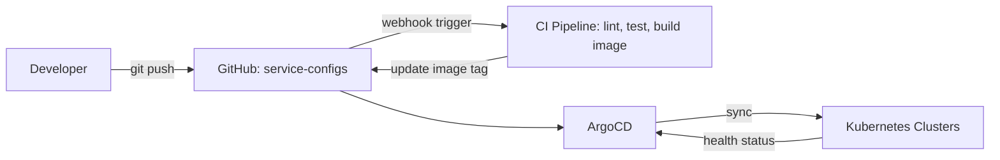
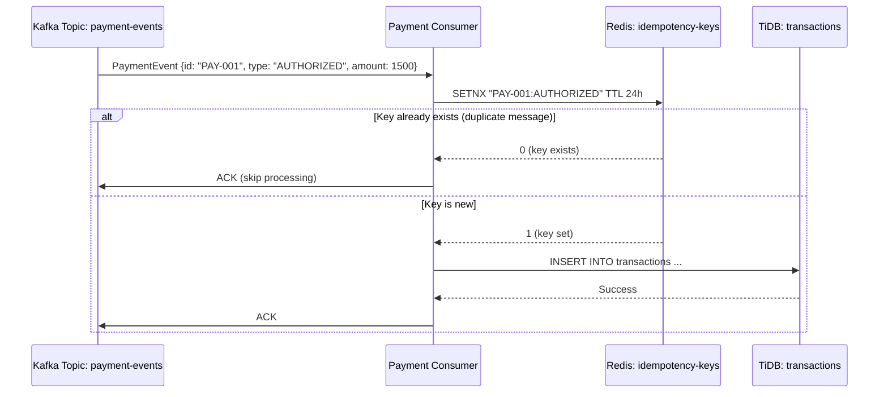

---
title: "PayPay Architecture: Scaling Payments to 70M Users"
cover:
  image: "/images/posts/default-post.png"
  alt: "Paypay Architecture Scaling"
slug: "paypay-architecture-scaling"
author: "Lê Tuấn Anh"
date: "2026-06-01T10:00:00+07:00"
lastmod: "2026-06-01T10:00:00+07:00"
draft: false
mermaid: true
categories:
  - "Engineering"
  - "Architecture"
  - "Payments"
tags:
  - "PayPay"
  - "TiDB"
  - "Kafka"
  - "Kubernetes"
  - "GitOps"
  - "Chaos Engineering"
  - "Fintech"
description: "An in-depth look at PayPay's engineering stack: handling 70M users and 7.8B transactions/year using TiDB, Kafka event sourcing, GitOps, and chaos engineering."
ShowToc: true
TocOpen: true
cover:
  image: "/images/posts/paypay-scaling-cover.png"
  alt: "PayPay architecture and scaling: distributed payment system engineering in Japan"
  relative: false
---

**Answer-first:** PayPay handles 7.8B annual transactions using a cloud-native architecture centered on TiDB for distributed ACID transactions, Kafka for event streaming, and Kotlin/Go microservices. GitOps-driven deployments and continuous chaos engineering ensure high availability and disaster recovery.

### What You'll Learn That AI Won't Tell You
- Running chaos engineering scripts in TiDB payment systems.
- How event sourcing with Kafka isolates PayPay checkout routes from legacy bank outages.

PayPay launched in October 2018 and grew to 10 million users in just 3 months — a growth rate that no Japanese fintech had ever seen. By 2025, the platform had crossed 70 million registered users and processed 7.8 billion payments per year. Behind this growth is an engineering team that has had to scale not just their infrastructure, but their entire engineering culture: from service standardization and GitOps-driven deployments to chaos engineering and AI-powered fraud detection.

This post is an engineering analysis of PayPay's platform based on their publicly shared engineering blog posts and conference talks. It covers their Kubernetes-first microservices architecture, Kafka-driven event sourcing, TiDB's role in replacing the relational ledger bottleneck, their SRE practices, and how they prepare for high-concurrency marketing campaigns like the famous "10 Billion Yen Giveaway."

For the complete technical series on PayPay's architecture, see the [Full PayPay Architecture Series](/series/paypay-architecture/).

---

## PayPay's Hyper-Growth: The Challenge of 70 Million Users and 7.8B Transactions/Year

PayPay's growth trajectory is unusual even by fintech standards. Most payment platforms grow incrementally, with engineering teams having years to adjust infrastructure as user counts climb. PayPay's engineers had months.

The "10 Billion Yen Giveaway" campaign in December 2018 — a marketing event where PayPay offered up to ¥1,000 cashback per transaction — brought the platform 1 million new users in a single day and caused the first major infrastructure stress test. The system experienced significant degradation. That incident became the forcing function for a complete architectural rethink.

The decisions made in 2019–2020 — containerization on Kubernetes, event sourcing with Kafka, TiDB for the ledger, and investment in SRE practices — are the reason PayPay could handle 7.8 billion transactions in 2024 without comparable incidents.

### The Scale Numbers

| Metric | 2019 (Post-launch) | 2025 |
|---|---|---|
| Registered users | 5 million | 70+ million |
| Annual transactions | ~200 million | 7.8 billion |
| Daily peak TPS | ~1,000 | ~100,000+ |
| Kubernetes clusters | 2 | 20+ |
| Microservices | ~30 | 200+ |

---

## Microservices on Kubernetes: Standardization and GitOps Deployment Flows

PayPay's platform is a collection of 200+ microservices deployed across multiple Kubernetes clusters. The core challenge they solved is the same one every large microservices organization faces: **how do you maintain consistency and reliability across hundreds of services developed by dozens of teams?**

### Service Standardization

PayPay enforces a set of mandatory standards for every microservice:

- **Language**: Primarily Kotlin (JVM) and Go for new services
- **Observability**: Every service must expose structured JSON logs with a `trace_id`, Prometheus metrics on `/metrics`, and a health endpoint on `/health`
- **Resource management**: CPU and memory requests/limits are mandatory — no service can be deployed without resource specifications
- **Circuit breakers**: All inter-service HTTP and gRPC calls must be wrapped with Resilience4j (JVM) or the Go `circuitbreaker` package circuit breakers

Teams that do not meet these standards cannot deploy to production. The gating is enforced via CI/CD — the deployment pipeline fails if a service does not expose the required endpoints or if the Kubernetes manifests lack resource specifications.

### GitOps with ArgoCD

PayPay adopted GitOps for infrastructure and application deployment management. Every Kubernetes resource — deployments, ConfigMaps, Secrets (encrypted with SealedSecrets), NetworkPolicies — is version-controlled in Git. ArgoCD continuously reconciles the live cluster state with the Git-declared desired state.

The GitOps model provides PayPay with:
- **Audit trail**: Every deployment is a Git commit — reviewable, revertable, attributable
- **Drift detection**: ArgoCD alerts if a manual `kubectl apply` changes the cluster state without a corresponding Git commit
- **Multi-cluster promotion**: The same manifests promote from `dev` → `staging` → `production` via branch merges and automated environment variable substitution

For a deep dive on this GitOps pattern, see [GitOps at Scale: Kubernetes & ArgoCD for Microservices](/posts/gitops-at-scale-kubernetes-argocd-microservices/).

---

## Event-Driven Messaging: Kafka for Idempotent Financial Processing

PayPay's transaction processing pipeline is built on Apache Kafka. Every payment event — initiated, authorized, captured, settled, reversed — flows through Kafka topics before being processed by downstream consumers.

### The Idempotency Problem in Financial Kafka Consumers

In Kafka, consumer group rebalancing and broker leader elections can cause a message to be delivered more than once. For most applications, this is acceptable. For financial payment events, it is catastrophic — a duplicated "payment authorized" event could credit a user's account twice.

PayPay solves this with an **idempotency key pattern** at the consumer level:

The `SETNX` (Set if Not Exists) Redis operation is atomic — exactly one consumer wins the race in the event of concurrent delivery to multiple replicas. The TTL is set to 24 hours (beyond the maximum message retention period), ensuring the idempotency key outlives any possible duplicate delivery window.

### Kafka Topic Design for Payment Events

PayPay partitions payment topics by `user_id` (or a hash of it). This ensures all events for a single user are processed in order by a single consumer instance — critical for state machine transitions (a refund must not be processed before the original payment is settled).

Key topics in the payment pipeline:
- `payment-initiated`: User has confirmed a payment
- `payment-authorized`: Issuing bank/card network has authorized the charge
- `payment-captured`: Funds have been captured (T+1 or T+0 for direct debit)
- `payment-settled`: Net settlement to merchant has completed
- `payment-reversed`: Refund or chargeback has been processed

This event sourcing model provides a complete audit trail: the current state of any transaction can be reconstructed by replaying its events from the beginning. This is a hard regulatory requirement for licensed payment service providers in Japan.

For a similar event-driven architecture implemented using Dapr Pub/Sub in a Go stack, see [Mastering Event-Driven Architecture with Dapr](/posts/mastering-event-driven-architecture-dapr).

---

## Database Scaling: How TiDB Solved the Relational Ledger Bottleneck

The payment transaction ledger is the most performance-critical database in any fintech platform. It must support:
- **High write throughput**: Every payment generates 2–6 ledger entries (debit, credit, fee, tax, etc.)
- **Strong consistency**: A ledger debit without a corresponding credit is a financial error
- **ACID transactions**: Multi-row updates must be atomic
- **Historical queries**: Regulatory requirements mandate querying millions of historical records

PayPay initially used MySQL. By 2020, the MySQL cluster was approaching write saturation during peak events. Vertical scaling was reaching physical limits, and horizontal MySQL sharding would break cross-shard transactions.

### Why TiDB

PayPay chose TiDB (NewSQL, Raft-based) as the replacement for their payment ledger. TiDB provides:

**Horizontal scalability with ACID**: Unlike MySQL sharding (which breaks cross-shard transactions), TiDB uses distributed transactions with Percolator-style two-phase commit. A single SQL transaction can span data across multiple TiKV storage nodes.

**MySQL compatibility**: TiDB speaks the MySQL protocol. PayPay's Kotlin services continued using their existing JDBC drivers and ORM (MyBatis) without changes — the migration was transparent to the application layer.

**HTAP via TiFlash**: TiFlash is TiDB's columnar storage engine for analytical queries. PayPay uses TiFlash for real-time fraud scoring (comparing current payment velocity to historical baseline) without impacting the OLTP write path.

**Raft-based replication**: TiKV replicates data across 3 replicas using Raft consensus. A write is acknowledged only when 2 of 3 replicas confirm receipt — providing durability guarantees equivalent to a synchronous multi-master MySQL setup, but at horizontal scale.

### The Migration Strategy

PayPay migrated from MySQL to TiDB using a dual-write strategy:
1. Write all new transactions to both MySQL and TiDB simultaneously
2. Run reconciliation queries to verify consistency between the two systems
3. Switch read traffic to TiDB (read replicas first, then primary reads)
4. After 30 days of consistent reconciliation, stop MySQL writes and decommission

The dual-write phase lasted 6 weeks. During this phase, the application code added a `WriteTiDB` flag that could be toggled via a feature flag without deployment — a kill switch in case TiDB showed unexpected behavior.

For a deeper comparison of TiDB, MySQL sharding, and OceanBase in the payment context, see [MySQL Database Scaling: Sharding and TiDB Architecture](/posts/mysql-scaling-sharding-tidb-architecture). For the complementary view from Alipay's similar architectural journey, see [Alipay Double 11: 583,000 TPS Architecture Explained](/posts/alipay-double-11-architecture-tps/).

---

## SRE and Chaos Engineering: Simulating Infrastructure Failures Safely

PayPay's SRE team runs a formal chaos engineering program modeled on Netflix's Chaos Monkey approach but scoped to their Kubernetes environment.

### Failure Injection Scenarios

PayPay uses Litmus Chaos (a CNCF-graduated chaos engineering tool for Kubernetes) to inject failures:

- **Pod Kill**: Randomly terminate pods to verify that Kubernetes restarts them within SLA and that the service degrades gracefully (returning errors, not crashing entirely)
- **Network Latency**: Add 500ms–2000ms latency to traffic between specific service pairs to verify timeout handling and circuit breaker activation
- **Node Drain**: Evict all pods from a worker node to simulate a hardware failure — verifying that PodDisruptionBudgets are configured correctly and that critical services maintain availability
- **Kafka Broker Failure**: Kill a Kafka broker to verify that producers handle leader election delays gracefully without losing messages

### The GameDay Model

Rather than running chaos experiments continuously (which can interfere with production traffic), PayPay runs quarterly "GameDay" events: scheduled 2-hour windows where the SRE and on-call teams deliberately inject failures and verify that detection and response procedures work as designed.

The GameDay format:
1. **Announce**: All stakeholders are notified 48 hours in advance
2. **Inject**: SRE injects a pre-defined failure scenario
3. **Observe**: Monitoring teams verify that alerts fire within SLA
4. **Respond**: On-call engineers execute runbooks without guidance from the SRE team
5. **Retrospect**: Identify gaps in monitoring coverage, runbook clarity, or system resilience

Each GameDay generates improvement items that feed into the next sprint's engineering work. This structured approach is how PayPay progressively hardened their platform across 20+ quarterly GameDays since 2020.

---

## High-Concurrency Campaigns: Preparing PayPay for "10 Billion Yen Giveaways"

PayPay's marketing campaigns — particularly the legendary "10 Billion Yen Giveaways" — are engineering challenges of the same class as Alipay's Double 11. The core problem: millions of users simultaneously attempt to use PayPay during a campaign announcement, creating traffic spikes that dwarf the normal daily load.

### Pre-Campaign Engineering Protocol

Before each major campaign, PayPay runs a structured preparation protocol:

**1. Traffic forecast modeling**: The marketing team provides expected user participation numbers. The engineering team converts this to a TPS model using historical conversion rates (announcement → app open → payment).

**2. Capacity testing**: Load tests at 150% of forecast peak are run against a production-identical staging environment. Any service that saturates below the 150% threshold is scaled up.

**3. Graceful degradation testing**: Non-critical features (loyalty point displays, historical transaction search) are tested with artificially induced latency. Degraded mode (hiding non-critical UI) is confirmed to work correctly.

**4. Rate limit adjustment**: Per-user and per-IP rate limits are tuned for campaign traffic patterns — campaign users are expected to attempt payments faster than normal users.

**5. Rollback preparation**: A rollback plan is documented and tested. If the campaign feature itself causes unexpected issues, it can be disabled via feature flag within 60 seconds.

### The Cache-Aside Campaign Counter

Campaign cashback offers (e.g., "first 1 million users get 10% cashback") require an atomic global counter. PayPay implements this using the same Redis DECR pattern described in [Shopee Flash Sale Architecture: Rate Limiting & Redis](/posts/shopee-flash-sale-architecture/):

1. Pre-populate a Redis counter with the campaign quota (e.g., `SET campaign:10B_giveaway:quota 1000000`)
2. For each eligible payment, atomically decrement: `DECR campaign:10B_giveaway:quota`
3. If the result is >= 0, the user qualifies for cashback; if < 0, the campaign has ended
4. Asynchronously persist the eligibility result to TiDB for the settlement process

---

## AI and PayPay's Next-Generation Routing and Fraud Systems

PayPay processes each payment through a real-time fraud detection pipeline. As the transaction volume has grown to 7.8 billion/year, rule-based fraud detection alone cannot scale — the false positive rate on manual rules grows as legitimate user behavior diversifies.

### ML-Based Fraud Detection

PayPay's fraud detection system uses a gradient boosting model (XGBoost) deployed as a low-latency inference service. The model evaluates each payment in under 10ms, considering:

- **Velocity features**: How many payments has this user made in the last 1 hour, 6 hours, 24 hours?
- **Amount anomaly**: Is this amount significantly larger than the user's historical transactions?
- **Device fingerprint**: Is the device new? Was the fingerprint recently associated with another account?
- **Merchant category**: Is this merchant category consistent with the user's historical preferences?
- **Network features**: Is the user's IP in a known VPN or proxy range?

The model outputs a fraud probability score. Transactions above a threshold (tuned to minimize false positives at each risk band) are rejected or routed to a manual review queue.

### Feature Store Architecture

Real-time feature computation (velocity counts, amount statistics) is handled by a Kafka Streams application that maintains rolling window aggregations in Redis. The XGBoost inference service reads from this feature store at sub-millisecond latency.

This pattern — Kafka Streams for real-time feature aggregation, Redis for low-latency feature serving, and a batch-trained model for inference — is the standard architecture for production ML-powered fraud detection in fintech.

---

## Frequently Asked Questions

### What database does PayPay use for transaction ledger?
PayPay migrated from MySQL to TiDB (v5.x → v7.x) for their payment transaction ledger. TiDB provides horizontal scalability with ACID distributed transactions (via Percolator two-phase commit), MySQL protocol compatibility (no application-layer changes required), and HTAP capabilities via TiFlash for real-time analytical queries alongside the OLTP write path.

### How does PayPay guarantee transaction idempotency with Kafka?
PayPay uses Redis `SETNX` (Set if Not Exists) with a 24-hour TTL as an idempotency key store. Each Kafka message has a unique event ID. Before processing, the consumer atomically tries to set the event ID in Redis. If the key already exists (a duplicate delivery), the consumer acknowledges the message without processing it. If the key is new, processing proceeds. This guarantees exactly-once processing semantics at the consumer level, regardless of Kafka's at-least-once delivery guarantee.

### How does PayPay scale during high-concurrency marketing campaigns?
PayPay runs a structured pre-campaign protocol: traffic forecast modeling, capacity testing at 150% of peak forecast, graceful degradation testing, rate limit tuning, and rollback preparation. Campaign eligibility tracking uses Redis atomic DECR counters (pre-populated with the quota) to eliminate database contention for the campaign counter. TiDB's horizontal scaling handles the surge in transaction writes. The combination of pre-scaling, rate limiting, and atomic counter patterns allows PayPay to sustain millions of concurrent payment attempts during campaign events.

For a different scale of fintech engineering — how microfinance institutions apply similar double-entry ledger, JLG loan engine, and batch processing patterns at community banking level — see [Microfinance Core Banking System: Architecture & Engineering Guide](/posts/deconstructing-microfinance-core-banking-architecture/). For the full architectural framework behind modern Core Banking systems from ISO standards to Microservices deployment, see the [Core Banking Architecture series](/series/core-banking-architecture/) and the [Learning Path to Core Banking Developer](/series/core-banking-developer/).


