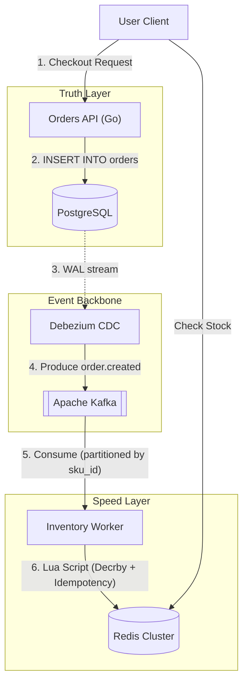

Handling e-commerce inventory during a flash sale—where thousands of users attempt to purchase a highly contested SKU simultaneously—is a pinnacle architectural challenge. Traditional synchronous database updates collapse under lock contention.

To guarantee accuracy without sacrificing sub-millisecond response times, modern 2026 architectures adopt the **Speed & Truth Model** using PostgreSQL, Apache Kafka, and Redis.

## The Dual-Write Dilemma and Lock Contention

**Answer-first:** Attempting to simultaneously write inventory updates to a fast cache (Redis) and a relational database (PostgreSQL) creates the dual-write problem. If one system fails, data diverges. Furthermore, synchronous `SELECT FOR UPDATE` queries in SQL cause massive lock queues and API timeouts.

When thousands of concurrent requests attempt to decrement stock for the exact same database row, row-level locks force sequential processing. This completely overwhelms connection pools.

> **Migration Context:** Many legacy monolithic e-commerce platforms struggle with this exact issue. Learn how event-driven decoupling solves this in our guide on [Magento AI Integration Strategy & Architecture](/posts/magento-ai-integration-strategy-architecture/).

## The Speed & Truth Architecture Pattern

**Answer-first:** The Speed & Truth pattern decouples reads and writes. PostgreSQL serves as the absolute "Truth" layer. Debezium streams database changes (CDC) into Apache Kafka, acting as the durable event backbone. Redis acts as the "Speed" layer for sub-millisecond inventory reads and atomic deductions.



This architecture entirely eliminates synchronous application dual-writes. The application writes strictly to the database (or emits to Kafka), and infrastructure asynchronously propagates the state.

### 1. PostgreSQL WAL and Debezium CDC

Change Data Capture (CDC) directly reads the database logs. In PostgreSQL, `wal_level` must be configured to `logical`.

By connecting Debezium (using the native `pgoutput` plugin), every committed transaction in the `orders` table is instantaneously streamed as an `order.created` event into Kafka.

### 2. Kafka Partitioning by SKU ID

**Answer-first:** To eliminate multi-node consumer race conditions, partition the `order.created` Kafka topic by `sku_id`. This guarantees all orders for a specific item route to the same partition, processed sequentially by a single Go consumer goroutine.

If orders for a single SKU are scattered randomly across partitions, multiple consumers will attempt to decrement the Redis stock concurrently. SKU-based partitioning converts concurrent chaos into an orderly, single-threaded queue.

> **Performance Tip:** Profiling the memory consumption of high-throughput Kafka consumers in Go requires specialized tooling. Read our [Go pprof Tutorial](/posts/golang-pprof-profiling-memory-cpu-tutorial/) for memory profiling techniques.

## Idempotent Inventory Deductions in Redis Cluster

**Answer-first:** Redis Lua scripts guarantee atomic execution for stock checks and deductions. However, because Kafka provides at-least-once delivery, the Lua script must enforce idempotency by checking a unique transaction token before decrementing stock.

If a Kafka consumer group rebalances, a partition might be reassigned before offsets are committed, causing duplicate events.

### The Cluster Cross-Slot Constraint (Hash Tags)

A critical rule in Redis Cluster is that multi-key Lua scripts fail if the keys resolve to different hash slots (throwing a `CROSSSLOT` error).

By wrapping the SKU identifier in **Hash Tags `{}`**—for example, `stock:{SKU-101}` and `idempotent:{SKU-101}:order-123`—Redis is forced to hash both keys to the exact same cluster node.

```lua
-- KEYS[1]: Stock Key (e.g., "stock:{SKU-101}")
-- KEYS[2]: Idempotency Key (e.g., "idempotent:{SKU-101}:order-123")
-- ARGV[1]: Quantity to Decrement
-- ARGV[2]: Token TTL in seconds (e.g., 86400)

if redis.call("EXISTS", KEYS[2]) == 1 then
    return {err = "ALREADY_PROCESSED"}
end

local stock = tonumber(redis.call("GET", KEYS[1]) or "0")
local qty = tonumber(ARGV[1])

if stock < qty then
    return {err = "INSUFFICIENT_STOCK"}
end

redis.call("DECRBY", KEYS[1], qty)
redis.call("SET", KEYS[2], "1", "EX", ARGV[2])

return stock - qty
```

### Idempotency Token Eviction

Avoid growing infinite Redis sets. By saving the `idempotent` key with a TTL (`EX 86400` for 24 hours), the keys automatically expire after the risk of Kafka duplication passes, conserving volatile memory.

## State Drift and Disaster Recovery

**Answer-first:** Network partitions or Redis node crashes can cause the Speed layer to drift from the Truth layer. Implement an asynchronous reconciliation cron job that recalculates absolute stock from PostgreSQL and atomically synchronizes the Redis cache.

If Redis completely fails and restarts empty, a bootstrap script reads the initial ledger quantities from Postgres minus pending orders, reconstructing the real-time cache before traffic resumes.

## FAQ


The Transactional Outbox pattern is excellent and easier to implement, but it adds application-level overhead as developers must explicitly write to an `outbox` table within the same transaction. Debezium CDC is zero-code at the application layer and reads database log buffers directly, offering superior performance at scale.



A single viral product (Hot SKU) will route all traffic to a single Redis slot. To mitigate this, partition the hot SKU stock inside Redis across multiple replica slots artificially (e.g., `stock:{SKU-101}_1`, `stock:{SKU-101}_2`), or apply application-level rate limiting before the request reaches Redis.



Implement a Dead Letter Queue (DLQ). If an inventory event fails validation, route the message to an `inventory.dlq` topic and commit the offset. Do not allow the consumer to block or crash loop, as this halts all inventory processing for that partition.

