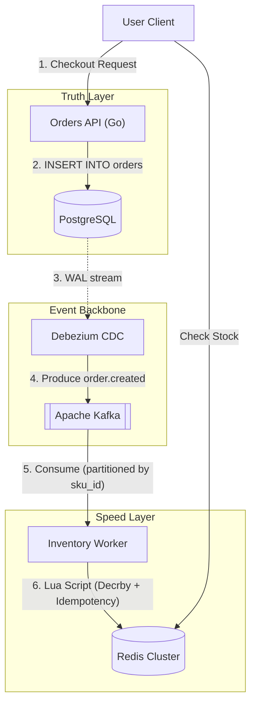

**Answer-first:** Attempting to simultaneously write inventory updates to a fast cache (Redis) and a relational database (PostgreSQL) creates the dual-write problem. If one system fails, data diverges. Furthermore, synchronous `SELECT FOR UPDATE` queries in SQL cause massive lock queues and API timeouts.

### What You'll Learn That AI Won't Tell You
- Write-through caches configuration in Redis to prevent inventory drift.
- Lua scripting implementations in Redis that prevent double-reservations under peak load.


## What Is Real-Time Inventory Synchronization?

**Real-time inventory synchronization** is the process of propagating stock count changes from the system of record (database) to all sales channels — web storefront, mobile app, WMS, ERP — in sub-second time. Instead of batch ETL jobs that run every hour, a CDC + Kafka pipeline streams every committed stock change as an event, eliminating overselling and stale stock displays.

Handling this during a flash sale — where thousands of users attempt to purchase a highly contested SKU simultaneously — is a pinnacle architectural challenge. Traditional synchronous database updates collapse under lock contention.

To guarantee accuracy without sacrificing sub-millisecond response times, modern 2026 architectures adopt the **Speed & Truth Model** using PostgreSQL, Apache Kafka, and Redis.

## The Dual-Write Dilemma and Lock Contention


When thousands of concurrent requests attempt to decrement stock for the exact same database row, row-level locks force sequential processing. This completely overwhelms connection pools.

> **Migration Context:** Many legacy monolithic e-commerce platforms struggle with this exact issue. Learn how event-driven decoupling solves this in our guide on [Magento AI Integration Strategy & Architecture](/posts/magento-ai-integration-strategy-architecture/).

## The Speed & Truth Architecture Pattern




This architecture entirely eliminates synchronous application dual-writes. The application writes strictly to the database (or emits to Kafka), and infrastructure asynchronously propagates the state.

### 1. PostgreSQL WAL and Debezium CDC

Change Data Capture (CDC) directly reads the database logs. In PostgreSQL, `wal_level` must be configured to `logical`.

By connecting Debezium (using the native `pgoutput` plugin), every committed transaction in the `orders` table is instantaneously streamed as an `order.created` event into Kafka.

### 2. Kafka Partitioning by SKU ID

If orders for a single SKU are scattered randomly across partitions, multiple consumers will attempt to decrement the Redis stock concurrently. SKU-based partitioning converts concurrent chaos into an orderly, single-threaded queue.

### Concurrency, Race Conditions, and Local Locking

When a high-traffic sale occurs, thousands of orders for the same hot SKU are generated in seconds. If the consumer group processes these events concurrently using multiple goroutines, a classic race condition emerges: two goroutines read the same initial stock count, calculate deductions, and write back incorrect values, causing stock drift.

To prevent race conditions while maintaining high throughput, we must combine Kafka partition partitioning with localized concurrency control:
1. **Partition Level Order**: Kafka routes all messages with the same partition key (the SKU ID) to the same partition. This ensures that only one consumer instance in the cluster processes events for that SKU.
2. **Worker Pool Locking**: If a consumer processes messages in parallel using a goroutine worker pool, it must synchronize access to the SKU. We can manage this using a sharded mutex map (`sync.Map`) keying locks by SKU. Before processing, a goroutine acquires the lock for that SKU, processes the database update, and then releases it.

---

## Production Go Kafka Consumer Group Implementation

Below is the complete Go code block implementing a manual offset-managed Kafka consumer group reader. It demonstrates local sharded locking by SKU and explicit offset commit management to guarantee at-least-once delivery.

```go
package inventory

import (
	"context"
	"encoding/json"
	"fmt"
	"log"
	"sync"
	"time"

	"github.com/segmentio/kafka-go"
)

// InventoryUpdateEvent represents the schema emitted by the database CDC stream
type InventoryUpdateEvent struct {
	OrderID      string    `json:"order_id"`
	SKU          string    `json:"sku"`
	QuantityDelta int       `json:"quantity_delta"` // negative for inventory decrement
	EventTime    time.Time `json:"event_time"`
}

// SKUKeyedLockManager provides sharded mutex locking to prevent concurrent goroutines
// from racing on the same SKU during batch processing.
type SKUKeyedLockManager struct {
	locks sync.Map
}

func (m *SKUKeyedLockManager) GetLock(sku string) *sync.Mutex {
	actual, _ := m.locks.LoadOrStore(sku, &sync.Mutex{})
	return actual.(*sync.Mutex)
}

type ConsumerGroupHandler struct {
	reader  *kafka.Reader
	lockMgr *SKUKeyedLockManager
}

func NewConsumerGroupHandler(brokers []string, topic, groupID string) *ConsumerGroupHandler {
	r := kafka.NewReader(kafka.ReaderConfig{
		Brokers:          brokers,
		GroupID:          groupID,
		Topic:            topic,
		MinBytes:         10e3, // 10KB
		MaxBytes:         10e6, // 10MB
		CommitInterval:   0,    // Set to 0 to disable background auto-commit of offsets
		StartOffset:      kafka.LastOffset,
		RebalanceTimeout: 10 * time.Second,
	})

	return &ConsumerGroupHandler{
		reader:  r,
		lockMgr: &SKUKeyedLockManager{},
	}
}

// Run starts the read loop. It blocks until the context is cancelled.
func (h *ConsumerGroupHandler) Run(ctx context.Context) {
	log.Println("Starting Go Kafka Consumer Group Handler...")
	defer h.reader.Close()

	for {
		// 1. FetchMessage blocks until a message is available and retrieves partition/offset data
		msg, err := h.reader.FetchMessage(ctx)
		if err != nil {
			if ctx.Err() != nil {
				return // Context cancelled, exit cleanly
			}
			log.Printf("Error fetching message: %v", err)
			time.Sleep(1 * time.Second)
			continue
		}

		// 2. Hand off message to worker goroutine for concurrent processing
		go func(m kafka.Message) {
			var event InventoryUpdateEvent
			if err := json.Unmarshal(m.Value, &event); err != nil {
				log.Printf("Invalid payload encoding, skipping offset commit: %v", err)
				// We commit the offset of corrupted payloads to prevent head-of-line blocking
				_ = h.reader.CommitMessages(ctx, m)
				return
			}

			// 3. Acquire local lock for the specific SKU to serialize concurrent reads/writes
			mu := h.lockMgr.GetLock(event.SKU)
			mu.Lock()
			defer mu.Unlock()

			// 4. Execute the inventory update in database and cache transactionally
			err := h.processInventoryUpdate(ctx, event)
			if err != nil {
				log.Printf("Failed to process inventory update for SKU %s, Order %s: %v", event.SKU, event.OrderID, err)
				// DO NOT commit the offset. The consumer will block, prompting manual SRE intervention
				// or forwarding to a Dead Letter Queue (DLQ) depending on policy.
				return
			}

			// 5. Commit offset manually once downstream databases have successfully saved state
			if err := h.reader.CommitMessages(ctx, m); err != nil {
				log.Printf("Failed to commit offset: %v (Partition: %d, Offset: %d)", err, m.Partition, m.Offset)
			}
		}(msg)
	}
}

func (h *ConsumerGroupHandler) processInventoryUpdate(ctx context.Context, event InventoryUpdateEvent) error {
	// In production, you would:
	// A. Query current database balance
	// B. Verify event.QuantityDelta doesn't violate business rules (overselling)
	// C. Execute transactional database write & Redis Lua update
	// D. Handle transient DB errors with retry policy
	
	// Simulated DB write:
	time.Sleep(20 * time.Millisecond)
	return nil
}
```

### Explaining Offset Management and Rebalancing Risks

Manual offset management is critical for guaranteeing **at-least-once** delivery semantics:

#### The Danger of Auto-Commit
When `CommitInterval` is left at its default (e.g. 5 seconds), the consumer client periodically commits the offset of the highest message read, without knowing if the processing logic succeeded. If the worker process crashes after reading message #100 but before successfully updating the Redis cache, that message is lost permanently. By setting the commit interval to `0` and using `CommitMessages` manually, we guarantee that the offset is only committed after the database transaction succeeds.

#### Handling Rebalances and Duplication
When a consumer instance joins or leaves the group, Kafka triggers a rebalance, reassigning partitions among active consumers. If consumer A fetches a message, updates the database, and crashes *before* committing the offset, the partition will be reassigned to consumer B. Consumer B will read the same message from the last committed offset and attempt to process it again.

To prevent this from causing double deductions, the downstream processing must be **idempotent**. This is where we combine:
- **Unique Idempotency Keys**: Checking for the existence of `idempotent:{SKU}:{OrderID}` in Redis.
- **Database Unique Constraints**: Storing processed Kafka offsets and message UUIDs in a `processed_messages` table within the same transaction that decrements stock. If the transaction attempts to run a second time, the unique key constraint on the message UUID will fail, causing a rollback and avoiding duplicate stock deductions.

> **Performance Tip:** Profiling the memory consumption of high-throughput Kafka consumers in Go requires specialized tooling. Read our [Go pprof Tutorial](/posts/golang-pprof-profiling-memory-cpu-tutorial/) for memory profiling techniques.

## Idempotent Inventory Deductions in Redis Cluster


If a Kafka consumer group rebalances, a partition might be reassigned before offsets are committed, causing duplicate events.

### The Cluster Cross-Slot Constraint (Hash Tags)

A critical rule in Redis Cluster is that multi-key Lua scripts fail if the keys resolve to different hash slots (throwing a `CROSSSLOT` error).

By wrapping the SKU identifier in **Hash Tags `{}`**—for example, `stock:{SKU-101}` and `idempotent:{SKU-101}:order-123`—Redis is forced to hash both keys to the exact same cluster node.

```lua
-- KEYS[1]: Stock Key (e.g., "stock:{SKU-101}")
-- KEYS[2]: Idempotency Key (e.g., "idempotent:{SKU-101}:order-123")
-- ARGV[1]: Quantity to Decrement
-- ARGV[2]: Token TTL in seconds (e.g., 86400)

if redis.call("EXISTS", KEYS[2]) == 1 then
    return {err = "ALREADY_PROCESSED"}
end

local stock = tonumber(redis.call("GET", KEYS[1]) or "0")
local qty = tonumber(ARGV[1])

if stock < qty then
    return {err = "INSUFFICIENT_STOCK"}
end

redis.call("DECRBY", KEYS[1], qty)
redis.call("SET", KEYS[2], "1", "EX", ARGV[2])

return stock - qty
```

### Idempotency Token Eviction

Avoid growing infinite Redis sets. By saving the `idempotent` key with a TTL (`EX 86400` for 24 hours), the keys automatically expire after the risk of Kafka duplication passes, conserving volatile memory.

## State Drift and Disaster Recovery


If Redis completely fails and restarts empty, a bootstrap script reads the initial ledger quantities from Postgres minus pending orders, reconstructing the real-time cache before traffic resumes.

## FAQ


Real-time inventory synchronization uses Change Data Capture (CDC) to read committed database transactions directly from the WAL (Write-Ahead Log) and stream them as events to a message broker like Apache Kafka. A downstream consumer (Go microservice) consumes these events and updates the read cache (Redis) atomically. This pipeline achieves sub-100ms propagation from database write to cache update without any polling or batch jobs.



Batch sync runs on a schedule (hourly, nightly) and reads the full inventory table or a delta snapshot. It introduces lag of minutes to hours — during which overselling can occur. Real-time synchronization using CDC streams each individual change as it is committed, reducing propagation lag to milliseconds and eliminating the overselling window during high-demand events like flash sales.



Overselling prevention requires two layers: (1) atomic stock deduction in Redis using Lua scripts that check and decrement in a single operation with an idempotency token to handle Kafka at-least-once delivery; (2) a final guard in PostgreSQL using optimistic locking or a `CHECK (stock >= 0)` constraint to reject any write that would push stock below zero. Redis provides the fast path; PostgreSQL provides the truth.



The Transactional Outbox pattern is excellent and easier to implement, but it adds application-level overhead as developers must explicitly write to an `outbox` table within the same transaction. Debezium CDC is zero-code at the application layer and reads database log buffers directly, offering superior performance at scale.



A single viral product (Hot SKU) will route all traffic to a single Redis slot. To mitigate this, partition the hot SKU stock inside Redis across multiple replica slots artificially (e.g., `stock:{SKU-101}_1`, `stock:{SKU-101}_2`), or apply application-level rate limiting before the request reaches Redis.



Implement a Dead Letter Queue (DLQ). If an inventory event fails validation, route the message to an `inventory.dlq` topic and commit the offset. Do not allow the consumer to block or crash loop, as this halts all inventory processing for that partition.


For the allocation layer built on top of real-time inventory sync — warehouse selection algorithms, split shipment logic, and Amazon CONDOR-style anticipatory inventory — see [Part 2: Real-Time Inventory Allocation Architecture](/posts/order-fulfillment-algorithm-warehouse-last-mile/). To see how this architecture powers our entire ecosystem, read the [Go Microservices Architecture: Production Guide](/posts/go-microservices/).
