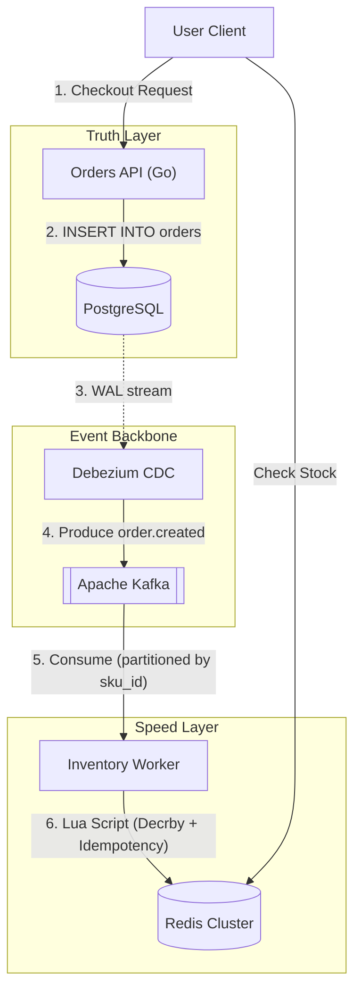

# Real-Time Inventory Topology: CDC, Kafka, and Redis

**Answer-first:** Real-time e-commerce inventory management uses Debezium CDC event streams, Kafka topic partitioning, and Redis memory caches to prevent stock over-selling during peak flash sales.

**Real-time inventory synchronization** is the process of propagating stock count changes from the system of record (database) to all sales channels — web storefront, mobile app, WMS, ERP — in sub-second time. Instead of batch ETL jobs that run every hour, a CDC + Kafka pipeline streams every committed stock change as an event, eliminating overselling and stale stock displays.

Handling this during a flash sale — where thousands of users attempt to purchase a highly contested SKU simultaneously — is a pinnacle architectural challenge. Traditional synchronous database updates collapse under lock contention.

To guarantee accuracy without sacrificing sub-millisecond response times, the recommended approach is the **Speed & Truth Model** using PostgreSQL, Apache Kafka, and Redis.

## The Dual-Write Dilemma and Lock Contention

Traditional e-commerce architectures that dual-write to both a relational database and an in-memory cache trigger split-brain states and inventory drift during flash sales. High-concurrency checkout spikes cause network partitions, worker crashes, and intense row-level lock contention, forcing transactions into sequential queues that degrade tail latency.

Furthermore, when thousands of concurrent API requests attempt to update the exact same database row (`UPDATE inventory SET quantity = quantity - 1 WHERE sku_id = X`), row-level exclusive locks force requests into a tight sequential queue. This lock contention escalates database CPU utilization, exhausts backend connection pools, and drives tail latency (p99) into several seconds, leading to cascade failures across the payment and checkout services.

> **Migration Context:** Many legacy monolithic e-commerce platforms struggle with this exact issue. Learn how event-driven decoupling solves this in our guide on [Magento AI Integration Strategy & Architecture](/posts/magento-ai-integration-strategy-architecture/).

## The Speed & Truth Architecture Pattern

The Speed & Truth pattern decouples high-speed stock reservations from the persistent database ledger. PostgreSQL serves as the system of record, Debezium CDC streams changes to Kafka, and atomic Redis Cluster caches handle sub-millisecond stock checks with zero overselling.


```mermaid
flowchart TD
    Client["User Client"]
    
    subgraph TruthLayer ["Truth Layer"]
        API["Orders API (Go)"]
        PG[("PostgreSQL")]
    end
    
    subgraph EventBackbone ["Event Backbone"]
        CDC["Debezium CDC"]
        Kafka[["Apache Kafka"]]
    end
    
    subgraph SpeedLayer ["Speed Layer"]
        Worker["Inventory Worker"]
        Redis[("Redis Cluster")]
    end
    
    Client -->|"1. Checkout Request"| API
    API -->|"2. INSERT INTO orders"| PG
    PG -.->|"3. WAL stream"| CDC
    CDC -->|"4. Produce order.created"| Kafka
    Kafka -->|"5. Consume (partitioned by sku_id)"| Worker
    Worker -->|"6. Lua Script (Decrby + Idempotency)"| Redis
    Client -->|"Check Stock"| Redis
```

This architecture entirely eliminates synchronous application dual-writes. The application writes strictly to the database (or emits to Kafka), and infrastructure asynchronously propagates the state.

### 1. PostgreSQL WAL and Debezium CDC

Change Data Capture (CDC) directly reads the database logs. In PostgreSQL, `wal_level` must be configured to `logical`.

By connecting Debezium (using the native `pgoutput` plugin), every committed transaction in the `orders` table is instantaneously streamed as an `order.created` event into Kafka.

### 2. Kafka Partitioning by SKU ID

If orders for a single SKU are scattered randomly across partitions, multiple consumers will attempt to decrement the Redis stock concurrently. SKU-based partitioning converts concurrent chaos into an orderly, single-threaded queue.

### Concurrency, Race Conditions, and Local Locking

When a high-traffic sale occurs, thousands of orders for the same hot SKU are generated in seconds. If the consumer group processes these events concurrently using multiple goroutines, a classic race condition emerges: two goroutines read the same initial stock count, calculate deductions, and write back incorrect values, causing stock drift.

To prevent race conditions while maintaining high throughput, we must combine Kafka partition partitioning with localized concurrency control:
1. **Partition Level Order**: Kafka routes all messages with the same partition key (the SKU ID) to the same partition. This ensures that only one consumer instance in the cluster processes events for that SKU.
2. **Worker Pool Locking**: If a consumer processes messages in parallel using a goroutine worker pool, it must synchronize access to the SKU. We can manage this using a sharded mutex map (`sync.Map`) keying locks by SKU. Before processing, a goroutine acquires the lock for that SKU, processes the database update, and then releases it.

---

## Production Go Kafka Consumer Group Implementation

High-throughput inventory consumers in Go combine Kafka consumer group management with SKU-sharded mutex locks. Key concerns: manual offset commits, idempotency verification, and clean partition rebalance handling.

```go
package inventory

import (
	"context"
	"encoding/json"
	"fmt"
	"log"
	"sync"
	"time"

	"github.com/segmentio/kafka-go"
)

// InventoryUpdateEvent represents the schema emitted by the database CDC stream
type InventoryUpdateEvent struct {
	OrderID      string    `json:"order_id"`
	SKU          string    `json:"sku"`
	QuantityDelta int       `json:"quantity_delta"` // negative for inventory decrement
	EventTime    time.Time `json:"event_time"`
}

// SKUKeyedLockManager provides sharded mutex locking to prevent concurrent goroutines
// from racing on the same SKU during batch processing.
type SKUKeyedLockManager struct {
	locks sync.Map
}

func (m *SKUKeyedLockManager) GetLock(sku string) *sync.Mutex {
	actual, _ := m.locks.LoadOrStore(sku, &sync.Mutex{})
	return actual.(*sync.Mutex)
}

type ConsumerGroupHandler struct {
	reader  *kafka.Reader
	lockMgr *SKUKeyedLockManager
}

func NewConsumerGroupHandler(brokers []string, topic, groupID string) *ConsumerGroupHandler {
	r := kafka.NewReader(kafka.ReaderConfig{
		Brokers:          brokers,
		GroupID:          groupID,
		Topic:            topic,
		MinBytes:         10e3, // 10KB
		MaxBytes:         10e6, // 10MB
		CommitInterval:   0,    // Set to 0 to disable background auto-commit of offsets
		StartOffset:      kafka.LastOffset,
		RebalanceTimeout: 10 * time.Second,
	})

	return &ConsumerGroupHandler{
		reader:  r,
		lockMgr: &SKUKeyedLockManager{},
	}
}

// Run starts the read loop. It blocks until the context is cancelled.
func (h *ConsumerGroupHandler) Run(ctx context.Context) {
	log.Println("Starting Go Kafka Consumer Group Handler...")
	defer h.reader.Close()

	for {
		// 1. FetchMessage blocks until a message is available and retrieves partition/offset data
		msg, err := h.reader.FetchMessage(ctx)
		if err != nil {
			if ctx.Err() != nil {
				return // Context cancelled, exit cleanly
			}
			log.Printf("Error fetching message: %v", err)
			time.Sleep(1 * time.Second)
			continue
		}

		// 2. Hand off message to worker goroutine for concurrent processing
		go func(m kafka.Message) {
			var event InventoryUpdateEvent
			if err := json.Unmarshal(m.Value, &event); err != nil {
				log.Printf("Invalid payload encoding, skipping offset commit: %v", err)
				// We commit the offset of corrupted payloads to prevent head-of-line blocking
				_ = h.reader.CommitMessages(ctx, m)
				return
			}

			// 3. Acquire local lock for the specific SKU to serialize concurrent reads/writes
			mu := h.lockMgr.GetLock(event.SKU)
			mu.Lock()
			defer mu.Unlock()

			// 4. Execute the inventory update in database and cache transactionally
			err := h.processInventoryUpdate(ctx, event)
			if err != nil {
				log.Printf("Failed to process inventory update for SKU %s, Order %s: %v", event.SKU, event.OrderID, err)
				// DO NOT commit the offset. The consumer will block, prompting manual SRE intervention
				// or forwarding to a Dead Letter Queue (DLQ) depending on policy.
				return
			}

			// 5. Commit offset manually once downstream databases have successfully saved state
			if err := h.reader.CommitMessages(ctx, m); err != nil {
				log.Printf("Failed to commit offset: %v (Partition: %d, Offset: %d)", err, m.Partition, m.Offset)
			}
		}(msg)
	}
}

func (h *ConsumerGroupHandler) processInventoryUpdate(ctx context.Context, event InventoryUpdateEvent) error {
	// In production, you would:
	// A. Query current database balance
	// B. Verify event.QuantityDelta doesn't violate business rules (overselling)
	// C. Execute transactional database write & Redis Lua update
	// D. Handle transient DB errors with retry policy
	
	// Simulated DB write:
	time.Sleep(20 * time.Millisecond)
	return nil
}
```

### Explaining Offset Management and Rebalancing Risks

Manual offset management is critical for guaranteeing **at-least-once** delivery semantics:

#### The Danger of Auto-Commit
When `CommitInterval` is left at its default (e.g. 5 seconds), the consumer client periodically commits the offset of the highest message read, without knowing if the processing logic succeeded. If the worker process crashes after reading message #100 but before successfully updating the Redis cache, that message is lost permanently. By setting the commit interval to `0` and using `CommitMessages` manually, we guarantee that the offset is only committed after the database transaction succeeds.

#### Handling Rebalances and Duplication
When a consumer instance joins or leaves the group, Kafka triggers a rebalance, reassigning partitions among active consumers. If consumer A fetches a message, updates the database, and crashes *before* committing the offset, the partition will be reassigned to consumer B. Consumer B will read the same message from the last committed offset and attempt to process it again.

To prevent this from causing double deductions, the downstream processing must be **idempotent**. This is where we combine:
- **Unique Idempotency Keys**: Checking for the existence of `idempotent:{SKU}:{OrderID}` in Redis.
- **Database Unique Constraints**: Storing processed Kafka offsets and message UUIDs in a `processed_messages` table within the same transaction that decrements stock. If the transaction attempts to run a second time, the unique key constraint on the message UUID will fail, causing a rollback and avoiding duplicate stock deductions.

> **Performance Tip:** Profiling the memory consumption of high-throughput Kafka consumers in Go requires specialized tooling. Read our [Go pprof Tutorial](/posts/golang-pprof-profiling-memory-cpu-tutorial/) for memory profiling techniques.

## Idempotent Inventory Deductions in Redis Cluster

Real-time inventory deductions across distributed Redis Clusters require strict idempotency and atomic key management. When Kafka consumer groups trigger partition rebalances or duplicate redeliveries, Redis Lua scripts evaluate hash-tagged idempotency tokens and verify stock thresholds atomically, preventing double-reservations.

### The Cluster Cross-Slot Constraint (Hash Tags)

A critical rule in Redis Cluster is that multi-key Lua scripts fail if the keys resolve to different hash slots (throwing a `CROSSSLOT` error).

By wrapping the SKU identifier in **Hash Tags `{}`**—for example, `stock:{SKU-101}` and `idempotent:{SKU-101}:order-123`—Redis is forced to hash both keys to the exact same cluster node. This slot alignment allows single-node atomic execution of Lua scripts without triggering multi-node distributed transactions. The Lua script below performs atomic verification of idempotency keys, checks stock thresholds, and executes decrements in a single non-preemptible execution thread:

```lua
-- KEYS[1]: Stock Key (e.g., "stock:{SKU-101}")
-- KEYS[2]: Idempotency Key (e.g., "idempotent:{SKU-101}:order-123")
-- ARGV[1]: Quantity to Decrement
-- ARGV[2]: Token TTL in seconds (e.g., 86400)

if redis.call("EXISTS", KEYS[2]) == 1 then
    return {err = "ALREADY_PROCESSED"}
end

local stock = tonumber(redis.call("GET", KEYS[1]) or "0")
local qty = tonumber(ARGV[1])

if stock < qty then
    return {err = "INSUFFICIENT_STOCK"}
end

redis.call("DECRBY", KEYS[1], qty)
redis.call("SET", KEYS[2], "1", "EX", ARGV[2])

return stock - qty
```

### Idempotency Token Eviction

Avoid growing infinite Redis sets. By saving the `idempotent` key with a TTL (`EX 86400` for 24 hours), the keys automatically expire after the risk of Kafka duplication passes, conserving volatile memory.

## State Drift and Disaster Recovery

Maintaining absolute stock accuracy across asynchronous event streams and in-memory caches demands robust state reconciliation and disaster recovery mechanisms. Engineering teams must deploy automated background audit workers to detect inventory drift between Redis Cluster keys and PostgreSQL ledger tables, triggering in-place write-through cache patches and cold-start recovery pipelines without disrupting live 2026 checkout traffic.

If a Redis node crashes without persistent snapshots (AOF/RDB) or spins up empty following a cluster failover, a dedicated reconciliation worker executes a cold-start recovery pipeline. The worker queries the source of truth in PostgreSQL to calculate current available balances (`total_allocated_inventory - sum(unfulfilled_orders)`). Additionally, a background cron job runs periodic shadow audits comparing Redis keys against database ledger tables. Any drift exceeding a designated threshold automatically emits a telemetry alert and triggers an in-place write-through patch to synchronize Redis state without disrupting active checkout traffic.

## Frequently Asked Questions

Below are answers to fundamental engineering questions regarding real-time inventory synchronization, CDC architectures, Redis Lua idempotency scripts, and oversell prevention strategies.

### How do you synchronize inventory in real-time?

Real-time inventory synchronization uses Change Data Capture (CDC) to read committed database transactions directly from the WAL (Write-Ahead Log) and stream them as events to a message broker like Apache Kafka. A downstream consumer service processes these events and updates the Redis read cache atomically. This pipeline achieves sub-100ms propagation from database write to cache update without polling.

### What is the difference between batch inventory sync and real-time inventory synchronization?

Batch synchronization runs on a periodic schedule and reads full inventory tables or delta snapshots, introducing sync lag of minutes to hours where overselling can occur. In contrast, real-time synchronization streams each committed change instantaneously as a CDC event. This reduces propagation lag to milliseconds and eliminates overselling windows during high-concurrency sales.

### How do you prevent overselling with real-time inventory synchronization?

Overselling prevention requires a dual-layer approach. First, atomic stock deductions in Redis using Lua scripts verify thresholds and apply idempotency tokens to handle at-least-once Kafka delivery. Second, PostgreSQL enforces relational consistency through database-level constraints and optimistic concurrency checks.

### Why use Debezium CDC instead of the Transactional Outbox pattern?

While the Transactional Outbox pattern is easier to implement, it requires explicit application code writes to an outbox table within each database transaction. Debezium CDC operates at the infrastructure layer by reading PostgreSQL transaction logs directly without modifying application code, delivering higher throughput and reduced transaction latency.

For the allocation layer built on top of real-time inventory sync — warehouse selection algorithms, split shipment logic, and Amazon CONDOR-style anticipatory inventory — see [Part 2: Real-Time Inventory Allocation Architecture](/posts/order-fulfillment-algorithm-warehouse-last-mile/). To see how this architecture powers our entire ecosystem, read the [Go Microservices Architecture: Production Guide](/posts/go-microservices/).
