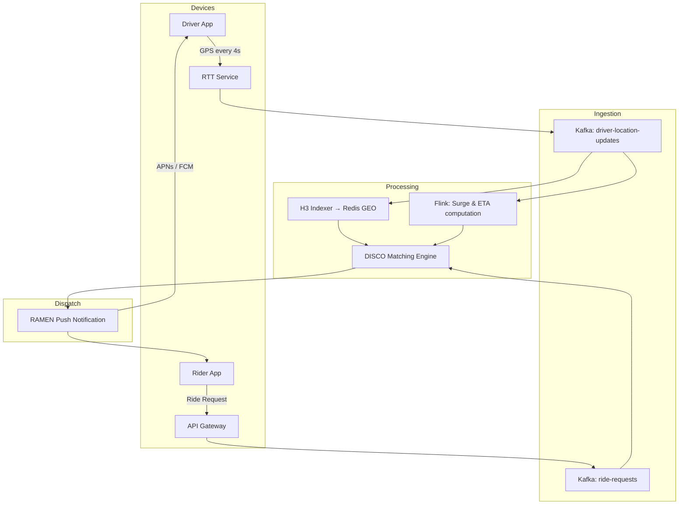

The moment you open the Uber or Grab app, a cascade of real-time systems activates simultaneously: your phone begins transmitting GPS coordinates, a geospatial index updates your location, a matching engine re-evaluates nearby driver availability, a pricing model recalculates the fare based on supply-demand ratios, and a push notification pipeline prepares to deliver your match confirmation in under 3 seconds.

What makes this hard is not any single component — it is the combination of all of them, processing millions of concurrent users, each with sub-second latency requirements, continuously. This post walks through all six layers of the real-time ride-hailing architecture stack, from GPS ingestion to driver notification, using Uber and Grab's engineering practices as the reference model.

For the complete deep-dive into each component, explore the [Full Ride-Hailing Architecture Series](/series/ride-hailing-realtime-architecture/).

---

## The Real-Time Challenge: What Happens in the First 3 Seconds After You Open the App

From a user's perspective, ride-hailing feels instant. From an engineering perspective, those 3 seconds involve:

1. **GPS position reported**: Your phone sends a location update to Uber/Grab's ingestion service. So do the phones of every active driver within 10 km.
2. **Geospatial index updated**: Your location and nearby driver locations are updated in an in-memory geospatial index.
3. **Matching engine evaluates**: The DISCO matching engine (Uber's internal matching algorithm) evaluates which available drivers are the best candidates for your ride based on proximity, direction of travel, and driver preference signals.
4. **Pricing computed**: The surge pricing model calculates the dynamic multiplier based on current supply (nearby available drivers) and demand (active riders requesting in the same hexagonal zone).
5. **Match dispatched**: A driver is selected and a dispatch message is sent.
6. **Push delivered**: The driver's phone receives a push notification via RAMEN (Uber's reliable notification system) or GrabAssign (Grab's equivalent).

Each of these steps must happen in under 500ms per cycle, and the cycle repeats every 4–8 seconds for every active session on the platform. At Uber's scale, this means processing on the order of **1–5 million GPS position updates per second** globally.

The architecture that makes this possible is layered: each layer has a specific responsibility and communicates with adjacent layers via high-throughput, low-latency mechanisms.

---

## Layer 1 — Location Ingestion: How Millions of GPS Pings Are Collected Per Second

Location data flows from devices via persistent TCP or WebSocket connections to Uber's **Real-Time Transport (RTT)** service cluster. This cluster's sole responsibility is to accept GPS payloads, validate them, and forward them to the event stream.

### Key Design Decisions in the Ingestion Layer

**Persistent connections over HTTP polling**: Every GPS update sent via a new HTTP connection adds 50–200ms of TCP handshake and TLS overhead. At millions of updates per second, this is unacceptable. Driver apps maintain persistent connections (WebSocket or HTTP/2 streaming) to regional RTT endpoints. This reduces per-update overhead to near-zero after the initial connection is established.

**Regional edge deployment**: RTT clusters are deployed in every major region where the service operates. A driver in Hanoi connects to the Southeast Asia RTT cluster, not to a US data center. This reduces round-trip latency and keeps the majority of traffic regional.

**Payload size discipline**: Each GPS payload is a small binary message: latitude, longitude, bearing, speed, accuracy, and timestamp. It is serialized with Protocol Buffers. A typical payload is under 100 bytes. At 5 million updates per second, this is 500 MB/s of inbound data — manageable only because the payloads are tiny.

**Buffering and batching**: The ingestion layer does not write every GPS update individually to the event stream. It batches updates in 100ms windows per device and emits a single event per window. This reduces write amplification to the event stream by 10× while remaining invisible to users (100ms is imperceptible in the context of a 4-second location update cycle).

---

## Layer 2 — Geospatial Indexing: Why Uber Uses Hexagons (H3), Not Circles or Squares

The core problem the geospatial index solves is: given a rider's location, find all available drivers within X distance **in under 10 milliseconds**.

A naive approach — "scan all driver locations and calculate Euclidean distance" — fails at scale. With 50,000 active drivers in a single city, this requires 50,000 distance calculations per query. At 100 queries per second per city, this is 5 million distance calculations per second — and that's just one city.

### How H3 Hexagonal Indexing Works

Uber's H3 library divides the entire Earth's surface into a hierarchical grid of hexagons at 16 resolution levels. At resolution 9 (the primary operational resolution), each hexagon covers approximately 0.1 km². Every GPS coordinate maps to exactly one hexagon ID using a fast mathematical transformation — no database lookup required.

```mermaid
graph TD
    GPS[Driver GPS: 10.7769° N, 106.7009° E] --> H3[H3 encode at resolution 9]
    H3 --> HEX[Hex ID: 89c9007e003ffff]
    HEX --> REDIS[(Redis: HSET drivers {hex_id} {driver_id: position})]
    
    RiderQuery[Rider at Hex: 89c9007e003ffff] --> KRING[H3 k-ring: Get 7 adjacent hexes]
    KRING --> LOOKUP[Redis HMGET: All driver keys in 7 hexes]
    LOOKUP --> FILTER[Filter: available, direction, ETA]
    FILTER --> MATCH[Top candidates → DISCO]
```

**Why hexagons over squares or circles?**
- **Uniform adjacency**: Each hexagon has exactly 6 neighbors, all equidistant from the center. A square grid has 8 neighbors, with 4 diagonal neighbors that are √2 farther away than the 4 orthogonal ones. This non-uniform adjacency creates edge cases in proximity calculations.
- **Hierarchical aggregation**: H3 hexagons at resolution N group cleanly into hexagons at resolution N-1. This makes it trivial to compute surge pricing zones (lower resolution = larger area), match driver clusters (medium resolution), and precise location indexing (high resolution) using the same spatial system.

For a deeper dive into H3, GeoHash, and S2 comparison in routing contexts, see [Part 2 — Geospatial Indexing: H3, S2 & Redis GEO](/series/ride-hailing-realtime-architecture/part-2-geospatial-indexing/).

### Redis as the Geospatial Store

Driver locations in each H3 hex are stored in Redis as hash maps (`HSET drivers:{hex_id} {driver_id} {serialized_position}`). A proximity query fetches driver hashes from the 7 hexes that form the K-ring (the target hex plus its 6 immediate neighbors), combines the results, and sorts by estimated time of arrival.

This query pattern retrieves driver data from a spatially bounded region in **O(k)** time where k is the number of drivers in the neighborhood — not O(n) where n is all drivers. At typical city densities, k is measured in hundreds, not thousands.

---

## Layer 3 — Event Streaming: The Apache Kafka & Flink Backbone

Between every layer of the real-time architecture, Apache Kafka serves as the durable, high-throughput event bus. Kafka's role in the ride-hailing stack is different from typical event streaming use cases — it is not primarily about durability or audit trails. It is about **decoupling the location ingestion rate from the matching engine processing rate**.

### Kafka Topic Design for Location Events

Location events are published to a `driver-location-updates` topic partitioned by `driver_id`. Using the driver ID as the partition key ensures all location updates for a single driver land on the same partition and are processed in order — critical for computing velocity and bearing correctly.

Consumer groups reading from this topic include:
- **H3 indexer**: Updates the Redis geospatial store
- **ETA computer**: Maintains a per-driver estimated arrival model
- **Surge calculator**: Aggregates supply density per H3 zone for pricing
- **ML feature pipeline**: Feeds driver behavior signals to fraud detection and matching quality models

### Apache Flink for Stateful Stream Processing

Kafka consumers for the ETA and surge pricing pipelines use Apache Flink for stateful windowed aggregation. For example, the surge pricing computation is a 5-minute sliding window aggregation:

- **Input**: GPS events from all drivers and ride request events from all riders
- **Aggregation**: Per H3 zone (resolution 7, ≈ 5 km² areas), count active drivers and active riders in each 5-minute window
- **Output**: Supply/demand ratio per zone → input to the surge pricing model

Flink's exactly-once processing semantics ensure that even in the event of a processing node failure, the surge pricing model does not double-count or miss location events. This correctness guarantee matters because incorrect surge pricing directly affects driver earnings and rider costs.

---

## Layer 4 — DISCO: The Matching Engine That Finds Your Driver in Milliseconds

DISCO (Dispatch System for Company Operations) is Uber's internal matching engine — the algorithm that decides which available driver to dispatch to which rider request.

### The Matching Problem

Matching is not simply "find the nearest driver." A pure proximity-based match would be optimal in a perfect world, but real-world matching must consider:
- **Driver direction of travel**: A driver heading away from a rider at high speed has a worse ETA than a slightly farther driver heading toward them.
- **Driver preference signals**: Drivers can set destination preferences (e.g., "I want rides heading to the airport"). DISCO weights matches that align with stated preferences.
- **Ride type compatibility**: A rider requesting UberX should not be matched to an Uber Black driver, even if they are the only available driver in proximity.
- **Expected acceptance rate**: DISCO's ML model predicts the probability a given driver will accept a given ride. A driver with a historically low acceptance rate in this zone is deprioritized.

### Batched Matching for Efficiency

Rather than matching one rider at a time (a greedy approach that produces locally optimal but globally suboptimal matches), DISCO batches rider requests in 500ms windows and solves the assignment as an **optimization problem**: maximize total system efficiency (minimize total ETA across all matches in the batch) subject to constraints (compatibility, preference, acceptance probability).

This is solved as a variant of the Assignment Problem (a classic combinatorial optimization) using algorithms adapted for real-time latency constraints — the solution must be computed in under 100ms for the batch window to remain transparent to users.

The result is that DISCO can produce matches that reduce total system-wide wait time by 10–15% compared to a greedy nearest-driver approach, at scale across millions of daily rides.

---

## Layer 5 — Surge Pricing: Supply-Demand Math in Real Time

Surge pricing is not a separate system — it is a continuous output of the Flink stream processing pipeline described in Layer 3. Every 30 seconds, the Flink job emits updated supply/demand ratios per H3 zone at resolution 7.

### The Surge Multiplier Model

The basic surge multiplier is a function of the supply/demand ratio in a zone:

```
ratio = active_drivers / active_rider_requests
multiplier = max(1.0, surge_curve(ratio))
```

The `surge_curve` function is a piecewise linear or sigmoid curve calibrated per city and time-of-day. When `ratio = 1.0` (drivers equal to riders), multiplier is approximately 1.0. When `ratio < 0.5` (2 riders for every available driver), multiplier rises to 1.5–2.0×.

The multiplier is applied at the fare estimation step — before the rider accepts the ride. Uber's design philosophy is to show riders the surge clearly at the point of decision, with the option to wait for surge to decrease.

This surge architecture is covered in depth in our standalone post on [Surge Pricing Algorithm & Spatial Indexing Architecture](/posts/surge-pricing-optimization-architecture).

---

## Layer 6 — RAMEN: Pushing Instant Notifications to Millions of Mobile Devices

After DISCO produces a match, the driver must be notified within seconds. This is the job of RAMEN (Real-time Application Message Exchange Network) — Uber's reliable push notification infrastructure.

### The Notification Delivery Challenge

Push notifications at Uber's scale face several engineering challenges:

**Platform fragmentation**: Drivers use iOS (APNs), Android (FCM), and Huawei (HMS) devices. RAMEN must maintain integration with all three notification platforms and handle their different retry semantics and delivery guarantees.

**Reliability under platform outages**: APNs and FCM experience periodic rate limiting or regional outages. If RAMEN sends a dispatch notification and the driver doesn't respond within 10 seconds, DISCO must trigger a rematch — but only if the notification was genuinely missed, not if the driver is simply reviewing the trip.

**Ordering guarantees**: If a driver receives three rapid dispatch notifications (because DISCO rematched twice), they must receive them in order. Receiving a newer dispatch, accepting it, then receiving the older dispatch could cause driver confusion.

RAMEN solves this with a **per-device ordered queue** in Redis. Each notification has a monotonically increasing sequence number. The driver app acknowledges notifications by sequence number. If the driver receives sequence 5 before sequence 4, they request a retransmit of sequence 4 before rendering either notification.

For the underlying event-driven infrastructure that supports notification routing, see [Mastering Event-Driven Architecture with Dapr](/posts/mastering-event-driven-architecture-dapr).

---

## The Full Architecture Stack: How All 6 Layers Connect



The six layers are loosely coupled through Kafka topics. Each layer can be scaled, upgraded, and failed independently. A Flink processing node failure does not affect DISCO's ability to match riders and drivers (it just runs on slightly stale surge pricing data until Flink recovers). A RAMEN outage does not affect matching — dispatches queue until RAMEN resumes. This loose coupling is what allows Uber to deploy updates to individual layers (new matching algorithm, new surge curve model) without system-wide maintenance windows.

---

## What Modern Engineers Can Learn from Ride-Hailing Architecture

**1. Geospatial queries need dedicated data structures.** H3 hexagonal indexing is not a clever trick — it is the only practical way to handle sub-10ms proximity queries at millions of events per second. If your system involves proximity queries (nearest store, nearest driver, nearest warehouse), invest in a proper spatial index before scaling.

**2. Separate the acceptance rate from the processing rate.** RAMEN queues dispatches; DISCO batches matches; Kafka decouples ingestion from processing. At every layer, production of work is separated from consumption of work. This is the pattern that allows each layer to operate at its own optimal rate.

**3. Exact matching is often the wrong optimization target.** DISCO's batched optimization is more complex than nearest-driver matching, but it produces better global outcomes. When designing algorithms for distributed systems, consider whether local greedy approaches underperform batch-optimized approaches at scale.

**4. Stateful stream processing requires exactly-once semantics.** The surge pricing Flink job computes financial outputs (multipliers that affect driver earnings). For any stateful stream computation that produces financial or legally significant outputs, exactly-once semantics are not optional.

---

## Frequently Asked Questions

### What database does Uber use for real-time location tracking?
Uber uses Redis as the primary store for real-time driver locations, indexed by H3 hexagonal grid cells. Redis HASH structures map hex IDs to driver position data. The choice of Redis is driven by the sub-10ms query latency requirement — no relational database can match Redis's read throughput for this workload.

### How does the Uber matching algorithm (DISCO) work?
DISCO batches ride requests in 500ms windows and solves the batch as a global assignment optimization problem — maximizing total system efficiency (minimizing aggregate ETA) across all rider-driver pairs, subject to compatibility constraints. This produces better outcomes than a greedy nearest-driver approach at the cost of slightly higher algorithmic complexity.

### What is H3 hexagonal indexing and why does Uber use it?
H3 is Uber's open-source geospatial indexing library. It divides Earth's surface into a hierarchical hexagonal grid. Every GPS coordinate maps to a hex ID at any of 16 resolution levels. Uber uses H3 because hexagons have uniform adjacency (6 equidistant neighbors vs. squares' 4+4 non-equidistant) and support hierarchical aggregation (high-res for precise location, low-res for surge pricing zones) — all using the same mathematical system.


