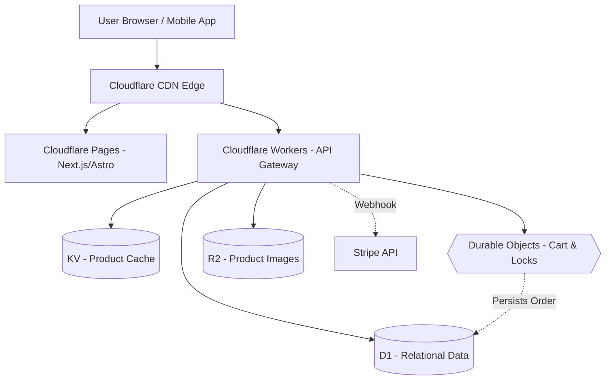

Running a traditional PHP/MySQL stack for e-commerce works until a flash sale hits. Then you're scaling servers, tuning Redis, and hoping your monolithic database doesn't lock up. If you are exploring [moving away from Magento](/posts/moving-from-magento-to-microservices) or simply evaluating the edge, there is a radically different approach: building a transactional e-commerce engine entirely on Cloudflare's edge network.

This post breaks down the architecture of a zero-ops, serverless e-commerce backend using Cloudflare Workers, D1 (SQLite), and Durable Objects. We will look at how to structure the database, how to prevent inventory overselling without Redis, and where the limits of this architecture lie.

## The "Zero-Ops" E-Commerce Dream

The traditional e-commerce problem is state. Serving static product pages is a solved problem (as discussed in [deploying full-stack edge architecture](/posts/deploying-astro-on-cloudflare-full-stack-edge-architecture)), but the moment a user adds an item to their cart, you need a transactional backend.

Cloudflare’s edge stack shifts this paradigm. Instead of sending users back to a centralized US-East data center for every API call, the API (Workers) and the database read replicas (D1) sit within milliseconds of the user. The latency profile completely changes.

## Architecting the Edge-Native E-Commerce Stack

A purely serverless e-commerce setup looks drastically different from traditional [microservices vs monoliths](/posts/architecting-21-service-ecommerce-golang-ddd).



- **Cloudflare Pages:** Hosts the static storefront (Astro, Next.js).
- **KV:** Caches product catalogs for instant reads.
- **D1:** Stores persistent relational data: `users`, `orders`, and `products`.
- **Durable Objects:** Manages the ephemeral, highly concurrent state of the shopping cart and inventory locks.
- **R2:** Stores heavy assets like product images and downloadable digital goods with zero egress fees.

## Designing the D1 Schema with Drizzle ORM

Cloudflare D1 is built on SQLite. It reached General Availability with a strict **10GB limit per database**. You cannot build a single massive monolithic database on D1.

Instead, the accepted pattern for B2B SaaS or multi-tenant e-commerce is **Database-per-Tenant**. Cloudflare allows up to 50,000 databases per account. By using [Drizzle ORM](https://orm.drizzle.team/), you can dynamically bind queries to the correct tenant's D1 instance at runtime.

Here is a simplified schema for a tenant database:

```typescript
// schema.ts
import { sqliteTable, text, integer } from 'drizzle-orm/sqlite-core';

export const users = sqliteTable('users', {
  id: text('id').primaryKey(),
  email: text('email').notNull().unique(),
  createdAt: integer('created_at', { mode: 'timestamp' })
});

export const products = sqliteTable('products', {
  id: text('id').primaryKey(),
  sku: text('sku').notNull().unique(),
  priceCents: integer('price_cents').notNull(),
  inventoryCount: integer('inventory_count').notNull(),
});

export const orders = sqliteTable('orders', {
  id: text('id').primaryKey(),
  userId: text('user_id').references(() => users.id),
  totalCents: integer('total_cents').notNull(),
  status: text('status').notNull().default('pending'),
});
```

Because D1 reads are globally replicated but writes go to a single Primary node, order placement will incur network latency (often ~300ms). This is an acceptable trade-off for checkout, but ensure your UI handles loading states gracefully.

## Handling Inventory Race Conditions with Durable Objects

The hardest problem in distributed e-commerce is the race condition: two users buying the last ticket to an event at the exact same millisecond. 

In AWS, you might use a Redis distributed lock (Redlock) or DynamoDB conditional updates. In Cloudflare, the elegant solution is **Durable Objects (DO)**.

Durable Objects provide strong consistency through a **single-threaded execution model**. When you map a product's inventory to a specific Durable Object, all checkout requests for that product queue up and execute sequentially. 

```javascript
// Example Worker calling a Durable Object for checkout
export default {
  async fetch(request, env) {
    const { productId, quantity } = await request.json();
    
    // Route to the unique Durable Object for this specific product
    const id = env.INVENTORY_DO.idFromName(productId);
    const productLock = env.INVENTORY_DO.get(id);

    // This call is guaranteed to be single-threaded at the destination
    const res = await productLock.fetch("http://do/decrement", {
      method: "POST",
      body: JSON.stringify({ quantity })
    });

    if (res.status === 409) return new Response("Out of stock", { status: 409 });
    return new Response("Checkout reserved");
  }
}
```
You don't need to write locking logic; the architecture itself provides the mutex.

## Payment Processing at the Edge

Integrating payments at the edge has specific constraints. Cloudflare Workers run on V8 isolates, not Node.js. 

When using the Stripe Node SDK, you must explicitly configure it to use the `fetch` API, and crucially, use `SubtleCrypto` to verify webhooks.

```javascript
import Stripe from 'stripe';

// Initialize with fetch client
const stripe = new Stripe(env.STRIPE_SECRET_KEY, {
  httpClient: Stripe.createFetchHttpClient(),
});

// Verifying Webhooks using Edge-native WebCrypto
const webCrypto = Stripe.createSubtleCryptoProvider();
const event = await stripe.webhooks.constructEventAsync(
  rawRequestBodyString, // MUST be raw text, not parsed JSON
  signatureHeader,
  env.STRIPE_WEBHOOK_SECRET,
  undefined,
  webCrypto
);
```

## WooCommerce vs Cloudflare: The Trade-offs

This architecture is incredibly fast and practically free to run at low volumes. However, it is not a drop-in replacement for WooCommerce.

1. **The Missing Ecosystem:** WooCommerce gives you thousands of plugins for shipping integration (FedEx, UPS), complex tax calculations, and PDF invoice generation. On Cloudflare, you have to build these integrations from scratch or rely on 3rd-party SaaS APIs.
2. **No Admin Panel:** You will need to build your own React or Astro admin dashboard to manage products and view orders.
3. **Database Migrations:** If you adopt a Database-per-tenant strategy to bypass the 10GB limit, running schema migrations across thousands of D1 instances requires a robust, custom DevOps pipeline.

## Conclusion

Building a serverless e-commerce engine on Cloudflare Workers and D1 is a masterclass in modern edge architecture. It eliminates idle server costs, scales infinitely, and solves race conditions natively with Durable Objects. 

It is the perfect stack for developer-led B2B SaaS platforms or digital product storefronts. But if you need an out-of-the-box retail store with complex shipping rules, the traditional monolith still holds its ground.
