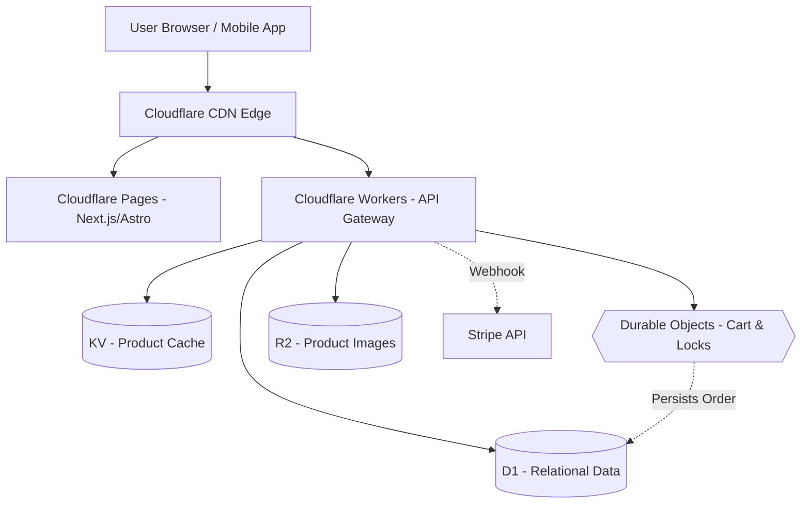

**Answer-first:** Serverless e-commerce on Cloudflare Workers utilizes edge-native compute for sub-millisecond routing. D1 database tables hold persistent relational state, while Durable Objects manage transactional operations like cart locking, balancing global low-latency with strict data consistency.

### What You'll Learn That AI Won't Tell You
- Edge-native schema migrations and connection tuning for SQLite-based D1.
- Managing distributed lock states in Durable Objects without causing bottleneck stalls.


Running a traditional PHP/MySQL stack for e-commerce works until a flash sale hits. Then you're scaling servers, tuning Redis, and hoping your monolithic database doesn't lock up. If you are exploring [moving away from Magento](/posts/moving-from-magento-to-microservices/) or simply evaluating the edge, there is a radically different approach: building a transactional e-commerce engine entirely on Cloudflare's edge network.

This post breaks down the architecture of a zero-ops, serverless e-commerce backend using Cloudflare Workers, D1 (SQLite), and Durable Objects. We will look at how to structure the database, how to prevent inventory overselling without Redis, and where the limits of this architecture lie.

## The "Zero-Ops" E-Commerce Dream

The traditional e-commerce problem is state. Serving static product pages is a solved problem (as discussed in [deploying full-stack edge architecture](/posts/deploying-astro-on-cloudflare-full-stack-edge-architecture/)), but the moment a user adds an item to their cart, you need a transactional backend.

Cloudflare’s edge stack shifts this paradigm. Instead of sending users back to a centralized US-East data center for every API call, the API (Workers) and the database read replicas (D1) sit within milliseconds of the user. The latency profile completely changes.

## Architecting the Edge-Native E-Commerce Stack

A purely serverless e-commerce setup looks drastically different from traditional [microservices vs monoliths](/posts/architecting-21-service-ecommerce-golang-ddd/).



- **Cloudflare Pages:** Hosts the static storefront (Astro, Next.js).
- **KV:** Caches product catalogs for instant reads.
- **D1:** Stores persistent relational data: `users`, `orders`, and `products`.
- **Durable Objects:** Manages the ephemeral, highly concurrent state of the shopping cart and inventory locks.
- **R2:** Stores heavy assets like product images and downloadable digital goods with zero egress fees.

## Designing the D1 Schema with Drizzle ORM

Cloudflare D1 is built on SQLite. It reached General Availability with a strict **10GB limit per database**. You cannot build a single massive monolithic database on D1.

Instead, the accepted pattern for B2B SaaS or multi-tenant e-commerce is **Database-per-Tenant**. Cloudflare allows up to 50,000 databases per account. By using [Drizzle ORM](https://orm.drizzle.team/), you can dynamically bind queries to the correct tenant's D1 instance at runtime.

Here is a simplified schema for a tenant database:

```typescript
// schema.ts
import { sqliteTable, text, integer } from 'drizzle-orm/sqlite-core';

export const users = sqliteTable('users', {
  id: text('id').primaryKey(),
  email: text('email').notNull().unique(),
  createdAt: integer('created_at', { mode: 'timestamp' })
});

export const products = sqliteTable('products', {
  id: text('id').primaryKey(),
  sku: text('sku').notNull().unique(),
  priceCents: integer('price_cents').notNull(),
  inventoryCount: integer('inventory_count').notNull(),
});

export const orders = sqliteTable('orders', {
  id: text('id').primaryKey(),
  userId: text('user_id').references(() => users.id),
  totalCents: integer('total_cents').notNull(),
  status: text('status').notNull().default('pending'),
});
```

Because D1 reads are globally replicated but writes go to a single Primary node, order placement will incur network latency (often ~300ms). This is an acceptable trade-off for checkout, but ensure your UI handles loading states gracefully.

## Handling Inventory Race Conditions with Durable Objects

The hardest problem in distributed e-commerce is the race condition: two users buying the last ticket to an event at the exact same millisecond. 

In AWS, you might use a Redis distributed lock (Redlock) or DynamoDB conditional updates. In Cloudflare, the elegant solution is **Durable Objects (DO)**.

Durable Objects provide strong consistency through a **single-threaded execution model**. When you map a product's inventory to a specific Durable Object, all checkout requests for that product queue up and execute sequentially. 

```javascript
// Example Worker calling a Durable Object for checkout
export default {
  async fetch(request, env) {
    const { productId, quantity } = await request.json();
    
    // Route to the unique Durable Object for this specific product
    const id = env.INVENTORY_DO.idFromName(productId);
    const productLock = env.INVENTORY_DO.get(id);

    // This call is guaranteed to be single-threaded at the destination
    const res = await productLock.fetch("http://do/decrement", {
      method: "POST",
      body: JSON.stringify({ quantity })
    });

    if (res.status === 409) return new Response("Out of stock", { status: 409 });
    return new Response("Checkout reserved");
  }
}
```
You don't need to write locking logic; the architecture itself provides the mutex.

## Payment Processing at the Edge

Integrating payments at the edge has specific constraints. Cloudflare Workers run on V8 isolates, not Node.js. 

When using the Stripe Node SDK, you must explicitly configure it to use the `fetch` API, and crucially, use `SubtleCrypto` to verify webhooks.

```javascript
import Stripe from 'stripe';

// Initialize with fetch client
const stripe = new Stripe(env.STRIPE_SECRET_KEY, {
  httpClient: Stripe.createFetchHttpClient(),
});

// Verifying Webhooks using Edge-native WebCrypto
const webCrypto = Stripe.createSubtleCryptoProvider();
const event = await stripe.webhooks.constructEventAsync(
  rawRequestBodyString, // MUST be raw text, not parsed JSON
  signatureHeader,
  env.STRIPE_WEBHOOK_SECRET,
  undefined,
  webCrypto
);
```

## Cloudflare D1 Query Optimization & Serverless Limits

Deploying SQLite at the edge via Cloudflare D1 offers a unique execution environment, but it comes with strict resource limits and query characteristics that differ substantially from traditional PostgreSQL or MySQL servers. To build a high-performance storefront, you must understand cold starts, query limits, and optimization techniques tailored for D1.

### Cold Starts and Connection Lifecycle
Unlike serverless databases running on traditional VM-based platforms (like AWS Lambda connecting to RDS), Cloudflare Workers run on V8 isolates. Worker cold starts are typically sub-10ms because they do not require spinning up a guest operating system.

However, D1 databases have their own warming behavior:
- **Isolate Warmth:** When a worker isolate starts, the binding connection to D1 is initialized. The first query against D1 may experience a slight overhead (typically 10-30ms) as the edge node mounts the underlying SQLite database file and compiles the SQL statements.
- **Statement Caching:** You should define your queries using parameterized prepared statements. Parameterized queries (`SELECT * FROM products WHERE sku = ?`) allow D1 to cache the compiled SQL execution plan. Re-compiling raw SQL strings on every request wastes CPU cycles and increases query latency.

### D1 Query Limits & Batch Operations
Cloudflare D1 enforces strict limits to ensure tenant isolation across the edge:
- **Maximum Execution Time:** A single SQL query must execute within 5 seconds.
- **Payload Limits:** The response size of a single query result is limited to 10MB.
- **Row Read and Write Limits:** D1 charges and throttles based on the number of rows read and written. A poorly optimized query that scans a table of 100,000 rows to return 10 items will consume 100,000 "row reads," quickly exhausting your monthly billing quotas and degrading edge performance.

To minimize the round-trip network latency between the Worker isolate and the D1 primary node (especially during writes), you should use D1’s batch querying capability. The `.batch()` API compiles multiple statements and sends them in a single HTTP payload:

```typescript
// Executing batch operations to minimize HTTP round-trips
const stmt1 = env.DB.prepare("INSERT INTO orders (id, user_id, total_cents) VALUES (?, ?, ?)");
const stmt2 = env.DB.prepare("UPDATE products SET inventory_count = inventory_count - ? WHERE id = ?");

const batchResults = await env.DB.batch([
  stmt1.bind(orderId, userId, totalCents),
  stmt2.bind(quantity, productId)
]);
```

### SQLite Query Optimizer Guide for D1

Because D1 runs SQLite under the hood, standard SQLite optimization techniques apply. Here is how to profile and optimize your D1 queries:

#### 1. Analyze with EXPLAIN QUERY PLAN
To inspect how D1 intends to execute a query, prepend `EXPLAIN QUERY PLAN` to your SQL. This returns a high-level representation of SQLite's query plan:

```sql
EXPLAIN QUERY PLAN 
SELECT p.id, p.sku, o.status 
FROM products p
JOIN orders o ON p.id = o.product_id
WHERE o.status = 'pending';
```

If the output contains `SCAN TABLE products`, it indicates SQLite is performing a full table scan, checking every single row because a foreign key index is missing. Look for `SEARCH TABLE` which indicates an index is being utilized.

#### 2. Avoid Column Scanning via Covering Indexes
If you frequently query a subset of columns, use a covering index. A covering index contains all the columns referenced in the query, allowing SQLite to fetch the data directly from the index B-Tree without performing a second lookup in the main table B-Tree:

```sql
-- Creating a covering index for fast product lookup by SKU and price
CREATE INDEX idx_products_sku_price ON products(sku, price_cents);
```

#### 3. Offload Large Columns to R2
SQLite stores data in pages (typically 4096 bytes). If you store large JSON payloads or text descriptions in a D1 cell, a single row can span multiple pages. This increases the number of page reads required to execute a query, even if the large column is not selected. 
- **Guideline:** Store product descriptions, long HTML specs, and image binaries in **Cloudflare R2**. Keep only the R2 resource URLs and metadata inside D1.

#### 4. The D1 Row-Read Profiler
When running queries locally or in staging, inspect the execution metadata returned by D1:

```typescript
const { results, meta } = await env.DB.prepare(
  "SELECT * FROM products WHERE inventory_count < ?"
).bind(10).all();

console.log(`Rows read: ${meta.rows_read}`);
console.log(`Rows written: ${meta.rows_written}`);
console.log(`Duration: ${meta.duration}ms`);
```

If `meta.rows_read` is significantly larger than `results.length`, your query is inefficient. Always optimize the query until `rows_read` matches `results.length` as closely as possible.

## WooCommerce vs Cloudflare: The Trade-offs


This architecture is incredibly fast and practically free to run at low volumes. However, it is not a drop-in replacement for WooCommerce.

1. **The Missing Ecosystem:** WooCommerce gives you thousands of plugins for shipping integration (FedEx, UPS), complex tax calculations, and PDF invoice generation. On Cloudflare, you have to build these integrations from scratch or rely on 3rd-party SaaS APIs.
2. **No Admin Panel:** You will need to build your own React or Astro admin dashboard to manage products and view orders.
3. **Database Migrations:** If you adopt a Database-per-tenant strategy to bypass the 10GB limit, running schema migrations across thousands of D1 instances requires a robust, custom DevOps pipeline.

## Conclusion

Building a serverless e-commerce engine on Cloudflare Workers and D1 is a masterclass in modern edge architecture. It eliminates idle server costs, scales infinitely, and solves race conditions natively with Durable Objects. 

It is the perfect stack for developer-led B2B SaaS platforms or digital product storefronts. But if you need an out-of-the-box retail store with complex shipping rules, the traditional monolith still holds its ground.

## FAQ


Cloudflare D1 has a **10GB limit per database** (General Availability as of 2026). For multi-tenant e-commerce or B2B SaaS applications that need more storage, the accepted pattern is **Database-per-Tenant**: each tenant gets their own D1 instance, and Cloudflare allows up to 50,000 databases per account. Drizzle ORM enables dynamic binding to the correct tenant database at runtime based on the request context. Schema migrations across thousands of D1 instances require a custom DevOps pipeline — this is a real operational cost and a meaningful reason to evaluate whether D1 is appropriate for high-scale multi-tenant workloads.



**Durable Objects** solve the inventory race condition through a **single-threaded execution model**: each product's inventory is mapped to a specific Durable Object instance, and all checkout requests for that product queue up and execute sequentially within that object. This provides strong consistency without distributed lock management (no Redlock, no Redis SETNX patterns). When two users try to buy the last item simultaneously, the second request waits for the first to complete, then checks the updated inventory count and returns a 409 Out of Stock response. The architecture itself provides the mutex — no explicit locking code required.



Cloudflare Workers are the wrong choice for e-commerce when you need: a **rich plugin ecosystem** (shipping integrations like FedEx/UPS, complex tax calculation engines, PDF invoice generation) that would require rebuilding from scratch; a **managed admin panel** for product and order management (Workers have no equivalent of WooCommerce admin); or when you are running **complex transactional operations** against large datasets where D1's SQLite-based architecture and single primary write node introduce unacceptable latency. For a developer-led digital product storefront or B2B SaaS backend, the edge stack is compelling. For a traditional retail store with 10+ third-party integrations, a managed platform (WooCommerce, Magento) is usually the better business decision.

