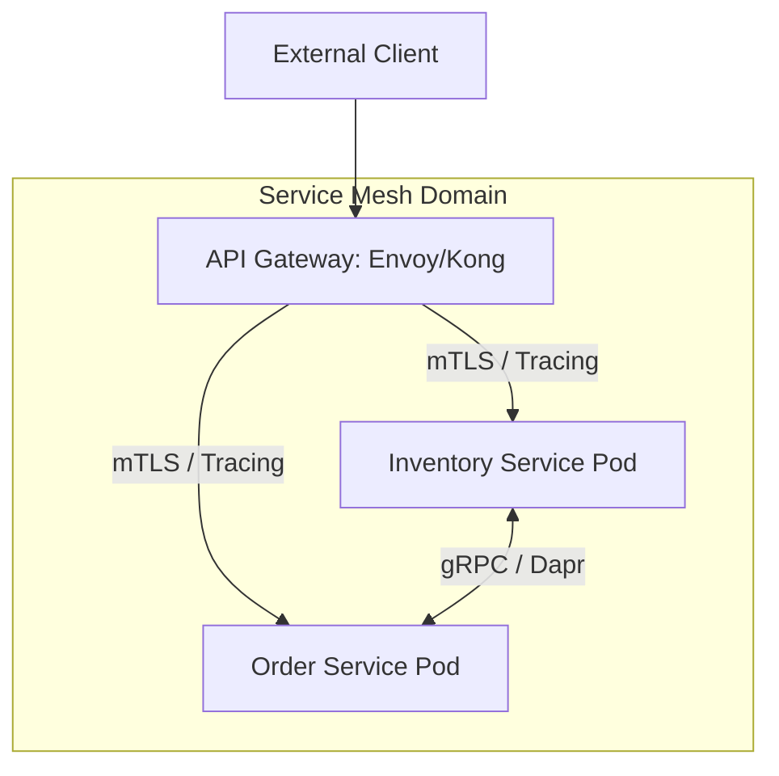
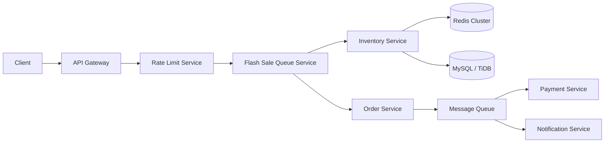

**Answer-first:** High-concurrency flash-sale architectures absorb peak traffic by applying C10M kernel-bypass networking at the edge, enforcing multi-layer rate limiting at the API Gateway, and executing atomic Redis Lua inventory reservations before any write request reaches the relational database.

---

## Executive Summary & System Design Foundations

High-concurrency systems handling millions of concurrent requests (C10M scale) must push load shedding and admission control as close to the network edge as possible:

1. **Edge Admission Control**: Offload connection handling via eBPF/DPDK and API Gateways.
2. **Atomic In-Memory Reservation**: Reserve stock in Redis via single-threaded Lua scripts to prevent DB row lock contention.
3. **Asynchronous Persistence**: Enqueue confirmed reservations into Kafka for decoupling and rate leveling.
4. **Resilient Database Layer**: Write-append order logs to sharded MySQL/TiDB clusters.

---

## 1. High-Concurrency Systems & The C10M Challenge

Handling 10 million concurrent connections (C10M) requires rethinking traditional OS network stacks:
- **Kernel Bypass**: Use DPDK / eBPF to bypass standard Linux network stack context switches.
- **Event-Driven Non-Blocking I/O**: Asynchronous epoll / io_uring event loops in Go/C++ microservices.
- **CPU Pinning & NUMA Awareness**: Bind worker threads to dedicated CPU cores and local NUMA memory nodes to avoid cache invalidation overhead.

---

## 2. API Gateway vs. Service Mesh at Edge Boundaries

For high-traffic flash sales, API Gateways and Service Meshes serve distinct architectural roles:



- **API Gateway (North-South)**: Handles TLS termination, IP rate limiting, JWT verification, and route rewriting for external clients.
- **Service Mesh (East-West)**: Handles mTLS, sidecar proxying, circuit breaking, and OpenTelemetry tracing between internal microservices.

---

## 3. Flash Sale Engine & Atomic Redis Inventory

Before a flash sale, inventory is pre-warmed into Redis:

```lua
-- Atomic Lua inventory reservation script
local key = KEYS[1]
local quantity = tonumber(ARGV[1])
local current = tonumber(redis.call('GET', key))

if current == nil then
    return -1  -- Product not in flash sale
end

if current < quantity then
    return 0   -- Out of stock
end

redis.call('DECRBY', key, quantity)
return 1       -- Success, proceed to order queue
```

---

## 4. Reference Service Decomposition



---

## FAQ


Shopee uses atomic Redis Lua scripts to decrement inventory counters in memory. Because Lua scripts execute atomically on single-threaded Redis keys, race conditions and database row lock contention are completely eliminated.



An API Gateway manages North-South external traffic (rate limiting, authentication, payload validation), whereas a Service Mesh manages East-West internal service-to-service traffic (mTLS, circuit breaking, distributed tracing).



C10M networking uses kernel bypass techniques (DPDK, eBPF) and io_uring event loops to handle millions of concurrent network connections without suffering OS thread context switching overhead.



