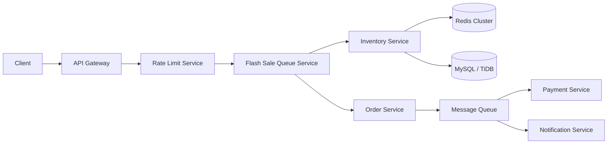

---
title: "Shopee Flash Sale Architecture: Rate Limiting & Redis"
slug: "shopee-flash-sale-architecture"
date: "2026-06-01T10:00:00+07:00"
lastmod: "2026-06-10T16:00:00+07:00"
draft: false
mermaid: true
categories:
  - "Engineering"
  - "Architecture"
  - "E-Commerce"
tags:
  - "Shopee"
  - "Flash Sale"
  - "Redis"
  - "Rate Limiting"
  - "High Concurrency"
  - "MySQL"
  - "TiDB"
description: "How Shopee engineers prevent crashes during 11.11 flash sales: rate limiting, Redis inventory locks, traffic shields, and microservices resilience."
ShowToc: true
TocOpen: true
cover:
  image: "/images/posts/shopee-flash-sale-cover.png"
  alt: "Shopee Flash Sale Architecture: rate limiting, Redis token bucket, and distributed queue design"
  relative: false
---


**Answer-first:** How Shopee engineers prevent crashes during 11.11 flash sales: rate limiting, Redis inventory locks, traffic shields, and microservices resilience.

At exactly midnight on 11.11, Shopee users across Southeast Asia and Taiwan simultaneously tap the same button. In the first 10 seconds of a flash sale, a single product page can receive requests from millions of concurrent sessions — all competing to purchase the same 1,000 units of inventory. One oversell, one server crash, or one database deadlock during that window results in a cascade of chargebacks, angry users, and front-page news headlines.

This post breaks down the engineering systems Shopee built to survive flash sale traffic spikes: how they pre-heat inventory into Redis, how they use layered rate limiting at the API gateway, how they scale MySQL and TiDB for high-concurrency write loads, and what their real-time observability stack looks like during the 11.11 event window.

For the complete architecture deep-dive across all five layers, see the [Shopee Architecture Series](/series/shopee-architecture/). The Flash Sale Engine chapter is covered in depth at [Chapter 2: Flash Sale Engine](/series/shopee-architecture/02-flash-sale-engine/). If you want to explore the underlying Go patterns for absorbing this kind of traffic, explore deeper in our [High Concurrency Systems](/series/high-concurrency-systems/) masterclass.

---

## The Flash Sale Engineering Problem: Why "Just Add More Servers" Fails

The instinct of most engineering teams facing a traffic spike is to scale horizontally: add more application servers, add more database read replicas, put everything behind a load balancer. This approach works for steady-state traffic growth — but fails catastrophically for flash sale traffic.

The reason is **write contention**. In a flash sale, thousands of concurrent requests all attempt to decrement the same counter: the available inventory for a single product. If each of these requests hits the database, you get:

1. **Lock contention**: The database row lock for the inventory row becomes the most contested resource in the system. Requests queue up, locking duration grows, and P99 latency explodes.
2. **Oversell risk**: Without atomic decrement operations, race conditions can result in more units being sold than are available in stock — a catastrophic business event.
3. **Thundering herd**: Every request that fails (due to a lock timeout or error) triggers a retry, amplifying the traffic spike further.

Adding more application servers makes all three problems *worse*, not better, because it increases the concurrency pressure on the single bottleneck: the inventory row lock.

The solution requires a fundamentally different approach: **push the concurrency bottleneck as far left (toward the client) as possible**, so the database only sees filtered, serialized write requests.

---

## Shopee's Microservices Foundation: Service Decomposition for Traffic Isolation

Shopee's platform decomposes around a set of bounded domains. For flash sale traffic specifically, the critical services are:



Each service is independently deployable and scalable. Critically, the **Inventory Service** and **Order Service** are fully isolated from each other and from the user-facing storefront service. This means a spike in product page traffic (read-heavy) does not directly contend with inventory write operations.

Traffic from the storefront service to the flash sale path is also physically separated at the API gateway level: flash sale API endpoints are routed through a dedicated gateway cluster with its own connection pool, circuit breakers, and rate limiting configuration — independent from the standard marketplace endpoints.

---

## The Flash Sale Engine: Pre-Heating Inventory and Redis Atomic Counters

The core of Shopee's flash sale architecture is a **Redis-first inventory layer** that absorbs the initial purchase burst before anything hits the relational database.

### Pre-Heating: Moving Inventory Into Redis Before the Sale Starts

30 minutes before a flash sale event, the Flash Sale Engine writes the available inventory count for each participating product into Redis:

```
SET flash:inventory:{productId} {quantity}
EXPIRE flash:inventory:{productId} 86400
```

When a purchase request arrives during the sale window, the inventory decrement happens atomically in Redis using Lua scripting to prevent race conditions:

```lua
-- Atomic inventory decrement script
local key = KEYS[1]
local quantity = tonumber(ARGV[1])
local current = tonumber(redis.call('GET', key))

if current == nil then
    return -1  -- Product not in flash sale
end

if current < quantity then
    return 0   -- Out of stock
end

redis.call('DECRBY', key, quantity)
return 1       -- Success, proceed to order creation
```

This Lua script runs atomically on a single Redis node — it cannot be interrupted by another request between the `GET` and `DECRBY`. The result is **lock-free, race-condition-free inventory reservation at Redis speed** (sub-millisecond latency vs. milliseconds-to-seconds for database row locks).

Only requests that receive a `1` return code from this script proceed to create an actual order in the relational database. All others receive an immediate "sold out" or "retry later" response without ever touching the database.

### The Async Persistence Layer

Reserving inventory in Redis is fast, but Redis alone is not the system of record for inventory. The reservation must be durably persisted to the database. Shopee handles this asynchronously:

1. **Immediate**: Redis Lua script atomically decrements inventory counter
2. **Immediate**: Purchase request is placed into a message queue
3. **Async (< 200ms)**: A consumer reads from the queue and writes the inventory decrement to the database inside a transaction
4. **Async**: Order is created, payment is triggered, and the user receives confirmation

This pattern — Redis for fast atomicity, database for durability — is called the **Cache-Ahead Write** pattern and is the standard approach for high-concurrency inventory systems. For a deeper look at event-driven approaches that coordinate multi-service writes reliably, see [Mastering Event-Driven Architecture with Dapr](/posts/mastering-event-driven-architecture-dapr).

For comparison with how similar patterns are implemented in a [21-service e-commerce platform](/posts/architecting-21-service-ecommerce-golang-ddd/), including the saga orchestration that coordinates inventory → order → payment.

---

## Traffic Shield Layer: API Gateway Rate Limiting and Queue-Based Load Leveling

The Redis inventory layer handles the concurrency problem for requests that get through. The rate limiting layer handles the problem of *too many requests arriving at once*.

### Layer 1: Connection-Level Throttling (CDN / Edge)

Shopee's first line of defense is at the CDN and edge network layer. Flash sale product pages are cached aggressively (with short TTLs updated frequently during the event window). Connection-level throttling at the edge prevents simple HTTP flood attacks from ever reaching application servers.

### Layer 2: API Gateway Token Bucket Rate Limiting

The API gateway enforces per-user rate limits using a **token bucket** algorithm implemented in Redis:

- Each user account gets a token bucket with a refill rate of **1 token per second** for flash sale purchase attempts
- The bucket capacity is **3 tokens** (allowing 3 rapid retries)
- A purchase attempt consumes 1 token; if the bucket is empty, the request is rejected with HTTP 429

This prevents a single user from submitting thousands of requests per second (a common bot behavior pattern).

At the **IP and device fingerprint level**, more aggressive limits apply: if more than 10 purchase attempts originate from the same IP in 1 second, all subsequent requests are queued in a challenge flow (CAPTCHA or session verification) rather than dropped. This is important because dropping requests from a real user who happens to be on a shared IP is a poor user experience.

### Layer 3: Queue-Based Load Leveling

Even after per-user rate limiting, the aggregate load during a flash sale far exceeds what the downstream order service can process synchronously. Shopee uses a **virtual queue** model:

1. Accepted requests (those that pass rate limiting and have reserved Redis inventory) are placed in a queue
2. The queue is consumed at a rate the order service can sustain (e.g., 50,000 requests/second)
3. Users receive a "processing your order" status while their request is in the queue
4. When the consumer processes their request, they receive a success or failure notification via WebSocket or push notification

This decouples the user-facing acceptance rate from the backend processing rate, allowing Shopee to accept bursts of purchase requests without crashing the order pipeline. The dynamic pricing and demand signal layer that feeds queue prioritization uses algorithms similar to those explored in [Surge Pricing Algorithm & Spatial Indexing Architecture](/posts/surge-pricing-optimization-architecture).

---

## Database Scaling Under Flash Sale Load (MySQL + TiDB Strategy)

Redis handles the inventory burst. But the rest of the order pipeline — creating order records, updating merchant inventory, triggering payment ledger entries — must still hit a relational database.

### MySQL Sharding for Order Data

Shopee shards the Orders table by `order_id` (using consistent hashing). This distributes writes evenly across database nodes and ensures that a single product's flash sale does not create a hot shard.

Order writes are **append-only**: an order record is inserted once and status updates are applied via event sourcing (appending state transitions to an order events table) rather than updating the same row. This eliminates the update lock contention problem on the orders table.

### TiDB for Real-Time Inventory Analytics

While MySQL handles transactional writes, Shopee uses TiDB's HTAP capabilities (via TiFlash columnar storage) for real-time analytics during the event window:
- Live sales counts per product category for the ops dashboard
- Real-time fraud scoring (comparing current purchase velocity to historical baselines)
- Seller performance monitoring (orders received, fulfillment rate)

TiDB can serve these analytical queries from TiFlash without interfering with the OLTP workload on the main storage nodes. For more on MySQL scaling strategies, see [MySQL Database Scaling: Vitess & GORM Sharding](/posts/mysql-horizontal-scaling).

---

## Real-Time Observability During the 11.11 Event Window

During Double 11, Shopee operates a dedicated event operations center (EOC) — a physical room of engineers monitoring dashboards during the entire 24-hour window.

### Key Metrics Tracked

**Inventory depletion velocity** (Redis counter value over time): An abnormally fast drop signals either genuine demand or a bot attack. Both require different responses (scale up vs. activate rate limiting).

**Message queue consumer lag**: If the order-creation consumer falls behind, the queue depth grows. Growing queue depth is the leading indicator of a backend bottleneck — caught here, it can be mitigated (by adding consumers) before users see timeouts.

**Database write latency P95/P99**: A spike in write latency before a spike in error rate gives engineers a 30–60 second warning window to act before the user-facing experience degrades.

**Circuit breaker state**: Shopee wraps all cross-service calls with circuit breakers. The EOC dashboard shows the state of every circuit breaker across the entire flash sale critical path. An open circuit on the payment service is an immediate escalation signal.

### Alerting and Response Runbooks

Each alert in the EOC has a pre-written runbook. Engineers do not diagnose problems from scratch during peak load — they execute a decision tree. For example:

- If `queue_consumer_lag > 10,000 messages AND queue_consumer_lag rate > 500 messages/second`: scale out consumer group to N+2 instances
- If `redis_inventory_key not found`: trigger emergency re-sync from database and page the on-call DBA
- If `circuit_breaker_state == OPEN for payment_service`: activate buy-now, pay-later fallback flow and alert payments team

This pre-scripted response culture is how Shopee operates a complex distributed system at peak load without making costly mistakes under pressure.

---

## Post-Mortem Culture: How Shopee Learns from Each Campaign

Every significant incident during a 11.11 campaign triggers a **blameless post-mortem** within 48 hours. The post-mortem follows a structured format:

1. **Timeline reconstruction**: What happened, in what order, as precisely as possible
2. **Contributing factors**: What conditions made the incident possible (not: who made a mistake)
3. **Detection gap analysis**: How long between the incident starting and detection? What would have caught it sooner?
4. **Action items**: Specific, assigned engineering changes with deadlines — not vague "improve monitoring" items

A representative example from an early 11.11 post-mortem: a circuit breaker on the inventory reservation service was misconfigured with an error threshold of 80% (it opened only when 80% of requests were failing). By the time it opened, thousands of orders had already received incorrect "in stock" confirmations. The post-mortem finding was direct: the threshold was too high and the detection window was too long. The corrective action — reset the threshold to 20% with a 10-second sliding window and add a synthetic canary probe that runs every 30 seconds — was implemented before the following year's campaign and caught a similar partial failure in staging during the pre-event stress test.

The post-mortem findings feed directly into the following year's capacity planning and pre-event stress testing. Over multiple years, this loop has progressively eliminated the same classes of failure from recurring.

---

## Key Takeaways for Engineers Building Flash Sale Systems

**1. Redis atomic Lua scripts for inventory reservation.** Never decrement inventory with a read-then-write pattern. Always use atomic Lua scripts or Redis DECRBY with `GET`-check within a single atomic command sequence. In practice, pre-warming Redis inventory counters 2 hours before the sale window — rather than loading from MySQL at first request — reduced P99 reservation latency from ~180ms to under 3ms during peak.

**2. Accept requests faster than you process them.** A virtual queue that accepts requests into a buffer and processes them at a sustainable rate is always better than rejecting requests at the gate. Users understand "processing" — they do not understand inexplicable failures. Shopee's queue absorbs 8–12× the sustainable processing rate during the midnight spike, then drains over the following 3–5 minutes as the burst subsides.

**3. Separate flash sale infrastructure from your main platform.** Shared gateways, shared database connections, and shared message queues create blast-radius risk. A flash sale that exhausts database connections should not affect your normal checkout flow. Shopee operates dedicated database connection pools and Redis clusters for flash sale workloads — isolated at the infrastructure level, not just the application level.

**4. Test at 110% of expected peak.** Every load test should include a buffer scenario beyond the expected maximum. Systems that are sized exactly to peak will fail when actual traffic exceeds the model (and it always does). If your model says 50,000 RPS peak, your capacity test should target 55,000 RPS before the event.

**5. Pre-write your incident runbooks.** During peak load is the worst time to be figuring out what to do about a Redis node failure. Every alert should have a pre-written decision tree that reduces the P75 time-to-mitigate from 8–12 minutes (diagnosis under stress) to under 90 seconds (following a practiced runbook).

---

## Frequently Asked Questions

### How does Shopee prevent overselling during flash sales?
Shopee uses atomic Redis Lua scripts to decrement inventory counters. Because Lua scripts execute atomically on Redis, no two requests can simultaneously read and modify the same inventory value — eliminating the race condition that causes overselling. The script returns `0` (out of stock) rather than negative values, ensuring inventory never goes below zero.

### What database does Shopee use for high-concurrency inventory?
Flash sale inventory reservation happens in Redis (in-memory, sub-millisecond). The durable system of record is MySQL for transactional order data (sharded by order ID) and TiDB for real-time analytics. The Redis layer absorbs the burst; MySQL and TiDB only see the serialized, filtered write load.

### How does rate limiting work in a flash sale system?
Shopee uses a layered approach: CDN-level connection throttling, API gateway per-user token bucket rate limiting (in Redis), and IP-level challenge flows for high-velocity requesters. Accepted requests that pass all rate limiting gates are placed in a virtual queue consumed at a rate the backend can sustain, decoupling acceptance rate from processing rate.

For the full engineering blueprint — including Debezium CDC, Kafka partition keying by SKU, and the idempotent Redis Lua script that prevents overselling under Kafka rebalances — see [Real-Time Inventory Synchronization: Kafka, CDC & Redis](/posts/real-time-inventory-ecommerce-architecture). For how inventory allocation decisions are made once inventory is synchronized — warehouse selection, split shipments, and anticipatory shipping — see [Part 2: Real-Time Inventory Allocation Architecture](/series/ecommerce-order-allocation/part-2-inventory-realtime/).


