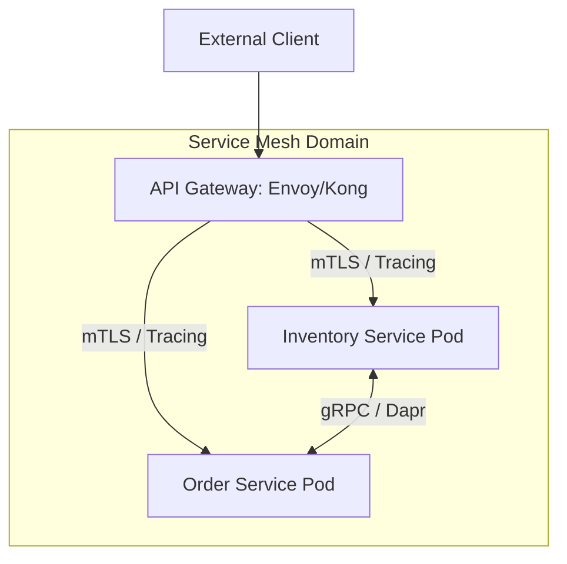
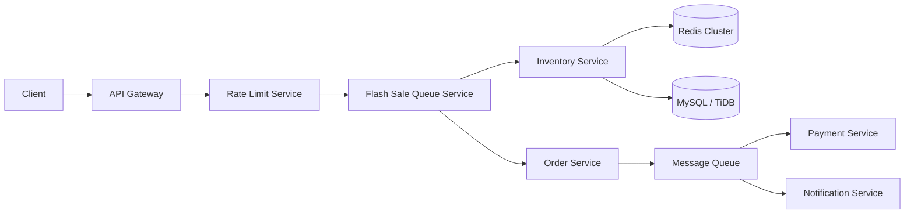

# Flash Sale Architecture: Rate Limiting & Redis

> **Answer-First:** High-concurrency flash sale architectures handle millions of concurrent requests (C10M scale) by using kernel bypass networking (DPDK/eBPF), edge rate limiting via atomic Redis Lua token buckets, pre-warmed in-memory inventory decrementing, and asynchronous Kafka queue leveling before persisting to distributed TiDB/MySQL database clusters.

---

## Executive Summary & System Design Foundations

High-concurrency systems handling millions of concurrent requests (C10M scale) must push load shedding and admission control as close to the network edge as possible. The following design baselines outline the essential trade-offs, performance targets, and architectural patterns required for enterprise deployment.

1. **Edge Admission Control**: Offload connection handling via eBPF/DPDK and API Gateways.
2. **Atomic In-Memory Reservation**: Reserve stock in Redis via single-threaded Lua scripts to prevent DB row lock contention.
3. **Asynchronous Persistence**: Enqueue confirmed reservations into Kafka for decoupling and rate leveling.
4. **Resilient Database Layer**: Write-append order logs to sharded MySQL/TiDB clusters.

---

## 1. High-Concurrency Systems & The C10M Challenge

Handling 10 million concurrent connections (C10M) requires rethinking traditional OS network stacks. Standard Linux socket handling incurs severe CPU overhead due to kernel context switches, lock contention in network driver queues, and memory copy operations between kernel space and user space.

- **Kernel Bypass Networking**: Systems employ Data Plane Development Kit (DPDK) or eBPF (Extended Berkeley Packet Filter) to route network packets directly to user-space application buffers. Bypassing standard Linux network interrupts reduces CPU cycle consumption per packet by up to 80%.
- **Event-Driven Non-Blocking I/O**: High-performance worker nodes leverage `io_uring` or `epoll` event loops in Go/C++ microservices. Single-threaded non-blocking event loops process tens of thousands of active socket handles per core without thread context switching overhead.
- **CPU Pinning & NUMA Awareness**: Thread pools are pinned to specific physical CPU cores using CPU affinity masks (`sched_setaffinity`). Allocating memory buffers within the local Non-Uniform Memory Access (NUMA) node avoids cross-socket memory bus latency.

---

## 2. API Gateway vs. Service Mesh at Edge Boundaries

For high-traffic flash sales, API Gateways and Service Meshes serve distinct architectural roles across traffic boundaries. The sequence diagram below traces the component interactions, data events, and boundary transitions across the workflow. Visualizing system interactions helps clarify data boundaries, concurrency limits, and failure domain separation. The sequence diagram below traces the component interactions, message flows, API gateways, and boundary transitions across the complete execution path.


```mermaid
graph TD
    Client[External Client] --> Gateway[API Gateway: Envoy/Kong]
    subgraph Service Mesh Domain
        Gateway -->|mTLS / Tracing| ServiceA[Inventory Service Pod]
        Gateway -->|mTLS / Tracing| ServiceB[Order Service Pod]
        ServiceA <-->|gRPC / Dapr| ServiceB
    end
```

- **API Gateway (North-South)**: Positioned at the network edge to handle TLS termination, global IP rate limiting, DDoS mitigation, JWT token authentication, and public API path rewriting before requests enter internal clusters.
- **Service Mesh (East-West)**: Operates inside the Kubernetes cluster via sidecar proxies (e.g., Envoy). The service mesh enforces mutual TLS (mTLS) security, dynamic service discovery, fine-grained circuit breaking, and distributed OpenTelemetry trace propagation across internal microservice calls.

---

## 3. Flash Sale Engine & Atomic Redis Inventory

During high-concurrency sales, querying or updating inventory directly in relational databases (MySQL/PostgreSQL) causes immediate system collapse due to database row lock contention. When thousands of concurrent transactions execute `UPDATE items SET stock = stock - 1 WHERE id = 100`, the database engine serializes requests, exhausting connection pools.

To prevent database lockup, inventory counters are pre-warmed into Redis clusters prior to sale launch. Stock reservations execute in-memory via single-threaded, atomic Lua scripts:

```lua
-- Atomic Lua inventory reservation script
local key = KEYS[1]
local quantity = tonumber(ARGV[1])
local current = tonumber(redis.call('GET', key))

if current == nil then
    return -1  -- Product not in flash sale
end

if current < quantity then
    return 0   -- Out of stock
end

redis.call('DECRBY', key, quantity)
return 1       -- Success, proceed to order queue
```

Because Redis executes Lua scripts as a single atomic operation on a single thread per shard, race conditions and overselling are physically impossible. Once stock drops to 0, subsequent requests fail instantly in Redis (< 1ms) without ever reaching backend database servers.

---

## 4. Atomic Rate Limiting Engine: Production Redis Lua & Go Token Bucket

To safeguard downstream order microservices from C10M traffic surges, rate limiting must evaluate at the API Gateway before requests reach application workers. Traditional in-memory local limiters fail across auto-scaled gateway nodes due to inconsistent global state, while Naive Redis `INCR` counter patterns suffer from race conditions and boundary spike vulnerabilities (2x burst problem).

### Token Bucket vs. Sliding Window Log under C10M Load

| Rate Limiter Algorithm | Time Complexity | Memory Complexity | C10M Flash Sale Suitability |
| :--- | :--- | :--- | :--- |
| **Fixed Window (`INCR`)** | $O(1)$ | $O(1)$ per key | ❌ **High Risk**: Allows 2x burst traffic at window boundaries. |
| **Sliding Window Log (`ZADD`)** | $O(N)$ | $O(N)$ log items | ❌ **Unsuitable**: Excessive memory and CPU overhead per request. |
| **Atomic Token Bucket (Lua)** | $O(1)$ | $O(1)$ fixed hash | ✅ **Optimal**: Smooth traffic shaping, exact sub-second precision. |

---

### Production Redis Lua Atomic Token Bucket Script

This Lua script executes atomically within Redis, updating available tokens based on elapsed fractional seconds while enforcing strict TTL boundaries to avoid memory leaks:

```lua
-- Atomic Token Bucket Rate Limiter
-- KEYS[1]: Redis Key (e.g., "{user:1001}:rate_limit")
-- ARGV[1]: Max Bucket Capacity (e.g., 100)
-- ARGV[2]: Token Refill Rate per Second (e.g., 10.0)
-- ARGV[3]: Current Unix Timestamp in fractional seconds (e.g., 1774944000.125)
-- ARGV[4]: Requested Tokens (e.g., 1)

local key = KEYS[1]
local capacity = tonumber(ARGV[1])
local refill_rate = tonumber(ARGV[2])
local now = tonumber(ARGV[3])
local requested = tonumber(ARGV[4])

-- Retrieve current state (returns false for missing hash fields)
local data = redis.call('HMGET', key, 'tokens', 'last_updated')
local tokens = tonumber(data[1])
local last_updated = tonumber(data[2])

if tokens == nil or last_updated == nil then
    tokens = capacity
    last_updated = now
else
    local delta = math.max(0, now - last_updated)
    tokens = math.min(capacity, tokens + delta * refill_rate)
end

-- Key TTL set to twice the full bucket refill duration to guarantee auto-eviction
local ttl = math.ceil(capacity / refill_rate) * 2

if tokens >= requested then
    tokens = tokens - requested
    redis.call('HSET', key, 'tokens', tokens, 'last_updated', now)
    redis.call('EXPIRE', key, ttl)
    return {1, math.floor(tokens), 0} -- Allowed: 1, Remaining tokens, Retry-After: 0
else
    redis.call('HSET', key, 'tokens', tokens, 'last_updated', now)
    redis.call('EXPIRE', key, ttl)
    local retry_after = math.ceil((requested - tokens) / refill_rate)
    return {0, math.floor(tokens), retry_after} -- Denied: 0, Remaining tokens, Retry-After seconds
end
```

---

### Production Go Rate Limiter Implementation

The API Gateway integrates atomic rate limiting via a thread-safe Go wrapper using github.com/redis/go-redis/v9 and pre-compiled EVALSHA scripts:

```go
package main

import (
	"context"
	"fmt"
	"time"

	"github.com/redis/go-redis/v9"
)

// RateLimiter wraps Redis client and compiled Lua script.
type RateLimiter struct {
	client *redis.Client
	script *redis.Script
}

// NewRateLimiter compiles the atomic Token Bucket Lua script.
func NewRateLimiter(client *redis.Client, luaScript string) *RateLimiter {
	return &RateLimiter{
		client: client,
		script: redis.NewScript(luaScript),
	}
}

// RateLimitResult encapsulates admission evaluation details.
type RateLimitResult struct {
	Allowed        bool
	Remaining      int64
	RetryAfterSecs int64
}

// Allow evaluates if an incoming request is admitted by the rate limiter.
func (r *RateLimiter) Allow(ctx context.Context, key string, capacity int, refillRate float64, requested int) (*RateLimitResult, error) {
	// Floating-point unix timestamp in seconds for sub-second precision
	now := float64(time.Now().UnixNano()) / 1e9

	res, err := r.script.Run(ctx, r.client, []string{key}, capacity, refillRate, now, requested).Result()
	if err != nil {
		return nil, fmt.Errorf("rate limit execution failed: %w", err)
	}

	values, ok := res.([]interface{})
	if !ok || len(values) < 3 {
		return nil, fmt.Errorf("invalid script response format")
	}

	return &RateLimitResult{
		Allowed:        values[0].(int64) == 1,
		Remaining:      values[1].(int64),
		RetryAfterSecs: values[2].(int64),
	}, nil
}
```

### Production Trade-Offs & Resiliency Signals

1. **Redis Cluster Hash Tagging**: Always format rate limit keys using Redis Hash Tags (e.g., `{user:1001}:rate_limit`). This forces multi-key or single-key Lua evaluations to target a single Redis cluster slot, avoiding cross-slot `CROSSSLOT Keys in request don't hash to the same slot` errors.
2. **Fail-Open vs. Fail-Closed Strategy**: If Redis latency spikes > 5ms or connection pools degrade under C10M peak load, the API Gateway MUST degrade gracefully. Standard practice mandates **Fail-Open** for authenticated VIP users (allowing traffic to be shaped downstream by Kafka queue backpressure) and **Fail-Closed** for unauthenticated/bot IP ranges.

---

## 5. Reference Service Decomposition

Understanding the architectural topology of Reference Service Decomposition requires tracing the end-to-end event sequence and data flow. The diagram below illustrates how components, API boundaries, and background workers coordinate during request processing. Visualizing system interactions helps clarify data boundaries, concurrency limits, and failure domain separation. The sequence diagram below traces the component interactions, message flows, API gateways, and boundary transitions across the complete execution path.


```mermaid
graph LR
    Client --> GW[API Gateway]
    GW --> RLS[Rate Limit Service]
    RLS --> FLQ[Flash Sale Queue Service]
    FLQ --> INV[Inventory Service]
    FLQ --> ORDER[Order Service]
    INV --> REDIS[(Redis Cluster)]
    INV --> DB[(MySQL / TiDB)]
    ORDER --> MQ[Message Queue]
    MQ --> PAY[Payment Service]
    MQ --> NOTIFY[Notification Service]
```

---

## FAQ


Shopee uses atomic Redis Lua scripts to decrement inventory counters in memory. Because Lua scripts execute atomically on single-threaded Redis keys, race conditions and database row lock contention are completely eliminated.



An API Gateway manages North-South external traffic (rate limiting, authentication, payload validation), whereas a Service Mesh manages East-West internal service-to-service traffic (mTLS, circuit breaking, distributed tracing).



C10M networking uses kernel bypass techniques (DPDK, eBPF) and io_uring event loops to handle millions of concurrent network connections without suffering OS thread context switching overhead.



