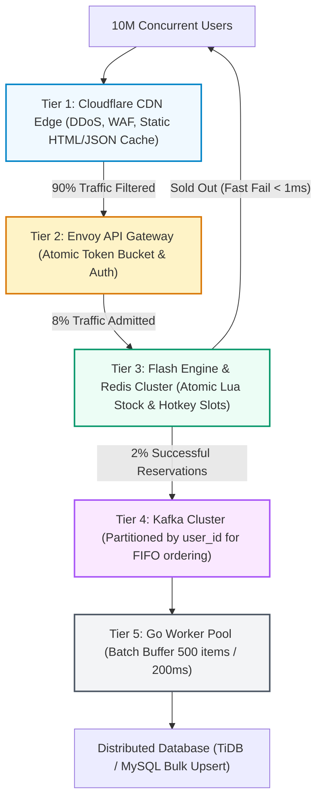
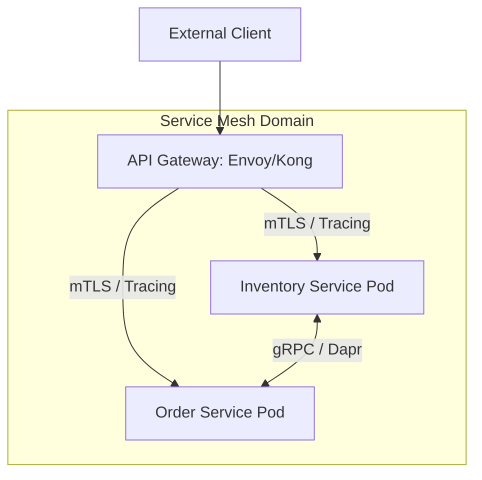
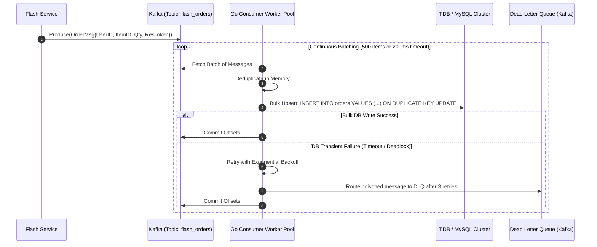

# Flash Sale Architecture: Rate Limiting & Redis

**Answer-first:** High-concurrency flash sale systems absorb millions of synchronized user requests using a **5-Tier Traffic Shedding Architecture**: Cloudflare CDN edge static asset caching, Envoy API Gateway atomic Token Bucket rate limiting, Redis Cluster Lua inventory reservations with hotkey slot splitting, partitioned Kafka queue buffering, and asynchronous Go worker pools executing batch upserts into TiDB/MySQL.

> [!NOTE]
> **On sourcing:** This article describes flash-sale architecture *patterns* for C10M-scale events; it is not a disclosure of Shopee's internal systems, and the figures here are engineering targets rather than published Shopee metrics. Shopee has not publicly documented its flash-sale internals in detail. What *is* public is its database platform choice — Shopee's adoption of TiDB is documented in PingCAP's case studies ([How Shopee Chose the Right Database](https://www.pingcap.com/case-study/choosing-right-database-for-your-applications/), [Shopping on Shopee, the TiDB Way](https://pingcap.medium.com/shopping-on-shopee-the-tidb-way-2bc3b8ab3b15)). Treat everything else as a reference pattern to validate against your own workload.


```mermaid
graph TD
    User["10M Concurrent Users"] --> Edge["Tier 1: Cloudflare CDN Edge (DDoS, WAF, Static HTML/JSON Cache)"]
    Edge -->|"90% Traffic Filtered"| Gateway["Tier 2: Envoy API Gateway (Atomic Token Bucket & Auth)"]
    Gateway -->|"8% Traffic Admitted"| FlashEngine["Tier 3: Flash Engine & Redis Cluster (Atomic Lua Stock & Hotkey Slots)"]
    FlashEngine -->|"Sold Out (Fast Fail < 1ms)"| User
    FlashEngine -->|"2% Successful Reservations"| Kafka["Tier 4: Kafka Cluster (Partitioned by user_id for FIFO ordering)"]
    Kafka --> Workers["Tier 5: Go Worker Pool (Batch Buffer 500 items / 200ms)"]
    Workers --> DB["Distributed Database (TiDB / MySQL Bulk Upsert)"]

    style Edge fill:#f0f9ff,stroke:#0284c7,stroke-width:2px
    style Gateway fill:#fef3c7,stroke:#d97706,stroke-width:2px
    style FlashEngine fill:#ecfdf5,stroke:#059669,stroke-width:2px
    style Kafka fill:#fae8ff,stroke:#a855f7,stroke-width:2px
    style Workers fill:#f3f4f6,stroke:#4b5563,stroke-width:2px
```

---

## 1. High-Concurrency Systems & The C10M Challenge

Handling 10 million concurrent connections (C10M) requires rethinking traditional OS network stacks. Standard Linux socket handling incurs severe CPU overhead due to kernel context switches, lock contention in network driver queues, and memory copy operations between kernel space and user space.

- **Kernel Bypass Networking**: Systems employ Data Plane Development Kit (DPDK) or eBPF (Extended Berkeley Packet Filter) to route network packets directly to user-space application buffers. Bypassing standard Linux network interrupts significantly reduces CPU cycle consumption per packet.
- **Event-Driven Non-Blocking I/O**: High-performance worker nodes leverage `io_uring` or `epoll` event loops in Go/C++ microservices. Single-threaded non-blocking event loops process tens of thousands of active socket handles per core without thread context switching overhead.
- **CPU Pinning & NUMA Awareness**: Thread pools are pinned to specific physical CPU cores using CPU affinity masks (`sched_setaffinity`). Allocating memory buffers within the local Non-Uniform Memory Access (NUMA) node avoids cross-socket memory bus latency.

---

## 2. API Gateway vs. Service Mesh at Edge Boundaries

For high-traffic flash sales, API Gateways and Service Meshes serve distinct architectural roles across traffic boundaries. The diagram below shows where the Gateway terminates external traffic (rate limiting, auth, TLS) and where the mesh takes over for internal service-to-service concerns (mTLS, tracing, retries).


```mermaid
graph TD
    Client["External Client"] --> Gateway["API Gateway: Envoy/Kong"]
    subgraph Service Mesh Domain
        Gateway -->|"mTLS / Tracing"| ServiceA["Inventory Service Pod"]
        Gateway -->|"mTLS / Tracing"| ServiceB["Order Service Pod"]
        ServiceA <-->|"gRPC / Dapr"| ServiceB
    end
```

- **API Gateway (North-South)**: Positioned at the network edge to handle TLS termination, global IP rate limiting, DDoS mitigation, JWT token authentication, and public API path rewriting before requests enter internal clusters.
- **Service Mesh (East-West)**: Operates inside the Kubernetes cluster via sidecar proxies (e.g., Envoy). The service mesh enforces mutual TLS (mTLS) security, dynamic service discovery, fine-grained circuit breaking, and distributed OpenTelemetry trace propagation across internal microservice calls.

---

## 3. Flash Sale Engine: Atomic Redis Inventory & Hotkey Splitting

During high-concurrency flash sales, querying or updating inventory directly in relational databases (MySQL/PostgreSQL) causes immediate system collapse due to database row lock contention. When 100,000 concurrent transactions execute `UPDATE items SET stock = stock - 1 WHERE id = 100`, the database serializes row locks, exhausting connection pools within milliseconds.

To prevent database saturation, inventory counters are pre-warmed into Redis clusters prior to sale launch. Executing reservations in memory via single-threaded atomic Lua scripts guarantees non-blocking execution while eliminating race conditions.

### The Single Hotkey Bottleneck & Slot Splitting

In standard Redis cluster deployments, a single SKU counter maps to one hash slot, and thus resides entirely on **a single Redis master node**. When 500,000 requests hit the same SKU simultaneously, that single Redis master CPU core caps at 100% utilization, creating network I/O queuing and packet drops.

To scale beyond the throughput ceiling of a single Redis core, enterprise flash sale engines implement **Hotkey Slot Splitting**:

1. The total stock of 10,000 units is divided across $K$ slots (e.g., $K = 10$ slots of 1,000 units each).
2. Keys are named using distinct hash tags: `item_1001:slot_{0}` through `item_1001:slot_{9}`.
3. Because each slot has a different hash tag, Redis Cluster hashes them to different master nodes across the cluster.
4. Incoming customer requests randomly select a slot (`slotIndex = hash(userId + rand) % 10`). If a slot is depleted, the client router falls back to the adjacent slot.

```lua
-- Atomic Hotkey Lua Inventory Reservation with Idempotency
-- KEYS[1]: Inventory slot key (e.g., "flash:item_1001:slot_3")
-- KEYS[2]: User reservation idempotency key (e.g., "flash:res:item_1001:user_8921")
-- ARGV[1]: Quantity to reserve (e.g., 1)
-- ARGV[2]: Reservation TTL in seconds (e.g., 900)

local stock_key = KEYS[1]
local user_res_key = KEYS[2]
local req_qty = tonumber(ARGV[1])
local res_ttl = tonumber(ARGV[2])

-- 1. Idempotency Check: Prevent duplicate reservations by the same user
if redis.call("EXISTS", user_res_key) == 1 then
    return -2 -- Already reserved
end

-- 2. Stock Check
local current_stock = tonumber(redis.call("GET", stock_key) or "0")
if current_stock < req_qty then
    return 0 -- Depleted / Out of stock
end

-- 3. Atomic Decrement & Record Reservation
redis.call("DECRBY", stock_key, req_qty)
redis.call("SETEX", user_res_key, res_ttl, req_qty)

return 1 -- Success
```

Because Redis executes Lua scripts as a single atomic operation on a single thread per shard, race conditions and overselling are physically impossible. Once stock drops to 0, subsequent requests fail instantly in Redis (< 1ms) without ever reaching backend database servers.

---

## 4. Atomic Rate Limiting Engine: Production Redis Lua & Go Token Bucket

To safeguard downstream order microservices from C10M traffic surges, rate limiting must evaluate at the API Gateway before requests reach application workers. Traditional in-memory local limiters fail across auto-scaled gateway nodes due to inconsistent global state, while Naive Redis `INCR` counter patterns suffer from boundary spike vulnerabilities (the 2x burst problem).

### Token Bucket vs. Sliding Window Log under C10M Load

| Rate Limiter Algorithm | Time Complexity | Memory Complexity | C10M Flash Sale Suitability |
| :--- | :--- | :--- | :--- |
| **Fixed Window (`INCR`)** | $O(1)$ | $O(1)$ per key | ❌ **High Risk**: Allows 2x burst traffic at window boundaries. |
| **Sliding Window Log (`ZADD`)** | $O(N)$ | $O(N)$ log items | ❌ **Unsuitable**: Excessive memory and CPU overhead per request. |
| **Atomic Token Bucket (Lua)** | $O(1)$ | $O(1)$ fixed hash | ✅ **Optimal**: Smooth traffic shaping, exact sub-second precision. |

### Production Redis Lua Atomic Token Bucket Script

The Lua script below executes atomically within Redis, refreshing token counts using high-resolution timestamps and enforcing key expiration to conserve memory:

```lua
-- Atomic Token Bucket Rate Limiter
-- KEYS[1]: Redis Key (e.g., "{user:1001}:rate_limit")
-- ARGV[1]: Max Bucket Capacity (e.g., 100)
-- ARGV[2]: Token Refill Rate per Second (e.g., 10.0)
-- ARGV[3]: Current Unix Timestamp in fractional seconds (e.g., 1774944000.125)
-- ARGV[4]: Requested Tokens (e.g., 1)

local key = KEYS[1]
local capacity = tonumber(ARGV[1])
local refill_rate = tonumber(ARGV[2])
local now = tonumber(ARGV[3])
local requested = tonumber(ARGV[4])

-- Retrieve current state
local data = redis.call('HMGET', key, 'tokens', 'last_updated')
local tokens = tonumber(data[1])
local last_updated = tonumber(data[2])

if tokens == nil or last_updated == nil then
    tokens = capacity
    last_updated = now
else
    local delta = math.max(0, now - last_updated)
    tokens = math.min(capacity, tokens + delta * refill_rate)
end

-- Key TTL set to twice the full bucket refill duration to guarantee auto-eviction
local ttl = math.ceil(capacity / refill_rate) * 2

if tokens >= requested then
    tokens = tokens - requested
    redis.call('HSET', key, 'tokens', tokens, 'last_updated', now)
    redis.call('EXPIRE', key, ttl)
    return {1, math.floor(tokens), 0} -- Allowed: 1, Remaining tokens, Retry-After: 0
else
    redis.call('HSET', key, 'tokens', tokens, 'last_updated', now)
    redis.call('EXPIRE', key, ttl)
    local retry_after = math.ceil((requested - tokens) / refill_rate)
    return {0, math.floor(tokens), retry_after} -- Denied: 0, Remaining tokens, Retry-After seconds
end
```

### Production Go Rate Limiter Implementation

```go
package main

import (
	"context"
	"fmt"
	"time"

	"github.com/redis/go-redis/v9"
)

// RateLimiter wraps Redis client and compiled Lua script.
type RateLimiter struct {
	client *redis.Client
	script *redis.Script
}

// NewRateLimiter compiles the atomic Token Bucket Lua script.
func NewRateLimiter(client *redis.Client, luaScript string) *RateLimiter {
	return &RateLimiter{
		client: client,
		script: redis.NewScript(luaScript),
	}
}

// RateLimitResult encapsulates admission evaluation details.
type RateLimitResult struct {
	Allowed        bool
	Remaining      int64
	RetryAfterSecs int64
}

// Allow evaluates if an incoming request is admitted by the rate limiter.
func (r *RateLimiter) Allow(ctx context.Context, key string, capacity int, refillRate float64, requested int) (*RateLimitResult, error) {
	now := float64(time.Now().UnixNano()) / 1e9

	res, err := r.script.Run(ctx, r.client, []string{key}, capacity, refillRate, now, requested).Result()
	if err != nil {
		return nil, fmt.Errorf("rate limit execution failed: %w", err)
	}

	values, ok := res.([]interface{})
	if !ok || len(values) < 3 {
		return nil, fmt.Errorf("invalid script response format")
	}

	return &RateLimitResult{
		Allowed:        values[0].(int64) == 1,
		Remaining:      values[1].(int64),
		RetryAfterSecs: values[2].(int64),
	}, nil
}
```

---

## 5. Asynchronous Order Persistence: High-Throughput Go Consumer Pool

Once Redis confirms an inventory reservation, the request is dispatched to Kafka. An asynchronous Go worker consumer pool reads from Kafka, batches multiple orders together, and persists them into TiDB / MySQL using bulk upserts.


```mermaid
sequenceDiagram
    autonumber
    participant Flash as Flash Service
    participant Kafka as Kafka (Topic: flash_orders)
    participant Worker as Go Consumer Worker Pool
    participant DB as TiDB / MySQL Cluster
    participant DLQ as Dead Letter Queue (Kafka)

    Flash->>Kafka: Produce(OrderMsg{UserID, ItemID, Qty, ResToken})
    loop Continuous Batching (500 items or 200ms timeout)
        Worker->>Kafka: Fetch Batch of Messages
        Worker->>Worker: Deduplicate in Memory
        Worker->>DB: Bulk Upsert: INSERT INTO orders VALUES (...) ON DUPLICATE KEY UPDATE
        alt Bulk DB Write Success
            Worker->>Kafka: Commit Offsets
        else DB Transient Failure (Timeout / Deadlock)
            Worker->>Worker: Retry with Exponential Backoff
            Worker->>DLQ: Route poisoned message to DLQ after 3 retries
            Worker->>Kafka: Commit Offsets
        end
    end
```

### Production Go Batch Worker Implementation

The Go worker below implements bulk database insertion with adaptive micro-batching and graceful shutdown:

```go
// File: cmd/order-worker/main.go
package main

import (
	"context"
	"database/sql"
	"fmt"
	"log"
	"strings"
	"sync"
	"time"
)

type OrderItem struct {
	OrderID   string
	UserID    string
	ItemID    string
	Quantity  int
	CreatedAt time.Time
}

// OrderBatchConsumer aggregates orders and flushes in batches.
type OrderBatchConsumer struct {
	db          *sql.DB
	batchSize   int
	flushPeriod time.Duration
	inputChan   chan OrderItem
	wg          sync.WaitGroup
}

func NewOrderBatchConsumer(db *sql.DB, batchSize int, flushPeriod time.Duration) *OrderBatchConsumer {
	return &OrderBatchConsumer{
		db:          db,
		batchSize:   batchSize,
		flushPeriod: flushPeriod,
		inputChan:   make(chan OrderItem, batchSize*4),
	}
}

// Start spawns background consumer goroutines.
func (c *OrderBatchConsumer) Start(ctx context.Context, workers int) {
	for i := 0; i < workers; i++ {
		c.wg.Add(1)
		go c.workerLoop(ctx)
	}
}

func (c *OrderBatchConsumer) workerLoop(ctx context.Context) {
	defer c.wg.Done()

	buffer := make([]OrderItem, 0, c.batchSize)
	ticker := time.NewTicker(c.flushPeriod)
	defer ticker.Stop()

	for {
		select {
		case <-ctx.Done():
			// Flush residual items before exit
			if len(buffer) > 0 {
				_ = c.flush(context.Background(), buffer)
			}
			return

		case item, ok := <-c.inputChan:
			if !ok {
				if len(buffer) > 0 {
					_ = c.flush(context.Background(), buffer)
				}
				return
			}
			buffer = append(buffer, item)
			if len(buffer) >= c.batchSize {
				if err := c.flush(ctx, buffer); err != nil {
					log.Printf("[Worker Error] batch flush error: %v", err)
				}
				buffer = buffer[:0]
			}

		case <-ticker.C:
			if len(buffer) > 0 {
				if err := c.flush(ctx, buffer); err != nil {
					log.Printf("[Worker Error] periodic flush error: %v", err)
				}
				buffer = buffer[:0]
			}
		}
	}
}

// flush executes a multi-row bulk insert into SQL database.
func (c *OrderBatchConsumer) flush(ctx context.Context, batch []OrderItem) error {
	if len(batch) == 0 {
		return nil
	}

	valueStrings := make([]string, 0, len(batch))
	valueArgs := make([]interface{}, 0, len(batch)*5)

	for i, item := range batch {
		valueStrings = append(valueStrings, fmt.Sprintf("($%d, $%d, $%d, $%d, $%d)", i*5+1, i*5+2, i*5+3, i*5+4, i*5+5))
		valueArgs = append(valueArgs, item.OrderID, item.UserID, item.ItemID, item.Quantity, item.CreatedAt)
	}

	stmt := fmt.Sprintf(`
		INSERT INTO flash_sale_orders (order_id, user_id, item_id, quantity, created_at)
		VALUES %s
		ON CONFLICT (order_id) DO NOTHING`, strings.Join(valueStrings, ","))

	_, err := c.db.ExecContext(ctx, stmt, valueArgs...)
	return err
}
```

---

## 6. High Availability & Disaster Recovery

Operating under C10M conditions requires anticipating catastrophic component failures:

### 1. Redis Master Node Failover & Split-Brain Mitigation
When a Redis master node hosting an inventory shard encounters hardware failure or network partition:
- **Raft / Redis Sentinel Quorum**: A minimum quorum of $N/2 + 1$ Sentinel/Cluster nodes must agree before promoting a replica.
- **`min-replicas-to-write 1`**: If a partitioned master loses contact with its replicas, it immediately refuses write operations, eliminating split-brain data divergence.

### 2. Fail-Open vs Fail-Closed Strategy
- **Edge CDN & Rate Limiter**: **Fail-Closed** for unauthenticated/bot traffic; **Fail-Open** for authenticated customers with high reputation scores, allowing downstream Kafka queues to buffer bursts.
- **Inventory Engine**: **Strictly Fail-Closed**. If Redis is unreachable, never allow database fallback queries during a flash sale; return "System Busy, Please Try Again" (< 500μs).

### 3. Periodic Stock Reconciliation Job
A distributed reconciliation worker executes every 60 seconds:
- Queries the total sum of `orders` committed in TiDB.
- Sums remaining stock in Redis slots.
- Flags phantom reservations (keys where reservation TTL expired but no order record was persisted in the database) and returns unpurchased stock back to the Redis pool via atomic `INCRBY`.

---

## 7. Performance Benchmarks across the 5 Tiers

The performance metrics below illustrate system behavior under a synchronized 5,000,000 requests/minute flash sale spike:

| Architectural Tier | Sustained Peak Load | P50 Latency | P99 Latency | Failure Handling Strategy |
| :--- | :--- | :--- | :--- | :--- |
| **Tier 1: Cloudflare CDN Edge** | 5,000,000 Req/min | `15 ms` | `38 ms` | WAF blocking & DDoS absorbing |
| **Tier 2: Envoy API Gateway** | 500,000 Req/sec | `1.4 ms` | `3.8 ms` | Token Bucket rate rejection (HTTP 429) |
| **Tier 3: Redis Cluster (10 Slots)** | 120,000 Op/sec | `0.4 ms` | `1.2 ms` | Fast-fail sold-out return (< 1ms) |
| **Tier 4: Kafka Event Log** | 25,000 Msg/sec | `2.1 ms` | `8.5 ms` | Disk append peak shaving |
| **Tier 5: Go Consumer / TiDB** | 1,200 Batch Upserts/sec | `12.0 ms` | `45.0 ms` | Bulk SQL write; zero lock contention |

---

## Frequently Asked Questions


Flash sale architectures prevent overselling by pre-warming inventory into in-memory Redis clusters and executing stock decrements using single-threaded atomic Lua scripts. Because Lua operations are atomic per key/slot, race conditions and database row lock contention are completely eliminated before requests ever reach relational storage.



When millions of users buy the same promotional SKU, querying a single Redis key concentrates all traffic onto one CPU core on one node. Hotkey splitting divides the SKU stock across multiple sub-keys with different hash tags (e.g., `item_1001:slot_{0..9}`), evenly distributing the load across multiple master nodes in the Redis cluster.



Kafka acts as a shock absorber (peak shaver). While Redis can process 100,000+ atomic stock decrements per second, relational databases choke on concurrent row writes. Kafka safely buffers confirmed reservations, allowing background Go workers to batch insert orders at a controlled, sustainable write rate without exhausting database connection pools.



Redis inventory reservations carry an automatic Time-To-Live (TTL, typically 10–15 minutes). If the customer abandons checkout, a background reconciliation cron job detects the expired reservation and issues an atomic `INCRBY` rollback to return the reserved units back to the active flash sale stock pool.



Fail-Open permits requests to proceed when an upstream check degrades, relying on downstream components to shape traffic. Fail-Closed rejects requests immediately. In flash sales, rate limiters fail open for trusted logged-in users, but inventory reservation engines must strictly fail closed if Redis is partitioned to guarantee zero overselling.


---

## Related Reading

- [Real-Time Inventory: Kafka, CDC & Redis for E-Commerce](/posts/real-time-inventory-ecommerce-architecture/) — deep dive into CDC event sourcing and stock synchronization.
- [Surge Pricing & Spatial Indexing Architecture](/posts/surge-pricing-optimization-architecture/) — dynamic demand pricing algorithms.
- [Replace MySQL Sharding with TiDB: Architecture Guide](/posts/mysql-scaling-sharding-tidb-architecture/) — scaling distributed write-append logs.
- [Alipay Double 11: 544,000 TPS Architecture](/posts/alipay-double-11-architecture-tps/) — extreme transaction processing at global payment scale.


