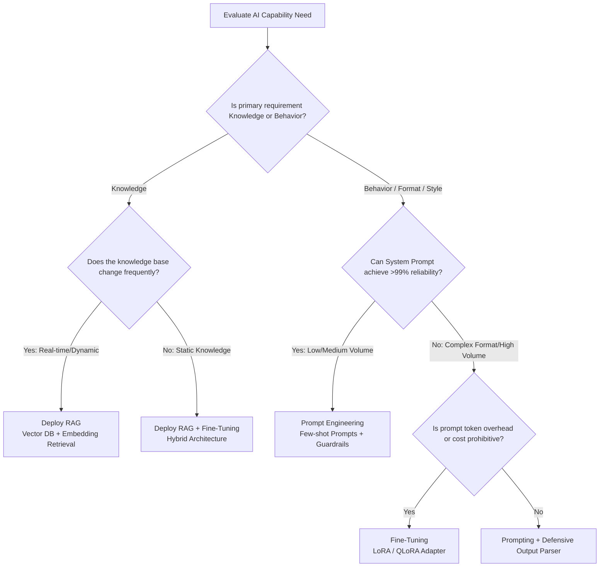
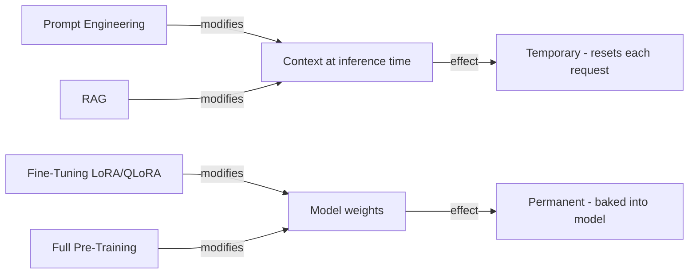
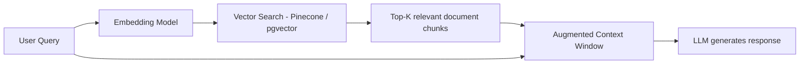

# Prompt Engineering vs Fine-Tuning vs RAG: Complete 2026 Decision Guide

**Answer-first:** When evaluating **prompt engineering vs fine tuning vs RAG**, the decision hinges on behavior versus knowledge. Choose **Prompt Engineering** for rapid prototyping and general domain tasks. Deploy **RAG (Retrieval-Augmented Generation)** when your application requires real-time knowledge retrieval from dynamic, frequently updated databases. Commit to **Fine-Tuning (LoRA/QLoRA)** when you need strict output formatting, persistent brand style compliance under adversarial input, or significant prompt token compression.

### What You'll Learn That AI Won't Tell You
- Production cost-benefit thresholds comparing fine-tuning a 7B/8B model locally versus calling proprietary APIs for structured schema generation.
- How to structure prompt engineering to handle 95% of intent recognition, and the exact boundary where local vLLM GGUF fine-tuning becomes cost-effective.

## Comparison Matrix: Prompt Engineering vs RAG vs Fine-Tuning

| Criteria | Prompt Engineering | RAG (Retrieval-Augmented Generation) | Fine-Tuning (LoRA / QLoRA) |
| :--- | :--- | :--- | :--- |
| **Primary Use Case** | Rapid prototyping, broad tasks, zero-shot reasoning | Real-time dynamic knowledge, product docs, live data | Strict output formatting, brand voice/style, token compression |
| **Cost per Request** | High (large context tokens per request) | Medium (embedding lookup + LLM prompt tokens) | Low (minimal system prompt; fixed host compute) |
| **Setup Complexity** | Zero infrastructure; immediate prompt edits | Medium (Vector DB, chunking, embedding pipeline) | High (GPU training run, dataset curation, weight management) |
| **Data Freshness** | Immediate (passed in context window) | Real-time (updated vector index) | Static snapshot (requires re-training on model updates) |
| **Latency** | High TTFT (large system prompt prefill) | Medium TTFT (retrieval overhead + prompt prefill) | Low TTFT (minimal system prompt; fast prefill) |
| **Token Overhead** | Heavy (thousands of instruction tokens) | Moderate (retrieved context chunks) | Minimal (behavior baked into adapter weights) |
| **Accuracy** | High for general tasks; fragile under edge cases | High for factual retrieval; zero hallucination when grounded | High for structural adherence and domain terminology |

## Decision Tree Flowchart: Choosing Your AI Architecture



> 

Three engineers on the same team are trying to build the same thing: a customer support assistant that answers questions in the company's specific support style, using terminology from their product documentation. One engineer says "just write a better system prompt." Another says "we need to fine-tune a model." The third says "this is clearly a RAG problem."

All three are partially right, and all three will be partially wrong depending on the specific requirement. The gap between "prompt engineering," "RAG," and "fine-tuning" is not just technical — it is a gap in understanding what each approach *actually changes* in the model.

This post provides a practical decision framework for AI engineers. We cover when prompt engineering is sufficient, when retrieval-augmented generation (RAG) is the correct architectural choice, and when LoRA or QLoRA fine-tuning is genuinely necessary — including the economics of each approach. The deeper implementation details for each path are covered in the [SLM Playbook Series](/series/slm-playbook/).

---

## The Core Question: Why "Just Prompt Better" Often Fails in Production

Prompt engineering is frequently the first tool engineers reach for, and for good reason: it requires no infrastructure changes, no training runs, and produces results in minutes. But it fails predictably in several scenarios:

**Style and tone drift**: A well-crafted system prompt can instruct a model to "respond formally and concisely in the style of an enterprise software support team." But under adversarial inputs, ambiguous queries, or simply long conversations, the model will gradually revert to its RLHF-trained default style. Prompt injection attacks can also override style instructions entirely.

**Terminology and domain vocabulary**: If your product uses terminology the base model was never trained on (proprietary names, industry jargon, internal abbreviations), a prompt cannot teach the model what those terms mean — it can only instruct the model to use them in outputs, which produces hallucinations when the model guesses at their meaning.

**Consistent output format adherence**: Instructing a model to "always respond in valid JSON with fields {name, category, action}" works well in demos and fails under adversarial or edge-case inputs in production. The model has not *learned* this format — it is following an instruction that competes with its next-token prediction training.

**Context window economics**: The more behavior you specify in a system prompt, the longer (and more expensive) every API call becomes. A 2,000-token system prompt that runs 1 million times per day costs real money, and the cost scales with volume.

Understanding these failure modes is the starting point for choosing the right approach.

---

## Understanding the Spectrum: Prompting → RAG → Fine-Tuning → Full Pre-Training

The four approaches exist on a spectrum of what they modify and how permanently:



**Prompt Engineering and RAG** operate entirely at inference time. They modify the context window — the information the model sees when generating a response. The model's underlying weights are unchanged. Every request starts from scratch.

**Fine-Tuning (LoRA/QLoRA)** modifies the model's weights — specifically, small adapter matrices added to the attention layers (LoRA) or the quantized model (QLoRA). The trained behavior is *baked into the model*. It persists across requests without any context overhead.

**Full Pre-Training** rebuilds the model from scratch on a new corpus. This is used by large organizations to train domain-specific foundation models (e.g., a medical LLM trained on clinical text). It is computationally expensive and outside the scope of this guide.

The practical question for most engineering teams is: which of the first three approaches solves my specific problem at the lowest total cost?

---

## When Prompt Engineering Is the Right Answer (and When It Isn't)

**✅ Use prompt engineering when:**
- The model already knows the domain and terminology (e.g., asking GPT-4 to explain general software architecture concepts)
- You need rapid iteration — behavior changes in minutes, not hours or days
- The task is well-defined enough to be fully specified in a few hundred tokens
- You are building a prototype or evaluating feasibility before committing to a deeper solution

**❌ Do NOT rely on prompt engineering when:**
- You need consistent output format adherence at production volume (>100K requests/day)
- The domain requires proprietary terminology or knowledge not in the training data
- Style and tone compliance is a hard business requirement (support contracts, brand guidelines)
- Users can potentially inject adversarial inputs that override your system prompt

**The practical test**: Run your prompting solution against 200 diverse edge-case inputs. If the failure rate exceeds your acceptable threshold, prompting alone is not sufficient.

---

## When RAG Is the Right Answer: Knowledge Retrieval vs. Behavior Change

RAG (Retrieval-Augmented Generation) is the correct choice when the primary problem is **knowledge**, not **behavior**.

If your model needs to answer questions accurately about:
- Your product documentation (which changes frequently)
- Internal policies, HR guidelines, or compliance rules
- Customer account data, order history, or ticket history
- News, research papers, or any corpus that postdates the model's training cutoff

...then fine-tuning is the wrong solution. Fine-tuning "bakes in" a static snapshot of knowledge. If your documentation changes monthly, re-running a fine-tuning job monthly is expensive and creates a knowledge freshness problem.

RAG solves this by **retrieving** the relevant document chunks at inference time and injecting them into the context window:



**✅ Use RAG when:**
- The knowledge base is large (too large to fit in a context window)
- The knowledge base changes frequently (documents updated weekly/monthly)
- You need source attribution (the model can cite which document it drew from)
- The task is knowledge retrieval, not behavior modification

**❌ Do NOT use RAG when:**
- The problem is how the model formats or styles its outputs (RAG doesn't change behavior)
- The retrieval quality is low (garbage-in-garbage-out — poor embeddings produce poor RAG)
- Latency is critical and the retrieval step adds unacceptable overhead

#### Case Study: The RAG vs. Fine-Tuning Hallucination Trap
An internal team once attempted to fine-tune an SLM with the company's entire technical documentation corpus instead of setting up a RAG pipeline. When users asked edge-case questions, the model hallucinated fake features because it tried to encode factual knowledge within its static weights.
* **The Correct Pattern:** Use RAG to fetch raw data from a vector database at runtime. Use fine-tuning (LoRA) to teach the model how to structure, format, and reason about that retrieved data.

A key insight: RAG and fine-tuning are often **complementary**, not alternatives. A fine-tuned model with correct style and format behavior, augmented by RAG for knowledge retrieval, is a common production pattern.

---

## When Fine-Tuning (LoRA/QLoRA) Is the Right Answer: Behavior and Style

Fine-tuning genuinely changes the model's behavior. Use it when the problem cannot be solved by telling the model what to do (prompting) or by giving it more information (RAG).

**✅ Use fine-tuning when:**

**1. Consistent output format at production volume**: If every response must be structured JSON, a specific XML schema, or a proprietary log format — and prompt-only approaches fail under edge cases — fine-tuning the model to natively produce that format eliminates the runtime enforcement problem.

**2. Style and tone that persists across adversarial inputs**: A fine-tuned model has the style "in its weights." It does not rely on a system prompt instruction that can be overridden.

**3. Domain vocabulary the base model doesn't know**: If your domain uses terminology not present in the base model's training data, fine-tuning on a corpus that includes that terminology teaches the model the actual meaning, not just the surface form.

**4. Reducing inference cost via prompt compression**: If you are running a smaller, self-hosted model (Llama 3, Mistral, Phi-3) and your system prompt is 2,000+ tokens, fine-tuning the desired behaviors directly into the model eliminates most of the system prompt overhead — reducing cost and latency per request.

**5. Preference alignment**: Adjusting the model's default tendencies (verbosity, hedging language, risk aversion) using techniques like DPO (Direct Preference Optimization) requires fine-tuning. Prompting alone cannot reliably override RLHF-trained defaults. See [Part 5: Preference Alignment (DPO, KTO, GRPO)](/series/slm-playbook/part-5-preference-alignment/) for the implementation detail.

### LoRA vs. QLoRA: The Practical Difference

**LoRA (Low-Rank Adaptation)** adds small trainable adapter matrices (typically 4–64 rank) to the attention layers of the frozen base model. During fine-tuning, only these small matrices are updated. The base model weights are unchanged.

**QLoRA** applies LoRA to a **quantized** version of the base model (4-bit NF4 quantization). This reduces the GPU VRAM required to hold the base model during training from ~80GB (BFloat16 Llama 3 70B) to ~20GB — enabling fine-tuning of large models on consumer-grade hardware (single A100 or even two 24GB RTX 4090s).

The tradeoff: QLoRA training is slightly slower than LoRA on full-precision models due to quantization/dequantization overhead, and the quantized base model may produce marginally lower quality outputs on complex reasoning tasks.

For most production fine-tuning tasks (format compliance, style alignment, domain vocabulary), QLoRA is the practical choice — the quality difference is marginal and the infrastructure cost savings are substantial. The hands-on implementation of LoRA and QLoRA with training scripts, hyperparameter selection, and adapter evaluation is covered in [Part 3: Practical LoRA & QLoRA Fine-Tuning](/series/slm-playbook/part-3-lora-qlora-tuning/).

---

## The Economics: Cost, Latency, and Maintenance Tradeoffs by Approach

| Dimension | Prompt Engineering | RAG | LoRA Fine-Tuning |
|---|---|---|---|
| **Setup time** | Minutes–hours | Days–weeks | Days–weeks |
| **Training cost** | $0 | $0 (embeddings only) | $50–$500+ per run |
| **Inference cost** | Base model cost + prompt tokens | Base model cost + retrieval latency | Base model cost (reduced prompt) |
| **Knowledge freshness** | Real-time (in prompt) | Real-time (retrieval) | Snapshot at training time |
| **Format adherence** | Fragile under edge cases | Not applicable | Robust |
| **Style consistency** | Fragile under adversarial input | Not applicable | Robust |
| **Maintenance burden** | Low (prompt edits) | Medium (embedding pipeline ops) | Medium (re-fine-tune on model updates) |

### Production Cost & Latency Benchmarks (Tipping Points)

Our engineering team conducted rigorous production benchmarks comparing OpenAI's cloud-hosted APIs (with few-shot prompts) against a self-hosted, fine-tuned Llama-3 8B model. The findings highlight the critical tipping points across two dimensions:

#### 1. Financial Cost Tipping Point
When forcing a model to generate complex JSON structures, prompt engineering requires numerous few-shot examples, bloating the system prompt.
* **Low Volume (<1,000 requests/day):** Using GPT-4o via API remains cost-optimal due to zero infrastructure overhead.
* **High Volume (>50,000 requests/day):** As the input token count swells (often exceeding 10,000 tokens per request), variable API costs grow exponentially. Fine-tuning a local SLM (e.g., Llama-3-8B) with QLoRA allows the model to understand the output structure natively without few-shot examples. This compresses prompt size and converts variable token charges into a predictable, fixed host compute cost.

#### 2. Latency Benchmarks (TTFT)
User experience is highly sensitive to the Time-to-First-Token (TTFT).
* **Cloud API (Large Prompt):** Under a 10k token context, the model spends substantial time in the prefill phase processing the input context. Together with network overhead, this pushes production TTFT above **800ms**.
* **Fine-tuned SLM (vLLM):** Since behavior and formatting are baked into the model weights, the system prompt remains minimal. Prefill times drop, reducing the average TTFT below **250ms** for a near-instantaneous user experience.

**The maintenance trap in fine-tuning**: When the base model provider releases a new version (GPT-4o Turbo, Llama 3.2, Mistral Nemo), your fine-tuned adapters are trained on the old model's weights. They cannot be directly transferred to the new model — you must re-run the fine-tuning job. For teams using commercial APIs, this creates a coupling between your production behavior and the provider's update schedule.

Self-hosting with vLLM (covered in the next section) gives you control over the model update cadence, avoiding forced re-fine-tuning.

---

## Decision Matrix: A Practical Framework for Your Team

Use this decision tree before committing to any approach:

```
Is the problem about WHAT the model knows?
├─ Yes → Does the knowledge change frequently?
│  ├─ Yes → RAG
│  └─ No → RAG or fine-tuning (if knowledge base is small enough to include in training data)
└─ No → Is the problem about HOW the model responds?
   ├─ Is it about output FORMAT or STYLE?
   │  ├─ Does prompting reliably produce the right format in 99%+ of cases?
   │  │  ├─ Yes → Prompt engineering (with defensive output parsing)
   │  │  └─ No → Fine-tuning (LoRA/QLoRA)
   ├─ Is it about domain VOCABULARY?
   │  ├─ Is the vocabulary in the base model's training data?
   │  │  ├─ Yes → Prompt engineering (provide definitions in context)
   │  │  └─ No → Fine-tuning on a domain corpus
   └─ Is it about reducing INFERENCE COST?
      ├─ Yes → Fine-tuning to compress system prompt behavior
      └─ No → Re-evaluate requirements
```

---

## Self-Hosting with vLLM: What Changes When You Fine-Tune Your Own SLM

When you fine-tune a small language model (Llama 3.1 8B, Phi-3 Mini, Mistral 7B) and self-host it using vLLM, the engineering picture changes meaningfully compared to commercial API usage.

### LoRA Adapter Loading in vLLM

vLLM supports serving multiple LoRA adapters on the same base model simultaneously. A single vLLM instance loads the base model once and dynamically swaps LoRA adapters per-request:

```bash
vllm serve meta-llama/Llama-3.1-8B-Instruct \
    --enable-lora \
    --lora-modules \
      support-style=/models/adapters/support-v2 \
      legal-drafting=/models/adapters/legal-v1 \
    --max-lora-rank 64
```

This enables **multi-tenant fine-tuned serving** — multiple teams sharing a single GPU cluster, each with their own fine-tuned behavior, without needing separate model instances per team.

### Quantization and Throughput

vLLM supports serving quantized models (GGUF, AWQ, GPTQ) with minimal throughput degradation compared to full-precision serving. A 4-bit AWQ Llama 3.1 8B model fits on a single 24GB GPU and serves approximately 500–800 tokens/second at batch size 1 — suitable for most production SLM workloads.

For the complete vLLM deployment guide with LoRA adapter management and autoscaling on Kubernetes, see [Part 6: vLLM Serving & Inference Optimization](/series/slm-playbook/part-6-vllm-deployment-evals/) which covers the full infrastructure stack. Production deployment of AI services also requires careful API versioning and authentication — covered in [OAuth 2.1 & Prompt Versioning for Production AI Agents](/posts/production-ai-apis-oauth-versioning-meta-predictions/). For teams deploying autonomous multi-agent AI systems powered by self-hosted SLMs, see [Production Agentic AI Swarm: OpenClaw & LiteLLM](/posts/deploying-autonomous-ai-swarm-openclaw-litellm/).

---

## Local SLM Inference: vLLM GGUF Support & Quantization

Self-hosting fine-tuned Small Language Models (SLMs) locally or on private cloud GPU instances provides complete sovereignty over data, zero per-token API charges, and deterministic latency. Modern inference engines like **vLLM** and **llama.cpp** make executing quantized local SLMs highly efficient.

### vLLM GGUF Execution Engine

Native **vLLM GGUF execution** allows hosting quantized GGUF format weights directly within high-throughput vLLM engines utilizing PagedAttention and dynamic multi-LoRA adapter swapping:

```bash
# Serving a 4-bit GGUF quantized 8B SLM locally via vLLM engine with LoRA support
vllm serve /models/Llama-3.1-8B-Instruct-Q4_K_M.gguf \
    --quantization gguf \
    --enable-lora \
    --lora-modules support-style=/models/adapters/support-v2 \
    --max-lora-rank 64 \
    --port 8000
```

### VRAM Footprints & Performance Benchmarks

Choosing the quantization format directly dictates GPU VRAM requirements and token generation throughput for 7B/8B class local SLMs:

| Model Format | Precision / Quantization | VRAM Required (8B Model) | Max Context Length | Token Generation Speed (Batch=1) |
| :--- | :--- | :--- | :--- | :--- |
| **Unquantized FP16** | 16-bit Floating Point | ~16.0 GB VRAM | 128k | ~65 tok/sec |
| **AWQ (Activation-aware)** | 4-bit W4A16 Tensor | ~5.8 GB VRAM | 128k | ~140 tok/sec (NVIDIA CUDA) |
| **GGUF (Q4_K_M)** | 4-bit Quantization | ~5.2 GB VRAM | 128k | ~120 tok/sec (GPU) / ~35 tok/sec (CPU) |
| **GGUF (Q8_0)** | 8-bit Quantization | ~8.5 GB VRAM | 128k | ~95 tok/sec |

### AWQ vs GGUF Quantization Trade-offs

When evaluating quantization formats for local SLM serving:

1. **AWQ (Activation-aware Weight Quantization)**:
   - *Best for*: Dedicated NVIDIA GPU inference clusters running vLLM.
   - *Key Trade-offs*: Maximum throughput via INT4 Tensor Cores, near-zero perplexity degradation compared to FP16, but requires CUDA GPUs and cannot offload layers to system RAM.

2. **GGUF (GPT-Generated Unified Format)**:
   - *Best for*: Edge hardware, hybrid CPU+GPU servers, Apple Silicon (Metal), and multi-tenant local developer workstations.
   - *Key Trade-offs*: Universal compatibility across llama.cpp and vLLM backends, supports partial layer offloading between GPU VRAM and CPU system RAM, but experiences lower throughput when CPU RAM offloading is active.

---

## Frequently Asked Questions

### What is the difference between fine-tuning and prompt engineering?
Prompt engineering modifies what the model *sees* (the context window) at inference time — the model's weights are unchanged. Fine-tuning modifies the model's *weights* directly — the trained behavior persists across all requests without any context window overhead. Prompt engineering is fast and cheap to iterate; fine-tuning produces more robust, consistent behavior but requires training compute and operational processes to manage model versions.

### When should I use RAG instead of fine-tuning?
Use RAG when the problem is *what the model knows* — especially when that knowledge changes frequently (product documentation, internal policies, news). Fine-tuning bakes knowledge into the weights as a static snapshot; if the knowledge changes, you must re-fine-tune. RAG retrieves the current knowledge at inference time. Use fine-tuning when the problem is *how the model behaves* — output format, style, tone, domain vocabulary.

### What is LoRA and how does it reduce fine-tuning costs?
LoRA (Low-Rank Adaptation) adds small trainable adapter matrices (rank 4–64) to the frozen base model's attention layers. Instead of updating all billions of parameters, LoRA trains only the small adapter matrices — typically less than 1% of the total parameter count. This reduces training compute and memory requirements by 10–100×, enabling fine-tuning of large models on a single GPU. QLoRA extends this by also quantizing the frozen base model to 4-bit, further reducing VRAM requirements.

### Can I fine-tune GPT-4 or Claude?
OpenAI offers fine-tuning for GPT-4o and GPT-3.5 Turbo via their API. Anthropic currently does not offer fine-tuning for Claude models. Fine-tuning commercial API models is more expensive per run than self-hosting (OpenAI charges per-token for training data), and you are dependent on the provider's update schedule for base model versions. For maximum control over the model update cadence and adapter management, self-hosting with open-weights models (Llama, Mistral, Phi) and vLLM is the more operationally flexible approach.



<script type="application/ld+json">
{
  "@context": "https://schema.org",
  "@type": "Article",
  "headline": "Prompt Engineering vs Fine-Tuning: 2026 AI Decision Guide",
  "author": {
    "@type": "Person",
    "name": "Lê Tuấn Anh",
    "url": "https://tanhdev.com/author/le-tuan-anh/"
  },
  "datePublished": "2026-06-01T10:00:00+07:00"
}
</script>

<script type="application/ld+json">
{
  "@context": "https://schema.org",
  "@type": "FAQPage",
  "mainEntity": [
    {
      "@type": "Question",
      "name": "What is the difference between fine-tuning and prompt engineering?",
      "acceptedAnswer": {
        "@type": "Answer",
        "text": "Prompt engineering modifies what the model sees (the context window) at inference time without changing model weights. Fine-tuning modifies model weights directly, producing persistent behavior across all requests."
      }
    },
    {
      "@type": "Question",
      "name": "When should I use RAG instead of fine-tuning?",
      "acceptedAnswer": {
        "@type": "Answer",
        "text": "Use RAG when knowledge changes frequently (product docs, internal policies). Fine-tuning bakes knowledge as a static snapshot into weights. Use fine-tuning when the requirement is output formatting, style, and domain vocabulary."
      }
    }
  ]
}
</script>
