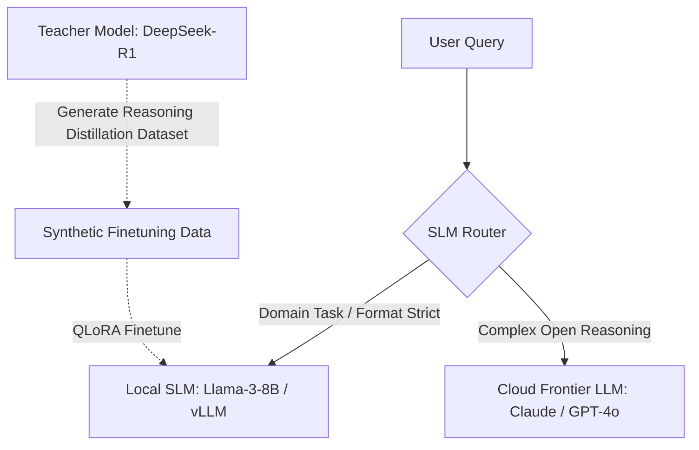

# Prompt Engineering vs Fine-Tuning vs RAG: Complete 2026 Decision Guide

**Answer-first:** When evaluating **prompt engineering vs fine tuning vs RAG**, the decision hinges on behavior versus knowledge. Choose **Prompt Engineering** for rapid prototyping. Deploy **RAG (Retrieval-Augmented Generation)** for dynamic, real-time knowledge retrieval. Commit to **Fine-Tuning (LoRA/QLoRA)**, **Knowledge Distillation (DeepSeek-R1)**, and **Preference Alignment (DPO/GRPO)** when you need strict formatting, low TTFT latency, and persistent style compliance on local Small Language Models (SLMs) served via vLLM.

---

## Executive Summary & SLM Playbook Architecture

Small Language Models (SLMs, 1B–8B parameters) combined with fine-tuning and local inference (vLLM) rival proprietary frontier LLMs on specialized domain tasks at a fraction of the cost:

1. **SLM Hybrid Architecture**: Router directs easy tasks to local SLMs and complex reasoning to cloud frontier models.
2. **Knowledge Distillation**: Distill reasoning trajectories from teacher models (DeepSeek-R1 / GPT-4o) into student SLMs.
3. **Preference Alignment**: Train model preferences using Direct Preference Optimization (DPO), KTO, or Group Relative Policy Optimization (GRPO).
4. **Production vLLM Deployment**: Serve multi-LoRA adapters on quantized AWQ/GGUF models with sub-250ms TTFT latency.

---

## Comparison Matrix: Prompt Engineering vs RAG vs Fine-Tuning

| Criteria | Prompt Engineering | RAG (Retrieval-Augmented Generation) | Fine-Tuning (LoRA / QLoRA) |
| :--- | :--- | :--- | :--- |
| **Primary Use Case** | Rapid prototyping, broad tasks | Real-time dynamic knowledge, live data | Strict formatting, brand style, token compression |
| **Cost per Request** | High (large context tokens per request) | Medium (embedding lookup + prompt tokens) | Low (minimal system prompt; fixed host compute) |
| **Setup Complexity** | Zero infrastructure | Medium (Vector DB, embedding pipeline) | High (GPU training run, dataset curation) |
| **Data Freshness** | Immediate | Real-time (updated vector index) | Static snapshot |
| **Latency (TTFT)** | High TTFT (>800ms) | Medium TTFT (~500ms) | Low TTFT (<250ms) |
| **Accuracy** | High for general tasks | High for factual retrieval | High for structural adherence |

---

## 1. SLM Hybrid Architecture & Knowledge Distillation

Instead of routing every user request to a expensive frontier cloud model:



### Knowledge Distillation from DeepSeek-R1 / Teacher Models
- Generate chain-of-thought (CoT) reasoning traces using a frontier teacher model.
- Filter out incorrect reasoning paths via deterministic validation scripts.
- Fine-tune a 1B–8B student SLM on the validated reasoning dataset using QLoRA.

---

## 2. Preference Alignment: DPO, KTO, and GRPO

Fine-tuning for format compliance gets you halfway; preference alignment guarantees brand tone and safety:
- **DPO (Direct Preference Optimization)**: Optimizes model policy directly on $(Prompt, Chosen, Rejected)$ triplets without training a separate reward model.
- **KTO (Kahneman-Tversky Optimization)**: Operates on binary $(Prompt, Response, IsGood)$ signals, simplifying data curation.
- **GRPO (Group Relative Policy Optimization)**: Evaluates a group of outputs against rule-based reward functions (used in R1 reasoning models).

---

## 3. Self-Hosting Local SLMs with vLLM & Multi-LoRA

vLLM serves quantized SLMs and dynamically swaps multiple LoRA adapters on a single GPU:

```bash
vllm serve meta-llama/Llama-3.1-8B-Instruct \
    --quantization awq \
    --enable-lora \
    --lora-modules \
      support-style=/models/adapters/support-v2 \
      legal-drafting=/models/adapters/legal-v1 \
    --max-lora-rank 64 \
    --port 8000
```

### Local SLM Quantization Benchmarks (8B Model)

| Model Format | Precision / Quantization | VRAM Required | Max Context | Token Speed (Batch=1) |
| :--- | :--- | :--- | :--- | :--- |
| **Unquantized FP16** | 16-bit Floating Point | ~16.0 GB VRAM | 128k | ~65 tok/sec |
| **AWQ (Tensor)** | 4-bit W4A16 | ~5.8 GB VRAM | 128k | ~140 tok/sec (CUDA) |
| **GGUF (Q4_K_M)** | 4-bit Quantization | ~5.2 GB VRAM | 128k | ~120 tok/sec (GPU) |

---

## FAQ


Prompt engineering modifies what the model sees at inference time without changing model weights. Fine-tuning modifies model weights directly, producing persistent format and style behavior across all requests with minimal system prompt overhead.



Knowledge Distillation extracts reasoning steps and high-quality outputs from a large teacher model (e.g. DeepSeek-R1 or GPT-4o) and uses them as training data to fine-tune a small student model (e.g. 8B SLM), giving the smaller model specialized reasoning capabilities.



DPO (Direct Preference Optimization) eliminates the need for training a separate reward model. It optimizes the policy network directly using a binary cross-entropy loss over chosen vs. rejected response pairs, making alignment faster and more stable.



