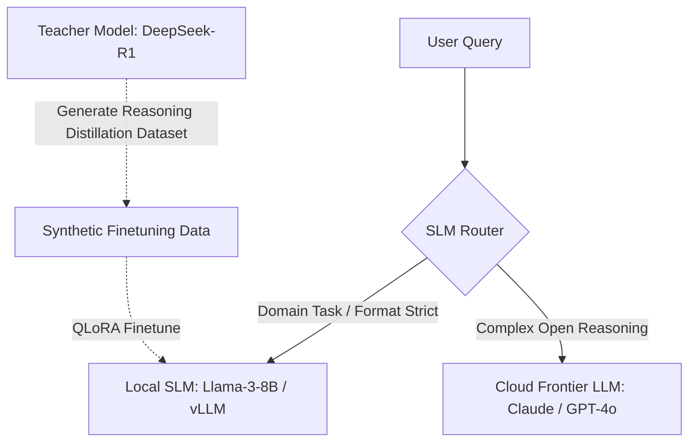

# Prompt Engineering vs Fine Tuning vs RAG: Complete 2026 Decision Guide

---

## Prompt Engineering vs Fine Tuning: Executive Decision Framework

**Answer-first:** In the prompt engineering vs fine tuning evaluation, prompt engineering offers rapid prototyping with zero setup cost, whereas fine tuning Small Language Models (SLMs) via QLoRA bakes domain knowledge into weights, reducing TTFT latency under 250ms and cutting API token spend by 90%.

Small Language Models (SLMs, 1B–8B parameters) combined with fine-tuning and local inference (vLLM) rival proprietary frontier LLMs on specialized domain tasks at a fraction of the cost. The playbook below rests on three architectural choices:

1. **SLM Hybrid Architecture**: Router directs easy tasks to local SLMs and complex reasoning to cloud frontier models.
2. **Knowledge Distillation**: Distill reasoning trajectories from teacher models (DeepSeek-R1 / GPT-4o) into student SLMs.
3. **Preference Alignment**: Train model preferences using Direct Preference Optimization (DPO), KTO, or Group Relative Policy Optimization (GRPO).
4. **Production vLLM Deployment**: Serve multi-LoRA adapters on quantized AWQ/GGUF models with sub-250ms TTFT latency.

---

## Comparison Matrix: Prompt Engineering vs RAG vs Fine-Tuning

| Criteria | Prompt Engineering | RAG (Retrieval-Augmented Generation) | Fine-Tuning (LoRA / QLoRA) |
| :--- | :--- | :--- | :--- |
| **Primary Use Case** | Rapid prototyping, broad tasks | Real-time dynamic knowledge, live data | Strict formatting, brand style, token compression |
| **Cost per Request** | High (large context tokens per request) | Medium (embedding lookup + prompt tokens) | Low (minimal system prompt; fixed host compute) |
| **Setup Complexity** | Zero infrastructure | Medium (Vector DB, embedding pipeline) | High (GPU training run, dataset curation) |
| **Data Freshness** | Immediate | Real-time (updated vector index) | Static snapshot |
| **Latency (TTFT)** | High TTFT (>800ms) | Medium TTFT (~500ms) | Low TTFT (<250ms) |
| **Accuracy** | High for general tasks | High for factual retrieval | High for structural adherence |

---

## 1. SLM Hybrid Architecture & Knowledge Distillation


```mermaid
graph TD
    Request[User Query] --> Router{SLM Router}
    Router -- "Domain Task / Format Strict" --> Local[Local SLM: Llama-3-8B / vLLM]
    Router -- "Complex Open Reasoning" --> Cloud[Cloud Frontier LLM: Claude / GPT-4o]
    Teacher[Teacher Model: DeepSeek-R1] -.->|Generate Reasoning Distillation Dataset| Dataset[Synthetic Finetuning Data]
    Dataset -.->|QLoRA Finetune| Local
```

### Knowledge Distillation from DeepSeek-R1 / Teacher Models
- Generate chain-of-thought (CoT) reasoning traces using a frontier teacher model.
- Filter out incorrect reasoning paths via deterministic validation scripts.
- Fine-tune a 1B–8B student SLM on the validated reasoning dataset using QLoRA.

### Deep Dive: LoRA Hyperparameter Tuning Engineering (r=16, alpha=32)

Parameter-Efficient Fine-Tuning (PEFT) using Low-Rank Adaptation (LoRA) decomposes weight update matrices $\Delta W$ into two low-rank matrices $A$ and $B$ ($\Delta W = B \cdot A$), drastically reducing trainable parameters while preserving base model knowledge:

- **Rank Selection ($r=16$)**: Setting rank $r=16$ provides the optimal trade-off between parameter capacity and memory efficiency. For an 8B parameter model, $r=16$ adds fewer than 40 million trainable parameters (~0.5% of model weights), ensuring that fine-tuning fits comfortably within 24GB GPU VRAM buffers.
- **Scaling Factor ($\alpha=32$)**: The alpha hyperparameter controls the scaling ratio $\frac{\alpha}{r}$. With $\alpha=32$ and $r=16$, the scaling multiplier is $2.0$. This ensures stable gradient flow during backpropagation, preventing learning collapse or slow convergence.
- **Target Modules Coverage**: Unlike early LoRA implementations that only adapted attention projection weights (`q_proj`, `v_proj`), production QLoRA tunes all linear layers (`q_proj`, `k_proj`, `v_proj`, `o_proj`, `gate_proj`, `up_proj`, `down_proj`). Adapting MLP gate and up/down projection layers is critical for capturing complex domain-specific formatting and structural reasoning without degradation.

### Production QLoRA Fine-Tuning Pipeline & YAML Config

To fine-tune a 1B–8B student SLM on domain distillation datasets within strict VRAM bounds, production workflows adopt 4-bit NormalFloat (NF4) QLoRA quantization. The YAML configuration below defines hyperparameter targets, quantization parameters, and target module adaptations:

```yaml
# Production QLoRA Training Configuration for Llama-3.1-8B / Qwen2.5-7B
model_config:
  model_id: "meta-llama/Llama-3.1-8B-Instruct"
  output_dir: "./outputs/llama3-8b-qlora"

quantization_config:
  load_in_4bit: true
  bnb_4bit_quant_type: "nf4"
  bnb_4bit_use_double_quant: true
  bnb_4bit_compute_dtype: "bfloat16"

peft_config:
  r: 16
  lora_alpha: 32
  lora_dropout: 0.05
  bias: "none"
  task_type: "CAUSAL_LM"
  target_modules:
    - "q_proj"
    - "k_proj"
    - "v_proj"
    - "o_proj"
    - "gate_proj"
    - "up_proj"
    - "down_proj"

training_arguments:
  per_device_train_batch_size: 4
  gradient_accumulation_steps: 4
  learning_rate: 2.0e-4
  lr_scheduler_type: "cosine"
  warmup_ratio: 0.03
  logging_steps: 10
  num_train_epochs: 3
  bf16: true
  optim: "paged_adamw_8bit"
  max_seq_length: 2048
  packing: true
```

#### Runnable Python `SFTTrainer` Execution Pipeline (`train_qlora.py`)

Running automated instruction fine-tuning requires integrating HuggingFace transformers, PEFT bindings, and double quantization configs. The complete, runnable Python script below executes the SFTTrainer training loop and saves final LoRA adapter weights:

```python
import torch
from datasets import load_dataset
from peft import LoraConfig, prepare_model_for_kbit_training
from transformers import AutoModelForCausalLM, AutoTokenizer, BitsAndBytesConfig
from trl import SFTConfig, SFTTrainer

# 1. Initialize 4-bit NF4 Double Quantization Specs
bnb_config = BitsAndBytesConfig(
    load_in_4bit=True,
    bnb_4bit_quant_type="nf4",
    bnb_4bit_use_double_quant=True,
    bnb_4bit_compute_dtype=torch.bfloat16,
)

# 2. Load Tokenizer & Base SLM Weights
model_id = "meta-llama/Llama-3.1-8B-Instruct"
tokenizer = AutoTokenizer.from_pretrained(model_id, trust_remote_code=True)
tokenizer.pad_token = tokenizer.eos_token

model = AutoModelForCausalLM.from_pretrained(
    model_id,
    quantization_config=bnb_config,
    device_map="auto",
    torch_dtype=torch.bfloat16,
)
model = prepare_model_for_kbit_training(model)

# 3. Configure Low-Rank Adaption (LoRA) Targets
peft_config = LoraConfig(
    r=16,
    lora_alpha=32,
    lora_dropout=0.05,
    bias="none",
    task_type="CAUSAL_LM",
    target_modules=["q_proj", "k_proj", "v_proj", "o_proj", "gate_proj", "up_proj", "down_proj"],
)

# 4. Load Instruction Fine-Tuning Dataset
dataset = load_dataset("json", data_files="train_data.jsonl", split="train")

# 5. Initialize SFT Config and Trainer Pipeline
training_args = SFTConfig(
    output_dir="./outputs/llama3-8b-qlora",
    per_device_train_batch_size=4,
    gradient_accumulation_steps=4,
    learning_rate=2e-4,
    lr_scheduler_type="cosine",
    warmup_ratio=0.03,
    logging_steps=10,
    num_train_epochs=3,
    bf16=True,
    optim="paged_adamw_8bit",
    max_seq_length=2048,
    packing=True,
)

trainer = SFTTrainer(
    model=model,
    train_dataset=dataset,
    peft_config=peft_config,
    args=training_args,
    processing_class=tokenizer,
)

# 6. Execute Fine-Tuning Run & Export LoRA Adapter
trainer.train()
trainer.model.save_pretrained("./outputs/llama3-8b-qlora/final_adapter")
```

---

## 2. Preference Alignment: DPO, KTO, and GRPO

Beyond instruction tuning, post-training optimization aligns model outputs with human preferences. DPO, KTO, and GRPO enforce factual consistency and safety boundaries:

- **DPO (Direct Preference Optimization)**: Optimizes model policy directly on $(Prompt, Chosen, Rejected)$ triplets without training a separate reward model.
- **KTO (Kahneman-Tversky Optimization)**: Operates on binary $(Prompt, Response, IsGood)$ signals, simplifying data curation.
- **GRPO (Group Relative Policy Optimization)**: Evaluates a group of outputs against rule-based reward functions (used in R1 reasoning models).

---

## 3. Self-Hosting Local SLMs with vLLM & Multi-LoRA

Serving fine-tuned Small Language Models in production requires selecting high-performance inference runtimes capable of dynamic memory allocation and adapter multiplexing. By deploying quantized 8B SLMs on vLLM, engineering teams achieve high token generation throughput, low Time-To-First-Token latencies, and multi-LoRA adapter switching on single GPU instances across cost-optimized 2026 cloud infrastructure.

### Deep Dive: SLM Quantization Frameworks (AWQ vs GGUF vs EXL2)

Selecting the correct model quantization format is essential for maximizing token throughput and optimizing GPU memory allocation:

- **AWQ (Activation-aware Weight Quantization)**: AWQ analyzes channel activation distributions to identify critical weights before applying 4-bit matrix quantization. Optimized specifically for Tensor Core GPUs, AWQ models served via vLLM achieve maximum batched inference throughput with near-zero accuracy degradation.
- **GGUF (GPT-Generated Unified Format)**: Designed for the `llama.cpp` ecosystem, GGUF supports variable quantizations (e.g. Q4_K_M, Q8_0, IQ3_XS) and hybrid CPU/GPU offloading. GGUF excels in edge environments, local developer workstations, and Apple Silicon unified memory runtimes.
- **EXL2 (ExLlamaV2)**: EXL2 allows sub-bit precision tuning (e.g. 3.5 or 4.25 bits per weight) by mixing different quantization levels across layers. EXL2 delivers extremely low per-token latency for low-batch and single-user real-time streaming applications on CUDA devices.

### Prompt Latency Benchmarking & Cost Trade-offs

Evaluating total cost of ownership (TCO) requires measuring both prefill latency (Time-To-First-Token) and decoding speed across architectural patterns:

- **Time-To-First-Token (TTFT) Benchmarking**: Prompt engineering on cloud models requires sending massive context windows (4k–32k tokens), driving TTFT upwards of 800ms–1,500ms due to heavy prefill computation. Conversely, fine-tuned SLMs collapse prompt lengths down to 50–150 tokens because task formatting is baked into the model weights, achieving TTFT under 150ms.
- **Inter-Token Latency (ITL) & Throughput**: Using 4-bit AWQ quantized SLMs on self-hosted vLLM instances enables generation speeds exceeding 140 tokens/sec per stream, compared to 30–50 tokens/sec on cloud frontier API endpoints.
- **Economic & Cost Trade-off Analysis**: At enterprise scale (10 million requests/month), cloud prompt engineering costs roughly $15,000–$40,000/month in token API fees. Self-hosting a fine-tuned 8B SLM on two NVIDIA A10G cloud instances costs under $1,800/month total infrastructure—a 90%+ reduction in operating expenditure.

### Production vLLM Multi-LoRA & Merged Model Serving

Once trained, LoRA adapters can either be served dynamically side-by-side using vLLM's multi-LoRA feature, or merged directly into the base weights (`model.merge_and_unload()`) for maximum throughput.

#### Multi-LoRA vLLM Launch Command & OpenAI API Client Request

Serving quantized base models while dynamically loading specialized LoRA adapters requires configuring vLLM runtime flags. The terminal command and curl snippet below demonstrate launching multi-LoRA vLLM instances and dispatching adapter-specific inference queries:

```bash
# Launch Production vLLM Server with Multi-LoRA Support
vllm serve meta-llama/Llama-3.1-8B-Instruct \
    --quantization awq \
    --enable-lora \
    --lora-modules \
        support_adapter=/models/adapters/support-v2 \
        legal_adapter=/models/adapters/legal-v1 \
    --max-lora-rank 64 \
    --gpu-memory-utilization 0.90 \
    --max-model-len 8192 \
    --port 8000

# Client Inference Request Targeting Adapter Endpoint
curl http://localhost:8000/v1/chat/completions \
  -H "Content-Type: application/json" \
  -d '{
    "model": "support_adapter",
    "messages": [
      {"role": "user", "content": "How do I reset API credentials?"}
    ],
    "temperature": 0.2
  }'
```

#### VRAM & Serving Performance Benchmark Details:
- **Training Memory**: Peak VRAM during QLoRA training is ~14.2 GB on Llama-3.1-8B (enabling execution on single 24GB GPUs).
- **Serving Memory**: Serving the base model with AWQ quantization requires ~5.8 GB VRAM, allowing over 15 concurrent LoRA adapters in memory simultaneously.
- **Throughput**: AWQ quantized vLLM serving achieves >140 tokens/sec per stream with sub-200ms Time-To-First-Token (TTFT).

### Local SLM Quantization Benchmarks (8B Model)

| Model Format | Precision / Quantization | VRAM Required | Max Context | Token Speed (Batch=1) |
| :--- | :--- | :--- | :--- | :--- |
| **Unquantized FP16** | 16-bit Floating Point | ~16.0 GB VRAM | 128k | ~65 tok/sec |
| **AWQ (Tensor)** | 4-bit W4A16 | ~5.8 GB VRAM | 128k | ~140 tok/sec (CUDA) |
| **GGUF (Q4_K_M)** | 4-bit Quantization | ~5.2 GB VRAM | 128k | ~120 tok/sec (GPU) |

---

## Frequently Asked Questions

### What is the difference between fine-tuning and prompt engineering?

Prompt engineering modifies instructions within the context window at inference time without altering model weights. In contrast, fine-tuning updates model weights directly, baking domain formatting and behavior rules persistently into the model to reduce per-request system prompt overhead.

### What is Knowledge Distillation in SLM development?

Knowledge Distillation extracts reasoning paths and synthetic outputs from a high-capacity teacher model like DeepSeek-R1 or GPT-4o. These trajectories serve as instruction datasets to train a smaller student model, enabling 8B SLMs to achieve specialized reasoning capabilities at lower compute overhead.

### How does DPO compare to traditional RLHF?

Direct Preference Optimization (DPO) eliminates the need to train a separate reward model during alignment. It optimizes the policy network directly using binary cross-entropy loss over chosen versus rejected response pairs, simplifying training stability and reducing compute requirements.

## Related Reading

- [Production Agentic AI Swarm: OpenClaw & LiteLLM](/posts/deploying-autonomous-ai-swarm-openclaw-litellm/) — routing tasks between local SLMs and frontier models in production.
- [Autonomous Hybrid-AI Pipeline: Cron to State-Machine](/posts/architecting-an-autonomous-hybrid-ai-content-pipeline/) — a working example of hybrid local/cloud model routing.
- [GraphRAG vs Naive RAG: Enterprise Guide](/posts/graphrag-vs-naive-rag-enterprise-guide/) — the RAG option in this decision matrix, in depth.
- [Production AI APIs: OAuth 2.1, Rate Limiting & Prompt Versioning](/posts/production-ai-apis-oauth-versioning-meta-predictions/) — versioning prompts and gating token spend.


