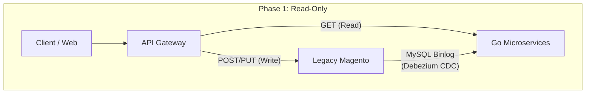

"Let's rewrite everything to Microservices." 
This sentence usually precedes multimillion-dollar engineering failures. When a legacy application (like a massive Magento e-commerce store) is holding up the financial weight of a company, doing a "Big Bang" cutover is practically suicidal.

Instead of burning the old house down before the new one is built, we employed the **Strangler Fig Pattern**. We allowed the new Go microservice ecosystem to gradually wrap around the old Magento monolith, intercepting its traffic piece by piece until the legacy server safely died of "starvation." 

Here is the exact 3-Phase blueprint we used to accomplish a true Zero-Downtime migration.

### Phase 1: Read-Only Migration (The Gateway Router)
In week one, we deployed our completely empty Go database clusters and our API Gateway.

The API Gateway is configured with **smart routing**. Whenever a user loaded a product page (`GET`), the gateway routed the traffic to the blazing-fast Go `Catalog` service. If the user clicked "Add to Cart" (`POST`), the traffic was routed to the old Magento instance. 
**But wait, how did the Go database get the product data?** 
We implemented a real-time CDC (Change Data Capture) pipeline using Debezium. By reading Magento's MySQL binlogs, every price update or stock change in Magento was streamed instantly (sub-second latency) over to the Go Postgres clusters. Go became a super-fast read replica of the monolith.

### Phase 2: Read-Write Dual Sync (The Hardest Step)
We can't rely on Magento forever. We needed to shift the write traffic over to Go, service by service.

We shifted the `Customer` and `Order` API writes to Go. But because Magento still controlled `Fulfillment`, Magento *needed* to know about the orders Go was creating.
To solve this, we moved past one-way CDC and built a bidirectional **Event Bus Sync** using Dapr PubSub.

* When an order was placed in Go, it published an `order.created` event. A dedicated Sync Worker caught this event and wrote it backward into Magento's database using Magento's massive EAV (Entity-Attribute-Value) schema format.
* To prevent primary key collisions (Magento using auto-increment INTs, Go using UUIDs), our sync layer kept a persistent `id_mapping_table` in Redis for instant cross-referencing.

### Phase 3: Full Cutover & Archive
After 6 weeks, all write-heavy traffic (Checkout, Order, Payment, Catalog) was pointing directly at the 21 Go microservices. Magento's API traffic had dropped to absolute zero.

Did we delete it? **No.**
Magento was quietly demoted to a **Hot Standby**. For 30 days, we continued to sync Go's data back into Magento. If a critically catastrophic flaw was found in the new Go cluster, we could simply flip the API Gateway switch back to Magento in < 10 seconds, and no data would be lost.

Once the 30-day quarantine period cleanly expired, we finally terminated Magento's EC2 instances. The Strangler Fig had fully consumed the host.

### The Takeaway
Rewrite projects don't fail because Microservices are inherently bad; they fail because developers neglect data-consistency during the transition. By utilizing CDC/Debezium for Phase 1, and bidirectional Event Driven outboxes for Phase 2, we secured the absolute safety of our data and proved that legacy migrations can be boring, predictable, and 100% safe.
