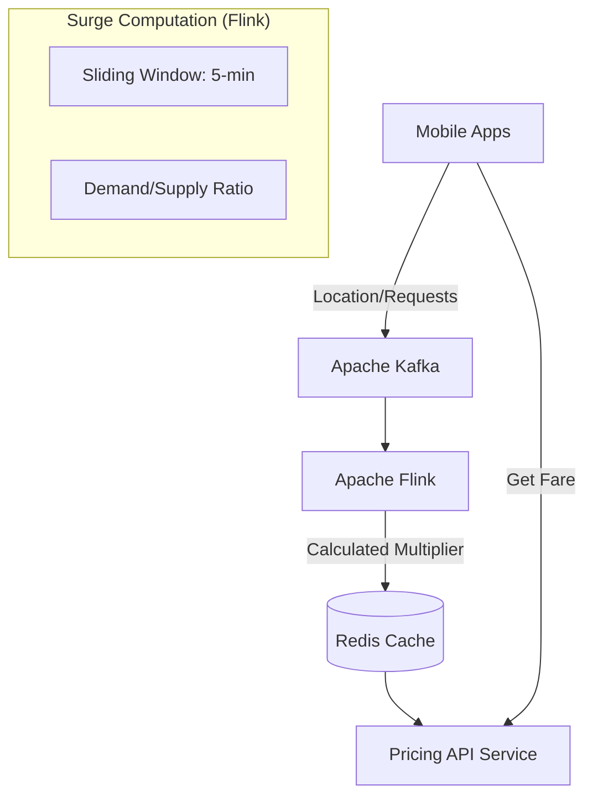

---
title: "Surge Pricing Algorithm & Spatial Indexing Architecture"
cover:
  image: "/images/posts/default-post.png"
  alt: "Surge Pricing Optimization Architecture"
slug: "surge-pricing-optimization-architecture"
author: "Lê Tuấn Anh"
date: "2026-06-01T15:20:00+07:00"
lastmod: "2026-06-10T16:00:00+07:00"
draft: false
mermaid: true
categories:
  - "Architecture"
  - "Data Engineering"
  - "Algorithm"
tags:
  - "Surge Pricing"
  - "Uber H3"
  - "Apache Kafka"
  - "Apache Flink"
  - "Redis"
  - "Real-time Architecture"
  - "Dynamic Pricing"
description: "Explore the architecture of a real-time Surge Pricing algorithm. Discover how Uber utilizes the H3 spatial index, Kafka, and Flink to calculate dynamic pricing."
ShowToc: true
TocOpen: true
cover:
  image: "/images/posts/surge-pricing-cover.png"
  alt: "Surge pricing optimization architecture: real-time demand-supply ML model for marketplace platforms"
  relative: false
---

**Answer-first:** Surge pricing calculates dynamic multipliers by matching supply and demand in real-time. The architecture indexes locations via H3 hexagons, streams GPS updates through Kafka, and aggregates demand density using Apache Flink to calculate price updates dynamically.

### What You'll Learn That AI Won't Tell You
- Implementing spatial aggregators in Apache Flink for surge multipliers.
- Preventing pricing oscillations using smooth sliding-window time series models.

Why is it that every time it rains, ride-hailing fares double, or even triple? It's not a human operator manually adjusting the prices behind a desk. Rather, it's the result of an incredibly sophisticated Stream Processing engine running in the background executing the **surge pricing algorithm**.

In this article, we will "dissect" the architecture of a real-time dynamic pricing system. We will explore everything from dividing geographical space using Uber's H3 library to the data processing architecture built on Kafka and Flink. Furthermore, we will examine why [Scaling your Database to handle Surge traffic](/posts/mysql-horizontal-scaling) is a strict prerequisite to prevent your system from crashing during massive traffic spikes.

---

## Understanding Surge Pricing and the Surge Multiplier

In economic terms, Surge Pricing is essentially a Supply - Demand Matching problem within a Marketplace ecosystem. Similar supply-side allocation challenges appear in [logistics dispatch and routing systems](/posts/graphhopper-distance-matrix-routing) that coordinate delivery fleets at scale.
- **Demand:** The number of riders currently opening the app, searching for rides, or requesting trips in a specific area.
- **Supply:** The number of drivers currently online and ready to accept rides in that same area.

When demand outstrips supply (for example, right after a concert ends), the system applies a **Surge Multiplier** (e.g., `1.5x` or `2.0x`). The goal of this multiplier isn't just to maximize profit, but more importantly:
1. **To attract more drivers** from surrounding areas into the depleted zone.
2. **To filter demand:** Only customers who urgently need a ride will accept the higher fare, preventing the system from suffering localized overloads.

---

## Spatial Partitioning with the H3 Hexagonal Index (Uber H3)

A system cannot calculate a single Surge price for an entire city because demand in the downtown commercial district differs wildly from the suburbs. Geographical space must be finely partitioned. The **Uber H3 (Hexagonal Hierarchical Spatial Index)** is the ultimate tool for this.

### Why Are Hexagons Better Than Square Grids or Circles?

Historically, maps were divided using square grids or radial coordinates (circles).
- **Squares:** The distance from the center of a square to its 4 orthogonal neighbors (North, South, East, West) is $1$, but the distance to its 4 diagonal neighbors is $\sqrt{2}$. This distorts radius search algorithms when looking for drivers in neighboring cells.
- **Hexagons:** Hexagons possess perfect geometric properties: the distance from the center of a hexagon to the center of all 6 of its neighbors is **absolutely equal**. This allows flood-fill algorithms, used for grouping drivers, to operate flawlessly.

### Choosing the Right H3 Resolution for Urban Density

H3 divides the globe into hexagonal cells with Resolutions ranging from 0 (massive) to 15 (less than 1 square meter).

For the Surge Pricing use case:
- **Resolution 8** (approx. 0.73 km²): Typically used for suburban areas or low-density cities.
- **Resolution 9** (approx. 0.10 km² - about the size of a few city blocks): This is the gold standard for dense urban environments. At this resolution, the system can precisely surge the price at a traffic-jammed intersection, while a location 500 meters away remains at normal pricing.

---

## Real-time Streaming Data Architecture

Calculating a Surge price is not a Batch Processing task run every night; it must be continuously recalculated every single second (Stream Processing).

### Ingesting GPS and Booking Data via Apache Kafka
Whenever a customer opens the app, drags the map, or a driver moves, these signals (Pings) encode the coordinates (Lat/Lng) into an `H3_Index` (e.g., `89283082803ffff`). This data is continuously fired into **Apache Kafka** partitions. Kafka acts as a massive buffer, absorbing millions of events per second.

### Processing Sliding Windows in Apache Flink for Data Smoothing
**Apache Flink** ingests this data stream from Kafka. Instead of calculating prices based on instantaneous moments (which are highly susceptible to network noise), Flink utilizes **Sliding Windows**. 

For example: Flink will count the number of Rider Pings and Online Drivers over the last 5-minute window, sliding forward every 30 seconds.
Based on the `Demand / Supply` ratio of each H3 cell within this window, Flink calculates the resulting Surge Multiplier.

### High-Performance Caching with Redis for Sub-100ms API Responses
The calculated Surge Multipliers (e.g., `[89283082803ffff: 1.5x]`) are continuously overwritten into **Redis** by Flink. 
When a customer's app makes a `Get_Fare()` API call, the [Backend API Microservice](/posts/banking-microservices-architecture) directly queries Redis using the customer's `H3_Index` key. Because Redis serves data entirely from RAM, the API response time is guaranteed to stay **under 100ms**.

---

## Damping Algorithms and Anti-Collusion Safeguards

### The Damping Feedback Loop
If the Surge spikes too high (e.g., to 4.0x), the Conversion Rate—the number of people who actually click "Book Ride"—will plummet to 0%. At this point, real demand (people willing to pay) is wiped out, but the influx of drivers causes supply to skyrocket.

If the algorithm is naive, it would immediately drop the Surge back to 1.0x, causing prices to oscillate violently. Modern systems must apply **Damping** algorithms (similar to PID controllers in physics) to smooth the pricing curve, creating a "soft-landing" by lowering prices gradually rather than abruptly cutting them.

### Anti-Collusion Measures
There are documented cases where groups of drivers intentionally log off (Offline) at an airport simultaneously to create a false shortage, triggering Surge Pricing, and then simultaneously log back on (Online) to scoop up high-paying rides.
The Flink system must monitor the *Driver Offline Spike* variable for anomalies and override or block Surge increases in areas exhibiting this behavior.

---

## Designing Fail-Safe Scenarios for the Pricing System (Default 1.0x)

Always remember the golden rule of distributed systems: "Everything fails."
What happens if the Kafka cluster crashes, or Flink suffers an OOM (Out Of Memory) error and halts processing?

If the Backend API queries Redis and finds no Surge configuration (due to TTL - Time To Live expiration), it **must absolutely never throw an HTTP 500 error**. Instead, the API must implement a **Fail-Safe** mechanism: automatically gracefully falling back to a default multiplier of **1.0x (Normal Fare)**. 

It is infinitely better for a business to absorb the loss of 15 minutes of surge revenue than to lock hundreds of thousands of customers out from requesting a ride home, causing irreversible damage to the brand's reputation.

For the complete engineering deep-dive on how ride-hailing platforms build this surge pricing engine — including the full Flink state machine, driver multiplier coefficients, and demand forecasting integration — see [Part 5: Surge Pricing Engine (Ride-Hailing Architecture Series)](/series/ride-hailing-realtime-architecture/part-5-pricing-surge-engine/).

## FAQ


Uber uses **H3 hexagonal grids** because hexagons have a critical geometric property that squares lack: the distance from the center of a hexagon to the center of all 6 of its neighbors is exactly equal. In a square grid, the distance to orthogonal neighbors is 1, but the distance to diagonal neighbors is √2 — a 41% difference that distorts radius search algorithms when looking for drivers in adjacent cells. At H3 Resolution 9 (roughly 0.10 km², about the size of a city block), the system can apply a surge multiplier to one specific intersection while leaving a location 500 meters away at the normal fare.



**Apache Flink** is preferred over Spark Streaming for surge pricing because Flink is a true **stream-first** system: it processes each event the moment it arrives with sub-second latency. Spark Streaming (Structured Streaming) uses micro-batching — it still processes events in small time-window batches, introducing 1–2 second minimum latency. For surge pricing, where a Demand/Supply ratio must be recalculated every 30 seconds based on a sliding 5-minute window, Flink's native event-time processing and stateful stream operators (e.g., `SlidingEventTimeWindows`) are a direct fit without the micro-batch overhead.



The system must implement a **fail-safe default**: when the Backend API queries Redis for a Surge multiplier and finds no value (due to TTL expiration after a Flink/Kafka outage), it must return a default multiplier of **1.0x (Normal Fare)** and never throw an HTTP 500 error. This is the golden rule of distributed pricing systems: absorb 15 minutes of lost surge revenue rather than lock hundreds of thousands of users out from requesting rides. In practice, each Redis Surge key is written with a TTL slightly longer than the Flink window interval — so a Flink restart during a 30-second lag window does not immediately expire all keys. Alerting on Redis TTL miss rate is the canary signal that the stream processor is down.


---

**Related Reading:** Surge pricing is one component of a larger real-time logistics platform. See [Real-Time Ride-Hailing Architecture: Uber & Grab](/series/ride-hailing-realtime-architecture/) for the complete system — from GPS event streaming and H3 geospatial matching to RAMEN notifications and driver dispatch. For the delivery-side application of spatial indexing and routing optimization, see [Order Fulfillment Algorithm: Warehouse to Last-Mile](/posts/order-fulfillment-algorithm-warehouse-last-mile/).
