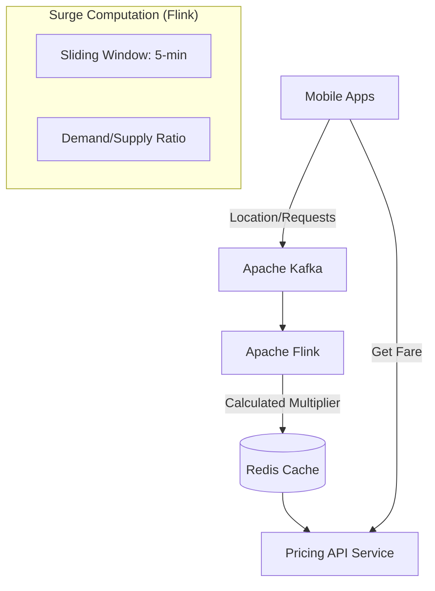

# Surge Pricing Algorithm & Spatial Indexing Architecture

Why is it that every time it rains, ride-hailing fares double, or even triple? It's not a human operator manually adjusting the prices behind a desk. Rather, it's the result of an incredibly sophisticated Stream Processing engine running in the background executing the **surge pricing algorithm**.

This analysis breaks down the architecture of a real-time dynamic pricing system: indexing geographical rider demand and driver supply using Uber's H3 hexagonal spatial grids, aggregating supply/demand ratios over Redis sliding windows, and calculating dynamic fare multipliers while damping oscillations and preventing boundary gaming. We also cover why [Scaling your Database to handle Surge traffic](/posts/mysql-horizontal-scaling/) is a strict prerequisite to prevent your system from crashing during massive traffic spikes.

---

## Understanding Surge Pricing and the Surge Multiplier

Surge pricing is an automated marketplace equilibrium mechanism that balances real-time rider demand against available driver supply. By continuously evaluating regional supply-demand ratios, dynamic pricing engines adjust trip multipliers to incentivize off-duty drivers to enter high-demand zones while filtering out low-urgency ride requests.

- **Demand:** The number of riders currently opening the app, searching for rides, or requesting trips in a specific area.
- **Supply:** The number of drivers currently online and ready to accept rides in that same area.

When demand outstrips supply (for example, right after a concert ends), the system applies a **Surge Multiplier** (e.g., `1.5x` or `2.0x`). The goal of this multiplier isn't just to maximize profit, but more importantly:
1. **To attract more drivers** from surrounding areas into the depleted zone.
2. **To filter demand:** Only customers who urgently need a ride will accept the higher fare, preventing the system from suffering localized overloads.

---

## Spatial Partitioning with the H3 Hexagonal Index (Uber H3)

A system cannot calculate a single Surge price for an entire city because demand in the downtown commercial district differs wildly from the suburbs. Geographical space must be finely partitioned. The **Uber H3 (Hexagonal Hierarchical Spatial Index)** is the ultimate tool for this.

### Why Are Hexagons Better Than Square Grids or Circles?

Historically, maps were divided using square grids or radial coordinates (circles).
- **Squares:** The distance from the center of a square to its 4 orthogonal neighbors (North, South, East, West) is $1$, but the distance to its 4 diagonal neighbors is $\sqrt{2}$. This distorts radius search algorithms when looking for drivers in neighboring cells.
- **Hexagons:** Hexagons possess perfect geometric properties: the distance from the center of a hexagon to the center of all 6 of its neighbors is **absolutely equal**. This allows flood-fill algorithms, used for grouping drivers, to operate flawlessly.

### Choosing the Right H3 Resolution for Urban Density

H3 divides the globe into hexagonal cells with Resolutions ranging from 0 (massive) to 15 (less than 1 square meter).

For the Surge Pricing use case:
- **Resolution 8** (approx. 0.73 km²): Typically used for suburban areas or low-density cities.
- **Resolution 9** (approx. 0.10 km² - about the size of a few city blocks): This is the gold standard for dense urban environments. At this resolution, the system can precisely surge the price at a traffic-jammed intersection, while a location 500 meters away remains at normal pricing.

---

## Real-time Streaming Data Architecture

A high-throughput stream processing pipeline handles the continuous location telemetry: GPS updates land in Apache Kafka topics, sliding-window aggregations run in Apache Flink, and multiplier results get cached in Redis for fast reads.


```mermaid
flowchart TD
    App[Mobile Apps] -->|Location/Requests| Kafka[Apache Kafka]
    Kafka --> Flink[Apache Flink]
    
    subgraph Stream_Processing["Surge Computation (Flink)"]
        Flink_Window[Sliding Window: 5-min]
        Flink_Calc[Demand/Supply Ratio]
    end
    
    Flink -->|Calculated Multiplier| Redis[(Redis Cache)]
    Redis --> API[Pricing API Service]
    App -->|Get Fare| API
```

### Ingesting GPS and Booking Data via Apache Kafka
Whenever a customer opens the app, drags the map, or a driver moves, these signals (Pings) encode the coordinates (Lat/Lng) into an `H3_Index` (e.g., `89283082803ffff`). This data is continuously fired into **Apache Kafka** partitions. Kafka acts as a massive buffer, absorbing millions of events per second.

### Processing Sliding Windows in Apache Flink for Data Smoothing
**Apache Flink** ingests this data stream from Kafka. Instead of calculating prices based on instantaneous moments (which are highly susceptible to network noise), Flink utilizes **Sliding Windows**. 

For example: Flink will count the number of Rider Pings and Online Drivers over the last 5-minute window, sliding forward every 30 seconds.
Based on the `Demand / Supply` ratio of each H3 cell within this window, Flink calculates the resulting Surge Multiplier.

### High-Performance Caching with Redis for Sub-100ms API Responses
The calculated Surge Multipliers (e.g., `[89283082803ffff: 1.5x]`) are continuously overwritten into **Redis** by Flink. 
When a customer's app makes a `Get_Fare()` API call, the [Backend API Microservice](/posts/banking-microservices-architecture/) directly queries Redis using the customer's `H3_Index` key. Because Redis serves data entirely from RAM, the API response time is guaranteed to stay **under 100ms**.

---

## Damping Algorithms and Anti-Collusion Safeguards

Preventing violent price oscillations and deliberate driver manipulation means embedding algorithmic safeguards directly into the stream processing pipeline: exponential damping to smooth fare adjustments, and anomaly detection on driver offline spikes to catch coordinated collusion attempts.

### The Damping Feedback Loop
If the Surge spikes too high (e.g., to 4.0x), the Conversion Rate—the number of people who actually click "Book Ride"—will plummet to 0%. At this point, real demand (people willing to pay) is wiped out, but the influx of drivers causes supply to skyrocket.

If the algorithm is naive, it would immediately drop the Surge back to 1.0x, causing prices to oscillate violently. Modern systems must apply **Damping** algorithms (similar to PID controllers in physics) to smooth the pricing curve, creating a "soft-landing" by lowering prices gradually rather than abruptly cutting them.

### Anti-Collusion Measures
There are documented cases where groups of drivers intentionally log off (Offline) at an airport simultaneously to create a false shortage, triggering Surge Pricing, and then simultaneously log back on (Online) to scoop up high-paying rides.
The Flink system must monitor the *Driver Offline Spike* variable for anomalies and override or block Surge increases in areas exhibiting this behavior.

---

## Designing Fail-Safe Scenarios for the Pricing System (Default 1.0x)

Graceful degradation matters in distributed pricing infrastructure: when Kafka broker failures, Flink memory exceptions, or Redis key expirations occur, backend pricing APIs should revert to a neutral 1.0x base multiplier rather than blocking checkout.

If the Backend API queries Redis and finds no Surge configuration (due to TTL - Time To Live expiration), it **must absolutely never throw an HTTP 500 error**. Instead, the API must implement a **Fail-Safe** mechanism: automatically gracefully falling back to a default multiplier of **1.0x (Normal Fare)**. 

It is infinitely better for a business to absorb the loss of 15 minutes of surge revenue than to lock hundreds of thousands of customers out from requesting a ride home, causing irreversible damage to the brand's reputation.

For the complete engineering deep-dive on how ride-hailing platforms build this surge pricing engine — including the full Flink state machine, driver multiplier coefficients, and demand forecasting integration — see [Part 5: Surge Pricing Engine (Ride-Hailing Architecture Series)](/series/ride-hailing-realtime-architecture/part-5-pricing-surge-engine/).

---

**Related Reading:** Surge pricing is one component of a larger real-time logistics platform. See [Real-Time Ride-Hailing Architecture: Uber & Grab](/series/ride-hailing-realtime-architecture/) for the complete system — from GPS event streaming and H3 geospatial matching to RAMEN notifications and driver dispatch. For the delivery-side application of spatial indexing and routing optimization, see [Order Fulfillment Algorithm: Warehouse to Last-Mile](/posts/order-fulfillment-algorithm-warehouse-last-mile/).

## Implementation: H3 Indexing and Multiplier Calculation

The Go snippet below shows the core surge calculation: hashing a coordinate to an H3 cell, then converting a demand/supply ratio into a capped multiplier using logarithmic growth.

```go
package main

import (
	"context"
	"fmt"
	"math"
	"time"

	"github.com/uber/h3-go/v3"
)

type SurgeCalculator struct {
	resolution int
	alpha      float64
}

func NewSurgeCalculator(res int, alpha float64) *SurgeCalculator {
	return &SurgeCalculator{resolution: res, alpha: alpha}
}

func (sc *SurgeCalculator) GetH3Index(lat, lng float64) h3.H3Index {
	coord := h3.GeoCoord{Latitude: lat, Longitude: lng}
	return h3.FromGeo(coord, sc.resolution)
}

func (sc *SurgeCalculator) CalculateMultiplier(demand int64, supply int64) float64 {
	if supply == 0 {
		supply = 1 // Prevent division by zero
	}
	ratio := float64(demand) / float64(supply)
	if ratio <= 1.0 {
		return 1.0
	}
	
	// Logarithmic surge growth with exponential cap at 3.5x
	multiplier := 1.0 + sc.alpha*math.Log(ratio)
	return math.Min(multiplier, 3.5)
}

func main() {
	calc := NewSurgeCalculator(8, 0.5)
	cell := calc.GetH3Index(10.7769, 106.7009) // Ho Chi Minh City Center
	multiplier := calc.CalculateMultiplier(450, 120)

	fmt.Printf("H3 Hexagon Cell: %x, Dynamic Surge Multiplier: %.2fx\n", cell, multiplier)
}
```


## Surge Pricing Trade-offs & Production Considerations

Running real-time surge pricing engines means balancing computational latency against marketplace fairness and consumer trust: spatial grid resolutions, sliding window time horizons, boundary blending algorithms, and policy multiplier caps all need calibrating to prevent pricing cliffs, boundary gaming, and regulatory issues.

1. **Resolution granularity vs. data sparsity**: A finer H3 resolution (res 9) prices a single intersection precisely, but smaller hexagons see fewer events per window — so demand/supply ratios get noisy and swing on a handful of requests. Coarser cells (res 8) are statistically stable but blur genuine local hotspots. Match resolution to observed event density per cell, and consider falling back to the parent cell when a child cell's sample size drops below a threshold.
2. **Responsiveness vs. price oscillation**: A short sliding window reacts fast to a concert letting out, but reacts *too* fast to noise, producing fares that flap up and down and erode rider trust. Exponential smoothing dampens this, but over-smoothing lags real demand and under-prices a genuine spike. Tune the smoothing factor against replayed historical demand, not intuition.
3. **Boundary gaming vs. computational cost**: Riders learn to walk 100m across a hexagon edge to escape a surge. Blending a cell's multiplier with its neighbors (using H3's equal-distance adjacency) smooths the boundary and defeats gaming, but every blended read multiplies the Redis lookups per price calculation. Cap the blend to the immediate ring (`k=1`) to bound the cost while still killing the cliff-edge.

> [!NOTE]
> Surge multipliers are commercially and sometimes legally sensitive (some jurisdictions cap surge during emergencies). Treat the multiplier ceiling and emergency-cap logic as policy configuration owned by the business, not as a hardcoded engineering constant.

## Related Reading

- [Real-Time Ride-Hailing Architecture Blueprint](/posts/real-time-ride-hailing-architecture/) — the full matching system this pricing engine plugs into.
- [Geospatial Indexing in Ride-Hailing Systems](/series/ride-hailing-realtime-architecture/part-2-geospatial-indexing/) — H3 indexing in depth.
- [GraphHopper Distance Matrix Production Guide](/posts/graphhopper-distance-matrix-production-guide/) — routing costs that feed dispatch decisions.
- [MySQL Horizontal Scaling](/posts/mysql-horizontal-scaling/) — scaling the datastore behind a surge-traffic spike.

## Frequently Asked Questions

### Why use Uber H3 hexagonal spatial indexing instead of rectangular GeoHashes?

H3 hexagons maintain uniform distances between neighboring cell centroids, preventing distortion artifacts and making spatial smoothing algorithms across neighboring cells mathematically consistent. This uniform adjacency ensures that radius searches for nearby drivers yield equal-distance candidates regardless of heading or direction.

### How do you prevent drivers from gaming surge pricing boundaries?

Implement spatial boundary blurring by computing surge multipliers as a weighted average across a driver's current H3 cell and all 6 immediate ring-1 neighbor cells. Blending regional cell weights eliminates abrupt pricing cliffs, preventing riders from walking short distances across cell boundaries to bypass surge rates.

### What Redis data structure is optimal for tracking real-time demand sliding windows?

Redis Sorted Sets (`ZSET`) storing timestamps as scores allow atomic removal of requests older than N minutes (`ZREMRANGEBYSCORE`) and fast counting (`ZCARD`) within 2ms. This sliding window structure maintains precise event density calculations without requiring heavy persistent database reads.
