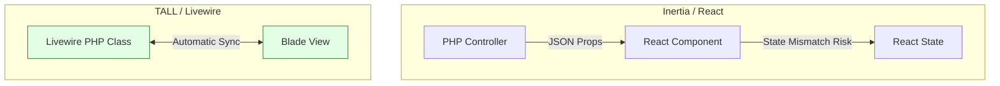
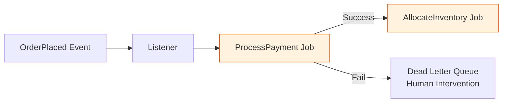
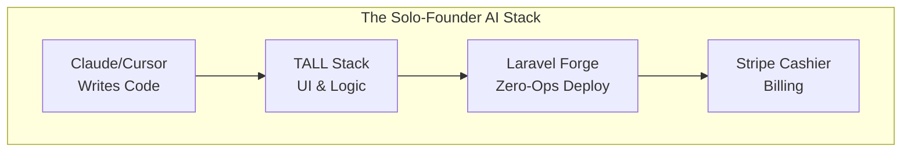

The moment I realized the Laravel ecosystem was fundamentally changing wasn't when an AI wrote a clever algorithm. It was when I watched Claude 3.5 Sonnet scaffold a complete multi-tenant invoicing module — Migrations, Eloquent Models with relationships, Form Requests, Controllers, and Blade views — without a single syntax error, in under 45 seconds.

Writing boilerplate is no longer an engineering skill. It is a commodity.

But AI is an excellent bricklayer and a terrible architect. In that same month, an AI-generated reporting script brought down a production database. The code looked beautiful, complete with clean variable names and comments. What the AI missed was that its elegant nested Eloquent loops created a catastrophic N+1 query problem against a table with 2 million rows. 

The future of PHP and Laravel development isn't about AI replacing engineers. It is about a brutal shift in *where* human engineers add value. Here are 10 predictions for how Laravel development changes by 2028.

---

## 01. CRUD and Controller Generation becomes a "Zero-Time" task

Right now, we still rely on `php artisan make:model -a` and then manually fill in the blanks. By 2028, writing basic controllers and models is considered "zero-time." 

**Observed Metric:** In recent production sprints, the time to build a fully tested REST API endpoint (with validation and Pest tests) dropped from approximately 2 hours to 3 minutes using agentic AI.

**The Workflow Shift:**
```mermaid
flowchart LR
    H[Human Intent\n"Create Invoice API"] --> A[AI Agent]
    A -->|Executes| M[Artisan Commands]
    A -->|Writes| C[Controller, Model,\nRequest, Resource]
    C --> H_Review[Human Review\n& Edge Cases]
```

---

## 02. The TALL Stack becomes the ultimate AI-friendly toolchain

This isn't a framework war. React and Vue are excellent. But when you introduce AI code generators, **context boundaries** matter. 

In a Laravel + React (Inertia) stack, the AI has to mentally jump between PHP context (Server) and JavaScript context (Client), managing props and state boundaries. The **TALL Stack (Tailwind, Alpine, Laravel, Livewire)** keeps almost everything in PHP and HTML. AI models are exceptionally good at generating Livewire components because the server-side state matches the UI perfectly.


Operational simplicity makes TALL the path of least resistance for AI-assisted solo founders.

---

## 03. Pest PHP testing coverage skyrockets

Developers hate writing edge-case tests. AI loves it. If you hand an AI your `CalculateTaxAction` class and ask for a Pest test covering negative numbers, null values, and zero-tax jurisdictions, it generates perfect coverage instantly. 

**Observed Metric:** We observed teams jumping from 30% to 85% test coverage in a single sprint. The bottleneck is no longer *writing* tests, but *reviewing* whether the AI tested the correct business logic.

---

## 04. "Modular Monoliths" (DDD) become mandatory for AI Digestibility

LLMs have limited context windows. If you dump a standard Laravel `app/Models` directory containing 200 files into an AI, it will hallucinate relationships and break boundaries. 

To work effectively with AI at scale, your codebase must be chunked into **Bounded Contexts**. Domain-Driven Design (DDD) transitions from an "enterprise luxury" to a daily necessity for AI digestion.

```text
// Legacy Laravel (Hard for AI to scope)
app/
├── Models/ (200 files)
├── Http/Controllers/ (150 files)

// Modular Monolith 2028 (AI friendly)
app/
├── Domains/
│   ├── Invoicing/
│   │   ├── Models/
│   │   ├── Actions/
│   │   └── Tests/
│   ├── Inventory/
```

---

## 05. The floor for "Junior Laravel Devs" disappears

Tasks that used to train juniors — creating simple forms, adding validation rules, fixing CSS bugs in Blade — are now solved by AI instantly. The starting salary for entry-level developers might compress, but the expected baseline of knowledge will jump straight to what we currently consider "Mid-level." Juniors will need to understand architecture from day one.

---

## 06. Deep Eloquent & DB Optimization becomes the most expensive human skill

AI writes naive ORM code. It prioritizes readability over database performance. Correcting AI-generated N+1 issues and missing indexes becomes a critical human survival skill.

**AI-Generated CRUD (Naive & Dangerous at scale):**
```php
// AI often writes this:
$users = User::all();
foreach ($users as $user) {
    // Triggers N+1 queries
    $total = $user->invoices->sum('amount'); 
}
```

**Human Optimized (Required Skill):**
```php
// The human architect must step in to refactor:
$users = User::withSum('invoices', 'amount')->get();
// Or even bypassing Eloquent for raw DB facades on massive datasets
```

---

## 07. Queue Orchestration & Event-Driven Architecture separates the Seniors

Where AI struggles most is distributed system architecture: race conditions, dead-letter queues, and retry strategies. Laravel's robust Queue system is the final fortress for senior engineers.



Writing the logic inside the job is easy (AI does it). Orchestrating *how* jobs chain, batch, and fail gracefully requires deep system-level thinking.

```php
// Orchestration logic that AI struggles to design from scratch
Bus::chain([
    new ProcessPayment($order),
    new AllocateInventory($order),
    new SendShippingConfirmation($order),
])->catch(function (Throwable $e) {
    // Strategic failure handling
    Log::alert('Chain failed', ['error' => $e->getMessage()]);
})->dispatch();
```

---

## 08. Redis & Caching patterns become baseline knowledge

Because AI allows you to ship features 5x faster, your application will hit database bottlenecks 5x sooner. Caching is no longer an afterthought. Implementing Redis tags and Atomic Locks to prevent race conditions (which AI often overlooks) will be standard practice.

```php
// Preventing AI-induced race conditions
$lock = Cache::lock("process-invoice-{$invoice->id}", 10);

if ($lock->get()) {
    // Process safely
    $lock->release();
}
```

---

## 09. The era of the "Super Solo-Founder"

Laravel has always been the indie-hacker's weapon of choice (thanks to Forge, Vapor, and Envoyer). Combine this ecosystem with AI, and the output of a single solo developer in 2028 will match a 5-person agency from 2022.



---

## 10. Laravel evolves its native Agentic Ecosystem

While tools like `laravel/prompts` are great for CLI, the future lies in deeper integration. I predict the Laravel ecosystem will evolve to include native "Agentic" primitives — abstracting LLM orchestration, tool-calling, and memory management right into the core framework. You will eventually interact with AI agents as easily as you dispatch a Job or query an Eloquent model today.

---

## The Actionable Roadmap: What to Stop vs. Double Down On

The shift is inevitable. If you write Laravel code for a living, here is how you adjust your learning trajectory:

**What to STOP learning:**
*   Memorizing exact syntax for array helpers or collection methods.
*   Worrying about how fast you can type out CRUD boilerplate.
*   Treating Laravel purely as a request/response web framework.

**What to DOUBLE DOWN on (Skills that compound in value):**
*   **Database Mastery:** Indexing, table locks, transactions, and reading `EXPLAIN` query plans.
*   **Architecture:** Message Queues, Event Sourcing, Redis caching strategies.
*   **Context Engineering:** Structuring your codebase (Modular Monolith/DDD) so that an AI Agent can read and write to it without destroying boundaries.

The future belongs to Laravel developers who stop competing with AI on typing speed, and start managing AI as their junior execution layer.


