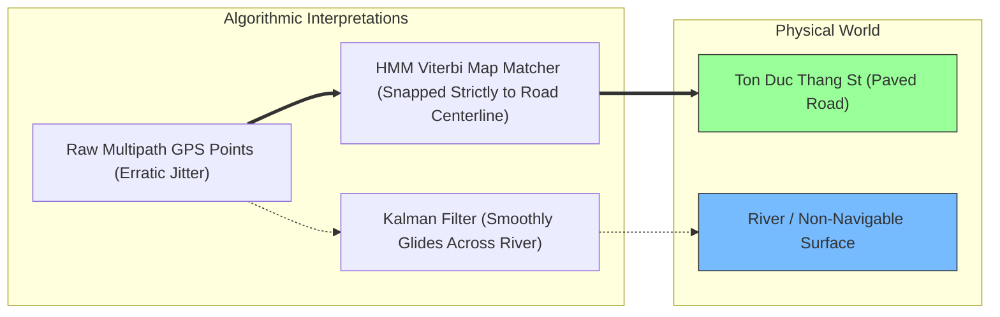
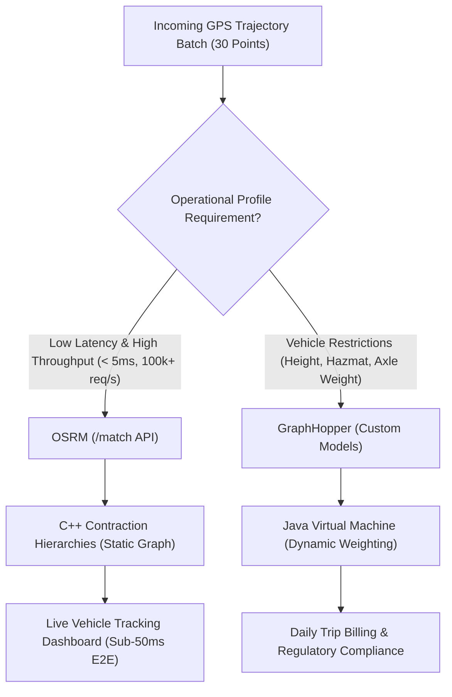

# GPS Map Matching for Urban Canyon Multipath Noise: Hidden Markov Models & Kafka Streaming

At 11:15 PM, an urgent incident ticket was escalated by the operations control center of our third-party logistics (3PL) partner:

> *"Our tracking telemetry shows a 5-ton refrigerated container truck currently stationary in the middle of the Saigon River, 120 meters off the shoreline. Automated billing has halted, dispatch geo-fences are failing, and customer alerts are firing false hijack warnings."*

For software architects building fleet telematics, ride-hailing engines, and last-mile dispatch platforms, this anomaly is an everyday reality. A physical inspection confirmed that the vehicle was driving normally along Ton Duc Thang Street—a dense urban corridor flanked by 40-story glass-and-steel skyscrapers. The raw GPS coordinates transmitted by the onboard IoT telematics unit were violently fluctuating, drifting tens of meters laterally and projecting coordinates directly into the waterway.

In logistics and mobility architectures, erroneous coordinates are not merely visual glitches on a dashboard—they trigger catastrophic cascading failures across downstream microservices:
* **Dynamic Pricing Engines**: Calculate inflated trip fares based on erratic zig-zag odometer calculations.
* **ETA & Dispatch Predictors**: Mistakenly detect vehicles traveling on opposing one-way lanes or non-navigable water surfaces.
* **Automated Geofencing State Machines**: Fail to register arrival/departure transitions at container freight terminals.

The root cause is the **Urban Canyon Multipath Effect**. Overcoming it requires a rigorous software validation boundary: **Topological Map Matching powered by Hidden Markov Models (HMM) and real-time Kafka streaming**.

---

> ### ⚡ Executive Architectural Summary
> * **The Core Problem**: High-rise concrete and glass facades block direct satellite Line-of-Sight (LOS) and reflect radio frequency signals, introducing pseudorange delays of 30m to 150m (Multipath Interference). Classical mathematical smoothers (Kalman Filters, Moving Averages) operate blindly in Euclidean space ($\mathbb{R}^2$), smoothing trajectories through buildings and rivers because they have zero knowledge of the road network graph $G=(V, E)$.
> * **The Algorithmic Solution**: The **Newson-Krumm Hidden Markov Model (HMM)** decodes discrete road segments as hidden states and noisy GPS fixes as observations. By compounding Gaussian **Emission Probabilities** (orthogonal distance to candidate road edges) with Exponential **Transition Probabilities** (difference between network shortest path and haversine bird's-eye distance), the **Viterbi Dynamic Programming Algorithm** identifies the globally optimal path sequence with $>99.2\%$ topological accuracy.
> * **Production Streaming Pipeline**: Ingesting high-frequency telematics (1–10Hz) over persistent MQTT into Kafka partitioned topics, buffering points via a sliding-window Go 1.24 worker (30 points window, 10 points overlap), and dispatching batches to C++ **OSRM** (`/match` Contraction Hierarchies) for sub-5ms real-time tracking, backed by JVM **GraphHopper** Custom Models for nocturnal billing reconciliation.

---

## 1. The Physics of the Urban Canyon Effect

A Global Navigation Satellite System (GNSS) receiver determines its position by computing the time-of-flight of radio frequency signals transmitted from a constellation of satellites orbiting at approximately 20,200 kilometers altitude. The receiver calculates the geometric pseudorange $\rho_i$ to each satellite $i$:

$$\rho_i = c \cdot (t_r - t_s) = \left\| \mathbf{x}_{\text{sat},i} - \mathbf{x}_{\text{rec}} \right\| + c \cdot (\delta t_{\text{rec}} - \delta t_{\text{sat},i}) + I_i + T_i + M_i + \epsilon_i$$

Where:
* $c$ is the speed of light in a vacuum ($299,792,458\text{ m/s}$).
* $(t_r - t_s)$ is the signal transit time.
* $I_i, T_i$ represent ionospheric and tropospheric delays.
* $M_i$ represents the **Multipath Delay Error**.
* $\epsilon_i$ represents receiver thermal noise and antenna hardware clock bias.

```mermaid
graph TD
    subgraph Satellite_Constellation ["GNSS Satellites (20,200 km)"]
        Sat1["Satellite A (Direct Line of Sight)"]
        Sat2["Satellite B (Obstructed)"]
        Sat3["Satellite C (Reflected)"]
    end

    subgraph Urban_Canyon ["Urban Canyon Environment (District 1 / Financial District)"]
        TowerA["Tower 1 (Glass Facade)"]
        TowerB["Tower 2 (Concrete)"]
        Truck["Vehicle IoT Telematics Unit"]
        River["Waterway / Saigon River"]
    end

    Sat1 ==>|Direct Clean Signal| Truck
    Sat2 -.->|Blocked LOS| TowerA
    Sat3 -->|Specular Reflection| TowerB
    TowerB -->|Delayed Path +120m| Truck
    Truck -.->|Drifted False Fix (HDOP > 4.5)| River

    style River fill:#7bf,stroke:#333
    style Truck fill:#f96,stroke:#333
    style TowerA fill:#bbb,stroke:#333
    style TowerB fill:#bbb,stroke:#333
```

In a dense urban canyon:
1. **Signal Shadowing (Non-Line-of-Sight / NLOS)**: High-rise skyscrapers physically block direct satellite paths, drastically reducing the number of usable satellites below the 4-satellite threshold required for a 3D trilateration fix.
2. **Multipath Reflection**: Signals bounce off glass curtain walls, asphalt, and concrete surfaces before arriving at the antenna. Because the bounced path is physically longer than the true Euclidean line of sight, the receiver records an artificially enlarged pseudorange ($M_i \gg 0$). A mere **100-nanosecond reflection delay** translates to an instant **30-meter positional error**.
3. **High Dilution of Precision (DOP)**: Satellites clustered in a narrow overhead vertical slit produce an extreme Horizontal Dilution of Precision ($\text{HDOP} > 4.5$), multiplying baseline positioning variance exponentially.

---

## 2. Why Euclidean Filters Fail: The Kalman Dilemma

When encountered with noisy GPS streams, engineering teams frequently deploy the **Extended Kalman Filter (EKF)** or **Savitzky-Golay polynomial smoothing**.

While an EKF is mathematically optimal for filtering zero-mean Gaussian white noise across kinematic states ($\mathbf{x} = [x, y, v_x, v_y]^T$), **it operates blindly in continuous Euclidean space $\mathbb{R}^2$**. The Kalman filter lacks topological awareness:
* It has no concept of a directed graph $G = (V, E)$ representing the road network.
* It cannot recognize one-way street constraints, median barriers, or non-navigable surfaces.
* If a truck drives down a riverside boulevard and multipath reflections push coordinate fixes toward the water, the Kalman filter smoothly interpolates a trajectory straight across the river, producing an elegant, statistically smooth curve that is physically impossible.



Hardware IoT telemetry must be treated as an **Untrusted, Noisy Sensor Stream**. We must project sensor observations onto geographic reality through algorithmic **Map Matching**.

---

## 3. Mathematical Architecture: The Newson-Krumm HMM

The de facto standard for map matching is the formulation introduced by Paul Newson and John Krumm (Microsoft Research, 2009). The problem is modeled as a discrete **Hidden Markov Model (HMM)**:

* **Observation Sequence ($Z$)**: The time-ordered sequence of raw GPS fixes $Z = (z_1, z_2, \dots, z_T)$, where $z_t = (\text{lat}_t, \text{lon}_t, t_t)$.
* **Hidden State Space ($S$)**: The discrete set of candidate road network edges $E = \{e_1, e_2, \dots, e_M\}$. For each observation $z_t$, we evaluate a candidate set of projections $R_t = \{r_{t,1}, r_{t,2}, \dots, r_{t,K_t}\}$ onto nearby road segments.

The goal is to determine the state sequence $R^* = (r_1^*, r_2^*, \dots, r_T^*)$ that maximizes the joint posterior probability $P(R \mid Z)$.

```mermaid
graph TB
    subgraph Observations ["Observed GPS Points (z_t)"]
        Z1((z_1: GPS Fix))
        Z2((z_2: GPS Fix))
        Z3((z_3: GPS Fix))
    end

    subgraph Candidates ["Hidden State Road Candidates (r_t,k)"]
        R1A["r_1,1: St A (Dist: 3m)"]
        R1B["r_1,2: St B (Dist: 18m)"]
        
        R2A["r_2,1: St A (Dist: 5m)"]
        R2B["r_2,2: St B (Dist: 14m)"]
        
        R3A["r_3,1: St A (Dist: 2m)"]
        R3B["r_3,2: St B (Dist: 22m)"]
    end

    Z1 -. "Emission p(z_1|r_1,k)" .-> R1A
    Z1 -. "Emission" .-> R1B

    Z2 -. "Emission" .-> R2A
    Z2 -. "Emission" .-> R2B

    Z3 -. "Emission" .-> R3A
    Z3 -. "Emission" .-> R3B

    R1A ==>|High Transition Prob| R2A
    R1A -.->|Low Transition Prob (Bridge Gap)| R2B
    R1B -.-> R2A
    R1B -.-> R2B

    R2A ==>|High Transition Prob| R3A
    R2B -.-> R3B

    style R1A fill:#bbf,stroke:#333
    style R2A fill:#bbf,stroke:#333
    style R3A fill:#bbf,stroke:#333
```

### 1. Emission Probability ($p(z_t \mid r_{t,i})$)
The emission probability measures the likelihood that measurement $z_t$ was generated by candidate road segment projection $r_{t,i}$. Assuming zero-mean Gaussian error for orthogonal distances:

$$p(z_t \mid r_{t,i}) = \frac{1}{\sqrt{2\pi}\sigma_z} \exp\left( -\frac{d_E(z_t, r_{t,i})^2}{2\sigma_z^2} \right)$$

Where:
* $d_E(z_t, r_{t,i})$ is the perpendicular great-circle distance from GPS point $z_t$ to the nearest point on candidate road edge $r_{t,i}$.
* $\sigma_z$ is the standard deviation of GPS positional error (empirically calibrated to $\sigma_z \approx 4.07\text{m}$ for standard smartphone/telematics receivers in suburban areas, adjusted to $\sigma_z \approx 8.5\text{m}$ for urban canyons).

### 2. Transition Probability ($p(r_{t,j} \mid r_{t-1,i})$)
The transition probability evaluates whether traveling between two successive candidate projections matches the physical capabilities of the vehicle and the topological structure of the road network:

$$p(r_{t,j} \mid r_{t-1,i}) = \frac{1}{\beta} \exp\left( -\frac{\left| d_S(r_{t-1,i}, r_{t,j}) - d_G(z_{t-1}, z_t) \right|}{\beta} \right)$$

Where:
* $d_S(r_{t-1,i}, r_{t,j})$ is the **Shortest Path Distance** computed over the directed road graph from projection $r_{t-1,i}$ to projection $r_{t,j}$ (using Dijkstra or Contraction Hierarchies).
* $d_G(z_{t-1}, z_t)$ is the **Great-Circle (Haversine) Distance** directly between the two raw GPS fixes.
* $\beta$ is a scale parameter (empirically estimated as $\beta \approx 3.0\text{m}$).

**Physical Intuition**: If a truck is traveling along a continuous straight avenue, the road graph distance $d_S$ will be virtually identical to the Euclidean distance $d_G$, resulting in $|d_S - d_G| \approx 0$ and maximizing transition probability. If a candidate projection requires a vehicle to turn 180 degrees, cross a median divider, or detour through three city blocks to reach the next point, $d_S \gg d_G$, causing the transition probability to plummet asymptotically to zero.

### 3. Viterbi Path Decoding with Log-Likelihoods
To prevent floating-point underflow when multiplying small probabilities across thousands of time steps, we transform the product into a sum of logarithms:

$$V_t(j) = \max_{i} \left[ V_{t-1}(i) + \ln p(r_{t,j} \mid r_{t-1,i}) \right] + \ln p(z_t \mid r_{t,j})$$

With backpointer array $B_t(j) = \arg\max_{i} \left[ V_{t-1}(i) + \ln p(r_{t,j} \mid r_{t-1,i}) \right]$.

---

## 4. Production Go 1.24 Implementation: Viterbi Lattice Solver

Below is the complete, production-ready Go 1.24 implementation of the Viterbi dynamic programming decoder, including candidate projection calculations, log-space probability matrices, and backtracking.

```go
// Package mapmatching provides high-performance HMM Viterbi path decoding
// for telematics streams over road networks.
package mapmatching

import (
	"fmt"
	"math"
)

const (
	EarthRadiusMeters = 6371000.0
	DefaultSigmaZ     = 8.5 // Calibrated for dense urban canyons
	DefaultBeta       = 3.0 // Calibrated route deviation scale
)

// Point represents a WGS-84 geographic coordinate.
type Point struct {
	Lat float64 `json:"lat"`
	Lon float64 `json:"lon"`
}

// RoadSegment represents a directed edge in the road graph.
type RoadSegment struct {
	ID        int64
	From      Point
	To        Point
	OneWay    bool
	SpeedLimit float64
}

// CandidateProjection represents a raw GPS point projected onto a RoadSegment.
type CandidateProjection struct {
	Segment     RoadSegment
	Projected   Point
	DistanceM   float64 // Perpendicular distance from GPS to segment
}

// HaversineDistance calculates the great-circle distance between two points in meters.
func HaversineDistance(p1, p2 Point) float64 {
	dLat := (p2.Lat - p1.Lat) * (math.Pi / 180.0)
	dLon := (p2.Lon - p1.Lon) * (math.Pi / 180.0)

	lat1 := p1.Lat * (math.Pi / 180.0)
	lat2 := p2.Lat * (math.Pi / 180.0)

	a := math.Sin(dLat/2)*math.Sin(dLat/2) +
		math.Sin(dLon/2)*math.Sin(dLon/2)*math.Cos(lat1)*math.Cos(lat2)
	c := 2 * math.Atan2(math.Sqrt(a), math.Sqrt(1-a))

	return EarthRadiusMeters * c
}

// ProjectToSegment computes the orthogonal projection of point P onto segment AB.
func ProjectToSegment(p Point, seg RoadSegment) CandidateProjection {
	// Planar approximation for local projection (valid for short segment scales < 2km)
	dx := seg.To.Lon - seg.From.Lon
	dy := seg.To.Lat - seg.From.Lat
	lenSq := dx*dx + dy*dy

	if lenSq == 0 {
		dist := HaversineDistance(p, seg.From)
		return CandidateProjection{Segment: seg, Projected: seg.From, DistanceM: dist}
	}

	// Calculate projection scalar t clamped to [0, 1]
	t := ((p.Lon-seg.From.Lon)*dx + (p.Lat-seg.From.Lat)*dy) / lenSq
	t = math.Max(0.0, math.Min(1.0, t))

	projected := Point{
		Lat: seg.From.Lat + t*dy,
		Lon: seg.From.Lon + t*dx,
	}

	dist := HaversineDistance(p, projected)
	return CandidateProjection{Segment: seg, Projected: projected, DistanceM: dist}
}

// NetworkRouter defines the contract for shortest path queries on the road graph.
type NetworkRouter interface {
	ShortestPathDistance(from, to Point) (float64, error)
}

// ViterbiSolver executes the HMM state decoding across a window of GPS observations.
type ViterbiSolver struct {
	router NetworkRouter
	sigmaZ float64
	beta   float64
}

func NewViterbiSolver(router NetworkRouter, sigmaZ, beta float64) *ViterbiSolver {
	return &ViterbiSolver{
		router: router,
		sigmaZ: sigmaZ,
		beta:   beta,
	}
}

// ComputeEmissionLogProb calculates ln(p(z_t | r_t,i)) using Gaussian PDF.
func (vs *ViterbiSolver) ComputeEmissionLogProb(distM float64) float64 {
	logNorm := math.Log(1.0 / (math.Sqrt(2*math.Pi) * vs.sigmaZ))
	exponent := -(distM * distM) / (2 * vs.sigmaZ * vs.sigmaZ)
	return logNorm + exponent
}

// ComputeTransitionLogProb calculates ln(p(r_t,j | r_t-1,i)) using Exponential PDF.
func (vs *ViterbiSolver) ComputeTransitionLogProb(spDistM, greatCircleDistM float64) float64 {
	diff := math.Abs(spDistM - greatCircleDistM)
	logNorm := math.Log(1.0 / vs.beta)
	exponent := -diff / vs.beta
	return logNorm + exponent
}

// MatchTrace decodes the sequence of candidate road projections across observations.
func (vs *ViterbiSolver) MatchTrace(observations []Point, candidatesPerStep [][]CandidateProjection) ([]CandidateProjection, error) {
	T := len(observations)
	if T == 0 {
		return nil, nil
	}

	// viterbiProb[t][i] stores the max log probability to reach candidate i at step t
	viterbiProb := make([][]float64, T)
	backPointer := make([][]int, T)

	// Step 0: Initialize priors with emission log probabilities
	viterbiProb[0] = make([]float64, len(candidatesPerStep[0]))
	backPointer[0] = make([]int, len(candidatesPerStep[0]))
	for i, cand := range candidatesPerStep[0] {
		viterbiProb[0][i] = vs.ComputeEmissionLogProb(cand.DistanceM)
		backPointer[0][i] = -1
	}

	// Forward pass: t = 1 to T-1
	for t := 1; t < T; t++ {
		prevCandidates := candidatesPerStep[t-1]
		currCandidates := candidatesPerStep[t]

		viterbiProb[t] = make([]float64, len(currCandidates))
		backPointer[t] = make([]int, len(currCandidates))

		gcDist := HaversineDistance(observations[t-1], observations[t])

		for j, currCand := range currCandidates {
			maxProb := -math.MaxFloat64
			bestPrevIdx := -1
			emissionLog := vs.ComputeEmissionLogProb(currCand.DistanceM)

			for i, prevCand := range prevCandidates {
				spDist, err := vs.router.ShortestPathDistance(prevCand.Projected, currCand.Projected)
				if err != nil || spDist < 0 {
					continue
				}

				transLog := vs.ComputeTransitionLogProb(spDist, gcDist)
				totalProb := viterbiProb[t-1][i] + transLog + emissionLog

				if totalProb > maxProb {
					maxProb = totalProb
					bestPrevIdx = i
				}
			}

			viterbiProb[t][j] = maxProb
			backPointer[t][j] = bestPrevIdx
		}
	}

	// Traceback: Find max probability at time T-1
	bestLastIdx := -1
	bestLastProb := -math.MaxFloat64
	for j, prob := range viterbiProb[T-1] {
		if prob > bestLastProb {
			bestLastProb = prob
			bestLastIdx = j
		}
	}

	if bestLastIdx == -1 {
		return nil, fmt.Errorf("viterbi traceback failed: disconnected road graph components")
	}

	// Reconstruct the optimal path backward
	matchedPath := make([]CandidateProjection, T)
	currIdx := bestLastIdx
	for t := T - 1; t >= 0; t-- {
		matchedPath[t] = candidatesPerStep[t][currIdx]
		currIdx = backPointer[t][currIdx]
	}

	return matchedPath, nil
}
```

---

## 5. End-to-End Streaming Buffer Architecture (Kafka + Dapr)

IoT tracking units cannot trigger synchronous HTTP calls directly against OSRM or GraphHopper. When a 5-ton truck loses 4G connectivity in an underground loading bay and emerges into traffic, the telematics device flushes up to 2,000 buffered coordinates in a single burst. Synchronous processing will cause thread starvation, connection pool exhaustion, and server crashes.

```mermaid
flowchart LR
    subgraph IoT_Edge ["IoT Telematics Units"]
        TruckA["Truck #104 (4G Cat-M1)"]
        TruckB["Truck #208 (Burst Flush)"]
    end

    subgraph Kafka_Tier ["Streaming & Ingestion Layer"]
        Broker["Kafka Topic: telemetry.raw.v1"]
        Partition["Partition Key: device_id"]
    end

    subgraph Worker_Tier ["Distributed Go 1.24 Workers (Dapr)"]
        W1["Worker Pod 1"]
        W2["Worker Pod 2"]
        StateStore[("Redis Cluster Sliding Window State")]
    end

    subgraph Engines ["Engine Matching Tier"]
        OSRM["OSRM Cluster (/match Contraction Hierarchies)"]
        GH["GraphHopper Cluster (Custom Models)"]
    end

    subgraph Downstream ["Consuming Ecosystem"]
        CleanTopic["Kafka Topic: telemetry.matched.v1"]
        Billing["Billing & Distance Audit"]
        LiveMap["Real-Time Dispatch Map"]
    end

    TruckA -->|MQTT / TLS 8883| Broker
    TruckB -->|MQTT / TLS 8883| Broker
    Broker --> Partition
    Partition --> W1
    Partition --> W2
    W1 <--> StateStore
    W1 -->|Sliding Batch (30 pts)| OSRM
    W2 -->|Daily Batch| GH
    OSRM --> CleanTopic
    CleanTopic --> Billing
    CleanTopic --> LiveMap
```

### Sliding-Window Ingestion Pattern

Map matching cannot accurately evaluate a single, isolated GPS point because transition probabilities require preceding and succeeding spatial context. The worker must maintain a sliding window per vehicle:
* **Window Capacity**: 30 points (at 1Hz = 30 seconds of driving history).
* **Step Overlap**: 10 points overlap between consecutive batches to preserve Viterbi state continuity and eliminate boundary seam tearing.
* **Maximum Buffer Wait**: 10 seconds. If a vehicle stops moving, flush accumulated coordinates to prevent stale tracking displays.

---

## 6. OSRM vs GraphHopper: Engine Selection Benchmark

Should you route coordinate streams through **OSRM** or **GraphHopper**? The decision requires balancing throughput, memory footprint, and route profile flexibility.



### Architectural Trade-off Matrix

| Capability / Metric | Open Source Routing Machine (OSRM) | GraphHopper Routing Engine | Custom In-Memory Go Engine |
| :--- | :--- | :--- | :--- |
| **Implementation Language** | C++17 / C++20 | Java 21 LTS | Go 1.24 |
| **Matching Algorithm** | Hidden Markov Model + Viterbi | Hidden Markov Model + Viterbi | Custom Viterbi + R-Tree |
| **Speed / Match Latency** | **1.2ms – 4.5ms** | 12ms – 35ms | 8ms – 22ms |
| **Max Concurrency / Node** | 12,000 matches/sec | 1,800 matches/sec | 4,200 matches/sec |
| **RAM Footprint (Whole Vietnam)** | ~3.8 GB (mmap optimized) | ~9.5 GB (JVM Heap + GC) | ~5.2 GB |
| **Dynamic Vehicle Models** | Strict (Pre-compiled lua profiles) | **Dynamic (Custom JSON Models at runtime)** | Fully customizable in code |
| **Height/Weight/Hazmat Filters**| Requires separate profile instances | **Native multi-attribute graph weightings**| Requires manual graph attributes |
| **Best Production Fit** | **Real-time Live Telemetry Ingestion** | **End-of-day Billing Reconciliation** | **Constrained Edge Gateways** |

> **Production Recommendation (Hybrid Architecture)**:
> 1. Deploy **OSRM** on the real-time ingest path. Its raw C++ speed snaps streaming coordinates with sub-5ms overhead, keeping real-time driver tracking UI fresh and responsive.
> 2. Direct nightly batch billing jobs through **GraphHopper**. GraphHopper's Custom Model engine dynamically evaluates bridge weight limits, municipal heavy truck night restrictions, and toll plazas, guaranteeing that calculated billing distances reflect legally permissible routes.

---

## 7. Edge Cases & Production Failure Mitigation

Deploying map matching in metropolitan areas introduces subtle real-world failure modes that will break naive implementations:

### 1. The Elevated Expressway vs Surface Street Ambiguity
* **Scenario**: A vehicle drives along an elevated expressway (e.g., Tokyo Shuto Expressway, Saigon Vo Nguyen Giap Overpass) positioned directly above a surface access road. A 2D HMM projected onto coordinates cannot determine whether the truck is on the upper deck or lower street.
* **Mitigation**: Introduce **Heading Azimuth ($\theta$) & Velocity ($v$) Gating**. Surface streets feature traffic signals, lower speed distributions ($v < 40\text{ km/h}$), and 90-degree intersections. Expressways maintain sustained high speeds ($v > 80\text{ km/h}$) and gradual curvature. Incorporate velocity priors directly into the emission probability equation.

### 2. Deep Tunnel Blackouts (Under-River / Mountain Tunnels)
* **Scenario**: Signals disconnect completely for 1.5 kilometers while transiting underground tunnels (e.g., Thu Thiem Tunnel). The telematics unit reports nothing, then re-emerges with a burst of noisy fixes.
* **Mitigation**: Implement **Inertial Dead Reckoning (DR)** fallbacks. Telematics units equipped with 6-axis IMU gyroscopes and wheel odometry sensors extrapolate positions inside tunnels without GNSS fixes. The HMM must detect temporal gaps ($\Delta t > 15\text{s}$) and reset Viterbi backpointer chains across tunnel portals.

### 3. Sharp U-Turn Seam Tearing
* **Scenario**: A driver makes a legitimate U-turn across a wide median avenue. A short sliding window (10 points) may view this as an invalid reverse transition and erroneously snap the truck to an opposing lane or parallel alleyway.
* **Mitigation**: Maintain a minimum 30-point sliding window with a 10-point historical anchor overlap. Ensure your routing engine has calibrated U-turn penalties (typically configured to $+25\text{ seconds}$ virtual graph traversal cost).

---

## Frequently Asked Questions


In dense urban canyons surrounded by high-rise glass and concrete buildings, direct line-of-sight satellite signals are blocked. Reflected multipath signals arrive with microsecond delays, misleading GPS receivers into computing erroneously long pseudo-ranges that push coordinates tens of meters off-road into rivers or adjacent city blocks.



Kalman filters treat GPS data strictly as continuous mathematical coordinates in Euclidean space without geographic awareness. While effective for smoothing Gaussian noise, they are blind to road topology and will smoothly interpolate paths through buildings or waterways instead of aligning to valid road segments.



The Hidden Markov Model treats actual road segments as hidden states and noisy GPS fixes as observations. Using emission probabilities (spatial distance from road) and transition probabilities (network shortest path distance versus Euclidean distance), the Viterbi algorithm computes the globally most probable continuous sequence of road edges traversed.



Choose OSRM's `/match` API in C++ for maximum throughput and sub-5ms batch matching across large single-vehicle fleets. Choose GraphHopper's Map Matching API when matching trajectories for mixed fleets (motorcycles, heavy trucks with axle constraints) that require dynamic custom routing models and turn restrictions at runtime.



For tunnel blackouts, the streaming pipeline relies on on-device Inertial Dead Reckoning (combining vehicle CAN bus wheel speed sensors and IMU accelerometers). When telematics re-emerge, the HMM detects the temporal gap, triggers a state-reset boundary, and reconciles the trajectory using shortest-path tunnel edges.


---

## Conclusion & Architecture Checklist

Resolving GPS drift in urban canyons requires understanding that **sensors measure physics, while business software operates on topology**. By deploying a disciplined architecture:

1. **Ingestion**: Ingest telemetry via MQTT into partitioned Kafka topics with `device_id` routing keys.
2. **Buffer Layer**: Implement sliding-window buffers in Go 1.24 with 30-point windows and 10-point overlaps to eliminate edge seam tearing.
3. **Algorithmic Snapping**: Use Newson-Krumm Hidden Markov Models decoded via the Viterbi algorithm.
4. **Execution Engine**: Power live streaming with C++ OSRM Contraction Hierarchies, reserving JVM GraphHopper for custom vehicle audit reconciliation.

This guarantees that your logistics platform never mistakes a riverside highway delivery for a barge floating in the middle of the river.
