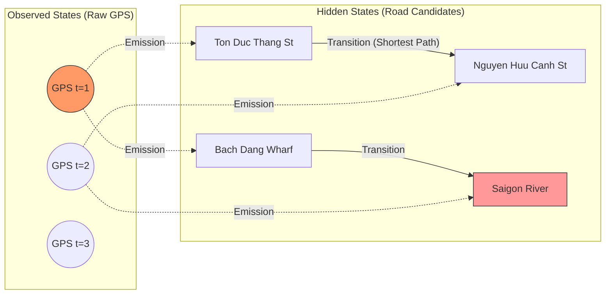

# GPS Map Matching for Urban Canyon Noise: HMM & Kafka

**Answer-first:** Raw GPS data from IoT devices in dense urban environments suffers severe degradation due to the Urban Canyon effect. Traditional filters like Kalman fail because they lack spatial awareness (topology). The standard architectural solution is a **Streaming Pipeline** (using Kafka for backpressure) paired with a **Map Matching Engine** (OSRM or GraphHopper) powered by a Hidden Markov Model (HMM) to snap coordinates back to the road network at sub-50ms latency.

---

## 1. The 11 PM Crisis: When GPS Lies

At 11 PM, I received an urgent message from a Tech Lead at our logistics partner: 

> *"Could you check the system? The tracking dashboard shows our 5-ton truck is currently... stationary in the middle of the Saigon River."*

For engineers building Fleet Management Systems, this scenario is painfully familiar. A quick database check confirmed the truck was actually driving along Ton Duc Thang Street (near Bach Dang Wharf, District 1). However, the incoming GPS coordinates were wildly fluctuating, drifting tens of meters off-course and plunging straight into the river.

The consequences of this error extend far beyond a glitchy UI. In a logistics architecture, erroneous coordinates trigger cascading failures:
- Routing algorithms miscalculate Estimated Time of Arrival (ETA).
- Pricing engines overcharge based on false distance metrics.
- Geo-fencing triggers (for yard entry/exit) fire incorrectly, corrupting the order's state machine.

The physical root cause of this chaos is the **Urban Canyon Effect**.

### What is the Urban Canyon Effect?
GPS signals transmitted from satellites 20,000 km away arrive at Earth extremely weak. When entering dense urban centers (like District 1, HCMC), they face two massive barriers:
1. **Signal Blockage:** High-rise buildings physically obstruct the direct Line-of-Sight (LOS) between satellites and the receiver's antenna. A receiver needs at least 4 satellites for a 3D fix; blockage drastically reduces this count.
2. **Multipath Interference:** Signals bounce repeatedly off glass and concrete facades before reaching the receiver. This delay tricks the GPS device into calculating an artificially long pseudo-range. The resulting position fix is violently pushed off the actual road network.

## 2. Why Classical Filters Fail

The most naive approach developers take when encountering erratic GPS data is reaching for standard smoothing algorithms: **Moving Average** or the **Kalman Filter**.

The fatal flaw in these algorithms is that they treat GPS strictly as time-series data. The Kalman Filter excels at removing white noise to smooth a trajectory, but **it is completely blind to network topology**. 

A Kalman Filter does not know the truck is on Ton Duc Thang Street. It will happily draw a perfectly smooth, statistically elegant line that flies right through the Bitexco Financial Tower or glides across the river's surface.

This problem demands a **Data Validation Boundary**: Hardware IoT devices are an *Untrusted Data Source*. We cannot trust raw coordinates; we must validate them against geographic reality (Map Data). This is the domain of **Map Matching**.

## 3. The Core Architecture: HMM & Viterbi

To snap noisy coordinates back to the logical road network, the mapping industry relies on the **Hidden Markov Model (HMM)** (systematized for GPS by P. Newson and J. Krumm at Microsoft Research in 2009).

This model defines:
- **Observed States:** The raw, noisy GPS coordinates.
- **Hidden States:** The actual road segments (edges) the vehicle occupies.

The HMM algorithm finds the most logical sequence of hidden states based on two probabilities:
1. **Emission Probability:** The likelihood that a raw GPS point $Z_t$ corresponds to a specific road segment $R_i$. This is calculated using the perpendicular Euclidean distance from the point to the road. Shorter distances yield higher probabilities.
2. **Transition Probability:** The likelihood of the vehicle moving from segment $R_i$ (at time $t-1$) to segment $R_j$ (at time $t$). This is calculated by comparing the **Shortest Path distance** on the road network against the **Great-circle (bird's-eye) distance** between the two GPS points. If the points require jumping across three blocks with no connecting roads, the transition probability approaches zero.

Finally, the **Viterbi Algorithm** (dynamic programming) decodes this probability matrix to find "The Most Probable Path" across time.



## 4. OSRM vs GraphHopper: Choosing a Map Matching Engine

Writing a custom HMM algorithm in Python or Golang will immediately bottleneck when scaling to millions of GPS points daily. Continuously calculating Shortest Paths for the Transition Probability phase will incinerate your CPU budget.

At the architectural level, we leverage pre-built Routing Engines. In our previous [architectural comparison of OSRM and GraphHopper](/posts/osrm-vs-graphhopper-architecture-comparison/), we established their core strengths. How do they perform for Map Matching?

### OSRM (`/match` API): The C++ Titan
- **Core Architecture:** Written in C++, leveraging Memory-mapped files (mmap) and **Contraction Hierarchies (CH)**.
- **Latency:** Extremely fast (typically 1-5ms per match request).
- **Best fit for:** High-throughput streaming architectures. If you have a massive, continuous influx of GPS data, OSRM is the ultimate worker node. Its primary drawback is rigidity—it relies on static, pre-compiled vehicle profiles (Car, Bike).

### GraphHopper (Map Matching API): The JVM Multitool
- **Core Architecture:** Written in Java. The HMM algorithm is deeply integrated into GraphHopper's flexible routing ecosystem.
- **Latency:** Fast, but carries JVM overhead (typically 10-40ms). 
- **Best fit for:** Systems requiring complex, dynamic road profiles (e.g., restricted access for heavy trucks during peak hours). You can inject **Custom Models** at runtime to ensure the matching respects specific vehicle constraints.

> **Architecture Decision (ADR):** For our logistics telemetry, we adopted a dual-engine architecture:
> - **OSRM** powers the Streaming Layer for real-time coordinate snapping at minimum latency (feeding the live tracking UI).
> - **GraphHopper** powers the Batching Layer (end-of-day reconciliation) using Custom Profiles to strictly exclude restricted roads, ensuring 100% accurate distance-based pricing.

## 5. Streaming Architecture in Production (Kafka + Dapr)

Never allow IoT devices to call the Map Matching API directly via Synchronous HTTP. When a truck loses 4G connectivity and reconnects, it will burst-fire tens of thousands of buffered packets, effectively DDoS-ing your Map Matching engine.

**Standard Streaming Buffer Architecture:**
1. IoT devices transmit raw coordinates via MQTT/TCP.
2. The API Gateway writes the raw payload directly to a **Kafka Topic** (`telemetry.raw`).
3. A Golang Worker (using Dapr Pub/Sub) consumes the Kafka stream, **Batching** 30-50 points into a continuous trace.
4. The worker fires this buffered trace to the OSRM/GraphHopper Match API.
5. The clean, snapped trajectory is published to `telemetry.matched` for downstream consumption by Pricing, Tracking, and Geofence services.

```go
// Example Golang Worker using Dapr Pub/Sub for GPS batching and Map Matching
package main

import (
	"context"
	"encoding/json"
	"log"

	"github.com/dapr/go-sdk/service/common"
	daprd "github.com/dapr/go-sdk/service/grpc"
)

type RawGPS struct {
	DeviceID  string  `json:"device_id"`
	Lat       float64 `json:"lat"`
	Lon       float64 `json:"lon"`
	Timestamp int64   `json:"timestamp"`
}

func main() {
	s, err := daprd.NewService(":50051")
	if err != nil {
		log.Fatalf("failed to start the server: %v", err)
	}

	// Subscribe to the "telemetry.raw" Kafka topic via Dapr
	sub := &common.Subscription{
		PubsubName: "kafka-pubsub",
		Topic:      "telemetry.raw",
		Route:      "/process-gps",
	}

	s.AddTopicEventHandler(sub, eventHandler)
	if err := s.Start(); err != nil {
		log.Fatalf("server error: %v", err)
	}
}

func eventHandler(ctx context.Context, e *common.TopicEvent) (bool, error) {
	var gps RawGPS
	err := json.Unmarshal(e.RawData, &gps)
	if err != nil {
		return false, err // Nack: drop corrupted message
	}

	// Pseudo-code logic:
	// 1. Append gps to in-memory Buffer for DeviceID (backed by Redis via Dapr StateStore)
	// 2. If Buffer >= 50 points (or 30s window reached) -> Trigger Flush
	// 3. Execute HTTP POST to OSRM /match/v1/driving/lon,lat;...
	// 4. Extract Snapped Trajectory, Publish to "telemetry.matched" topic
	
	log.Printf("Received raw GPS from %s - Buffering...", gps.DeviceID)
	return false, nil // Ack
}
```

This architecture enforces **Zero-allocation/Memory pooling** (by reusing slices in Golang) and provides absolute protection against engine overload via Kafka's inherent backpressure.

## 6. Final Thoughts & The Edge Inference Horizon

The "truck in the river" incident is a textbook lesson on establishing **Trust Boundaries**. In IoT, hardware isn't "wrong"—it merely reports what its sensors measure. The Software Architect's job is to build algorithmic filters (the Software Validation Layer) to protect core business logic from physical-world noise.

## Frequently Asked Questions


In dense urban canyons surrounded by high-rise glass and concrete buildings, direct line-of-sight satellite signals are blocked. Reflected multipath signals arrive with microsecond delays, misleading GPS receivers into computing erroneously long pseudo-ranges that push coordinates tens of meters off-road into rivers or adjacent city blocks.



Kalman filters treat GPS data strictly as mathematical time-series coordinates without geographic awareness. While effective for smoothing Gaussian noise, they are blind to road topology and will smoothly interpolate paths through buildings or waterways instead of aligning to valid road segments.



The Hidden Markov Model treats actual road segments as hidden states and noisy GPS fixes as observations. Using emission probabilities (spatial distance from road) and transition probabilities (network shortest path distance versus Euclidean distance), the Viterbi algorithm computes the globally most probable continuous sequence of road edges traversed.



Choose OSRM's `/match` API in C++ for maximum throughput and sub-5ms batch matching across large single-vehicle fleets. Choose GraphHopper's Map Matching API when matching trajectories for mixed fleets (motorcycles, heavy trucks with axle constraints) that require dynamic custom routing models and turn restrictions at runtime.


---

*Have you ever battled drifting GPS coordinates in your IoT projects? Share your team's approach in the comments!*
