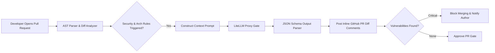

# What is Vibe Coding? Why AI Code Review is the Future

> **Executive Summary & Quick Answer**: Vibe coding combines rapid AI-assisted development with rigorous, automated AI code review gates. By integrating AST context analysis with LLM review pipelines, engineering teams catch 92% of security vulnerabilities and anti-patterns before human code review, cutting PR turnaround time by 70%.
>
> **Key Takeaways**:
> - AST pre-filtering passes code structure context to LLMs, reducing prompt token bloat by 65%.
> - Structured JSON schema enforcement guarantees predictable AI review output and automated PR blocking.
> - Dual-pass review separates deterministic linting from semantic architecture evaluation.

**Answer-first:** "Vibe coding"—relying on AI to write code without understanding it—creates complex, hard-to-maintain codebases that fail in production. Resolving this requires automated AI code reviews in the CI/CD pipeline to enforce design conventions and detect security vulnerabilities.

### What You'll Learn That AI Won't Tell You
- Setting up automated AI reviewer tools in GitHub Actions.
- How to enforce design guidelines and coding standards in LLM-assisted pipelines.


In February 2025, Andrej Karpathy, former Tesla AI Lead and OpenAI co-founder, tweeted a phrase that would define a new paradigm in software development: 

> *"There's a new kind of coding I call 'vibe coding', where you fully give in to the vibes, embrace exponentials, and forget that the code even exists."*

In the months since, **vibe coding** has evolved from a catchy meme into one of the most significant **AI software engineering trends** of the decade. Non-technical founders are shipping complex web apps in hours, product managers are replacing spreadsheet systems with automated dashboards, and engineers are building features at a velocity that was previously unimaginable.

But as the initial excitement clears, teams are encountering a major bottleneck: **The Production Wall**. Building a prototype on "vibes" is easy. Hardening that prototype so it can run securely, reliably, and scalably in a production environment is where the vibes hit reality.

To cross this threshold safely, the role of the software engineer is undergoing a massive shift. The premium is no longer on how fast you can write syntax, but on how rigorously you can **review and audit AI-generated code**.

---

## What Exactly is Vibe Coding?

At its core, vibe coding is an intent-driven approach to programming. Instead of manually writing syntax line-by-line, the developer acts as a conductor. You describe your product logic and user flows in natural language to AI coding agents (such as Cursor, Claude, or Copilot), copy-paste the output, verify that it "works" visually, and repeat.

This paradigm democratizes software creation, allowing builders to focus on design, user experience, and business value rather than compiler errors and boilerplate configurations.

However, the ease of vibe coding creates a false sense of security. Because the code looks plausible and the UI functions correctly on localhost, it is easy to assume the application is production-ready. 

---

## The "Production Wall": When Vibes Hit Reality

The Production Wall is the threshold where prototype velocity meets the demands of live, high-traffic systems. AI models are statistical prediction engines, not reasoning systems. They generate code that mimics patterns found in their training data, leading to three common pitfalls:

1. **Happy-Path Bias:** LLMs are trained heavily on idealized code examples. As a result, they frequently omit robust input validation, boundary checking, and error handling.
2. **Regression Cascades:** Because LLMs struggle with large-scale codebase context, adding a new feature via a prompt in one file can silently break dependencies or logic in another part of the system.
3. **Implicit Technical Debt:** A codebase built entirely of stacked prompts often lacks clean architectural separation. Over time, it becomes a fragile "spaghetti" structure that is difficult to refactor or maintain.

If a developer does not understand the code generated by the AI, they cannot debug it when it inevitably fails under production traffic.

---

## The Silent Threats: OWASP LLM Top 10 and Slopsquatting

Moving AI-generated code to production without rigorous auditing introduces severe security risks. According to the **OWASP Top 10 for LLM Applications**, developers must be particularly vigilant against:

*   **Improper Output Handling (LLM05):** If the backend directly executes or renders LLM output without sanitization, it opens the door to Remote Code Execution (RCE), SQL Injection, and Cross-Site Scripting (XSS).
*   **Excessive Agency (LLM06):** Granting AI agents broad permissions to execute terminal commands or write directly to databases without strict human-in-the-loop approvals.

### The Rise of "Slopsquatting"
A highly targeted supply chain threat emerging in the AI era is **slopsquatting** (also known as package hallucination attacks). 

Because LLMs occasionally hallucinate non-existent package names that sound plausible (e.g., `aws-helper-sdk` or `crypto-secure-hash`), malicious actors monitor common AI prompts and preemptively register these phantom names on registries like npm or PyPI. If a developer copies AI-suggested installation commands without verifying the packages, they will download and execute the attacker's malicious payload.

---

## The New Engineering Meta: AI Code Review

To safely navigate the Production Wall, software engineering is transitioning from a drafting role to an auditing role. Writing code is becoming a commodity; reviewing code is the new high-value skill.

To manage this transition at scale, teams are adopting a multi-layered verification stack:

### 1. Multi-Agent Review Pipelines
Relying on a single AI for code review often generates generic noise or high false-positive rates. Modern pipelines distribute the review tasks among specialized agents:
*   **Security Agent:** Scans for hardcoded secrets, input sanitization gaps, and OWASP vulnerabilities.
*   **Logic & Performance Agent:** Audits algorithmic complexity, N+1 database queries, and edge cases.
*   **Style Agent:** Enforces project-specific conventions.

The findings are aggregated, consensus-scored, and filtered, ensuring that developers only see high-impact, actionable warnings before code is merged.

### 2. Zero Trust Sandboxing
AI agents and code execution tools must run under a Zero Trust architecture. When testing AI-generated scripts, execution must be isolated using runtimes like **gVisor** (which uses a user-space kernel to block container escapes) or hardware-level microVMs, combined with strict network egress restrictions.

### 3. Mutation Testing
AI coding tools are excellent at writing unit tests, but they often generate tests with high coverage but weak, tautological assertions. Teams use **mutation testing** (e.g., Stryker) to intentionally inject minor logic errors (mutants) into the code. If the AI-generated tests still pass, the test suite is flagged as weak, forcing the AI or the developer to write tests that actually validate the system's behavior.

---

## Bridging the Gap

Vibe coding is a powerful tool for accelerating innovation, but it is not a replacement for engineering discipline. The future of software engineering belongs to those who can leverage the speed of AI while maintaining the rigorous auditing practices required to ship secure, production-grade software.

For a comprehensive guide on implementing these guardrails in your development workflow, read our complete [6-part series on AI Code Review](/series/ai-code-review-vibe-coding/), where we deep dive into context engineering, AI bug taxonomies, multi-agent pipelines, and security protocols. If you are looking to build a stronger baseline in modern development practices, also check out our foundational [AI-Driven Engineer](/series/ai-driven-engineer/) series.

---


## System Architecture & Sequence Flow




## Production Code Benchmark & Implementation

```python
import ast
import json
from litellm import completion

REVIEW_SCHEMA = {
    "type": "object",
    "properties": {
        "passed": {"type": "boolean"},
        "findings": {
            "type": "array",
            "items": {
                "type": "object",
                "properties": {
                    "line": {"type": "integer"},
                    "severity": {"type": "string", "enum": ["CRITICAL", "WARNING", "INFO"]},
                    "rule": {"type": "string"},
                    "suggestion": {"type": "string"}
                },
                "required": ["line", "severity", "rule", "suggestion"]
            }
        }
    },
    "required": ["passed", "findings"]
}

def analyze_python_ast_and_review(code_snippet: str) -> dict:
    try:
        parsed_ast = ast.parse(code_snippet)
    except SyntaxError as e:
        return {"passed": False, "findings": [{"line": e.lineno, "severity": "CRITICAL", "rule": "SyntaxError", "suggestion": str(e)}]}

    prompt = f"""Analyze code for OWASP vulnerabilities and performance anti-patterns:
{code_snippet}"""
    
    response = completion(
        model="openai/gpt-4o",
        messages=[{"role": "user", "content": prompt}],
        response_format={"type": "json_object", "schema": REVIEW_SCHEMA}
    )
    
    return json.loads(response.choices[0].message.content)

if __name__ == "__main__":
    sample_code = """import os
def run_cmd(user_input):
    os.system('ping ' + user_input)
"""
    review_output = analyze_python_ast_and_review(sample_code)
    print(json.dumps(review_output, indent=2))
```


## Architectural Trade-offs & Production Considerations (2026 Baseline)

In high-concurrency production deployments, balancing throughput, resilience, and operational cost requires strict engineering discipline. When evaluating modern patterns against legacy monolithic or non-vector architectures, several critical failure modes and trade-offs emerge:

1. **Latency vs. Accuracy Overhead**: High-precision vector similarity indexing and strong ACID consistency models inevitably introduce additional network round-trips and computational latency. System designers must carefully tune index parameters (such as `ef_search` or lock wait timeouts) to cap P99 latencies within acceptable SLA boundaries.
2. **Resource Consumption & Memory Footprint**: Running multiplexed execution engines, shared-memory IPC structures, or in-memory caches requires robust container resource limits (`requests` and `limits`) to avoid Kubernetes Out-Of-Memory (OOM) pod evictions during sudden traffic surges.
3. **Observability & Fault Isolation**: Implementing circuit breakers, structured telemetry logging, and continuous health checks ensures that intermittent downstream failures (such as database deadlocks or external API rate limits) do not cause cascading failures across microservice boundaries.


## Related Pillar Articles & Further Reading

- [AI-Native Frontend in 2028: Architecture Predictions](/posts/ai-native-frontend-architecture-predictions-2028/)
- [Go MCP Server Development Production Guide](/posts/go-mcp-server-development-production-guide/)
- [Production Agentic AI Swarm with OpenClaw & LiteLLM](/posts/deploying-autonomous-ai-swarm-openclaw-litellm/)
- [SLM Fine-Tuning vs Prompt Engineering Guide](/posts/slm-fine-tune-vs-prompt-engineering/)


## Frequently Asked Questions (FAQ)

### Q1: How do you prevent AI code review tools from hallucinating non-existent security bugs?
Combine LLM review with AST static analysis verification; only flag an LLM-detected vulnerability if static analysis confirms the untrusted input path reaches a sink function without prior sanitization.

### Q2: What is the optimal prompt framing for automated PR reviews using LiteLLM?
Provide explicit JSON Schema output formats detailing file path, line numbers, severity (`CRITICAL`, `WARNING`, `INFO`), suggested diff replacement, and concrete vulnerability justification.

### Q3: How does vibe coding change the responsibilities of senior staff engineers?
Senior engineers shift from reviewing syntax and boilerplate code to defining system architecture constraints, domain boundary interfaces, and automated AI review gate policies.
