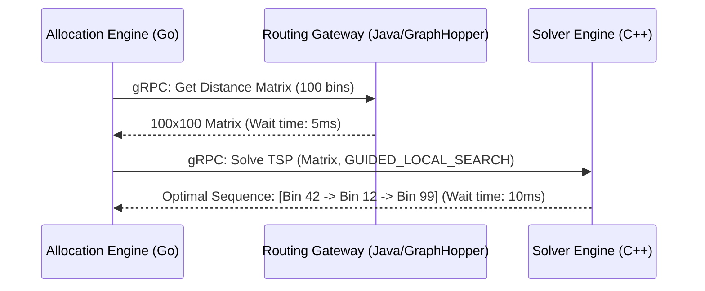

> **Prerequisite:** Review [Part 9: Order Splitting Algorithm](/posts/order-splitting-graph-coloring-opa/) for the previous module on box estimation and graph coloring algorithms.

# Warehouse Picker Routing Optimization (GraphHopper & OR-Tools)

**Answer-first:** Minimizing walking distance for warehouse pickers requires solving the Traveling Salesperson Problem (TSP) inside a physical building. The 2026 standard architecture uses a **Java-based Indoor GraphHopper** instance to generate a 100x100 Distance Matrix from custom OpenStreetMap (OSM) data, which is then fed into a **C++ Google OR-Tools gRPC Microservice** to calculate the absolute optimal pick sequence in under 15 milliseconds. 

---

## The S-Shape Trap in Warehouse Picking

In legacy Warehouse Management Systems (WMS), workers are directed to pick items using heuristic patterns like the S-Shape (Z-pattern) or Largest Gap. These heuristics force the worker to walk down every aisle that contains an item, traversing the aisle from end to end.

When a picker's batch contains 100 items distributed sparsely across a 50,000 square foot warehouse, the S-Shape heuristic is brutally inefficient. Pickers routinely walk over 15km per shift, wasting hours of operational time.

The engineering mandate is to abandon hardcoded paths and treat the warehouse floor as a formal routing graph, effectively solving the Vehicle Routing Problem (VRP) for human workers.

## Building the Indoor Graph (GraphHopper & OSM)

To calculate true walking distances rather than naive Euclidean straight lines, the warehouse floorplan is mapped into the OpenStreetMap (OSM) XML format. 

We define physical constraints using custom tags:
- `highway=aisle`: Walkable paths between storage racks.
- `level=1`: The floor tier.
- `highway=elevator`: Edges connecting different floors.

### The Contraction Hierarchy (CH) Trap
The default routing engine for GraphHopper utilizes Contraction Hierarchies (CH). CH is incredibly fast because it bakes (compiles) the routing graph statically at startup. 

If you use CH in a warehouse, you fail. Warehouse routing requires dynamic weights. For example, during peak hours, the wait time for `highway=elevator` might increase from 10 seconds to 45 seconds, making the stairs a mathematically faster route. CH cannot update edge weights on the fly without a full graph rebuild.

**The Fix:** Disable CH (`profile.ch.enabled=false`) and utilize the A-Star (A*) algorithm combined with **GraphHopper Custom Models**. This allows the Go Allocation Engine to inject JSON payloads at runtime to dynamically penalize or prioritize specific edges.

```json
{
  "priority": [
    { "if": "highway == 'aisle'", "multiply_by": "1.0" },
    { "if": "highway == 'elevator'", "multiply_by": "0.4" },
    { "if": "highway != 'aisle' && highway != 'elevator'", "multiply_by": "0.0" }
  ]
}
```

## Solving the TSP Math (Google OR-Tools)

Once GraphHopper returns the 100x100 Distance Matrix representing the time it takes to walk between every single item in the picker's batch, the matrix is passed to the solver.

Google OR-Tools, specifically the Routing Library, is the industry standard for VRP/TSP models. It applies a First Solution Strategy (e.g., `PATH_CHEAPEST_ARC`) followed by a Metaheuristic (e.g., `GUIDED_LOCAL_SEARCH`) to find the optimal sequence.

### The Python GIL Trap
Most OR-Tools documentation directs you to use the Python wrapper (`pywrapcp`). In a SaaS E-commerce environment processing thousands of concurrent routing requests, the Python Global Interpreter Lock (GIL) becomes a catastrophic bottleneck. Multi-threading Python for CPU-bound matrix calculations causes extreme latency spikes.

**The Fix:** Wrap the OR-Tools Routing Library in a dedicated **C++ gRPC Microservice**. The Go Orchestrator communicates exclusively with this C++ backend, achieving true multi-core parallelization and dropping the P99 solver latency to under 15ms.



## Scaling to 20+ Warehouses (Multi-Tenant JVM & K8s)

When running a SaaS platform supporting 20+ distinct warehouse locations, deploying 20 isolated GraphHopper instances wastes massive amounts of AWS compute resources. The architecture dictates wrapping GraphHopper in a single Spring Boot or Vert.x Java Gateway, maintaining a `ConcurrentHashMap<String, GraphHopper>` keyed by Tenant ID.

### The Kubernetes OOMKilled Trap
GraphHopper defaults to `RAM_STORE`, loading the routing graph directly into the Java Heap. Loading 20+ warehouses into the Heap triggers aggressive Garbage Collection (GC) pauses and inevitable `OutOfMemoryError` crashes.

The solution is to switch to **`MMAP_STORE`** (Memory-Mapped Files). This moves the graphs entirely off the Java Heap, forcing the Linux OS to manage the data via the Page Cache. Idle warehouse graphs are swapped to disk, while active ones remain in physical RAM.

However, this introduces a severe DevOps trap. If this Java service runs inside an EKS/ECS Kubernetes Pod, the kubelet monitors memory limits. By default, standard memory dashboards track `container_memory_usage_bytes`, which *includes* the OS Page Cache. When the `MMAP` files fill the Page Cache, Kubernetes will falsely assume the Pod is leaking memory and terminate it with `OOMKilled`.

**The Fix:** Alerting and horizontal pod autoscaling (HPA) must strictly monitor `container_memory_working_set_bytes`. This metric explicitly excludes the evictable Page Cache, ensuring Kubernetes does not terminate your routing gateway when the OS is simply doing its job managing the `MMAP` files.

---

## Series Navigation

**[E-commerce Order Allocation Architecture Systems Guide](https://tanhdev.com/series/ecommerce-order-allocation/)**

| Part | What it covers |
| :--- | :--- |
| [Part 1-4: Executive Summary](/posts/order-fulfillment-algorithm-warehouse-last-mile/) | Full warehouse-to-last-mile pipeline, inventory sync, multi-warehouse allocation |
| [Part 5: Split Shipment & Consolidation](/series/ecommerce-order-allocation/part-5-split-consolidation-lastmile/) | Greedy set-covering heuristic, profitability thresholds |
| [Part 6: Building a Mini Allocation Engine](/series/ecommerce-order-allocation/part-6-build-mini-allocation-engine/) | Google OR-Tools integer programming for assignment |
| [Part 7: Distance Matrix Routing](/series/ecommerce-order-allocation/part-7-distance-matrix-routing/) | GraphHopper distance matrix generation for VRP |
| [Part 8: Intelligent Order Release](/series/ecommerce-order-allocation/part-8-intelligent-order-release/) | Agentic AI Order Batching & VRPTW |
| [Part 9: Order Splitting Algorithm](/posts/order-splitting-graph-coloring-opa/) | Order Splitting, OPA & Graph Coloring |
| **This post (Part 10)** | Picker Routing, GraphHopper A*, OR-Tools in C++ |

🔗 **Next Step:** You have reached the final part of this series. Revisit the series index at [/series/ecommerce-order-allocation/](/series/ecommerce-order-allocation/) or explore other backend architecture series linked below.

