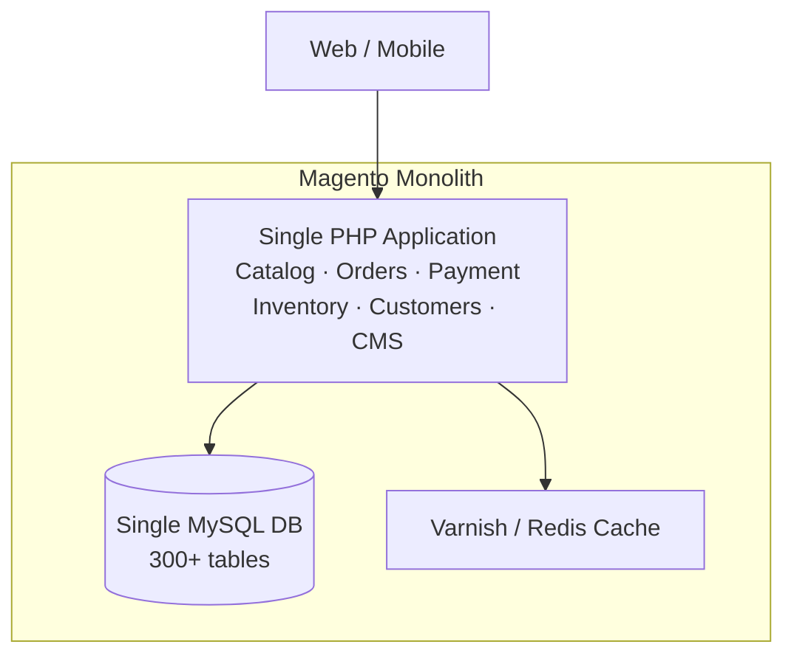
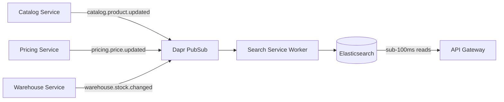
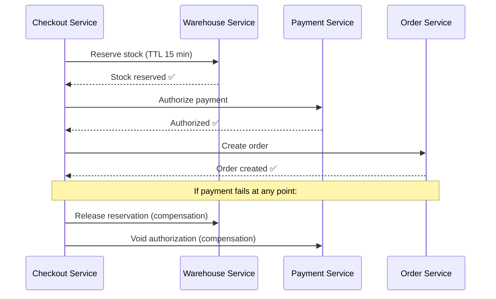

Let's be direct: Magento is not a bad platform. For thousands of businesses, it is the right tool. It has a mature plugin ecosystem, a large developer community, and a proven track record across enterprise e-commerce.

But there is a ceiling. And when you hit it, you feel it everywhere — in your deployment pipeline, in your database query times, in your team's ability to ship features independently, and ultimately in your ability to serve customers reliably at scale.

This post is about what that ceiling looks like technically, why it exists architecturally, and what a migration to microservices actually solves — and what it doesn't.

## The Core Problem: Magento is a Shared-State Monolith

Magento's architecture is fundamentally a single application with a single shared MySQL database. Every module — catalog, orders, payments, inventory, customers, promotions — reads and writes to the same database cluster.



This design works well at low-to-medium scale. The problem surfaces when you need to grow.

### 1. You Cannot Scale Selectively

During a flash sale, your `Order` and `Checkout` modules get hammered. Your `Catalog` module is mostly idle. In Magento, you cannot scale just the checkout flow — you must scale the entire application. Every PHP worker you spin up carries the full weight of every module, whether it's under load or not.

In a microservice architecture, you scale surgically:

```yaml
# Scale only the Order service during flash sale
# Other services remain at baseline
order-service:    replicas: 10   # 10x during sale
checkout-service: replicas: 8
payment-service:  replicas: 6
catalog-service:  replicas: 2   # Unchanged
analytics-service: replicas: 1  # Unchanged
```

The cost difference at scale is measurable. In our production environment, selective scaling during flash sale events reduced EC2 compute spend by approximately 60% compared to scaling the full Magento stack uniformly — because we only scaled the 3 services under load, not all 21.

### 2. A Single Failure Brings Down Everything

In Magento, a misbehaving extension, a slow database query, or a memory leak in one module can cascade into a full site outage. The application shares a process space and a database connection pool.

In a distributed system, failure is contained:

```
Magento:          Review module crashes → entire site down
Microservices:    Review service crashes → customers still browse, add to cart, and pay
```

This is not theoretical. The `Review` service going down should never affect the `Payment` service. Database isolation enforces this at the infrastructure level — each service owns its own PostgreSQL instance. A slow query in the `Analytics` database cannot lock rows in the `Order` database.

### 3. The EAV Schema Becomes a Performance Liability

Magento's product catalog uses an Entity-Attribute-Value (EAV) model. Instead of storing product data in flat rows, it spreads attributes across multiple tables: `catalog_product_entity_varchar`, `catalog_product_entity_int`, `catalog_product_entity_decimal`, and so on.

Fetching a single product with 30 attributes can require joining 5+ tables. At 25,000+ SKUs with complex attribute sets, this becomes a measurable latency problem — especially for search and listing pages. The SQL to export even a basic order manifest from Magento looks like this:

```sql
-- Just to get orders with payment and shipment IDs — already 3 JOINs
SELECT 
    sales_order.entity_id        AS "Order ID",
    sales_order_payment.entity_id AS "Payment ID",
    sales_shipment.entity_id      AS "Shipment ID",
    sales_order.status            AS "Order Status",
    sales_order.grand_total       AS "Total"
FROM sales_order
LEFT JOIN sales_order_payment 
    ON (sales_order.entity_id = sales_order_payment.parent_id)
LEFT JOIN sales_shipment 
    ON (sales_order.entity_id = sales_shipment.entity_id)
ORDER BY sales_order.created_at ASC;
```

And that is just orders. The product catalog EAV joins are significantly worse — fetching a single product with 30 attributes touches `catalog_product_entity_varchar`, `catalog_product_entity_int`, `catalog_product_entity_decimal`, and more in a single query. For a full breakdown of how to extract and flatten this data during migration, see [Exporting Magento 2 Orders: Bypassing the EAV Model with Clean SQL & Node.js](/posts/exporting-magento-2-data-flat-sql-nodejs/).

A dedicated `Catalog Service` with a purpose-built schema and an Elasticsearch read model solves this cleanly:

- Writes go to a normalized PostgreSQL schema owned by the Catalog service
- A CQRS read model in Elasticsearch serves product listings and search with sub-100ms response times
- Price and stock updates propagate via Dapr events, keeping the search index fresh in near real-time

The CQRS flow works like this: when the `Catalog` or `Pricing` service updates a product, it publishes a `catalog.product.updated` or `pricing.price.updated` event to the Dapr event mesh. The `Search` service subscribes to these topics and rebuilds the Elasticsearch document for that SKU — no cron jobs, no full reindex, no stale data windows.



### 4. Teams Step on Each Other

At scale, multiple squads need to work on the same platform simultaneously. In Magento, this means multiple teams modifying the same codebase, the same database schema, and deploying together.

Conway's Law is real: your system architecture mirrors your team structure. A monolith forces teams to coordinate deployments, negotiate schema changes, and share release cycles. One team's bug blocks another team's feature.

Bounded contexts solve this. When the `Payment` team owns their service end-to-end — their codebase, their database, their deployment pipeline — they ship independently. A bug in the `Loyalty` service does not block a `Checkout` release.

### 5. Distributed Transactions Require Explicit Design

Magento handles checkout as a synchronous database transaction: reserve stock, create order, capture payment — all in one `BEGIN ... COMMIT` block. This is simple and correct for a single database.

At scale, this becomes a liability. A slow payment gateway response holds a database transaction open, consuming connection pool slots. Under load, this cascades into connection exhaustion.

The microservice answer is the **Saga pattern**: each step is a local transaction, and failures trigger compensating transactions rather than database rollbacks.



No long-lived database transactions. No connection pool exhaustion. Each service handles its own state, and failures trigger explicit rollback logic rather than implicit database rollbacks.

## What Microservices Actually Deliver

Based on a production 21-service Go ecosystem handling 10,000+ orders per day, here is what the architecture concretely delivers:

| Capability | Magento | Microservices |
|---|---|---|
| Per-module scaling | ❌ Scale entire app | ✅ Scale only what's under load |
| Fault isolation | ❌ One crash = site down | ✅ Isolated failure domains |
| Database isolation | ❌ 300+ shared tables | ✅ Separate DB per service |
| Independent deploys | ❌ Full app deployment | ✅ Deploy one service at a time |
| Payment resilience | ❌ Sync, no retry logic | ✅ Saga + DLQ + compensation |
| Search performance | ⚠️ EAV joins at query time | ✅ Pre-indexed Elasticsearch |
| Event reliability | ❌ Sync observers | ✅ Transactional outbox, at-least-once |
| Zero-downtime deploy | ⚠️ Maintenance mode | ✅ Rolling updates per service |

The difference between these two event models is worth unpacking. In Magento, events are synchronous PHP observers — if the observer is slow or throws an exception, it blocks the entire request:

```php
// Magento: Synchronous observer — blocks the HTTP request
class OrderPlaceAfterObserver implements ObserverInterface
{
    public function execute(Observer $observer)
    {
        $order = $observer->getEvent()->getOrder();
        // If this call to an external API is slow or fails,
        // the customer's checkout request hangs or errors out
        $this->loyaltyService->awardPoints($order->getCustomerId(), $order->getGrandTotal());
        $this->analyticsService->trackPurchase($order); // Another blocking call
    }
}
```

In the microservice model, the `Order` service writes the event to an outbox table in the same database transaction as the order itself — then a background worker publishes it asynchronously:

```go
// Go: Transactional Outbox — event is guaranteed, non-blocking
func (uc *OrderUsecase) CreateOrder(ctx context.Context, o *Order) error {
    return uc.repo.WithTx(ctx, func(tx Tx) error {
        // 1. Save the order
        if err := tx.SaveOrder(ctx, o); err != nil {
            return err
        }
        // 2. Write event to outbox in the SAME transaction
        // If the DB commits, the event is guaranteed to be published
        return tx.SaveOutboxEvent(ctx, "orders.order.created", o)
    })
    // Background worker picks up outbox events and publishes to Dapr
    // Checkout request returns immediately — no blocking on downstream services
}
```

The outbox guarantees delivery even if the Dapr broker is temporarily unavailable. The Magento observer has no such guarantee — a failed observer silently drops the event.

## The Real Cost of Migration

This is where most migration posts stop being honest. Microservices are not free.

**Operational complexity increases dramatically.** You are now running 21+ services, each with its own database, deployment pipeline, and failure modes. You need Kubernetes, a service mesh, distributed tracing, centralized logging, and a team that understands all of it.

**Distributed systems introduce new failure modes.** Network partitions, event ordering issues, idempotency bugs, and eventual consistency edge cases do not exist in a monolith. They require explicit engineering investment to handle correctly.

**The migration itself is high-risk.** A naive "big bang" rewrite is how multimillion-dollar projects fail. The only safe path is an incremental migration using the Strangler Fig pattern — routing traffic gradually from the monolith to new services while maintaining data consistency through CDC pipelines and bidirectional sync.

**Team size matters.** A team of 2-3 developers cannot maintain 21 services. The operational overhead alone requires dedicated platform engineering capacity. Shopify or a managed Magento cloud is the right answer for small teams.

## When to Migrate (And When Not To)

**Migrate when:**
- You have 5+ developers and dedicated DevOps capacity
- You are hitting Magento's scaling ceiling (slow deploys, shared DB contention, module conflicts)
- You need independent team autonomy across multiple squads
- You require custom payment flows, multi-warehouse WMS, or VN-specific integrations that Magento handles poorly
- You want full source ownership with zero vendor licensing costs

**Do not migrate when:**
- Your team is under 5 engineers
- You need to launch in weeks, not months
- Your traffic is manageable on a well-tuned Magento stack
- You rely heavily on Magento's plugin ecosystem
- You do not have the operational maturity to run Kubernetes in production

## The Bottom Line

Magento's monolithic architecture is not a flaw — it is a deliberate design choice that optimizes for simplicity and ecosystem richness. For the majority of e-commerce businesses, it is the correct choice.

The migration to microservices makes sense when the cost of that simplicity — shared database contention, inability to scale selectively, coupled deployments, cascading failures — exceeds the cost of distributed systems complexity.

That crossover point is real, and when you hit it, the architectural investment pays for itself in deployment velocity, operational resilience, and the ability to scale exactly what needs scaling — nothing more.

For the exact playbook on how to execute this migration safely — including the 3-phase Strangler Fig pattern, Debezium CDC pipelines, and bidirectional sync — read [The Zero-Downtime Blueprint: Moving from Magento to Microservices](/posts/moving-from-magento-to-microservices/).

If you are still evaluating team capability before a migration, read [Magento Developers in Vietnam: What to Look For Beyond Theme Work](/posts/magento-developers-in-vietnam/) and [Magento Development in Vietnam: Cost, Capability, and When It Actually Fits](/posts/magento-development-in-vietnam/).


