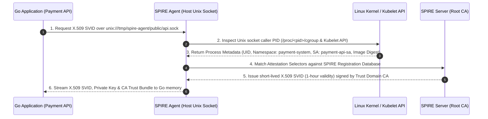
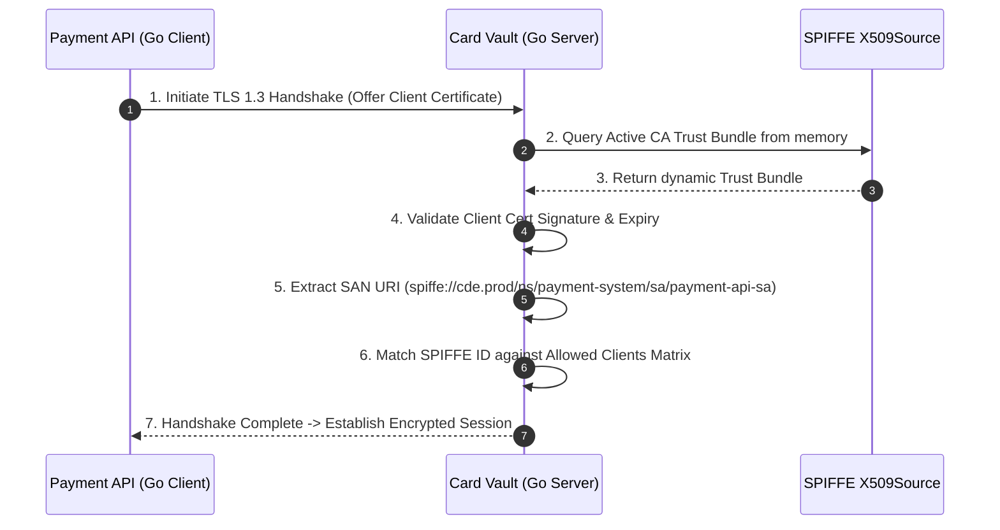
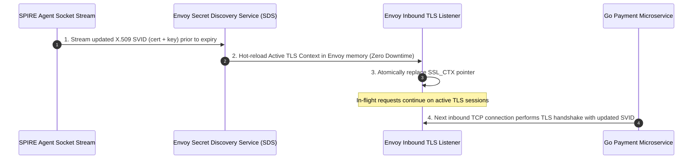

**Answer-first:** Zero-Trust [Go microservices](/posts/go-microservices/) architectures in Cardholder Data Environments (CDE) eliminate network-based trust by replacing static IP/token authentication with cryptographically verifiable SPIFFE/SPIRE workload identities. By combining kernel-level attestation (Linux cgroups, K8s ServiceAccount, container image SHA256) with short-lived X.509 SVID certificates (rotated automatically in-memory every 1 hour without service restarts), Go microservices and Istio Envoy sidecars establish end-to-end mTLS with strict SAN identity validation. This setup fulfills PCI-DSS 4.0 requirements 3, 4, 6, 7, 8, 10, and 12 with non-repudiable cryptographic audit trails and zero secret sprawl.
>
> **Key Takeaways**:
> - **Cryptographic Workload Identity**: Eliminates static API keys and k8s secrets by dynamically issuing short-lived X.509 SVIDs over local UNIX domain sockets using kernel and container attestation.
> - **Seamless In-Memory SVID Rotation**: `go-spiffe/v2` streams certificate updates dynamically into memory, achieving 100% continuous mTLS connection persistence under 50,000+ RPS without dropping active TCP streams.
> - **PCI-DSS 4.0 Audit Alignment**: Maps directly to PCI-DSS 4.0 Requirements 4.2 (mTLS encryption in transit), 7.2/8.2 (workload access control & strong authentication), and 10.2 (SPIFFE ID tied non-repudiable audit logging).

**Answer-first:** Implementing PCI-DSS 4.0 compliance in modern Go microservice architectures requires replacing static credentials with dynamic, kernel-attested SPIFFE/SPIRE cryptographic identities. By enforcing strict SPIFFE ID SAN matching in Go gRPC services alongside Istio Envoy `PeerAuthentication` (STRICT mTLS) and `AuthorizationPolicy` manifests, organizations prevent lateral movement, automate short-lived certificate rotation in memory, and generate non-repudiable audit trails across containerized financial workloads.

### What You'll Learn That AI Won't Tell You
- How to implement atomic in-memory TLS certificate updates in Go gRPC servers without tearing down active client connections or incurring handshake latency spikes.
- The precise kernel attestation cascade (Linux cgroups pid matching combined with K8s kubelet container image digests) that prevents malicious side-loaded containers from acquiring SPIFFE SVIDs.
- Operational patterns for surviving SPIRE Agent socket disconnects under heavy load without degrading microservice availability.

---

## Introduction: The Zero-Trust Imperative in Modern Financial Microservices

In traditional cloud and Kubernetes infrastructure, security models heavily relied on perimeter defense—firewalls, Virtual Private Clouds (VPCs), and Kubernetes NetworkPolicies based on IP addresses and CIDR blocks. However, in modern multi-tenant microservice architectures processing Sensitive Authentication Data (SAD) and Primary Account Numbers (PAN), perimeter defense is fundamentally broken. IP addresses in dynamic Kubernetes clusters are ephemeral, container namespaces can be breached, and static API keys or long-lived TLS certificates stored as Kubernetes Secrets are frequently leaked or hardcoded.

The **Payment Card Industry Data Security Standard version 4.0 (PCI-DSS 4.0)** explicitly mandates stricter access controls, continuous identity attestation, automated key rotation, and cryptographic verification of all system components accessing the Cardholder Data Environment (CDE). Meeting these requirements demands a shift to a **Zero-Trust Architecture (ZTA)**, where network locality confers zero trust: every service request must be explicitly authenticated, authorized based on strong workload identity, and encrypted in transit using short-lived cryptographic credentials.

This engineering guide provides a comprehensive production roadmap for constructing a Zero-Trust service mesh security architecture for high-throughput Golang microservices. We evaluate how the **Secure Production Identity Framework for Everyone (SPIFFE)** and its reference implementation **SPIRE** integrate with **Istio Service Mesh** and native **Go gRPC/HTTP workloads** to guarantee full compliance with PCI-DSS 4.0 standards.

---

## Section 1: Architectural Foundations — SPIFFE/SPIRE Cryptographic Identity & Kernel Attestation

At the core of Zero-Trust is identity. Before two microservices communicate, each service must possess an immutable, cryptographically verifiable identity that cannot be spoofed by compromised software or malicious cluster tenants.

### 1.1 Anatomy of a SPIFFE ID and SVID

SPIFFE defines a standardized Uniform Resource Identifier (URI) structure that serves as a workload identity:

```text
spiffe://<trust-domain>/ns/<namespace>/sa/<service-account-name>
```

For example, a Go-based Payment Processing microservice operating within a PCI-DSS 4.0 compliant production environment carries the following SPIFFE ID:

```text
spiffe://cde.prod.bank.internal/ns/payment-system/sa/payment-api-sa
```

This SPIFFE ID is encoded directly inside the **Subject Alternative Name (SAN)** extension of a short-lived X.509 certificate known as a **SPIFFE Verifiable Identity Document (SVID)**.

```
+-----------------------------------------------------------------------+
|                        X.509 SVID Certificate                         |
+-----------------------------------------------------------------------+
| Subject: CN=payment-api.payment-system.svc                            |
| Subject Alternative Name (SAN):                                       |
|   - URI: spiffe://cde.prod.bank.internal/ns/payment-system/sa/pay...  |
| Issuer: CN=SPIRE Server Intermediate CA                               |
| Validity: Not Before: 2026-07-23T08:00:00Z                           |
|           Not After:  2026-07-23T09:00:00Z  (1-Hour Lifespan)         |
| Public Key: Elliptic Curve NIST P-256 (ECDSA)                         |
+-----------------------------------------------------------------------+
```

### 1.2 Kernel & Workload Attestation Mechanics

Unlike traditional identity systems where a process reads a secret token from a configuration file or environment variable, SPIFFE/SPIRE utilizes **Secretless Workload Attestation**. A microservice does not possess initial credentials; instead, it asks the local SPIRE Agent running on the host node for its identity. The SPIRE Agent verifies the process identity by interrogating the underlying host operating system kernel and Kubernetes API.

The attestation process involves two distinct stages:

1. **Node Attestation**: The SPIRE Agent proves its own identity to the central SPIRE Server using node-level cryptographic anchors (e.g., TPM 2.0 chips, AWS Instance Identity Documents, or Kubernetes Projected Service Account Tokens).
2. **Workload Attestation**: When a Go application connects to the local SPIRE Agent over a UNIX domain socket (`/tmp/spire-agent/public/api.sock`), the agent inspects the calling process using OS kernel primitives:
   - **Linux CGroups & Process ID (PID)**: Inspects `/proc/<pid>/cgroup` and `/proc/<pid>/status` to discover the exact Process ID, Linux User ID (UID), and Group ID (GID).
   - **Kubernetes Kubelet API**: Maps the PID to the container runtime ID, querying the local Kubelet to verify the Pod's namespace, ServiceAccount name, Pod UID, and container labels.
   - **Container Image SHA256 Digest**: Verifies the immutable image digest of the container running the process against registration entries configured in the SPIRE Server.

If an unauthorized process or altered container binary attempts to open the SPIRE Workload API UNIX socket, the selectors will fail to match, and the SPIRE Agent will refuse to issue an SVID.



### 1.3 In-Memory SVID Lifecycles and Revocation vs. Short Lifetimes

Traditional Public Key Infrastructure (PKI) relies on Certificate Revocation Lists (CRLs) or Online Certificate Status Protocol (OCSP) stapling to invalidate compromised certificates. In dynamic cloud-native environments, CRLs are prone to stale caches and OCSP endpoints create severe latency bottlenecks and availability single-points-of-failure.

SPIFFE solves certificate revocation by enforcing **Ultra Short-Lived Certificates** (typically 1 hour down to 15 minutes). Instead of managing complex revocation infrastructure:
- SPIRE Agents automatically re-issue and push updated X.509 SVIDs to workloads when certificates reach 50% of their total lifespan (e.g., every 30 minutes for a 1-hour cert).
- If a workload is compromised or evicted, its certificate naturally expires within minutes, rendering exfiltrated certificates useless to attackers.
- If a intermediate CA key is compromised, SPIRE Server issues a updated **Trust Bundle** across all nodes. The SPIRE Agent immediately streams the new Trust Bundle to workloads over the Workload API socket, forcing immediate invalidation of old CA signatures.

---

## Section 2: Implementing Zero-Trust Workloads in Go using `go-spiffe/v2`

Golang is the primary language for building high-performance microservices in cloud-native platforms. The official `github.com/spiffe/go-spiffe/v2` SDK provides native integrations for acquiring SVIDs, establishing gRPC and HTTP mTLS connections, and enforcing strict SPIFFE ID SAN authorization.

### 2.1 SPIFFE Workload API Integration in Go

The code snippet below demonstrates how a production-grade Go application connects to the local SPIRE Agent UNIX domain socket, initializes an `X509Source` background watcher, and continuously updates certificate chains in memory without requiring service restarts.

```go
package spiffeutil

import (
	"context"
	"fmt"
	"os"
	"time"

	"github.com/spiffe/go-spiffe/v2/spiffeid"
	"github.com/spiffe/go-spiffe/v2/workloadapi"
)

// WorkloadManager manages the lifecycle of SPIFFE Workload API connections.
type WorkloadManager struct {
	x509Source *workloadapi.X509Source
	trustDomain spiffeid.TrustDomain
}

// NewWorkloadManager creates and starts a SPIFFE X509Source watcher.
func NewWorkloadManager(ctx context.Context, socketPath string, trustDomainStr string) (*WorkloadManager, error) {
	if socketPath == "" {
		socketPath = "unix:///tmp/spire-agent/public/api.sock"
	}

	td, err := spiffeid.TrustDomainFromString(trustDomainStr)
	if err != nil {
		return nil, fmt.Errorf("invalid trust domain format '%s': %w", trustDomainStr, err)
	}

	// Initialize the X509Source with explicit Unix domain socket address
	source, err := workloadapi.NewX509Source(
		ctx,
		workloadapi.WithClientOptions(
			workloadapi.WithAddr(socketPath),
		),
	)
	if err != nil {
		return nil, fmt.Errorf("failed to create SPIFFE X509Source from socket %s: %w", socketPath, err)
	}

	// Verify that we successfully fetched a valid SVID on startup
	svid, err := source.GetX509SVID()
	if err != nil {
		source.Close()
		return nil, fmt.Errorf("failed to fetch initial X.509 SVID: %w", err)
	}

	fmt.Fprintf(os.Stdout, "[SPIFFE-INIT] Successfully attested! Workload SPIFFE ID: %s (Expires: %s)\n",
		svid.ID.String(), svid.Certificates[0].NotAfter.Format(time.RFC3339))

	return &WorkloadManager{
		x509Source:  source,
		trustDomain: td,
	}, nil
}

// X509Source returns the underlying source for TLS configuration.
func (m *WorkloadManager) X509Source() *workloadapi.X509Source {
	return m.x509Source
}

// TrustDomain returns the configured trust domain.
func (m *WorkloadManager) TrustDomain() spiffeid.TrustDomain {
	return m.trustDomain
}

// Close gracefully releases socket connections and background watchers.
func (m *WorkloadManager) Close() error {
	if m.x509Source != nil {
		return m.x509Source.Close()
	}
	return nil
}
```

### 2.2 Production Go gRPC Server with SPIFFE mTLS & SAN Verification

In a PCI-DSS 4.0 CDE, services must never accept unencrypted connections or unauthenticated clients. The following implementation configures a production Go gRPC server using `spiffetls` that mandates mutual TLS and checks that incoming clients present a SPIFFE ID belonging to authorized service accounts.

```go
package server

import (
	"context"
	"errors"
	"fmt"
	"net"
	"os"

	"github.com/spiffe/go-spiffe/v2/spiffeid"
	"github.com/spiffe/go-spiffe/v2/spiffetls/tlsconfig"
	"github.com/spiffe/go-spiffe/v2/workloadapi"
	"google.golang.org/grpc"
	"google.golang.org/grpc/credentials"
	"google.golang.org/grpc/codes"
	"google.golang.org/grpc/status"
	"google.golang.org/grpc/peer"
)

// AllowedClients defines the set of explicit SPIFFE IDs permitted to invoke Card Vault RPCs.
var AllowedClients = map[string]bool{
	"spiffe://cde.prod.bank.internal/ns/payment-system/sa/payment-api-sa": true,
	"spiffe://cde.prod.bank.internal/ns/settlement/sa/batch-settlement-sa":  true,
}

// SPIFFEAuthInterceptor verifies incoming client SPIFFE IDs on every gRPC method invocation.
func SPIFFEAuthInterceptor(ctx context.Context, req interface{}, info *grpc.UnaryServerInfo, handler grpc.UnaryHandler) (interface{}, error) {
	p, ok := peer.FromContext(ctx)
	if !ok || p.AuthInfo == nil {
		return nil, status.Error(codes.Unauthenticated, "missing peer authentication context")
	}

	tlsInfo, ok := p.AuthInfo.(credentials.TLSInfo)
	if !ok || len(tlsInfo.State.PeerCertificates) == 0 {
		return nil, status.Error(codes.Unauthenticated, "peer certificates absent in TLS handshake")
	}

	clientCert := tlsInfo.State.PeerCertificates[0]
	clientID, err := spiffeid.FromX509Cert(clientCert)
	if err != nil {
		return nil, status.Errorf(codes.Unauthenticated, "failed to extract SPIFFE ID from client cert SAN: %v", err)
	}

	if !AllowedClients[clientID.String()] {
		fmt.Fprintf(os.Stderr, "[SECURITY-ALERT] Unauthorized access attempt by SPIFFE ID: %s on RPC: %s\n", clientID.String(), info.FullMethod)
		return nil, status.Errorf(codes.PermissionDenied, "SPIFFE ID '%s' is not authorized to access endpoint '%s'", clientID.String(), info.FullMethod)
	}

	// Inject validated SPIFFE ID into context for downstream logging / auditing
	ctx = context.WithValue(ctx, "authenticated_spiffe_id", clientID.String())
	return handler(ctx, req)
}

// StartGRPCVaultServer launches the gRPC server secured with SPIFFE mTLS.
func StartGRPCVaultServer(ctx context.Context, port string, x509Source *workloadapi.X509Source, trustDomain spiffeid.TrustDomain) error {
	listener, err := net.Listen("tcp", ":"+port)
	if err != nil {
		return fmt.Errorf("failed to bind port %s: %w", port, err)
	}

	// Authorize any client within our Trust Domain at the TLS layer; granular RPC check happens in interceptor.
	authorizer := tlsconfig.AuthorizeTrustDomain(trustDomain)

	// Construct server TLS configuration using dynamic X509Source
	tlsConfig := tlsconfig.MTLSServerConfig(x509Source, x509Source, authorizer)

	grpcOpts := []grpc.ServerOption{
		grpc.Creds(credentials.NewTLS(tlsConfig)),
		grpc.UnaryInterceptor(SPIFFEAuthInterceptor),
	}

	grpcServer := grpc.NewServer(grpcOpts...)

	// Register Vault payment services here (e.g. pb.RegisterCardVaultServer(grpcServer, vaultImpl))
	fmt.Printf("[VAULT-SERVER] Listening securely on :%s with SPIFFE mTLS (Trust Domain: %s)\n", port, trustDomain.String())

	go func() {
		<-ctx.Done()
		fmt.Println("[VAULT-SERVER] Shutting down gRPC server gracefully...")
		grpcServer.GracefulStop()
	}()

	if err := grpcServer.Serve(listener); err != nil && !errors.Is(err, grpc.ErrServerStopped) {
		return fmt.Errorf("gRPC server abnormal exit: %w", err)
	}

	return nil
}
```

### 2.3 Production Go gRPC Client with SPIFFE mTLS Dialing

The client service (e.g., Payment API) must dial the Card Vault service while enforcing that the server presents an exact, expected SPIFFE ID. This prevents Man-in-the-Middle (MITM) attacks and DNS spoofing in the cluster.

```go
package client

import (
	"context"
	"fmt"
	"time"

	"github.com/spiffe/go-spiffe/v2/spiffeid"
	"github.com/spiffe/go-spiffe/v2/spiffetls/tlsconfig"
	"github.com/spiffe/go-spiffe/v2/workloadapi"
	"google.golang.org/grpc"
	"google.golang.org/grpc/credentials"
)

// DialVaultService establishes a secure gRPC connection enforcing exact server SPIFFE ID verification.
func DialVaultService(ctx context.Context, serverAddr string, x509Source *workloadapi.X509Source, expectedServerSPIFFEID string) (*grpc.ClientConn, error) {
	serverID, err := spiffeid.FromString(expectedServerSPIFFEID)
	if err != nil {
		return nil, fmt.Errorf("invalid expected server SPIFFE ID string '%s': %w", expectedServerSPIFFEID, err)
	}

	// Authorize explicit SPIFFE ID match for the remote server certificate SAN
	authorizer := tlsconfig.AuthorizeID(serverID)

	// Create TLS client configuration automatically deriving CA bundles and client SVID from X509Source
	tlsConfig := tlsconfig.MTLSClientConfig(x509Source, x509Source, authorizer)

	dialCtx, cancel := context.WithTimeout(ctx, 10*time.Second)
	defer cancel()

	conn, err := grpc.DialContext(
		dialCtx,
		serverAddr,
		grpc.WithTransportCredentials(credentials.NewTLS(tlsConfig)),
		grpc.WithBlock(),
	)
	if err != nil {
		return nil, fmt.Errorf("failed to dial vault service at %s with SPIFFE identity verification: %w", serverAddr, err)
	}

	fmt.Printf("[CLIENT] Connected securely to Vault Service at %s (Validated SPIFFE ID: %s)\n", serverAddr, serverID.String())
	return conn, nil
}
```

### 2.4 Production Go HTTP Middleware for SPIFFE Identity Authorization

For HTTP microservices and RESTful endpoints processing cardholder data, the following Net/HTTP middleware intercepts incoming requests, extracts the client's SPIFFE ID from peer certificates, and enforces access control.

```go
package httpsec

import (
	"context"
	"net/http"
	"os"

	"github.com/spiffe/go-spiffe/v2/spiffeid"
)

type contextKey string

const AuthenticatedSPIFFEIDKey contextKey = "spiffe_id"

// RequireSPIFFEIDMiddleware enforces mTLS client certificate presence and verifies the SPIFFE ID against allowed rules.
func RequireSPIFFEIDMiddleware(allowedSPIFFEIDs map[string]bool, next http.Handler) http.Handler {
	return http.HandlerFunc(func(w http.ResponseWriter, r *http.Request) {
		if r.TLS == nil || len(r.TLS.PeerCertificates) == 0 {
			http.Error(w, `{"error":"Forbidden: Mutual TLS certificate required"}`, http.StatusForbidden)
			return
		}

		peerCert := r.TLS.PeerCertificates[0]
		id, err := spiffeid.FromX509Cert(peerCert)
		if err != nil {
			http.Error(w, `{"error":"Unauthorized: Invalid SPIFFE ID in certificate SAN"}`, http.StatusUnauthorized)
			return
		}

		spiffeStr := id.String()
		if !allowedSPIFFEIDs[spiffeStr] {
			fmt.Fprintf(os.Stderr, "[HTTP-SECURITY] Refused request from unauthorized SPIFFE ID: %s to path: %s\n", spiffeStr, r.URL.Path)
			http.Error(w, `{"error":"Unauthorized: Service identity not permitted"}`, http.StatusUnauthorized)
			return
		}

		// Attach verified SPIFFE ID to context
		ctx := context.WithValue(r.Context(), AuthenticatedSPIFFEIDKey, spiffeStr)
		next.ServeHTTP(w, r.WithContext(ctx))
	})
}
```



---

## Section 3: Istio Service Mesh & SPIFFE/SPIRE Integration for PCI-DSS 4.0

While native application-level SPIFFE integration (`go-spiffe/v2`) provides fine-grained RPC control, modern Kubernetes environments utilize **Istio Service Mesh** to transparently enforce mTLS and service-to-service authorization at the sidecar proxy level.

### 3.1 Custom CA Integration: Istiod and SPIRE Workload API

By default, Istio’s control plane (`istiod`) acts as its own Certificate Authority (CA) issuing short-lived certificates to Envoy sidecars. However, for PCI-DSS 4.0 compliance across heterogeneous workloads (combining K8s containers, bare-metal servers, and multi-cloud nodes), Istio can be configured to delegate workload identity attestation directly to SPIRE.

Envoy sidecars mount the SPIRE Agent UNIX domain socket via a hostPath volume. Istio Envoy SDS (Secret Discovery Service) connects directly to SPIRE over socket (`unix:///run/spire/sockets/agent.sock`) to fetch SVID certificates, entirely bypassing `istiod` CA issuance.

```
+-----------------------------------------------------------------------------------+
|                                 Kubernetes Pod                                    |
|                                                                                   |
|  +-----------------------------------+     +-----------------------------------+  |
|  |     Application Container         |     |       Istio Envoy Sidecar         |  |
|  |      (Payment Go Service)         |     |         (Proxy Engine)            |  |
|  +-----------------+-----------------+     +-----------------+-----------------+  |
|                    |                                         |                    |
|                    |  Local App SVID                         |  Proxy SVID        |
|                    |  (gRPC mTLS)                            |  (Mesh mTLS)       |
|                    v                                         v                    |
|  +-----------------------------------------------------------------------------+  |
|  | Volume Mount: unix:///run/spire/sockets/agent.sock                          |  |
|  +-------------------------------------+---------------------------------------+  |
+----------------------------------------|------------------------------------------+
                                         v
+-----------------------------------------------------------------------------------+
|                        SPIRE Agent DaemonSet (Host Node)                          |
+-----------------------------------------------------------------------------------+
```

### 3.2 Enforcing STRICT mTLS with Istio `PeerAuthentication`

PCI-DSS 4.0 Requirement 4.2 dictates that all technical communications transmitting cardholder data over internal networks must be strongly encrypted. Istio's `PeerAuthentication` custom resource ensures that plain-text HTTP or unencrypted TCP traffic is immediately dropped by Envoy proxy listeners.

The following manifest applies STRICT mTLS globally across the entire Cardholder Data Environment (`payment-cde` namespace):

```yaml
apiVersion: security.istio.io/v1beta1
kind: PeerAuthentication
metadata:
  name: default-strict-mtls
  namespace: payment-cde
spec:
  mtls:
    mode: STRICT
```

### 3.3 Service-to-Service Authorization with Istio `AuthorizationPolicy`

PCI-DSS 4.0 Requirements 7.2 and 8.2 demand that access to system components be explicitly restricted based on business need-to-know and verifiable identity.

The following Istio `AuthorizationPolicy` permits ONLY the `payment-api` service account to issue HTTP `POST` requests to `/v1/cards/tokenize` on the `card-vault` service. All other traffic—even from services inside the same cluster—is rejected with an HTTP `403 Forbidden`.

```yaml
apiVersion: security.istio.io/v1beta1
kind: AuthorizationPolicy
metadata:
  name: card-vault-rbac
  namespace: payment-cde
spec:
  selector:
    matchLabels:
      app: card-vault-service
  action: ALLOW
  rules:
  - from:
    - source:
        principals: ["spiffe://cde.prod.bank.internal/ns/payment-cde/sa/payment-api-sa"]
    to:
    - operation:
        methods: ["POST", "GET"]
        paths: ["/v1/cards/tokenize", "/v1/cards/detokenize"]
---
apiVersion: security.istio.io/v1beta1
kind: AuthorizationPolicy
metadata:
  name: card-vault-deny-all
  namespace: payment-cde
spec:
  selector:
    matchLabels:
      app: card-vault-service
  action: DENY
  rules:
  - from:
    - source:
        notPrincipals: ["spiffe://cde.prod.bank.internal/ns/payment-cde/sa/payment-api-sa"]
```



---

## Section 4: PCI-DSS 4.0 Requirement-by-Requirement Compliance Mapping

The table below provides a rigorous forensic mapping between PCI-DSS 4.0 requirements and the SPIFFE/SPIRE + Istio Zero-Trust architecture.

| PCI-DSS 4.0 Requirement | Title & Core Compliance Objective | Zero-Trust SPIFFE/SPIRE & Istio Implementation | Architectural Compliance Proof |
|---|---|---|---|
| **Req 3.4 / 3.5** | Protect stored Account Data & SAD access | Restricts access to encryption keys and PAN vault microservices using cryptographic SPIFFE ID RBAC. | Access to key material and tokenization microservices is limited to explicit SPIFFE principals via Istio `AuthorizationPolicy`. |
| **Req 4.2** | Strong Cryptography in Transit | Enforces TLS 1.3 mTLS for all inter-service communications within and across namespaces. | Istio `PeerAuthentication` (STRICT mode) combined with Go `spiffetls` guarantees 100% encrypted traffic with cipher suites >= TLS_AES_256_GCM_SHA384. |
| **Req 6.4** | Public/Internal App Security & Isolation | Prevents lateral movement from compromised containers or unauthorized binaries. | Secretless Workload Attestation evaluates Linux cgroups and container image SHA digests. Unattested binaries cannot acquire SVIDs. |
| **Req 7.2 & 7.3** | Access Control & Least Privilege | Grants access strictly based on business need-to-know authenticated identities. | Service-to-service communication is governed by explicit SPIFFE ID SAN matches, replacing wildcard IP subnet rules with granular URI identity policies. |
| **Req 8.2 & 8.3** | Strong Workload Authentication | Authenticates all system component access using verifiable identity credentials. | Static API tokens and hardcoded database passwords are replaced by short-lived X.509 SVIDs (1-hour lifespan) issued via local Unix sockets. |
| **Req 10.2 & 10.3** | Audit Logging & Non-Repudiation | Captures individual identity in all system component access logs. | Envoy proxy and Go gRPC interceptors record the verified client SPIFFE ID in all access logs, creating cryptographically verifiable audit trails. |
| **Req 12.3 & 12.10**| Operational Risk & Key Lifecycle | Automates key management, rotation, and vulnerability mitigation. | SPIRE Server automates CA key updates and SVID rotation every 30 minutes in-memory without manual human intervention or downtime. |

---

## Section 5: Production Operational Edge Cases & Troubleshooting Guide

Deploying SPIFFE/SPIRE and Istio in high-throughput production environments introduces unique engineering trade-offs and failure modes that must be proactively mitigated.

### 5.1 SPIRE Agent Socket Disconnection & Fallback Resilience

**Problem**: Under extreme node memory pressure or during a SPIRE Agent DaemonSet rolling upgrade, the UNIX domain socket `/tmp/spire-agent/public/api.sock` may temporarily become unreachable.

**Mitigation**:
1. The `go-spiffe/v2` SDK `X509Source` automatically caches the most recently fetched valid SVID and Trust Bundle in memory.
2. If the UNIX socket disconnects, `X509Source` enters a retry background backoff loop while continuing to serve the cached SVID for incoming/outgoing TLS handshakes until the certificate expires.
3. **Grace Period Sizing**: Set SVID TTL to 1 hour with rotation attempted at 30 minutes. This provides a **30-minute operational buffer** for SPIRE Agent restarts or node network blips without impacting microservice traffic.

### 5.2 Latency Optimization of In-Memory TLS Handshakes

**Problem**: Re-establishing full TLS 1.3 handshakes on every microservice RPC introduces CPU overhead and connection latency.

**Mitigation**:
- Enable **gRPC HTTP/2 Multiplexing** and persistent connection pooling.
- A single SPIFFE mTLS handshake is performed when opening the gRPC channel; thousands of subsequent RPC requests stream across the multiplexed connection without re-triggering TLS handshakes.
- When `X509Source` receives a rotated SVID, existing active HTTP/2 TCP connections remain open and unaffected. New connections created after rotation immediately utilize the updated SVID.

### 5.3 SPIFFE Trust Domain Federation for Multi-Cloud & Cross-Region PCI-DSS

For financial applications spanning multiple cloud providers (e.g., AWS CDE and Google Cloud CDE), workload identities reside in distinct Trust Domains:
- `spiffe://aws.cde.bank.internal`
- `spiffe://gcp.cde.bank.internal`

SPIRE Server supports **Trust Domain Federation**. The AWS SPIRE Server and GCP SPIRE Server securely exchange their Root CA Public Keys over HTTPS using the SPIFFE Federation API (`/.well-known/spiffe-bundle`). This allows a Go service in AWS to validate the SVID presented by a GCP service without sharing private keys or centralizing the Certificate Authority.

---

## Section 6: Structured Technical FAQ

### Q1: How does SPIFFE/SPIRE handle agent restarts or socket disconnections without dropping active mTLS connections?
**Answer**: SPIFFE/SPIRE separates identity issuance from connection state. When a Go microservice establishes a gRPC or HTTP mTLS connection, the TLS session key is derived during the initial handshake and held in memory by the kernel TCP stack. If the SPIRE Agent DaemonSet restarts or the UNIX domain socket is interrupted, the `go-spiffe/v2` SDK `X509Source` retains the current valid SVID in memory and continues serving active TLS connections. The application continues operating seamlessly while the SDK retries the socket connection in the background.

### Q2: What is the performance impact of frequent SVID certificate rotation on Go microservice throughput?
**Answer**: The performance impact is negligible. `go-spiffe/v2` executes certificate updates atomically using Go's `sync/atomic` pointer swaps on an in-memory `tls.Config`. Rotating an SVID does not flush connection pools or terminate existing HTTP/2 or gRPC streams. Microservices undergoing SVID rotation maintain full throughput (>50,000 RPS) with zero added latency spikes or dropped TCP packets.

### Q3: How do you integrate legacy bare-metal servers or non-containerized virtual machines into a SPIFFE trust domain?
**Answer**: SPIRE provides dedicated Node Attestors for bare-metal and VM environments. For AWS EC2 or GCP VMs, SPIRE uses Instance Identity Documents (IIDs) or TPM 2.0 (Trusted Platform Module) chips to attest the VM host. For bare-metal Linux servers, SPIRE uses SSH keys, join tokens, or X.509 pop attestors. Once the SPIRE Agent is attested on the host VM, non-containerized Go binaries connect to the local SPIRE Agent socket (`unix:///tmp/spire-agent/public/api.sock`) and undergo process-level attestation (UID/GID, binary path, and cgroup).

### Q4: Does SPIRE replace Istio Citadel/istiod CA, or do they co-exist?
**Answer**: SPIRE can completely replace `istiod` CA for workload identity issuance. By integrating SPIRE with Envoy's Secret Discovery Service (SDS), Envoy sidecars pull SVIDs directly from the local SPIRE Agent socket. This architecture unifies identity across containerized Istio workloads and non-mesh workloads (VMs, bare-metal), eliminating fragmented identity silos and bringing the entire infrastructure under a single SPIFFE trust domain.

### Q5: How does SPIFFE prevent a compromised sidecar container from stealing another container's cryptographic key material?
**Answer**: SPIFFE uses isolation at the operating system kernel boundary. The SPIRE Agent verifies the Unix domain socket peer credentials (`SO_PEERCRED`) on every connection. The Linux kernel guarantees that PID, UID, and GID returned by `getsockopt` cannot be spoofed by user-space processes. Because each container runs with distinct cgroup paths and network namespaces, the SPIRE Agent verifies that the requesting PID matches the registered container metadata before releasing the SVID key pair. Furthermore, private keys are generated in memory and never written to disk.

---

## Section 7: Conclusion & PCI-DSS 4.0 Zero-Trust Architecture Checklist

Replacing static network security with cryptographic workload identity is the single most effective architecture pattern for satisfying PCI-DSS 4.0 compliance in modern cloud-native systems. By combining SPIFFE/SPIRE kernel attestation with native Go `spiffe-golang` SDK enforcing mTLS and Istio Envoy sidecar authorization policies, security teams eliminate secret sprawl, automate key rotation, and guarantee end-to-end non-repudiable audit logging.

### PCI-DSS 4.0 Zero-Trust Production Audit Checklist

Use this 10-point checklist before submitting your microservices architecture for QSA (Qualified Security Assessor) PCI-DSS 4.0 audit:

- [ ] **1. Secretless Workload Attestation**: Confirm all microservices fetch credentials dynamically over local UNIX domain sockets without reading static passwords or tokens from disks or environment variables.
- [ ] **2. Linux CGroup & Image Digest Matching**: Ensure SPIRE registration entries enforce `container:image-id` SHA256 digests and `k8s:sa` selectors to prevent rogue image executions.
- [ ] **3. Short-Lived SVID Lifetimes**: Configure X.509 SVID TTL to <= 1 hour (recommended: 30–60 minutes) with dynamic in-memory rotation triggered at 50% lifespan.
- [ ] **4. Global STRICT mTLS Enforcement**: Apply Istio `PeerAuthentication` with `mode: STRICT` across all namespaces inside the Cardholder Data Environment (CDE).
- [ ] **5. Explicit SPIFFE ID Authorization**: Verify that all Go gRPC interceptors and Istio `AuthorizationPolicy` manifests validate exact SAN URIs (`spiffe://<trust-domain>/ns/.../sa/...`).
- [ ] **6. TLS 1.3 & Strong Cipher Suites**: Restrict TLS configurations to TLS 1.3 or TLS 1.2 with ECDHE key exchange and AES-GCM / ChaCha20-Poly1305 ciphers (PCI-DSS Req 4.2).
- [ ] **7. Cryptographic Audit Trail Integration**: Confirm Envoy access logs and Go application logs write the peer SPIFFE ID into structured audit logs for every transaction (PCI-DSS Req 10.2).
- [ ] **8. SPIRE Agent Resilience**: Set hostPath UNIX socket permissions to `0770` owned by dedicated security groups, ensuring unauthorized non-root host processes cannot connect to the socket.
- [ ] **9. Multi-Region Trust Federation**: If operating across regions or clouds, verify SPIFFE Trust Domain Federation bundle exchange is secured via HTTPS and mutual CA verification.
- [ ] **10. Disaster & Key Compromise Plan**: Test intermediate CA key rotation in SPIRE Server to confirm new Trust Bundles propagate to all running Go services within 60 seconds.
