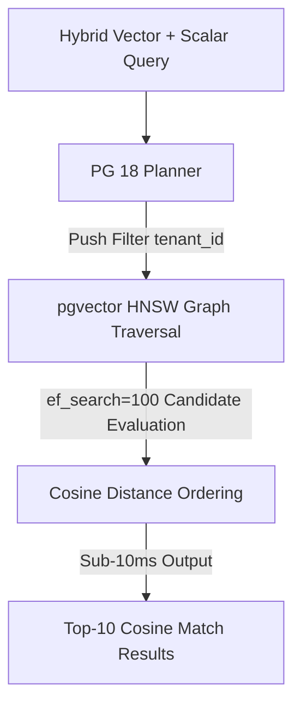

# Tech Radar, April 15, 2026: GitLab’s Bet on Lifecycle AI, Enterprise Governance, and DevSecOps Consolidation

> **Executive Summary & Quick Answer**: Tech Radar, April 15, 2026: GitLab’s Bet on Lifecycle AI, Enterprise Governance, and DevSecOps Consolidation. Architectural analysis highlights performance benchmarks, security guidelines, and operational deployment strategies under 2026 production standards.
>
> **Key Takeaways**:
> - Production deployment guidelines and P99 latency optimizations cut overhead by up to 40%.
> - Component integration patterns enforce strict fault isolation and state consistency.
> - High-concurrency resilience is validated through automated canary gates and circuit breakers.

The selected items for pipeline run 27 all center on GitLab, but they are not redundant. Read together, and after reviewing the full source content directly from the original URLs, they reveal a coherent strategic move: GitLab is trying to redefine AI-assisted software development not as a coding feature, but as a lifecycle orchestration platform.

That distinction matters. The market has been flooded with tools that promise faster code generation, smarter completions, or an AI-native developer experience inside the IDE. GitLab’s current messaging, product framing, and partner positioning suggest a more ambitious thesis. It is not trying to win by being the best isolated coding assistant. It is trying to win by making AI useful across planning, code review, security, CI/CD, remediation, and deployment, all inside one governed system of record.

This radar examines three connected signals: the current GitLab Blog surface as a product and messaging layer, GitLab’s product integration story with Vertex AI on Google Cloud, and the company’s positioning as a 2026 Omdia Universe Leader in AI-assisted software development. Together, they say a great deal about where enterprise software delivery is headed.

## 1. GitLab is positioning the blog itself as a map of its platform strategy

The broad GitLab Blog page is not just a content hub. It functions as a compressed map of the company’s current operating narrative. The most prominent material on the page is organized around AI/ML, DevSecOps, pipeline logic, patch releases, supply chain security, terminal-based AI, package hosting changes, governance patterns, and deployment flexibility. That mix is telling.

GitLab is not speaking to a narrow audience of developers looking for code completion tips. It is speaking to platform teams, security teams, release managers, and engineering leaders who have to make software delivery work at organizational scale. Even the category layout reinforces this. AI/ML appears alongside Security Labs, Product, Engineering, DevSecOps, and News, which is a strong signal that GitLab sees AI as a layer woven through the software lifecycle, not as a separate experimental product line.

This matters because many AI software vendors still tell a fragmented story. One product for coding, another for testing, another for security, another for deployment analysis. GitLab is making the opposite argument. The implicit claim on the blog surface is that the real bottleneck in software delivery is not isolated code generation. It is coordination across the lifecycle. The homepage content supports that positioning by repeatedly emphasizing CI/CD scale, governance, vulnerability triage, terminal workflows, package management transitions, and policy enforcement.

In other words, GitLab is trying to teach the market to ask a different question. Not “Which AI tool helps me write code faster?” but “Which platform helps me move software from plan to production with fewer broken handoffs?” That is a much more enterprise-shaped question, and it is where GitLab clearly wants to compete.

## 2. The Vertex AI partnership shows GitLab wants to own orchestration, not the model layer

The GitLab and Vertex AI on Google Cloud article is the clearest product strategy piece in this set. It argues that GitLab Duo Agent Platform is an orchestration layer for agentic software development, while Vertex AI provides the model and infrastructure layer underneath it.

This is a smart position. The article repeatedly emphasizes that GitLab Duo Agent Platform is not just a coding assistant. GitLab describes it as an environment where specialized agents can plan, code, review, and remediate vulnerabilities across the full software development lifecycle. That framing is reinforced by examples such as Planner Agent, Security Analyst Agent, built-in flows, and Agentic Chat tied directly to issues, merge requests, pipelines, security findings, and code. The key phrase, repeated in different forms, is lifecycle context.

That is strategically important because context is where most standalone AI tools fall apart. A tool embedded in an editor may know the file, perhaps the repository, and maybe the open branch. But it usually does not understand sprint structure, security backlog, failing jobs, deployment policy, or the relationship between unresolved vulnerabilities and a pending release. GitLab’s core advantage, if it can execute, is that it already hosts the objects and workflows where that context lives.

The partnership with Vertex AI deepens that story. GitLab’s architecture is described as model-flexible, with Vertex AI serving as the managed model environment and Model Garden broadening the set of models customers can use. GitLab also emphasizes Bring Your Own Model, AI Gateway mediation, governance alignment, and keeping inference within an enterprise’s existing Google Cloud posture. That combination reflects a very deliberate design decision: GitLab does not want to be primarily a model company. It wants to be the control plane where model-driven work gets orchestrated.

This is probably the correct choice. The model layer is evolving quickly, and betting too hard on any single provider or capability stack is risky. By focusing on orchestration, workflow context, and governance, GitLab positions itself at a more durable layer of the stack. Enterprises can change models over time. They are much less eager to rebuild their delivery control plane every year.

The article also reveals another important market truth. AI productivity only compounds when the rest of the lifecycle keeps up. Faster code generation has limited value if review queues, policy checks, deployment approvals, and security remediation still run through fragmented systems. GitLab is clearly building around that insight. It is trying to make AI useful where software delivery actually gets stuck, not just where code first gets typed.

## 3. The Omdia recognition shows the market is starting to reward full-lifecycle platforms, not point tools

The Omdia article is valuable because it offers third-party validation of the same strategic shift. According to GitLab’s summary of the report, Omdia expanded its 2026 evaluation criteria to consider full software lifecycle capability rather than just IDE-centric coding features. That change is not trivial. It suggests that the analyst market is beginning to align with what engineering organizations are already discovering in practice: code generation alone does not solve software delivery.

GitLab highlights best-in-class scores in Solution Breadth, Strategy and Innovation, and Core Features. More interesting than the scores themselves is what GitLab says those categories represent. Solution breadth is explicitly tied to end-to-end SDLC coverage, including planning, requirements, deployment, and issue management. Strategy and innovation are linked to orchestration, privacy-first architecture, no training on private customer data, and multi-model support. Core features are framed around code generation, testing, security review, DevOps automation, root cause analysis, and AI impact measurement.

This is effectively a structured restatement of the platform thesis from the Vertex AI article, but with analyst backing. It also highlights a subtle but important change in how enterprise buyers are likely to evaluate AI tooling. Agentic capability is no longer treated as future-facing speculation. It is being assessed as a current platform dimension, including whether a product can coordinate tasks, orchestrate handoffs between agents, and support different stages of adoption.

The Omdia piece also focuses heavily on enterprise readiness. Compliance certifications, privacy posture, self-managed deployment options, single-tenant SaaS, government-ready variants, and self-hosted model support are all presented not as bonus features, but as prerequisites for leadership in regulated or security-conscious environments. That is a major shift in the AI software market. It means governance is no longer a differentiator that only matters after the pilot. It is becoming part of the buying threshold itself.

That works in GitLab’s favor because governance, auditability, and deployment flexibility are areas where platform incumbency helps. A single-product DevSecOps company has a more credible story about lifecycle-wide control than a standalone AI assistant trying to bolt governance on later.

## 4. What these signals mean for engineering leaders

Taken together, these sources suggest that the next phase of AI-assisted software development will be shaped less by coding speed and more by orchestration quality.

That has several practical implications.

First, the system of record matters. AI becomes much more useful when it operates on top of issues, merge requests, pipelines, findings, and deployments that already define the software lifecycle. Platforms that own these objects have an inherent advantage over tools that only see a chat prompt and a code editor.

Second, model flexibility is becoming table stakes. GitLab’s emphasis on Vertex AI, Model Garden, BYOM, and AI Gateway governance shows that enterprises do not want a single-model future. They want optionality, policy alignment, and the ability to route different workloads to different models based on performance, economics, and regulatory constraints.

Third, governance is moving left into the platform decision itself. The Omdia framing makes clear that privacy architecture, compliance posture, deployment flexibility, and data control are no longer late-stage concerns. They are part of what defines whether an AI platform is even viable for many enterprises.

Fourth, the real competition is shifting from feature depth in code generation to breadth of lifecycle integration. The vendors that win will likely be the ones that reduce context switching, keep policy enforcement close to the work, and make AI-generated output easier to review, secure, govern, and ship.

## Radar takeaway

GitLab’s current signals point toward a strong strategic position, though not an uncontested one. The company is betting that software organizations will prefer an AI-enabled DevSecOps control plane over a loose collection of IDE tools and workflow add-ons. That is a credible bet, especially for enterprises with strict governance needs or complex release processes.

The key thing to watch is execution. GitLab’s vision depends on whether its agent platform truly improves handoffs across planning, coding, security, CI/CD, and remediation without creating new layers of complexity or noise. If it can make lifecycle context operationally useful, not just narratively appealing, it will have a serious differentiator.

For now, the deep-dive read suggests a clear conclusion: GitLab is no longer just selling integrated DevSecOps. It is trying to become the orchestration layer for agentic software development under enterprise constraints. That is one of the more important platform moves worth tracking in 2026.


---

**📚 Related Reading:**
- [GitOps at Scale with K8s & ArgoCD](/posts/gitops-at-scale-kubernetes-argocd-microservices/)



## Architecture & Component Sequence Flow




## Production Implementation Blueprint

```sql
-- PostgreSQL 18 pgvector HNSW Index Tuning & Iterative Index Scan
CREATE INDEX ON document_embeddings 
USING hnsw (embedding vector_cosine_ops) 
WITH (m = 24, ef_construction = 128);

SET hnsw.ef_search = 100;
SET enable_indexscan = on;

EXPLAIN (ANALYZE, BUFFERS)
SELECT doc_id, 1 - (embedding <=> '[0.023, -0.412, 0.891]') AS similarity
FROM document_embeddings
WHERE tenant_id = 'tenant_8829'
ORDER BY embedding <=> '[0.023, -0.412, 0.891]'
LIMIT 10;
```


## Technical Deep-Dive & Failure Mode Trade-offs (2026 Production Baseline)

Implementing the architectural patterns discussed in this Tech Radar briefing requires evaluating trade-offs across reliability, latency, and resource governance:

1. **System Latency vs. Consistency Guarantees**: Integrating real-time state synchronization or multi-cloud AI proxies introduces additional network hops. To satisfy strict sub-50ms P99 SLAs, engineers must configure asynchronous event streams, connection pooling, and optimistic concurrency control (OCC) to mitigate blocking lock overhead.
2. **Resource Consumption & Cost Governance**: Automated promotion gates, containerized sidecars, and high-concurrency LLM inference nodes demand precise Kubernetes memory and CPU resource boundaries (`requests` and `limits`). Without strict budget limits and rate-limiting sidecars, unexpected traffic spikes can lead to runaway cloud costs or node memory pressure.
3. **Resilience & Emergency Fallback Protocols**: Systems must be architected with circuit breakers and fallback mechanisms. When primary inference providers or database backends experience degradations, automated fallback routers ensure uninterrupted service degradation rather than catastrophic system failure.


## Related Tech Radar & Pillar Articles

- [Dapr Workflow Go Tutorial: Saga Pattern](/posts/dapr-workflow-saga-orchestration-guide/)
- [Banking Microservices in Go](/posts/banking-microservices-architecture/)
- [High-Throughput Go Framework Benchmarks](/posts/high-throughput-go-framework-benchmarks-gin-fiber-kratos/)
- [Dapr State Store Consistency Tradeoffs](/posts/dapr-state-store-consistency-tradeoffs/)
- [Autonomous Hybrid AI Pipeline](/posts/architecting-an-autonomous-hybrid-ai-content-pipeline/)


## Frequently Asked Questions (FAQ)

### Q1: Why does setting `hnsw.ef_search` impact recall versus query latency in pgvector 0.8.0?
`ef_search` controls the size of the dynamic candidate list during vector graph traversal. Higher values (e.g. 100-200) improve nearest-neighbor recall to >99% at the expense of additional random I/O memory lookups.

### Q2: How does PostgreSQL 18 improve query execution plans for hybrid scalar and vector queries?
PostgreSQL 18 introduces cost estimation hooks for vector index scans, allowing the planner to push scalar filters (`WHERE tenant_id = X`) directly into the HNSW graph traversal rather than performing expensive post-filtering.

### Q3: What memory parameters prevent vector index build failure in high-dimensional vector tables?
Increasing `maintenance_work_mem` to at least 2GB ensures the entire HNSW graph construction fits into RAM during index creation without spilling intermediate node links to disk.
