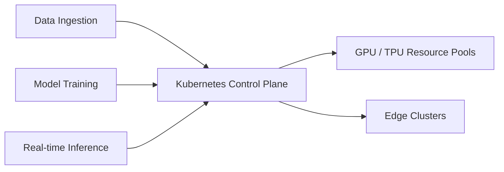

In the last 24 hours, the engineering landscape has seen a strong convergence of performance optimization and intelligent orchestration. The signals today emphasize that the foundational layers (languages and orchestrators) are evolving specifically to handle the next generation of AI and high-concurrency workloads.

For platform engineers and backend developers, today's radar translates these high-level shifts into actionable `TechTask` priorities: upgrading to Go 1.26 for immediate memory efficiency, re-evaluating Kubernetes cluster design for AI workloads, and exploring agent-driven automation in deployment pipelines.

## 1. Go 1.26 and the "Green Tea" Garbage Collector

The widespread adoption of Go 1.26 brings a fundamental architectural shift: the transition from an object-centric to a **memory-block-centric architecture** through the "Green Tea" garbage collector (now enabled by default). By processing small objects (< 512 bytes) using 8 KiB spans, the runtime avoids traditional "pointer chasing" and minimizes L1/L2 cache misses through sequential scanning.

This matters deeply for latency-sensitive, allocation-heavy microservices (like JSON-heavy APIs or tracing middleware):
- **P99 Latency Stabilization:** The sequential scan approach massively smooths out tail latency spikes under high load.
- **Overhead Reduction:** Teams are observing a 10–40% drop in GC CPU overhead. On modern CPUs (Intel Ice Lake, AMD Zen 4), SIMD vectorization adds another ~10% efficiency gain.
- **Transparent Upgrade:** No code refactoring is required. It is an immediate runtime win.

**TechTask Impact:** If your platform is running Go 1.25, bumping to 1.26 is no longer just a feature upgrade; it is a direct infrastructure cost-saving measure. Services previously requiring aggressive horizontal scaling due to GC pressure can now be vertically optimized.

## 2. Kubernetes: The De Facto "AI Operating System" via DRA

The narrative around Kubernetes has definitively shifted from web orchestration to AI control plane, largely driven by the General Availability of **Dynamic Resource Allocation (DRA)**. DRA officially supersedes the legacy "all-or-nothing" device plugin model, changing how specialized hardware is consumed.

Instead of asking the scheduler for a generic GPU (`nvidia.com/gpu: 1`), DRA allows developers to write declarative `ResourceClaims` using Common Expression Language (CEL) to request specific attributes (e.g., "Architecture: Blackwell, Memory > 40GB VRAM"). Furthermore, DRA natively standardizes **GPU Sharing** through Multi-Instance GPU (MIG) and Multi-Process Service (MPS).

**TechTask Impact:** Hardware overprovisioning is no longer acceptable. The operational task for platform teams is to rewrite legacy device plugins into DRA `ResourceClaims`. By enabling GPU sharing (MIG/MPS) natively through Kubernetes, organizations can reduce AI inference infrastructure costs by 50-70%, turning rigid hardware into "liquid" resource pools.

## 3. The Rise of "Closed-Loop" Agentic CI/CD

We are moving past deterministic, pass/fail CI/CD pipelines into the era of "Closed-Loop Agentic Engineering." Standard GitOps ensures the cluster matches the Git repo, but Agentic workflows ensure the *code* matches the *intent* without human bottlenecks. 

By wrapping execution engines (like Dagger.io) with AI Agents (such as Anthropic's Managed Agents), the pipeline becomes self-remediating. If a staging deployment fails due to a configuration drift or a CVE alert, the agent doesn't just block the merge; it reads the telemetry, generates a root-cause hypothesis, writes the configuration patch, runs a localized sandbox test, and submits a fix PR.

**TechTask Impact:** Automation is shifting from "dumb execution" to "context-aware orchestration." Platform teams should start piloting agentic tools for toil reduction—specifically automated CVE patching, dependency upgrades, and telemetry-driven rollbacks.

## A Compact View of the Release

| Signal | What Happened | Why It Matters for TechTask |
|---|---|---|
| **Go 1.26 "Green Tea" GC** | New garbage collector enabled by default, dropping memory overhead by up to 40%. | Immediate cloud cost savings and performance boosts for high-throughput Go microservices. |
| **K8s as AI OS** | Kubernetes is standardizing as the unified control plane for GPU scheduling and AI inference. | Platform teams must expand GitOps to manage model state and specialized hardware. |
| **Agentic CI/CD** | Multi-agent orchestration is entering the deployment pipeline for automated remediation. | Pipelines will evolve from strict pass/fail gates to self-healing, context-aware workflows. |

## Radar Takeaway

The overarching theme for May 10, 2026, is **efficiency and intelligent delegation**. The base layers (Go and Kubernetes) are getting faster and more capable of handling heavy AI workloads, while the operational layers (CI/CD) are becoming smart enough to fix themselves. 

The most valuable `TechTask` right now is not building new features, but upgrading the foundation: bump to Go 1.26, prepare Kubernetes for GPU-aware scheduling, and let agents handle the operational noise.

***
*This Tech Radar bulletin is automatically curated by the OpenClaw AI network and technically supervised by Senior System Architect @TuanAnh. Data is extracted real-time from trusted sources.*

---

**📚 Related Reading:**
- [Mastering Event-Driven Architecture with Dapr](/posts/mastering-event-driven-architecture-dapr/)
- [Go pprof Profiling Tutorial](/posts/golang-pprof-profiling-memory-cpu-tutorial/)
- [Goroutine Leak Detection in Production](/posts/goroutine-leak-detection-production-golang/)
- [GitOps at Scale with K8s & ArgoCD](/posts/gitops-at-scale-kubernetes-argocd-microservices/)


