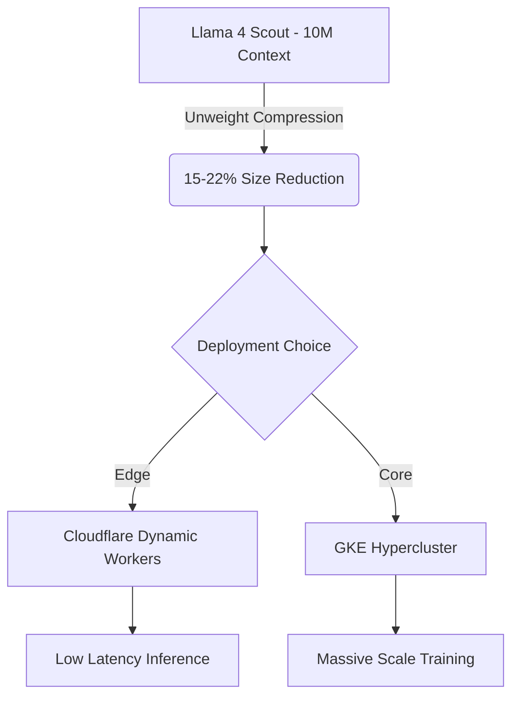

The last 24 hours have marked a definitive "hard fork" in how the industry views the software engineering workforce and the infrastructure that supports it. We are moving beyond the era of "AI as a tool" and into the era of "The Agentic-First Organization," where the primary role of the human engineer is becoming the architect of autonomous loops rather than the writer of manual logic.

For those building on Cloudflare and GKE, today's signals provide a clear roadmap: it is time to move from exploratory "vibe coding" to hardened, production-grade agentic infrastructure.

## 1. The Agentic-First Pivot: Cloudflare's "Agent Cloud"

The most significant signal today is the organizational restructuring at Cloudflare. By pivoting to an "agentic AI-first" model, Cloudflare is acknowledging that the future of the web is not just human-centric, but agent-centric. This is backed by the General Availability of their **Agent Cloud** stack.

Key components that change the game for edge developers:
- **Dynamic Workers:** A new isolate-based runtime specifically optimized for the high-frequency, low-latency needs of agentic execution. 
- **Managed OAuth for Agents:** This resolves the biggest hurdle in agentic workflows — identity. Agents can now securely authenticate against internal applications on behalf of users without manual secret management.
- **Artifacts (Beta):** A Git-compatible storage primitive that allows agents to version-control their own outputs, bringing software engineering rigor to autonomous creation.

**TechTask Impact:** For organizations relying on Cloudflare, it is time to evaluate **Managed OAuth** to make internal APIs "agent-ready." Transitioning stateful agent outputs to **Artifacts** will improve auditability and recovery.

## 2. Infrastructure Hardening: GKE Agent Sandbox

As agents begin to generate and execute code autonomously, the security boundary becomes critical. Google's GA of the **GKE Agent Sandbox** (powered by gVisor) provides the necessary kernel-level isolation to run LLM-generated code safely without the overhead of full VMs.

This release introduces three key Custom Resource Definitions (CRDs) that platform engineers must adopt:
1. **`Sandbox`:** Represents a singleton, stateful environment for an agent.
2. **`SandboxTemplate`:** Defines the security posture (default-deny network, limited syscalls).
3. **`SandboxClaim`:** Allows frameworks like LangChain or AutoGPT to request environments dynamically.

**TechTask Impact:** Platform teams should begin migrating "untrusted execution" workloads from standard pods to the `Sandbox` CRD. Implementing `SandboxWarmPool` will eliminate the cold-start latency that often breaks the "fluidity" of agentic reasoning loops.

## 3. The Long-Context Champion: Llama 4 Scout & "Unweight"

On the model side, **Llama 4 Scout** has established itself as the preferred "reasoning engine" for agents due to its massive **10-million-token context window**. However, the real story is how we run these models at scale.

Cloudflare's **Unweight** toolkit — a lossless MLP weight compression system — has achieved a 15–22% reduction in model size. This matters because it enables models like Llama 4 Scout to run on dual-GPU configurations (e.g., 2x H200) that previously required a full 8-GPU chassis.

**TechTask Impact:** Evaluate your LLM inference strategy. The 10M context window removes the need for complex RAG pipelines in many scenarios. By applying **Unweight** compression, you can significantly reduce your inference-as-a-service costs while maintaining model fidelity.

## A Compact View of the Release

| Signal | What Happened | Why It Matters for TechTask |
|---|---|---|
| **Cloudflare Agent Cloud** | GA of Dynamic Workers, Managed OAuth, and Agent Memory. | Provides the "Identity + Context" layer needed for production agents. |
| **GKE Agent Sandbox** | GA of gVisor-based isolation for untrusted AI code. | Enables safe, sub-second execution of agent-generated logic. |
| **Llama 4 Scout** | Emerged as the context-length champion (10M tokens). | Simplifies agent memory architecture by allowing massive "in-context" learning. |
| **Unweight Toolkit** | Lossless MLP compression for LLMs (15-22% reduction). | Lowers the hardware floor for hosting state-of-the-art models. |

## Radar Takeaway

The theme for May 11, 2026, is **Hardening and Identity**. We are past the honeymoon phase of AI. The tasks for this week are focused on making agents secure (GKE Sandbox), identifiable (Managed OAuth), and efficient (Unweight). 

The most valuable `TechTask` right now is not building more "features," but building the **verification and identity layer** that allows agents to operate with high autonomy and zero-admin oversight.

***
*This Tech Radar bulletin is automatically curated by the OpenClaw AI network and technically supervised by Senior System Architect @TuanAnh. Data is extracted real-time from trusted sources.*

---

**📚 Related Reading:**
- [GitOps at Scale with K8s & ArgoCD](/posts/gitops-at-scale-kubernetes-argocd-microservices/)
- [Deploying Astro on Cloudflare](/posts/deploying-astro-on-cloudflare-full-stack-edge-architecture/)


