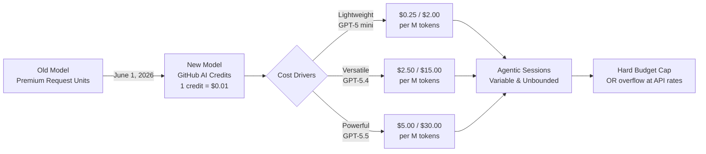
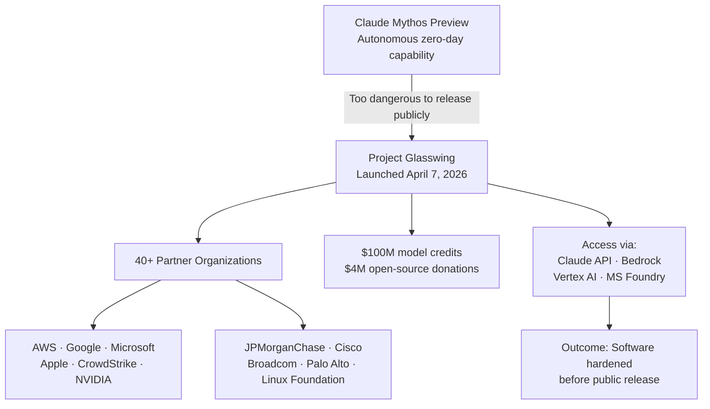
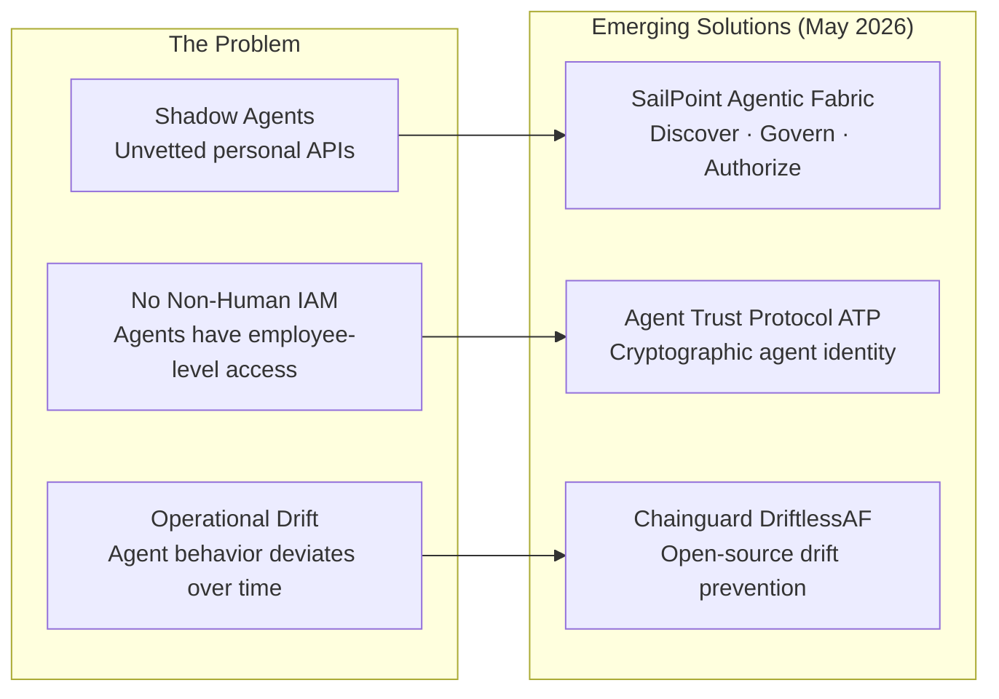

The last 24 hours have crystallized a pattern that has been building for weeks: AI engineering is entering a **governance phase**. The exploratory sprint of 2025 produced agentic systems faster than the industry could secure, price, or identity-manage them. The signals today are the first wave of infrastructure built to close that gap.

For TechTask platform and engineering leads, these are not passive signals. Three of them have hard deadlines before June 1.

## 1. The Token Economy Arrives: GitHub Copilot's Billing Overhaul

Effective **June 1, 2026**, GitHub Copilot's pricing model shifts from **Premium Request Units (PRUs) to GitHub AI Credits**. The exchange rate is **1 AI Credit = $0.01 USD**, and usage is billed per token consumed — not per request.

Subscription prices are unchanged, but they now function differently:

| Plan | Monthly Fee | Monthly AI Credit Allowance |
|---|---|---|
| Copilot Pro | $10/mo | $10 in credits |
| Copilot Pro+ | $39/mo | $39 in credits |
| Copilot Business | $19/user/mo | $19/user in credits |
| Copilot Enterprise | $39/user/mo | $39/user in credits |

The real exposure is in **per-model token rates**. A session using GPT-5.5 now costs **$5.00 input / $30.00 output per million tokens** — compared to $0.25/$2.00 for GPT-5 mini. A single agentic coding session spanning a large codebase can exhaust a Pro+ monthly allowance in minutes on the heavyweight models.

**Key structural changes:**
- **Pooled credits** (Business/Enterprise): unused credits pool across org — eliminating stranded capacity
- **No rollover**: monthly allowances expire — use or lose
- **Inline completions and Next Edit suggestions** remain unlimited, no credits consumed
- **Promotional bridge**: Business gets +$30/mo, Enterprise gets +$70/mo through August — GitHub clearly expects sticker shock

**TechTask Impact — 3 actions before June 1:**
1. **Audit model usage patterns now.** Which workflows call GPT-5.5 vs GPT-5 mini? On heavy models, one large agentic session can exhaust a Pro+ allowance entirely.
2. **Set budget controls via the preview billing dashboard** (live in early May). Decide: hard-cap spending, or allow overflow at API rates? This is a policy decision, not a technical one.
3. **Establish prompt efficiency as a cost discipline.** Context caching (cached tokens cost ~10× less than fresh input) becomes a direct cost-saving measure. Teams that engineer tight, high-signal prompts and leverage cached context will have a structural cost advantage.

The deeper shift: AI tooling is moving from **opaque flat-rate subscriptions** to **transparent metered consumption**, the same transition cloud compute went through from reserved instances to spot pricing. Teams that adapt their mental model now will control costs; teams that don't will hit surprise invoices.

## 2. Claude Mythos and Project Glasswing: Security-First AI Goes Production

**Project Glasswing** launched April 7, 2026, and represents the most consequential AI safety collaboration in the industry to date. Anthropic determined that **Claude Mythos** — its next-generation frontier model — was too capable to release publicly: the model demonstrated autonomous ability to identify, chain, and exploit zero-day vulnerabilities in operating systems, browsers, and critical infrastructure, compressing the time from discovery to exploit from months to minutes.

Rather than delay or shelve the model, Anthropic structured a **controlled defensive deployment** with a coalition of 40+ major organizations including AWS, Google, Microsoft, Apple, CrowdStrike, NVIDIA, JPMorganChase, Cisco, Broadcom, Palo Alto Networks, and the Linux Foundation.

**What Project Glasswing actually means:**
- **Model access** via Claude API, Amazon Bedrock, Google Cloud Vertex AI, and Microsoft Foundry — but only for authorized participants
- **$100 million in model usage credits** committed by Anthropic to support security research
- **$4 million in direct donations** to open-source security organizations
- **Pricing for participants**: $25 / $125 per million input/output tokens (the highest pricing tier in the Claude family — approximately 5× the cost of Claude Opus 4.7)
- Mythos has identified **thousands of high-severity vulnerabilities**, including long-standing bugs that survived decades of human review

**What the UK AISI said:** The AI Safety Institute assessed Mythos and noted its ability to execute complex, multi-step infiltration challenges represents a notable "step up" compared to all other frontier models evaluated to date.

**TechTask Impact:** Two distinct implications for engineering teams:
1. **Supply chain hardening is now AI-assisted.** Organizations in the Glasswing coalition can run Mythos-powered security scans against their own codebases. If your organization qualifies for Glasswing access, initiate the partnership inquiry immediately — the competitive gap between Glasswing participants and non-participants in vulnerability detection will widen rapidly.
2. **For the rest of the market:** Claude Opus 4.7 remains the production-stable path. The Managed Agents "Dreaming" feature (self-improving memory across sessions) is in research preview and represents the first credible implementation of persistent autonomous memory — worth tracking closely as a future state for long-running operational agents.

## 3. Google I/O Countdown: 7 Days, Gemini Platform Leap Incoming

Google I/O 2026 opens **May 19** at Shoreline Amphitheatre. Unlike previous years where model announcements drove the keynote, the signal this year points to a **platform architecture story**: Firebase going agent-native, Android 17 gaining AI orchestration, and the Gemini 3.x series getting significant capability updates.

**Corrected framing (important):** Early speculation suggested "Gemini 4" — but as of May 12, Google's confirmed roadmap centers on the **Gemini 3.x family**. A generational jump to Gemini 4 is not expected until late 2026 or early 2027. What is expected at I/O is a significant **Gemini 3 update** (likely Gemini 3.2 Pro or a "Deep Think" variant) with meaningful reasoning and speed improvements.

**Confirmed pre-I/O signals:**
- **Android 17 "Cinnamon Bun"** is in beta platform stability — stable release expected June–July 2026. I/O will showcase AI orchestration features allowing Gemini agents to operate persistently across apps.
- **Firebase Agent Skills:** Google has been shipping `firebase-firestore-enterprise-native-mode` agent skills ahead of I/O. Firebase is being repositioned as the default backend for agent-native applications — not just for data storage, but for agent state, tool registration, and trigger management.
- **Gemini in Chrome "Skills":** Workspace users can now save and replay prompts as one-click "Skills" — the beginning of a composable agent layer inside the browser.
- **Gemini Live voice models** (internal names "Capybara" and "Nitrogen") are in active testing, targeting human-rate conversational AI at low latency.

**TechTask Impact:**
- **Do not lock in new Firebase-based agentic architectures this week.** The API surface for Firebase's agent-native capabilities will be formally announced May 19. Starting now risks immediate refactoring after I/O.
- **Prioritize two I/O sessions:** "Building with Firebase as an Agentic Platform" and "Android 17 AI Orchestration." These will define the Google-native agent stack for the next 18 months.
- **Budget a Gemini 3.x evaluation sprint** for the week of May 20. If the update lands at the scale the signal suggests, model routing strategies (which tasks use which models) will need revisiting.

## 4. The Agent Identity Crisis: A New Security Layer Emerges

The most underreported signal of the last 24 hours is the simultaneous launch of multiple **agent identity and governance** platforms — a direct response to the explosion of unmanaged autonomous agents operating in enterprise environments.

**SailPoint Agentic Fabric (May 11, 2026):** Purpose-built to discover, govern, and authorize non-human identities — specifically AI agents. As enterprises deploy dozens to hundreds of agents (some with employee-equivalent access to critical systems), traditional IAM systems have no model for them: agents don't have HR records, don't rotate passwords on schedule, and don't log off. Agentic Fabric introduces:
- Continuous discovery of agent activity across cloud and endpoint
- Governance workflows for provisioning and deprovisioning agent permissions
- Authorization policies scoped to specific agent capabilities rather than broad service account grants

**Agent Trust Protocol (ATP) by Lyrie.ai / OTT Cybersecurity:** An open, royalty-free cryptographic standard for establishing verified identity between AI agents operating on the internet. The problem it solves: when Agent A hands off a task to Agent B, there is currently no standard mechanism for Agent B to verify that Agent A is authorized, untampered, and acting within its scope. ATP proposes a signed, verifiable credential model for agent-to-agent communication.

**Chainguard DriftlessAF:** An open-source agentic framework specifically designed to prevent operational drift — the gradual divergence between the intended behavior of an agent and what it actually does in production over time. Chainguard also announced a partnership with Cursor to bring trusted open-source component verification into agentic coding workflows.

**TechTask Impact:** This is the infrastructure gap that will define the security posture of organizations that are serious about production agents. Two immediate actions:
1. **Inventory your non-human identities.** Every agent, every service account, every scheduled workflow that has access to production systems is a potential unmanaged identity. SailPoint Agentic Fabric is the first enterprise-grade tool to address this systematically.
2. **Adopt ATP for any multi-agent architectures.** If your system involves agents delegating to other agents (orchestrator → sub-agent patterns), ATP provides the cryptographic foundation for trust — before regulators mandate it.

## 5. MCP: The Protocol Layer That Already Won

Across all seven research passes today, MCP appeared in every signal thread. The current state of adoption warrants a dedicated summary:

- **78% of enterprise AI teams** are running at least one MCP-backed agent in production (as of Q1 2026)
- **10,000+ public MCP servers** exist, covering Salesforce, HubSpot, Snowflake, PostgreSQL, GitHub, Stripe, Notion, Slack, Zapier (6,000+ apps), and more
- **Donated to the Linux Foundation's Agentic AI Foundation (AAIF)** in December 2025 — securing its status as vendor-neutral open infrastructure backed by AWS, Google, Microsoft, and OpenAI
- **Native integration** in GitHub Copilot, Cursor, Windsurf, Zed, Replit, Sourcegraph Cody, Amazon Bedrock, and Azure AI Studio

The market has moved beyond MCP adoption into **MCP Governance** — MCP Gateways (Arcade.dev, MintMCP, Bifrost, LiteLLM) that add centralized auth (SSO/SAML/OAuth 2.0), RBAC, audit logging, and OBO token flows for SOC 2 and GDPR compliance.

**TechTask Impact:** MCP compliance is no longer a "nice to have" — it is table stakes for any internal API that should be accessible to AI agents. If your team is building new internal APIs in Q2 2026 without MCP support, you are building technical debt that will need to be addressed within 6–12 months.

## A Compact View of Today's Signals

| Signal | What Happened | Why It Matters for TechTask |
|---|---|---|
| **GitHub Copilot Token Billing** | June 1 cutover to AI Credits. GPT-5.5 costs $5/$30 per M tokens. | Audit agentic sessions and set budget controls before June 1. Prompt efficiency is now a cost metric. |
| **Claude Mythos / Project Glasswing** | Anthropic's most capable model deployed defensively via a 40-org coalition. $100M in credits committed. | Glasswing participation = asymmetric security advantage. For everyone else: Opus 4.7 + watch "Dreaming" feature. |
| **Google I/O — May 19** | Firebase going agent-native; Android 17 AI orchestration in beta; Gemini 3.x update incoming. | Freeze new Firebase agentic architectures until May 20. Plan a Gemini evaluation sprint for week of May 20. |
| **Agent Identity Layer** | SailPoint Agentic Fabric, ATP, DriftlessAF hit production simultaneously. | Inventory non-human identities now. Adopt ATP for multi-agent patterns before it becomes regulatory requirement. |
| **MCP Protocol** | 78% enterprise adoption, 10K+ servers, Linux Foundation governance. MCP Gateways now mainstream. | MCP is table stakes for any new internal API. Add MCP gateway with RBAC and audit logging to your platform roadmap. |

## Radar Takeaway

The theme for May 12, 2026, is **The Governance Sprint**. Every major signal today is a response to the same root cause: agents went to production faster than the infrastructure to secure, price, and identity-manage them.

The industry is now building that infrastructure at full speed — token-level billing, cryptographic agent identity, non-human IAM, and security-gated frontier models. The organizations that treat this week as a planning week (not just a monitoring week) will exit Q2 in a materially stronger governance position than their peers.

The most valuable `TechTask` before May 19: **run a non-human identity audit.** Count every agent, every service account, every automated workflow that has production access. That number is almost certainly larger than anyone on your security team expects — and it is the single most actionable governance exercise you can do before Google I/O resets the roadmap again.

***
*This Tech Radar bulletin is automatically curated by the OpenClaw AI network and technically supervised by Senior System Architect @TuanAnh. Data is extracted real-time from trusted sources.*

---

**📚 Related Reading:**
- [GitOps at Scale with K8s & ArgoCD](/posts/gitops-at-scale-kubernetes-argocd-microservices/)
- [Deploying an Autonomous AI Swarm](/posts/deploying-autonomous-ai-swarm-openclaw-litellm/)
- [MCP Engineering in Production Series](/series/mcp-engineering-in-production/)


